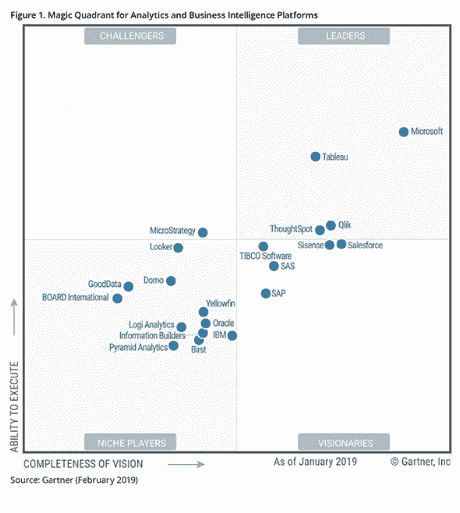

# 如何成为 Power BI 开发者？

> 原文：<https://www.edureka.co/blog/how-to-become-a-power-bi-developer/>

世界各地都需要像 Power BI(T2)开发人员这样的专业人才。在本文中，我们将进一步探讨这一职位，并了解这一职位的基本要求以及 Power BI 开发人员的角色和职责。我们将回答一个基本而重要的问题，即如何成为一名 Power BI 开发人员？

以下是我们将在本文中讨论的主题；

*   你为什么想成为一名 Power BI 开发人员？
*   成为一名 Power BI 开发人员需要哪些技能？
*   Power BI 开发人员的角色和职责是什么？
*   Power BI 的未来和范围是什么？

那么让我们开始吧，

## **你为什么想成为一名 Power BI 开发人员？**

Power BI 被认为是 BI 工具的领导者，并被 it 研究巨头 Gartner 评为最佳。Gartner 的魔力象限根据执行能力和愿景的完整性提到了截至 2019 年 2 月的 Power BI。

除了对强大的商务智能专家有很大的需求之外，还有奖励可以提供。如果你浏览像 Indeed 和 PayScale 这样的工作门户网站，你可以找到大量的工作列表。在 IT 行业，专业的商务智能人士也进入了更高的工资等级，平均年薪为【117，000 美元 。有大量的工作需要电力商业智能的实践经验作为主要技能。如果您想知道成为一名 BI 开发人员到底需要什么？在继续写博客之前，你可以查看一下由行业专家策划的 **[Power BI 课程大纲](https://www.edureka.co/power-bi-certification-training)** 。我们的 Power BI 课程将帮助您为就业做好行业准备。观看下面的视频，了解 Power BI 的概念

[https://www.youtube.com/embed/W0mG3KFR3Hw](https://www.youtube.com/embed/W0mG3KFR3Hw)

## 成为一名 Power BI 开发人员需要哪些技能？

以下是 Power BI 开发人员职位的一些一般背景先决条件。

*   从事计算机科学/信息系统或任何类似的工作。除此之外，一个人需要在类似领域有相当多的工作经验。
*   数据准备、数据网关和数据仓库项目的实践经验。
*   熟悉微软商业智能堆栈，拥有强大的 BI、SSAS、SSRS 和 SSIS。
*   至少 3 年使用自助工具的经验，最好是 Power BI 或 Tableau。
*   JavaScript、CSS 和其他 JavaScript 库。
*   结构化查询语言

**了解我们在顶级城市举办的 Power BI 培训课程**

| 印度 | 美国 | 其他国家 |
| [海德拉巴的 Power BI 培训](https://www.edureka.co/power-bi-certification-training-hyderabad) | [达拉斯的 Power BI 球场](https://www.edureka.co/power-bi-certification-training-dallas) | [墨尔本 Power BI 球场](https://www.edureka.co/power-bi-certification-training-melbourne) |
| [班加罗尔的 Power BI 培训](https://www.edureka.co/power-bi-certification-training-bangalore) | [夏洛特动力 BI 课程](https://www.edureka.co/power-bi-certification-training-charlotte) | [伦敦 Power BI 课程](https://www.edureka.co/power-bi-certification-training-london) |
| [在钦奈的电力 BI 培训](https://www.edureka.co/power-bi-certification-training-chennai) | [纽约的 Power BI 课程](https://www.edureka.co/power-bi-certification-training-new-york-city) | [悉尼 Power BI 球场](https://www.edureka.co/power-bi-certification-training-sydney) |

Power BI 开发人员的角色和职责是什么？

Power BI 开发人员的主要角色和职责如下:

*   动手换动力 BI &电动工具
*   构建 Analysis Services 报告模型。
*   使用 Power BI desktop 开发可视化报告、仪表盘和 KPI 记分卡。
*   连接到数据源，导入数据并为商业智能转换数据。
*   将数据转化为信息视觉效果和报告的分析思维。
*   对数据实施行级安全性，并了解 Power BI 中的应用安全层模型。
*   使 *[DAX 在 Power BI](https://www.edureka.co/blog/power-bi-dax-basics/) 桌面* 中查询。
*   对数据集使用高级计算。
*   设计方法和项目文件。
*   开发符合仓库标准的表格和多维模型。
*   擅长根据业务需求 *开发、发布和调度电力 BI 报表* 。
*   了解业务需求，并通过关注资源相应地开发数据模型。
*   具有 *原型、设计和需求分析的知识和经验。*
*   具备微软 Azure、SQL 数据仓库、PolyBase、Visual Studio 等二次工具的知识和技能。
*   使用嵌入式分析(如 Power BI service (SaaS ))或通过 API automation 将 Power BI 报告集成到其他应用中。
*   D *evelop 为 Power BI 定制视觉效果。*

继续这篇关于如何成为 Power BI 开发人员的文章？

## **什么是未来的&电力 BI 的范围？**

Power BI 在 BI 工具中脱颖而出的一个原因是，在连接性方面有广泛的选择——从电子表格、数据库甚至大数据开始。此外，您可以访问仓库、Salesforce 等云应用程序，甚至连接到 Amazon Redshift 等云数据库。Power BI 可以连接到你可能想到的任何数据。除此之外，Power BI 还配备了一个 web 数据连接器，它用于直接从 Web 上获取 API，以便连接任何所需的数据源。

Power BI 使企业用户能够轻松、快速地在庞大的 Hadoop 数据集中找到有价值的数据。该软件消除了用户对查询语言知识的需求，使利益相关者更容易处理大数据。

*Power BI is focused upon Natural language processing and machine learning-enabled data and molding itself with new technologies to enable futuristic approaches to visualize data. With new cutting-edge features in the tool such as launching hybrid data connectivity for the cloud and live query agent acting as a tunnel to on-premises data, the scope for Power BI is broadened with every version update.  In conclusion, I’d like to say what are you waiting for? It’s a brilliant time to go ahead and get certified in Power BI.*

**这就把我们带到了这篇关于如何成为一名 Power BI 开发人员的文章的结尾？**

**此外，如果您希望在商业智能领域发展，我们的[商业智能课程](https://www.edureka.co/masters-program/business-intelligence-certification) 将帮助您挖掘这些数据，并增强整个组织的决策过程。**

***有问题吗？请在评论区提到它，我们会给你回复。***