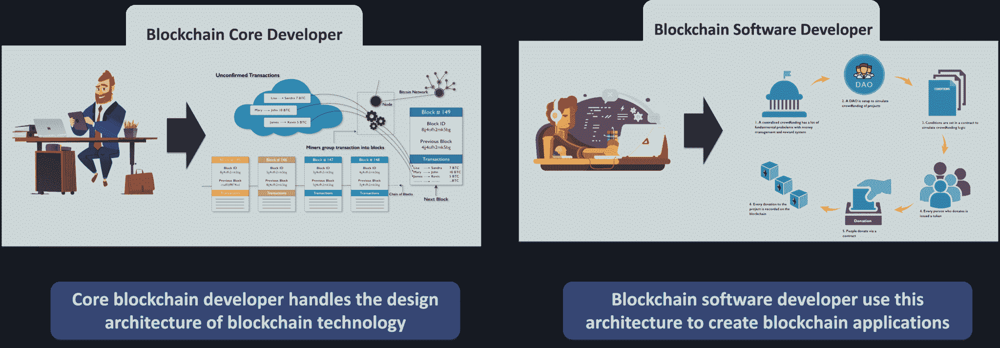
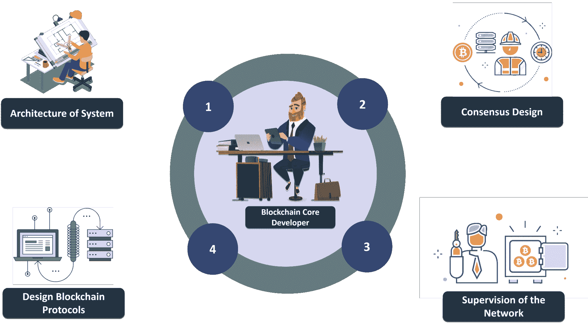
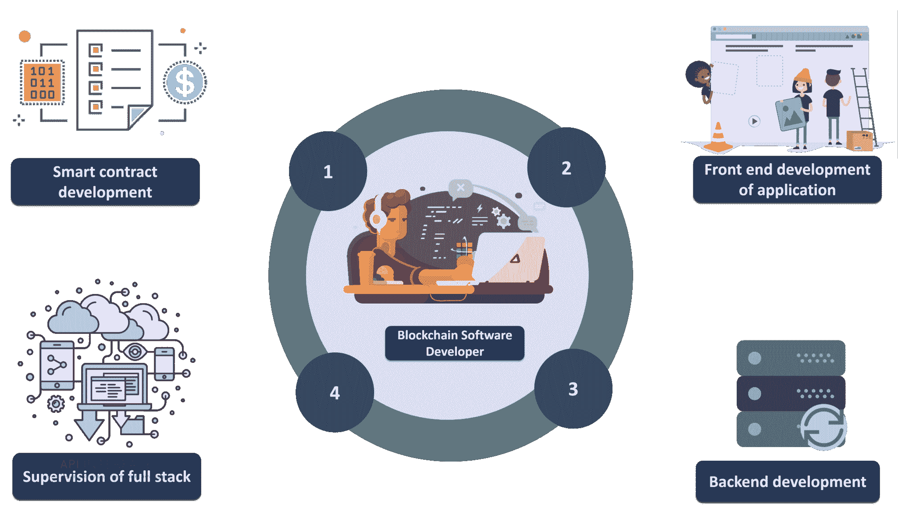
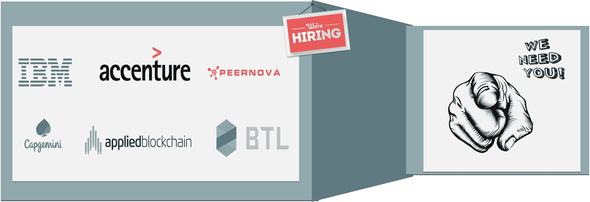
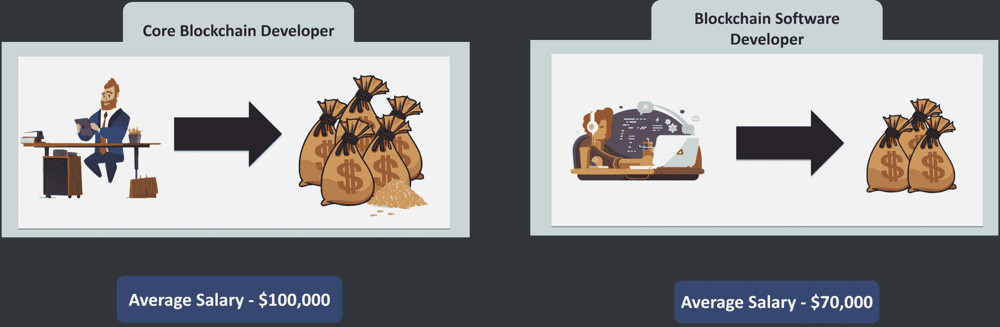

# 如何成为区块链开发者？–类型、角色和技能

> 原文：<https://www.edureka.co/blog/how-to-become-blockchain-developer/>

区块链作为革命性的技术，显然开辟了一个新的发展领域，称为区块链发展。这反过来为开发者和技术爱好者创造了大量的工作机会。即使有这么好的工作机会，人们似乎还是不知道成为区块链开发者的方向。因此，我决定写这篇文章来引导区块链爱好者进入区块链发展的世界

好的，让我列出我将在本文中讨论的主题:

## **谁是区块链开发者？**

在过去的几年里，我实际上在很多场合被问到过这个问题，比如“到底谁是区块链的开发商，他关心的是什么样的开发？”嗯，我想这很容易让人感到困惑，因为这个行业中有这么多类型的开发人员。因此，让我们通过实际定义区块链开发者来消除这种困惑……

*A developer responsible for developing and optimizing blockchain protocols, crafting the architecture of blockchain systems, developing smart contracts and web apps using blockchain technology are commonly called blockchain developers.*

**你也可以看一下区块链开发者的这段录音，我们的 ***[区块链培训专家](https://www.edureka.co/blockchain-training)*** 已经用例子详细讲解过了。**

## ****如何成为区块链开发者？|爱德华卡****

**[//www.youtube.com/embed/9v8--hje4xc?rel=0&showinfo=0](//www.youtube.com/embed/9v8--hje4xc?rel=0&showinfo=0)**

**基本上，任何参与区块链技术开发的开发者都可以被称为区块链开发者。现在区块链的开发商可以分为两种截然不同的类型。让我们花点时间来讨论这两种类型。**

## ****区块链开发者类型****

**正如我刚才指出的，有两种类型的区块链开发商，即:**

***   核心区块链开发者*   区块链软件开发商**

****

**区块链核心开发人员主要负责开发区块链系统的架构、协议设计、共识协议设计以及其他与区块链技术相关的高层决策和开发。另一方面，区块链软件开发商使用核心区块链开发商设计的架构和协议来构建基于区块链技术运行的去中心化应用。 既然我们知道了区块链开发者的类型，那就让我告诉你们他们各自在行业中的角色吧。**

## ****区块链开发者的角色****

**让我们首先讨论一下核心区块链开发者的角色。**

### ****核心区块链开发者****

**如前所述，核心区块链开发人员通常参与区块链系统的设计、架构和安全性。简而言之，他们的角色包括:**

***   区块链协议设计*   网络共识协议和安全模式的设计*   网络架构的设计*   整个网络的监管**

****

### ****区块链软件开发商****

**区块链软件开发者有一套独立的角色。这些角色与系统的一致设计或架构无关。就像一个普通的 web 开发人员如何使用由核心 web 架构师建立的协议和设计结构来构建 web 应用程序一样，区块链软件开发人员使用区块链技术来构建*分散式应用程序*或 *Dapps* 。他们的角色包括:**

***   智能合同的开发*   为 Dapps 开发交互式前端设计*   关于区块链的后端开发*   监督运行 Dapps 的整个堆栈**

****

**现在，我已经告诉了你们不同类型的区块链开发者和他们各自的角色，让我告诉你们作为一名区块链开发者，你需要的技术知识和技能。**

## ****成为区块链开发者所需的技术技能****

**当谈到区块链开发人员时，人们期望他具备多种技能。让我们逐一讨论。**

### ****区块链架构****

**一个区块链开发者应该对区块链、它的工作和它的架构有很好的理解。像*加密哈希函数*、*共识、分布式账本技术*这样的概念应该唾手可得。让自己熟悉区块链技术的最佳方式是浏览比特币区块链白皮书，但浏览完整的白皮书可能是一项乏味的任务，一点点指导总是有助于提高学习曲线。因此，你可以报名参加 edureka 的区块链课程**

### ****数据结构****

**其次，要想成为一名区块链开发人员，对数据结构的深入了解和应用意识是必不可少的。区块链开发人员不断尝试和调整现有的数据结构，如 *merkle trees、petrecia trees 等*，以满足他们的个人网络需求。区块链使用大量的数据结构结合先进的加密技术来建立一个安全和不可变的系统。一个关于区块链的知识，没有任何数据结构的知识，只能被视为*不完整。***

### ****密码术****

**正如我刚才提到的，区块链是数据结构和高级密码学的结合，因此很明显，要成为区块链开发者还需要对密码学有很好的掌握。除了用于生成数字签名的异步加密之外，区块链还使用了很多加密方法，如哈希函数 SHA256 和 KECCAK256。不了解这些是如何工作的，就不可能成为区块链开发者。**

### ****智能合约开发****

**自从以太坊发布以来，智能合约已经成为一个巨大的事物。现在，每个区块链都试图将智能合同功能整合到其系统中，以便业务逻辑可以轻松应用于区块链。因此，努力进入区块链领域的开发人员肯定应该学习智能合约开发。这通常需要学习网络特定语言，如 *Solidity、Viper、Chaincode 等。***

**网页开发是区块链开发者的核心工作。当一个人作为行业中的区块链开发人员开始他的职业生涯时，他们中的大多数人被雇佣来进行分散式应用程序的基本设计。这意味着你必须了解前端和后端开发的基础知识，包括像*为 Dapps 创建交互式图形用户界面、API 处理、请求处理等。* 既然我已经告诉了大家，成为一名区块链开发者所需的技能，那就让我们来看看这些公司高招的区块链开发者吧。**

## ****公司招聘区块链开发者****

**因此，如果你认为自己具备成为一名区块链开发者的条件，那么这是你的黄金时期，因为机会正在增多。业内每**五个**区块链开发者相关的工作，只有**一个**合格的区块链开发者。许多财富 500 强公司如 IBM、埃森哲、凯捷都在寻找合格的区块链开发人员。**

****

**在当今时代，区块链的开发者不仅有无限的机会，而且他们还有丰厚的薪水。一个核心的区块链开发者平均年收入约为 10 万美元，而区块链的软件开发者年收入为 7 万美元。**

****

**伙计们，这就是如何成为一名区块链开发者的全部内容。现在继续前进，掌握上述技能，进入区块链发展。**

***如果您希望了解更多关于区块链的信息，并在区块链技术领域建立职业生涯，那么请查看我们的 [**区块链** **课程**](https://www.edureka.co/blockchain-training) ，该课程提供讲师指导的现场培训和真实项目体验。本培训将帮助您深入了解 Hyperledger Fabric，并帮助您掌握该主题。***