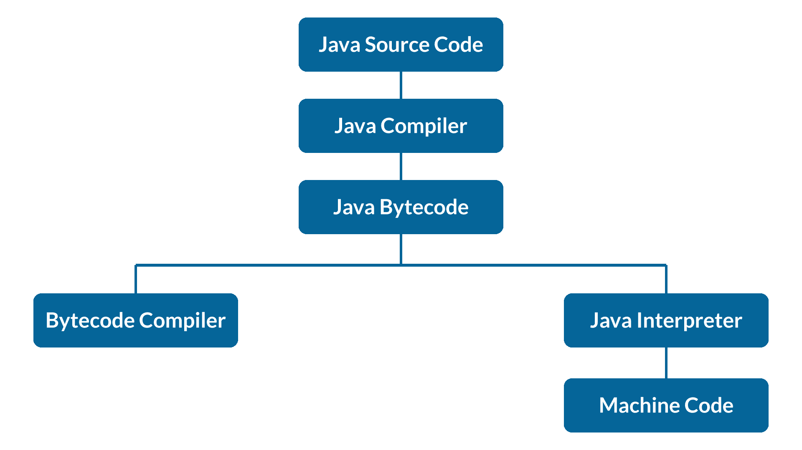

# 如何用 Java 创建文件？–文件处理概念

> 原文：<https://www.edureka.co/blog/how-to-create-a-file-in-java>

Java 中的文件处理是对文件执行各种任务所必需的，比如创建、读取、写入等。在这篇文章中，我将告诉你如何使用各种方法在 Java 中创建一个文件。

本教程涵盖以下主题:

*   [什么是 Java？T3](#WhatisJava?)[T5](#WhatisJava?)
*   [Java 中执行程序的步骤](#StepstoexecuteaprograminJava)[](#WhatisFileinJava?)
*   [Java 中的 File 是什么？T3T5](#WhatisFileinJava?)
*   [Java 中创建文件的方法](#HowtocreateafileinJava?)

我们开始吧。

**Java 是什么？**

**Java** 是最流行的用于创建 Web 应用程序和平台的编程语言之一，也是[基于类的](https://www.edureka.co/blog/java-objects-and-classes/)，[类似于 C++的面向对象语言](https://www.edureka.co/blog/object-oriented-programming/)，但具有高级特性。 Java 是平台无关的，因为 [Java 编译器](https://www.edureka.co/blog/just-in-time-compiler/)将源代码转换成字节码。它被设计成允许开发者编写可以在任何机器上运行的代码。

Java 如此受欢迎的一个最大原因就是它的平台独立性。Java 仍然是一种相关的编程语言，没有显示出受欢迎程度下降的迹象，这就是它值得学习的原因。大多数开发人员把它作为他们的第一编程语言，因为它容易学习。

现在让我们进一步理解 Java 程序的执行流程。

**Java 程序的执行流程**

下图显示了参与执行一个 [Java 程序的](https://www.edureka.co/blog/java-programs/) :



所有的高级(也称为第三代)编程语言都允许你用一种类似于(尽管简单得多)自然语言的语言来编写程序。这个高级程序叫做 **源代码。**

**Step1:** 写源代码。[编译器](https://www.edureka.co/blog/how-to-compile-run-java-program/)是一种计算机程序，它将以源语言编写的计算机代码翻译成目标语言。

**Step2:** 编译将源代码翻译成机器码。

**step 3**:Java 程序一编译好，下一步就是生成 Java 字节码。我们也可以说 Java 字节码是一种*形式的机器码。类文件。*因此，Java 字节码是 Java 程序编译的结果，是独立于机器的程序的中间表示。

**Step4:** 为了执行 [Java 代码](https://www.edureka.co/blog/java-tutorial/)你需要将其转换成机器语言。为此，我们需要一个编译器和解释器。解释程序一次翻译一条语句。然而，编译器扫描整个程序，并将其作为一个整体翻译成机器码，所以它会在所有程序执行完毕后给出错误，而解释器逐行检查代码并给出错误。

第五步:最后一步，编译器字节码将整个代码翻译成机器码。

现在你已经知道了 Java 的基本原理，让我们进一步理解什么是 Java 中的文件。

**Java 中的 File 是什么？**

文件无非是数据的简单存储，在 [Java 语言中为](https://www.edureka.co/blog/what-is-java/)。 一个文件系统可以实现对某些操作的限制，比如读、写、执行。这些限制称为访问权限。 在用 Java 读文件的时候，一定要知道 Java 文件类。 [Java File](https://www.edureka.co/blog/file-handling-in-java/) 类以抽象的方式表示文件和目录路径名。File 类有几种处理目录和文件的方法，比如创建新的目录或文件，删除和重命名目录或文件等。 文件对象代表光盘上的实际文件/目录。

现在让我们来了解一下在 Java 中创建文件的各种方法。

## **在 Java 中创建文件的方法**

**1。用 java.io.File 类**创建文件

创建一个新文件，需要使用[**file . create new file()**](https://docs.oracle.com/javase/7/docs/api/java/io/File.html#createNewFile())方法。这个方法返回一个布尔值:

*   **真** 如果文件完成了。

*   **false** 如果文件已经存在或者由于某种原因操作忽略打开。

当这个方法不能创建文件时，它也会抛出 java.io.IOException。

当我们通过传递文件名来创建文件对象时，它可以带有一个绝对路径，或者我们可以只提供文件名或者我们可以提供相对路径。 对于非绝对路径，File 对象试图定位项目根目录中的文件。如果我们从命令行运行程序，对于非绝对路径，File 对象试图从当前目录定位文件。File 类的实例是不可改变的；也就是说，一旦创建，由文件对象表示的抽象路径名将永远不会改变。

现在，我们举一个小例子，了解一下它的工作原理。

```
File file = new File("c://temp//testFile1.txt");
//create the file.
if (file.createNewFile()){
System.out.println("File is created!");
}
else{
System.out.println("File already exists.");
}
//write content
FileWriter writer = new FileWriter (file);
writer.write("Test data");
writer.close();
```

好心的 注意，这个方法只会创建一个文件，而不会向其中写入任何内容。现在让我们进一步了解下一个方法。

**2。用 java.io.FileOutputStream 类**创建文件

如果你想创建一个新文件，同时如果你想向其中写入一些数据，你可以使用一个file output streamwrite 方法。 在 Java 中，FileOutputStream 是一个[字节流](https://www.edureka.co/blog/file-handling-in-java/#WhatisaStream?)类。要将数据写入文件，必须将数据转换成字节，然后保存到文件中。

**例如:**

```
String data = "Test data";
FileOutputStream out = new FileOutputStream("c://temp//testFile2.txt");
out.write(data.getBytes());
<span>out.close();
```

FileOutputStream 类以单个字节的形式存储数据。它可以用来创建文本文件。文件代表数据在第二存储介质(如硬盘或光盘)上的存储。**file output stream . write****()**方法自动创建一个新文件并向其中写入内容。

**3。** **用 Java . NIO . File . files-Java NIO 创建文件**

[**【files . write()**](https://docs.oracle.com/javase/7/docs/api/java/nio/file/Files.html#write(java.nio.file.Path,%20java.lang.Iterable,%20java.nio.charset.Charset,%20java.nio.file.OpenOption...))是创建文件的最佳方式，如果您还没有使用它，这应该是您将来的首选方法。 这是一个很好的选择，因为我们不用担心关闭 IO 资源。 每行是一个字符序列，按顺序写入文件，每行以平台的行 分隔符结束

**方法** **:**

`public static Path createFile(Path path, FileAttribute<?>... attrs) throws IOException`

创建一个新的空文件，如果该文件已经存在，此操作将失败。

**参数:**

**路径**–创建文件的路径。

**attrs**–创建文件时自动设置的可选文件属性列表。

**例如:**

```
String data = "Test data";
Files.write(Paths.get("c://temp//testFile3.txt");
data.getBytes());
//or
List<String> lines = Arrays.asList("1st line", "2nd line");
Files.write(Paths.get("file6.txt");
lines,
StandardCharsets.UTF_8,
StandardOpenOption.CREATE,
StandardOpenOption.APPEND);
```

这就是你需要创建它的方式。接下来，让我们看看临时文件的创建。

**4。Java 也可以创建临时文件**

在很多情况下都需要在 java 中创建一个临时文件，但是大多数情况下，它会发生在单元测试期间，在那里你不想存储结果。一旦测试用例完成，您就不关心文件内容了。

使用**Java . io . file . createtempfile()**创建临时文件

```
Public class TemporaryFileExample{
Public static void main(string[] args){
try{
final path path = Files.createTempFile("myTempFile",".txt");

System.out.println("Temp file : " + path);
// delete file on exist.
path.toFile().deleteonExit();
} catch (IOException e){
e.printStackTrace();
}
}
}
```

**使用 NIO 创建临时文件**

```
Public class TemporaryFileExample{
Public static void main(string[] args){
File temp;
try{
temp = File.createTempFile("myTempFile" , ".txt");

System.out.println("Temp file created : " +
temp.getAbsolutePath());
} catch (IOException e){
e.printStackTrace();
}
}
}
```

创建临时文件，使用以下两种方法。

**1**3。 `createTempFile(Path, String, String, FileAttribute<?>… attrs)`–在指定目录下创建一个 tmp 文件。

上面的方法接受四个参数。

**Path->**指定要创建文件的目录。

**->-**以提及文件名的前缀。使用 null 避免前缀。

**->-**字符串来提文件名的后缀。即文件扩展名。使用 null 来使用。作为延伸的 tmp。

**属性- >** 这是可选的，在创建文件时自动设置文件属性列表

**例如**`Files.createTempFile(path,null, null);`–用创建一个临时文件。指定路径中的 tmp 扩展名

**2。**`createTempFile(String, String, FileAttribute<?>)`–在系统/服务器的默认临时目录下创建临时文件。

例如:*files . createtempfile(null，null)*–在系统默认的 temp 文件夹中创建一个临时文件。在 windows 中，temp 文件夹可能是*C:UsersusernameAppDataLocalTemp*，其中 username 是您的 windows 登录 id

因此，Java 可以创建新文件，这就是它的工作方式。至此，我们结束了这篇关于如何用 Java 创建文件的文章。我希望你发现它信息丰富。如果你想了解更多，你也可以看看我们的  **[其他 Java 博客](https://www.edureka.co/blog/java-tutorial/) [s](https://www.edureka.co/blog/java-tutorial/)** 。

*查看 Edureka 提供的 **[Java 认证培训](https://www.edureka.co/java-j2ee-soa-training)** ，edu reka 是一家值得信赖的在线学习公司，在全球拥有超过 250，000 名满意的学习者。我们在这里帮助你的旅程中的每一步，为了成为一个除了这个 java 面试问题，我们提出了一个课程，这是为学生和专业人士谁想要成为一个 Java 开发人员设计的。*

有问题要问我们吗？请在“如何用 Java 创建文件”这篇文章的评论部分提到它，我们会尽快回复您。