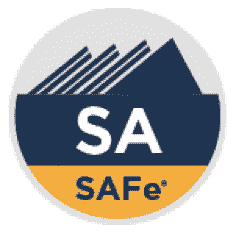
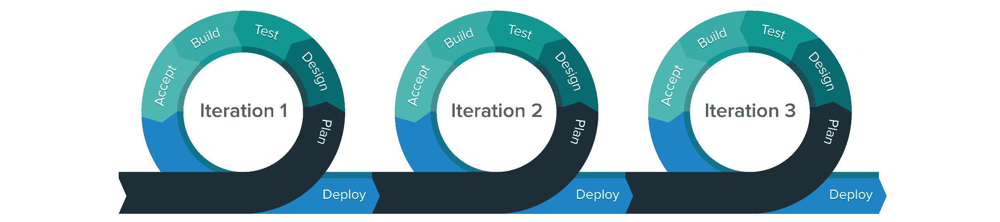
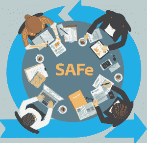

# 如何获得 SAFe 认证？

> 原文：<https://www.edureka.co/blog/how-to-get-safe-certified/>

是一个持续帮助各种企业应对重大挑战的框架。它帮助他们在最短的可持续交付周期内开发和交付企业级软件和系统。它是一个在线知识库，提供已证实的成功模式，免费提供给构建世界上最重要的软件和系统的人。这篇文章详细地向你解释了如何获得安全认证。

以下是引导您获得认证的主题

*   [**安全(缩放敏捷)认证**](#safecertification)
*   [**为期两天的领先安全认证培训**](#safetraining)
*   [**安全课程大纲**](#courseoutline)
*   [**谁应该参加培训**](#whoshouldtakeup%20the%20training)
*   [**先决条件**](#prerequisites)
*   [**安全考试详情**](#examdetails)
*   [**安全认证套件**](#certificationkit)

## **安全 ( 缩放敏捷)认证**

[***扩展的敏捷框架***](https://www.edureka.co/blog/scaled-agile-framework/) 为多个敏捷团队同步调整、协作和交付。由于其可扩展性和配置能力，该框架允许每个组织适应自己的业务需求。SAFe 支持雇佣约 100 名从业者的小规模解决方案，以及需要数千人的复杂系统。作为一个广泛的知识体系，SAFe 描述了实现精益-敏捷开发所必需的角色、人工制品和活动。

## **为期两天的领先安全认证培训**

你必须参加为期两天的 SAFe 培训课程，这将为你参加基于 SAFe 版本 4.6 的 ***SAFe 4 Agilist 认证*** 考试做准备，SAFe 版本 4.6 是 SAFe 的最新版本。作为预备班的参与者，您将获得以下好处

*   你将了解精益企业的五种能力
*   它会帮助你成为一个思维敏捷的经理老师
*   你将学会应用精益-敏捷思维的价值观和原则
*   你也可以将外管局的精益和敏捷原则应用到外管局的角色和实践中
*   通过建立使命和目标，你将创建高绩效的团队和培训
*   您应该用安全的实施路线图来领导转型
*   您将支持 PI 计划和与成功项目执行相关的事件
*   您可以通过连续交付管道按需驱动*发布*
*   你将学会建立与战略主题和精益投资组合管理的一致性和执行力
*   您还可以协调多个敏捷发布系列和供应商与一个解决方案系列

这是一个为期两天的安全准备课程。与会者将通过利用扩展的敏捷框架及其基本原则，获得领导精益敏捷企业所必需的知识。这些原则源自精益、敏捷、产品开发流程和 DevOps。该培训讨论了您的组织成为精益企业所需的五项核心能力。与会者还将学习和实践支持和执行 PI 计划事件的技能，以及协调多个***【ARTs】***敏捷发布系列的技能。

当他们成为 ***认证的 SAFe 4 Agilist *** (SA)时，他们将发展一套全球所需的技能，并使他们的企业能够在一个破坏性的市场中取得成功。

预备课程有两种形式。如果企业中有 10 名或 10 名以上的员工寻求安全培训，可在培训机构和内部举办现场、讲师指导的安全新兵训练营。

这个为期两天的课程将从**上午 8:30 到下午 5:00**开始。

## **安全课程大纲**

外管局教学大纲大纲如下:

*   引入扩展的敏捷框架(SAFe)
*   成为精益敏捷的领导者
*   创建高绩效团队和培训
*   体验项目增量(PI)规划
*   使用 DevOps 按需发布
*   构建精益投资组合
*   引领变革

## **谁应该参加这次培训**

本课程面向希望获得 ***SAFe 4 Agilist 认证*** 的个人。然而，任何想学习如何领导精益-敏捷企业的人都可以学习这门课程。从实践者到管理者，所有人都将从学习成为一个更成熟的精益-敏捷领导者中受益。

每个渴望在组织中工作的人都可以接受这种培训。从团队领导、产品经理、开发经理和项目经理到开发人员、架构师、分析师和测试人员。

## **先决条件**

不管有没有经验，都欢迎参加这个课程。不过，对于打算参加 ***SAFe 4 Agilist (SA)认证*** 考试的人，强烈推荐以下先决条件。

*   5 年以上软件开发、测试、业务分析、产品或项目管理经验
*   Scrum 环境中的体验

## **安全考试详情**

考试详情如下；

*   **名称:** SAFe 4 Agilist 考试
*   **格式:**选择题
*   **交付:**基于网络，单浏览器，闭卷，无外部协助，定时
*   **访问:**考生在完成 SAFe 领先课程后，可以在 SAFe 社区平台内访问考试
*   **持续时间:** 90 分钟
*   **问题数量:** 45
*   **及格分数:**45 分中的 34 分或 75%及格分数

## **安全认证套件**

通过认证考试的与会者将获得以下内容:

*   SAFe 4 Agilist 证书
*   在线推广你的成就的数字徽章
*   一年期安全敏捷认证会员资格，包括进入安全敏捷实践社区
*   带有 SA 认证标志的认证使用指南
*   访问各种资源，在认证专家的安全旅程中学习和支持他们

*总而言之，可扩展的敏捷框架是为了迎合拥有大型解决方案的大型企业而创建的。通过安全认证，您可以帮助一定规模的组织，使他们能够采取更敏捷的方法来开发和交付软件。*

就这样，伙计们！就这样，我们到了文章的结尾。你也可以顺便看看 **[分级敏捷面试问题](https://www.edureka.co/blog/interview-questions/scaled-agile-interview-questions/)** 。

*有问题吗？请在这篇* *文章的评论部分提到它，我们会尽快回复你。*