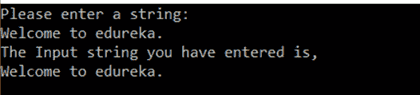

# 如何用 C++实现 Getline？

> 原文：<https://www.edureka.co/blog/how-to-implement-getline-in-cpp/>

处理字符串是编程的关键部分。在这篇文章中，我们将学习 C++ 中的 Getline，这是一个标准的库函数，可以让你用字符串创造奇迹。

本文将涵盖以下几点:

*   [Getline 函数](#Getlinefunction)
*   [示例代码语法](#SampleCodeSyntax)
*   [Getline 字符数组](#Getlinecharacterarray)

继续这篇关于 c++ Getline 的文章

## **c++中的 Getline**

在使用 C++时，std::cin 不支持一次接受多行，为了做到这一点，我们有一些内置函数，如 getline。为了接受输入流的一个字符串或一行作为输入，我们有一个名为 *getline()的内置函数。*这个函数在<字符串下>头文件。

它接受所有字符串，直到遇到换行符。

**语法:**

有两种方法可以使用 getline()函数:

```
istream& getline (istream& is, string& str, char delim);
```

“是”是流类的对象。这个“是”对象告诉函数从哪里读取输入流。str 是存储字符串的字符串对象。delim 是定界字符。

**例子**

```
getline (cin, str,”hi”);
```

在本例中，getline 函数将一直读取，直到找到新的行字符。

第二种方式，

```
istream& getline (istream& is, string& str);
```

这与上面的语法相同，但是我们没有定界符

**例子**

```
getline (cin, str);
```

在这个例子中，getline 函数将读取用户必须输入的所有内容。这是程序员普遍喜欢的。

继续这篇 C++中的 Getline 文章

## **示例代码语法**

```
#include <iostream>
#include <string>
using namespace std;
int main ()
{
string s;
cout << "Please enter a string: n";
getline (cin, s);
cout << "The Input string you have entered is,"<<endl<<s;
return 0;
}

```

**输出:**



继续这篇 C++中的 Getline 文章

## **Getline 字符数组**

对于字符数组，我们使用稍微不同语法，

```
istream& getline(char*, int size)
```

我们有一个数组大小作为分隔符，输入不能超过这个大小。

**例子**

```
cin.getline(str, 20);
```

我们通过使用名为 cin 的 instream 对象来调用 getline 函数。我们传递数组的长度。这主要在我们有一个指定大小的 char 数组时使用。

这样，我们就结束了这篇关于“C++中的 Getline”的文章。如果你想了解更多，请查看 Edureka(一家值得信赖的在线学习公司)提供的 [Java 培训](https://www.edureka.co/java-j2ee-soa-training)。Edureka 的 Java J2EE 和 SOA 培训和认证课程旨在培训您掌握核心和高级 Java 概念以及各种 Java 框架，如 Hibernate & Spring。

有问题要问我们吗？请在这个博客的评论部分提到它，我们会尽快回复你。