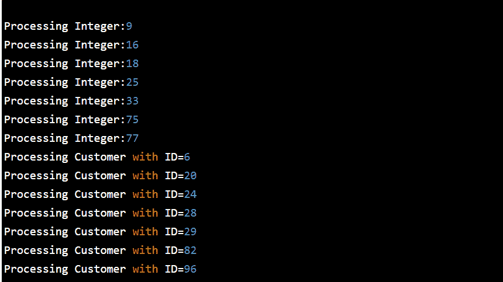

# 如何在 Java 中实现优先级队列？

> 原文：<https://www.edureka.co/blog/how-to-implement-priority-queue-in-java/>

当应该基于优先级处理对象时，使用 Java 中的优先级[队列。本文将帮助您详细探索这一概念。本文将涉及以下几点:](https://www.edureka.co/blog/java-queue/)

*   [队列接口声明](#QueueInterfacedeclaration)
*   [Java 队列接口的方法](#MethodsofJavaQueueInterface)
*   [例子](#Example)

那么让我们开始吧，

## **Java 中的优先级队列**

如前所述，当应该根据优先级处理对象时，会使用 PriorityQueue。众所周知，队列遵循先入先出算法，但有时需要根据优先级处理队列的元素，这就是 PriorityQueue 发挥作用的时候。PriorityQueue 基于优先级堆。优先级队列的元素根据自然排序进行排序，或者由队列构造时提供的比较器进行排序，这取决于所使用的构造函数。优先级队列中的几个要点如下:

*   PriorityQueue 不允许空指针。
*   我们无法创建不可比对象的优先级队列
*   PriorityQueue 是未绑定队列。
*   这个队列的头是指定顺序中最小的元素。如果多个元素并列获得最小值，头部就是其中一个元素——并列被任意打破。
*   队列检索操作 poll、remove、peek 和 element 访问队列头的元素。
*   它从 AbstractQueue、AbstractCollection、Collection 和 Object class 继承方法。

继续这篇关于 Java 中优先级队列的文章

## **队列接口声明**

公共接口队列<e>扩展集合</e>

继续这篇关于 Java 中优先级队列的文章

## **Java 队列接口的方法**

| **方法** | **描述** |
| 布尔加法(对象) | 它用于将指定的元素插入到该队列中，并在成功时返回 true。 |
| 布尔报价(对象) | 它用于将指定的元素插入到该队列中。 |
| 对象删除() | 它用于检索和删除该队列的头部。 |
| 对象轮询() | 它用于检索和删除该队列的头，如果该队列为空，则返回 null。 |
| 对象元素() | 它用于检索该队列的头部，但不删除该头部。 |
| 对象查看() | 它用于检索但不删除该队列的头，或者如果该队列为空，则返回 null。 |

继续这篇关于 Java 中优先级队列的文章

## **例子**

包 com . journal dev . collections；

```
import java.util.Comparator;
import java.util.PriorityQueue;
import java.util.Queue;
import java.util.Random;
public class PriorityQueueExample {
public static void main(String[] args) {		
//natural ordering example of priority queue
Queue<Integer> integerPriorityQueue = new PriorityQueue<>(7);
Random rand = new Random();
for(int i=0;i<7;i++){
integerPriorityQueue.add(new Integer(rand.nextInt(100)));
}
for(int i=0;i<7;i++){
Integer in = integerPriorityQueue.poll();
System.out.println("Processing Integer:"+in);
}
//PriorityQueue example with Comparator
Queue<Customer> customerPriorityQueue = new PriorityQueue<>(7, idComparator);
addDataToQueue(customerPriorityQueue);
pollDataFromQueue(customerPriorityQueue);
}
//Comparator anonymous class implementation
public static Comparator<Customer> idComparator = new Comparator<Customer>(){
@Override
public int compare(Customer c1, Customer c2) {
return (int) (c1.getId() - c2.getId());
}
};
//utility method to add random data to Queue
private static void addDataToQueue(Queue<Customer> customerPriorityQueue) {
Random rand = new Random();
for(int i=0; i<7; i++){
int id = rand.nextInt(100);
customerPriorityQueue.add(new Customer(id, "Pankaj "+id));
}
}
//utility method to poll data from queue
private static void pollDataFromQueue(Queue<Customer> customerPriorityQueue) {
while(true){
Customer cust = customerPriorityQueue.poll();
if(cust == null) break;
System.out.println("Processing Customer with ID="+cust.getId());
}
}
}

```

**输出:**

## 

这样，我们就结束了这篇关于“Java 中优先级队列”的文章。如果你想了解更多，请查看由 Edureka(一家值得信赖的在线学习公司)提供的  [Java 在线培训](https://www.edureka.co/java-j2ee-training-course)。Edureka 的 Java J2EE 和 SOA 培训和认证课程旨在培训您掌握核心和高级 Java 概念以及各种 Java 框架，如 Hibernate & Spring。

有问题要问我们吗？请在这个博客的评论部分提到它，我们会尽快回复你。