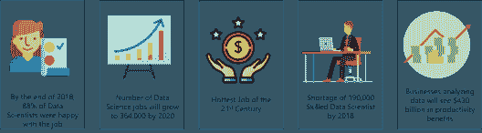
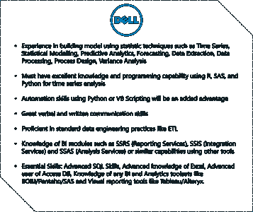
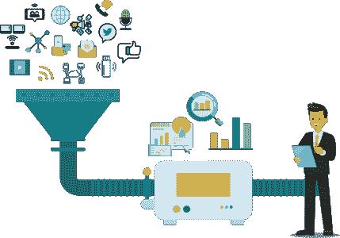
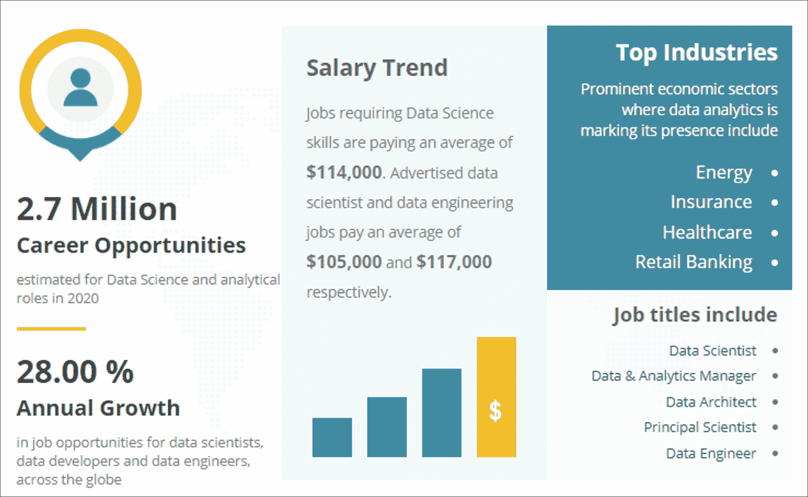
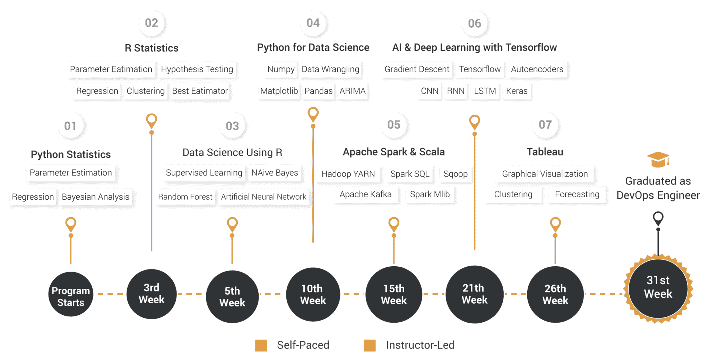
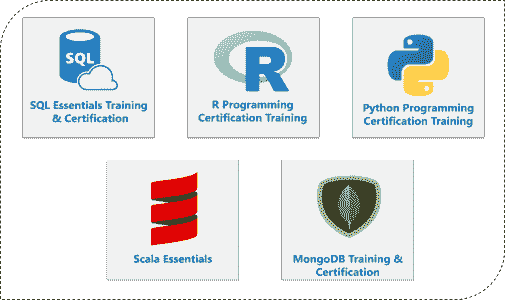
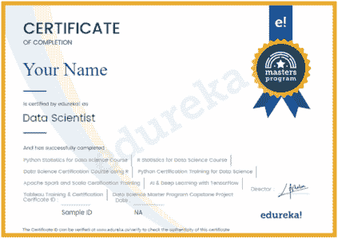

# 如何学习数据科学的综合指南

> 原文：<https://www.edureka.co/blog/how-to-learn-data-science/>

## **如何学习数据科学:**

几个月前，我在网上浏览，寻找关于数据科学的课程。我想学习数据科学，我意识到互联网上有丰富的内容，但我不知道如何学习数据科学，从哪里开始，我必须掌握什么工具等。我脑子里有一百万个问题，所以我决定写下来。

我对数据科学的好奇心始于我偶然发现的一篇文章，这篇文章讲述了 Target 的数据科学家如何研究女性顾客的购物模式，以预测她们是否怀孕的故事。这让我着迷，因为我不知道数据科学能够预测这样的事情。我很困惑，我知道我必须学习更多。我的旅程就这样开始了。

*数据科学家技能——如何学习数据科学——爱德华卡*

在我继续讲下去，用理论让你厌烦之前，这里有一个关于数据科学的有趣事实的列表:

*   2015 年，大约 65%的数据科学家对他们的工作感到满意，到 2018 年底，这一数字上升到 88%。
*   《哈佛商业评论》将数据科学称为 21 世纪最热门的工作。人们只能听到对数据科学如何为业务增长提供有用见解的赞美。
*   据估计，到 2020 年，数据科学工作的数量将增长到 364，000 个。
*   到 2018 年底，熟练的数据科学家将短缺 19 万人。
*   与不实施数据分析的企业相比，实施数据科学的企业将获得 4300 亿美元的生产力收益。

有趣的事实已经说得够多了，让我们来讨论一下成为一名数据科学家所需的技能。当我坐下来研究数据科学家的技能组合时，我浏览了 Glassdoor 等平台上的几份工作描述，实际上是为了检查顶级公司到底需要什么样的数据科学家。

让我们来看看戴尔数据科学家的工作描述:

*职位描述——如何学习数据科学——爱德华卡*

上述工作描述深入了解了公司对数据科学家的确切期望。为了让你更容易理解，我在下面的部分列出了工作描述的要点。

## **数据科学家——所需技能**

对我来说，数据科学家很像夏洛克·福尔摩斯。就像夏洛克·福尔摩斯如何解决谋杀之谜一样，数据科学家解决数据之谜，例如，检测有用的见解，提取重要的数据等，以发展业务。

以下是数据科学的定义:

*Data Science is the process of extracting useful insights from data by using a variety of tools, algorithms and Machine Learning fundamentals.***

*数据科学——如何学习数据科学——爱德华卡*

如果你想了解更多关于数据科学的知识，你可以浏览下面的博客文章:

1.  [什么是数据科学？数据科学入门指南](https://www.edureka.co/blog/what-is-data-science/)
2.  [数据科学教程——从零开始学习数据科学！](https://www.edureka.co/blog/data-science-tutorial/)
3.  [数据科学 R 综合指南](https://www.edureka.co/blog/r-for-data-science/)
4.  [用于数据科学的 Python——在数据科学中使用 Python 库](https://www.edureka.co/blog/learn-python-for-data-science/)

让我们继续讨论数据科学家的技能组合。以下是大多数行业对数据科学家的技能要求:

*   统计数字
*   至少一种编程语言–R/Python
*   数据提取、转换和加载
*   数据争论和数据探索
*   机器学习算法
*   高级机器学习(深度学习)
*   大数据处理框架
*   数据可视化

如果您希望了解有关数据科学家技能的更多信息，请参考 [*数据科学家技能——成为数据科学家需要什么？*](https://www.edureka.co/blog/data-scientist-skills/) 博客。

Edureka 也有一些关于各种机器学习算法的博客，请务必阅读:

1.  [线性回归](https://www.edureka.co/blog/linear-regression-in-r/)
2.  [逻辑回归](https://www.edureka.co/blog/logistic-regression-in-r/)
3.  [随机森林](https://www.edureka.co/blog/random-forest-classifier/)
4.  [决策树](https://www.edureka.co/blog/decision-trees/)
5.  [支持向量机](https://www.edureka.co/blog/support-vector-machine-in-r/)
6.  [K 个最近邻居](https://www.edureka.co/blog/machine-learning-algorithms/)
7.  [朴素贝叶斯](https://www.edureka.co/blog/naive-bayes-tutorial/)

现在，让我们专注于我们讨论的话题，如何学习数据科学？

## **如何成为一名数据科学家？**

当我开始研究数据科学时，我发现我阅读的大多数免费内容都只专注于数据科学的理论方面。为了正确理解数据科学，人们必须对数据科学如何使用机器学习算法从数据中获取洞察力有一个实际的理解。

因此，您必须始终选择结构良好的数据科学课程，该课程提供对概念的深入理解，以及基于现实世界问题的项目、数据集和作业。

Edureka 设计的[数据科学在线培训](https://www.edureka.co/masters-program/data-scientist-certification)在整个课程期间遵循实用方法，在每个模块结束时提供一组作业和项目来测试您的技能。

让我们了解一下 Edureka 的数据科学硕士课程如何让你走上成为一名成功的数据科学家的道路。

## **edu reka**的数据科学家硕士项目

Edureka 的数据科学硕士课程旨在涵盖世界顶级 it 公司所需的所有工具和技能。Edureka 是在线数据科学培训的市场领导者。Edureka 已经在全球数据科学领域培训了 30，000 多名学生。

我在网上找到的大多数数据科学课程都不是为绝对的初学者准备的。每门课程都需要某个领域的专业知识。这对初学者来说很难，因为他们不知道从哪里开始。在 Edureka，我们设计了一门数据科学硕士课程，涵盖成为数据科学家所需的所有先决条件、工具、概念、算法、语言等。

*如何学习数据科学——爱德华卡*

为了确保最好的教育质量，Edureka 提供了由行业级专家现场指导的课程，这些专家在该行业拥有超过 10 年的工作经验。无论您是在 IT 行业工作的经验丰富的专业人士，还是计划进入数据科学领域的有志之士，硕士课程的设计和开发都是为了适应各种专业背景。

为了更好地理解我们提供的课程，请查看课程设置:

*数据科学家硕士课程课程表——爱德华卡*

在 Edureka，数据科学硕士课程是在对全球 5000 多个职位描述进行广泛研究后设计的。该堆栈包括 12 个模块，大约需要 30 周才能完成。对于每个模块，将有一个项目和结束。

一旦你完成了所有的模块，作业和项目，你会得到一个顶点项目。顶点工程将为你提供一个商业案例。你需要运用你在整个硕士项目期间所学的所有技能来解决这个问题。这个项目将会给你的简历增添一笔精彩的内容！

让我们把重点放在课程所提供的内容上！

数据科学硕士课程将包括 5 门现场课程和 7 门自定进度课程，以涵盖先决条件。自定进度课程包括以下内容:

1.  Python 统计
2.  r 统计
3.  SQL 基础培训和证书
4.  r 编程认证培训
5.  Python 编程认证培训
6.  Scala 基础
7.  MongoDB 培训和认证

*数据科学家硕士课程免费选修*

*   直播课程包括两个独立的课程，一个用 R，一个用 Python。这些课程将涵盖数据提取、争论、探索、机器学习等技能。
*   下一个现场课程将通过使用 Apache Spark 和 Scala(用于近实时处理大数据)来涵盖大数据分析的概念。
*   贴了这个，你就用 Tensorflow 了解了 AI &深度学习。这个模块将帮助你理解深度神经网络的概念。在这里，您将构建使用 Tensorflow 创建深度学习模型的动手项目。
*   最后一个模块将帮助您获得数据可视化、仪表板和使用 Tableau 进行数据发现等技能。

课程结束时，您将获得一份结业证书，只需点击一个按钮，即可将证书上传到您的 LinkedIn 个人资料中。

*数据科学家硕士证书——如何学习数据科学——爱德华卡*

成为一名数据科学家并不容易，它需要持续的努力和奉献。我们在 Edureka 的老师荒谬地致力于让你理解和学习。本课程提供 250 多个小时的互动学习和 12 门课程，帮助您走上成为一名成功的数据科学家的道路。此外，我们还提供讲师指导的现场会议、课堂录音、终身访问整个课程、全天候支持团队帮助您解决任何技术问题，您将接触到行业级项目，并获得 Edureka 的认证证书。**