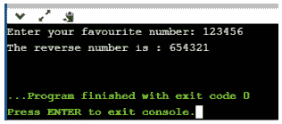

# 如何在 Python 中求一个数的倒数？

> 原文：<https://www.edureka.co/blog/how-to-reverse-a-number/>

Python 是一种具有不同应用的解释型、高级、通用编程语言。为了学习 Python 的[基本概念，有一些标准程序可以让你对所有概念有一个简单的了解。Python 中的反数程序就是这样一个程序，它能让学习者深刻理解](https://www.edureka.co/blog/python-basics/)[循环](https://www.edureka.co/blog/loops-in-python/)和[算术运算符](https://www.edureka.co/blog/operators-in-python/)。这个博客将帮助你理解和实现逆转一个数字的方法。它将涵盖以下主题

*   [如何在 Python 中倒一个数？](#how)
*   [Python 程序反转一个数字](#reverse)
    *   [使用循环](#loop)
    *   [使用递归](#recursion)

## **如何在 Python 中反算一个数？**

很简单！你可以写一个 Python 程序，它接受输入数字，然后反过来。一个整数值存储在一个[变量](https://www.edureka.co/blog/python-basics/#Variables)中，该变量使用一个条件进行检查，然后该数字的每个数字存储在另一个变量中，该变量将打印反转的数字。在 Python 中，可以使用不同的方法来反转数字，让我们来看看实现相同功能的 Python 程序。

## **Python 程序反转一号**

在 [Python 编程语言](https://www.edureka.co/blog/python-programming-language)中有两种反转数字的方法

*   使用循环
*   使用递归

## **使用循环反转一个数字**

```
 # Get the number from user manually 
num = int(input("Enter your favourite number: "))

# Initiate value to null
test_num = 0

# Check using while loop

while(num>0):
  #Logic
  remainder = num % 10
  test_num = (test_num * 10) + remainder
  num = num//10

# Display the result
print("The reverse number is : {}".format(test_num))

```

**输出** : 

**程序说明**

用户值:数字= 123456，反向= 0

**第一次迭代** 提醒= Number %10 提醒= 123456%10 = 6 反向=反向*10 +提醒反向= 0 * 10+6 = 0+6 = 6Number = Number//10Number = 123456//10 = 12345

**第二次迭代** 从第一次迭代开始，Number 和 Reverse 的值都更改为:Number = 12345 和 Reverse = 6Reminder = Number % 10Reminder = 12345% 10 = 5Reverse = Reverse * 10+Reminder = 6 * 10+5Reverse = 60+5 = 65Number = Number//10 = 12345//10Number = 1234

**第三次迭代** 从第二次迭代开始，Number 和 Reverse 的值都改为:Number = 1234 和 Reverse = 65Reminder = Number % 10Reminder = 1234% 10 = 4Reverse = Reverse * 10+Reminder = 65 * 10+4Reverse = 650+4 = 654Number = Number//10 = 1234//10Number = 123

**第四次迭代** 从第二次迭代开始，Number 和 Reverse 的值都变成了:Number = 123，Reverse = 654Reminder = Number % 10Reminder = 123% 10 = 3Reverse = Reverse * 10+Reminder = 654 * 10+3Reverse = 6540+3 = 6543Number = Number//10 = 123//10Number = 12

**第五次迭代** 从第二次迭代开始，Number 和 Reverse 的值都变成了:Number = 12，Reverse = 6543Reminder = Number % 10Reminder = 12% 10 = 2Reverse = Reverse * 10+Reminder = 6543 * 10+2Reverse = 65430+2 = 65432Number = Number//10 = 12//10Number = 1

**第六次迭代** 从第二次迭代开始，Number 和 Reverse 的值都变成了，Number = 1，Reverse = 654332Reminder = Number % 10Reminder = 1% 10 = 1Reverse = Reverse * 10+Reminder = 65432 * 10+1Reverse = 654320+1 = 654321Number 结束:

## **使用递归反转一个数**

```

# Python Program to Reverse a Number using Recursion

Num = int(input("Please Enter any Number: "))

Result = 0
def Result_Int(Num):
    global Result
    if(Num > 0):
        Reminder = Num %10
        Result = (Result *10) + Reminder
        Result_Int(Num //10)
    return Result

Result = Result_Int(Num)
print("n Reverse of entered number is = %d" %Result)

```

**输出** : 我希望它增加了您的 Python 编程知识的价值。

*T 要深入了解 Python 及其各种应用，您可以 [**在此**](https://www.edureka.co/python/) 注册在线实时培训，全天候支持，终身访问。* *有问题吗？在“在 Python 中反转数字”的评论部分提到它们，我们会给你回复。*