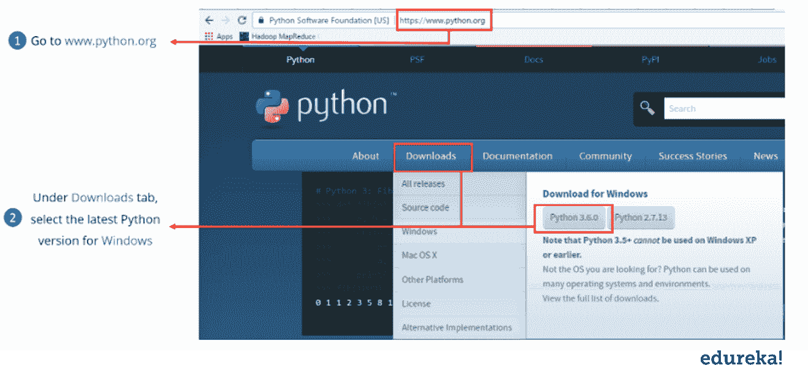
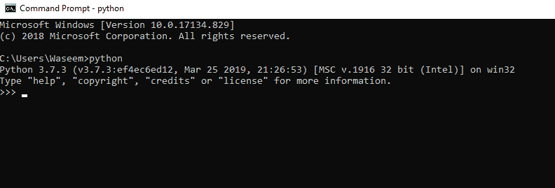
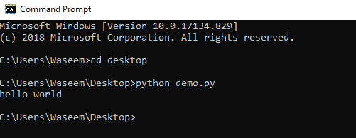
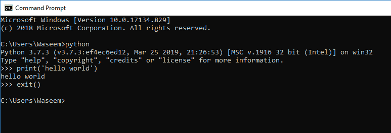
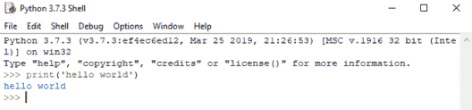
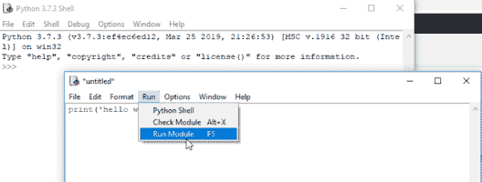
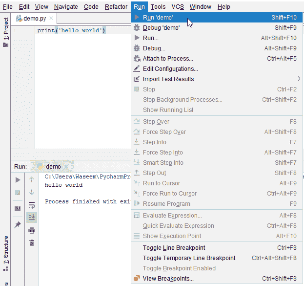
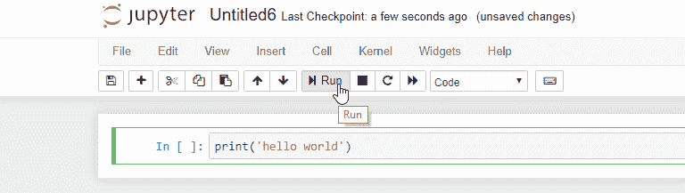

# 如何运行 Python 脚本？

> 原文：<https://www.edureka.co/blog/how-to-run-a-python-script/>

Python 编程语言已经成为最近最流行的编程语言之一。它承诺为每个领域的顶尖技术应用提供结果和开箱即用的功能。从许多开发人员从他们各自的编程语言转向 python 来看，学习 python 的需求是显而易见的。 [Python](https://www.edureka.co/data-science-python-certification-course) 由于其简单的语法和可读性，非常容易学习。在这篇博客中，我们将学习如何运行 python 脚本。以下是本文讨论的主题。

*   [环境设置–安装](#environmentsetup)
*   [Hello World 节目](#helloworld)
*   [运行一个. py 文件](#.pyfile)
*   [不同的想法](#ides)

## **环境设置-安装**

要开始使用 python，请按照以下步骤在您的系统上安装 python。



1.  去 python.org
2.  下载最新版本
3.  安装设置
4.  单击设置路径复选框。

完成上述步骤后，转到命令提示符并运行以下命令。



如果你得到了类似的窗口，你就可以走了。

## **你好世界节目**

python 的一个显著特点是它的语法和可读性。与其他编程语言相比，用 python [编写代码变得极其容易。下面是用 python 打印 hello world 的简单代码。](https://www.edureka.co/blog/java-vs-python/)

```

print('hello world')

```

如你所见，这很容易，几乎等同于用简单的英语编写一个 [python 脚本](https://www.edureka.co/blog/python-programs/)。

**Python 解释器**

解释器是一个我们需要运行 python 代码或脚本的程序。它基本上提供了代码和计算机硬件之间的接口，以获得代码的结果。

无论用哪种编程语言编写代码，使用 python 时都要经过解释器。例如，pypy 用于执行用 python 编写的代码。

## **运行一个. py 文件**

为了理解我们如何在 python 中执行. py 文件。遵循下面写的步骤。

1.  制作一个文本文件，用你选择的扩展名**保存。py** 。
2.  编写代码以在。复制文件并保存您的文件
3.  打开命令提示符。
4.  运行命令–python filename . py



还有一种运行 python 程序的方法。我们可以使用命令提示符来访问 python 交互式会话。



## **不同的想法**

当涉及到 python 的不同[ide 时，就变得略有不同。运行一个特定的脚本包括稍微不同的方法，但是在通过解释器运行代码方面是相同的。](https://www.edureka.co/blog/best-ide-for-python/)

*   **空闲时运行程序**



还有一种方法，我们创建一个新文件，并用扩展名保存它。py，剩下的过程也一样。



*   **在 Pycharm 中运行程序**

当你使用 pycharm 时，创建一个 python 文件并编写代码。完成后，运行程序，它将执行代码。



*   **运行 jupyter 笔记本中的程序**

你可以简单地在程序块中输入你的代码，然后按 run，它就会执行你的程序。



在这篇博客中，我们学习了如何运行 python 脚本。我们已经学习了不同的方法，包括交互式 python 会话和在不同的 ide 中运行简单的 python 程序，如 [Pycharm](https://www.edureka.co/blog/pycharm-tutorial) 和 [Jupyter notebook](https://www.edureka.co/blog/cheatsheets/Jupyter-Notebook-Cheat-Sheet) 。Python 编程语言是数据科学和机器学习的巅峰之作。

随着市场上不同的应用和趋势性技术进步，熟悉未来的编程语言变得很有必要。要开始学习并掌握成为 python 开发人员所需的技能，请注册 edureka 的 [python 编程认证计划](https://www.edureka.co/data-science-python-certification-course)并构建未来的应用程序。

*有什么问题吗？在评论区提到它们，我们会尽快回复你。*