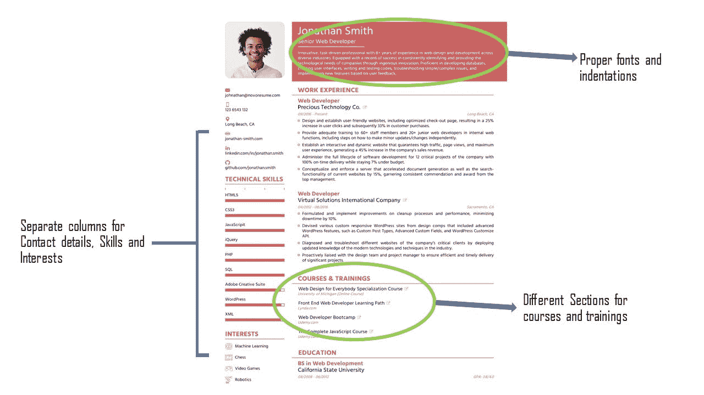
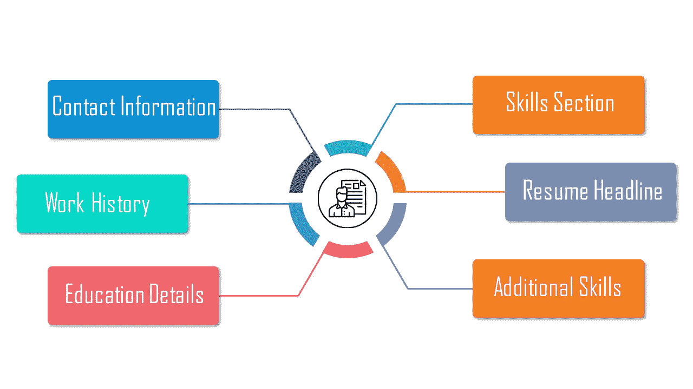
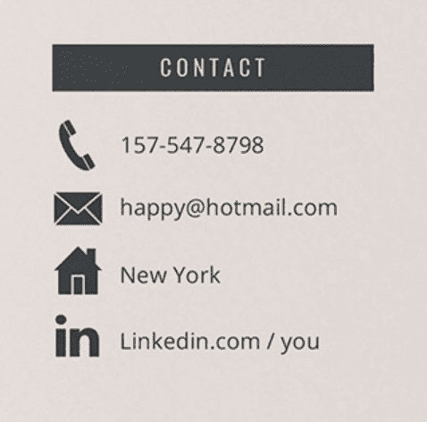
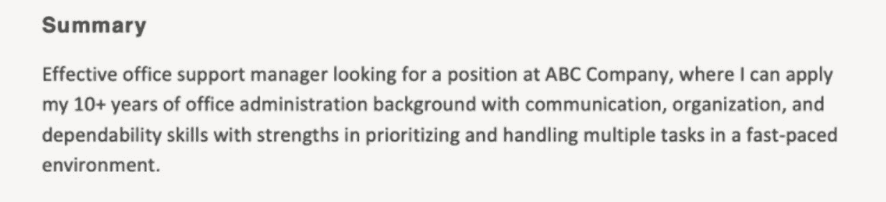
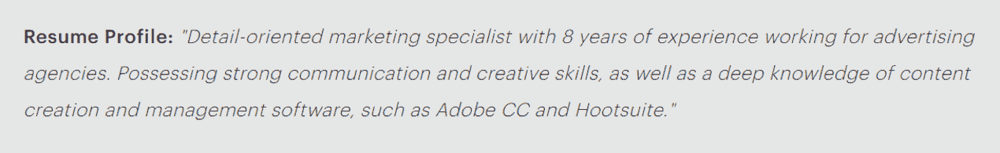
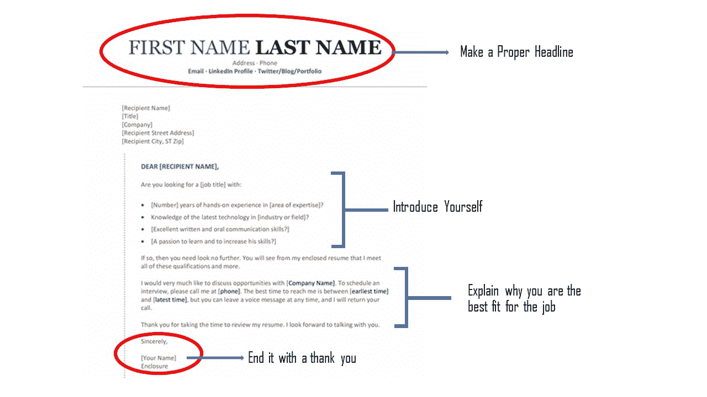

# 如何写一份求职简历——给应届毕业生和有经验的人

> 原文：<https://www.edureka.co/blog/how-to-write-a-resume-for-a-job/>

在过去的几年里，就业市场发生了巨大的变化，2017-18 年的失业率为 6.1%，尽管每天都有新的工作机会，但申请任何职位都存在激烈的竞争。简历在求职过程中起着重要的作用，即使你有资格申请任何职位，如果一个潜在的候选人比你做得更好，他们被选中的机会就会大大增加。如果你想知道制作入围简历背后的科学，你来对地方了！在这个博客中，我们将教你如何写一份简历，以及如何对你的简历做一些基本的改变，这些改变将会产生巨大的影响。让我们进入正题

如果你不喜欢阅读，这里有一个视频供你参考:

[//www.youtube.com/embed/bNmKMzed4eU](//www.youtube.com/embed/bNmKMzed4eU)

以下是我们将在本博客中涉及的主题:

[招聘如何运作](#TheRecruitmentProcess) [挑选合适的简历格式](#PicktherightResumeFormat) [提及正确的联系方式和个人信息](#Mentioncorrectcontactdetailsandpersonalinformation) [写一份独特的简历标题](#Writeauniqueresumeheadline) [列出你值得注意的工作成就](#Listyournotableworkaccomplishments) [添加你的软硬技能](#Addyoursoftandhardskills) [提及相关关键词](#Mentionrelevantkeywords) [写一份类似的求职信](#Writeasimilarcoverletter) [在发送简历前校对一下](#Proofreadyourresumebeforesendingit)

## **招聘是如何进行的——简历入围背后的科学原理**

首先让我们了解一下招聘流程是如何运作的。世界各地的人力资源和招聘人员都在采用新技术来帮助简化招聘流程，其中一项广泛使用的技术是应用跟踪系统或 ATS。应用程序跟踪系统基本上做的是充当它收到的成千上万份简历的数据库，并将其与职位描述进行匹配。它还会从你的简历中剔除不相关的数据，保留它认为重要的数据。这就是使用正确的关键词会有回报的时候，我们很快就会谈到这一点，现在让我们首先关注招聘过程。一旦申请跟踪系统给你的简历开了绿灯，你就会被进一步选中，这意味着你适合这份工作。

## **选择合适的简历格式**

对于第一次制作简历的人来说，选择正确的简历格式可能有点困难，尽管网上有成千上万种格式可供选择，但你应该选择一种简单、易用并且像我们讨论过的那样——“便于使用”。为了让事情变得简单，你可以在选择简历之前参考一下这个清单，看看它是否适合你:

1.  它有合适的字体和缩进吗？
2.  该格式是否包含了我想要包含的所有部分？
3.  它看起来专业吗？对我申请的工作有用吗？
4.  它对刮擦友好吗？
5.  我所有的数据都符合这种格式吗？
6.  我完成的简历有多少页？

在编辑你的简历之前，检查这些问题是否得到了回答。下面是一些简历格式的例子，

要写一份完美的简历，你不仅要知道如何写简历，还要知道简历中应该包括的所有部分。如果你对哪些部分应该被提及感到困惑，这里有一个列表是任何简历都必须要有的:

## ** ** **提及联系方式和个人信息**

第一部分有很多可能出错的地方，大多数情况下，申请人投出的简历信息不正确或不完整，会导致他们马上被拒绝。为了避免这种情况，你必须确保你简历中的数据是正确的和最新的。从你的工作联系电话、你的专业邮箱和任何一个容易联系的网址开始。

## **撰写独特的简历标题**

大一新生有搜索简历标题的习惯，并复制粘贴第一个出现的例子，虽然这可能是一个简单的方法，招聘人员马上就知道你写的标题是否独特(他们当然不是像你这样的大一新生！).真正吸引任何面试官眼球的是一个独特的诚实而直白的标题。这很容易构建。你能做的就是在网上看到一些例子，然后试着根据你认为最适合你的来组织你的标题。

**例 1**

**例 2**

## **列出你的工作成绩**

如果你是一名大一新生，你可能没什么可写的，但你可以提及你在毕业期间的实习或项目。如果你没有任何实习机会，你可以简单地写下你所精通的技术。 如果你是一个有经验的人，你可以从你参与过的主要客户或项目或者任何对公司有影响的显著成就开始。

## **添加你的软硬技能**

在简历中加入你的软技能和硬技能可以让招聘者了解你是怎样的一个人，软技能包括你的职业道德和能力，比如良好的沟通和领导能力等。另一方面，硬技能是与工作相关的技术能力。两者同等重要，在为职位选择合适的候选人时发挥着巨大的作用

## **提及相关关键词**

关键词就是工作描述中提到的那些词。为了解决申请跟踪系统的问题，你必须选择这些关键词，并把它们天衣无缝地写进你的简历，这样你才能被选中。每当招聘团队收到一份简历，他们就会寻找这些关键词，并将包含相同的简历列入候选名单

## **写一封类似的求职信**

求职信是一页纸的文件，作为你工作申请的一部分提交。你应该把求职信看作是给招聘经理的直接信息。在写求职信时，你只需要解释为什么你是这份工作的合适人选。它的目的是介绍你，简要概括你的专业背景。 

## 申请前校对你的简历

在发送简历之前，最好花两分钟时间检查一下你的简历是否有语法错误和拼写错误。这些错误可能看起来很小，但它们可能是你的简历被拒绝的原因，所以安全比后悔好！

关于如何写简历的博客到此结束，我希望你喜欢了解你可以在简历中做出的小改变，这些改变将会产生巨大的影响。快乐学习！

*有问题吗？请在下面的评论区提出来，我们会尽快回复您。*