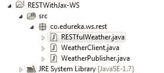
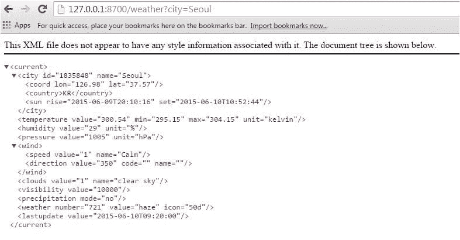
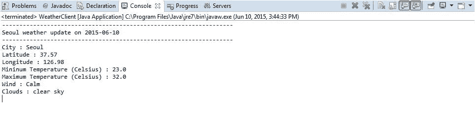

# 如何用 JAX-WS 编写 RESTful Web 服务

> 原文：<https://www.edureka.co/blog/how-to-write-restful-web-services-with-jax-ws/>

Web 服务是部署在机器(服务器)上的应用程序。Web 服务接受来自客户端的传入请求，并以纯文本、JSON 或 XML 格式向客户端发送响应。

web 服务的美妙之处在于它们是语言独立的。因此，用 Python 编写的 web 服务可以从用 Java、C#、Ruby 等编写的客户端请求。

Web 服务分为两类:

*   **SOAP**–在基于 SOAP 的 web 服务中，客户端和服务都传输 SOAP 消息进行通信。
*   REST——在 REST 风格的服务中，客户端和服务通常传输原始的 XML 来进行通信。

Java 为创建 SOAP 和 REST 风格的 web 服务提供了 API

JAX-WS–JAX-WS(Java API for XML Web Services)是一个 Java API，用于创建 SOAP 和 REST 风格的 Web 服务。有一种常见的误解，认为 JAX-WS 仅用于基于 SOAP 的服务，这是不正确的。使用 JAX-WS，您可以创建 SOAP 和 REST 风格的服务

JAX-RS(RESTful Web 服务的 Java API)是一个可以轻松编写 RESTful Web 服务的 Java API

**注意**:虽然 JAX-WS 可以用来编写 RESTful web 服务，但它不是创建 REST 风格服务的最佳方式。在生产模式下，你可能应该使用 JAX-RS，Restlet 框架等。

现在，让我们看看如何使用 JAX-WS API 创建一个 RESTful 天气服务。

我们将编写一个天气服务，它将城市名作为参数，并将天气细节作为 XML 文档返回。我们将使用 [的天气服务打开天气地图。](http://openweathermap.org/)

现在，让我们深入研究代码。

下面是 Eclipse IDE 中的项目结构

[](https://www.edureka.co/blog/wp-content/uploads/2015/06/restful-webservice-projectstructure.jpg)

RESTfulWeather 类实现将由 WeatherPublisher 类发布的天气服务

```
@WebServiceProvider
@ServiceMode(value = javax.xml.ws.Service.Mode.MESSAGE)
@BindingType(value = HTTPBinding.HTTP_BINDING)

public class RESTfulWeather implements Provider {

	@Resource
	protected WebServiceContext wsContext;

	@Override
	public Source invoke(Source request) {		
		MessageContext msg_cxt = wsContext.getMessageContext();
		String httpMethod = (String) msg_cxt
				.get(MessageContext.HTTP_REQUEST_METHOD);
		//System.out.println("Http Method : " + httpMethod);
		if (httpMethod.equalsIgnoreCase("GET")) {
			 return doGet(msg_cxt);
		}
		return null;
	}

	private Source doGet(MessageContext msg_cxt) {
		String query_string = (String) msg_cxt.get(MessageContext.QUERY_STRING);
		StringBuffer text=new StringBuffer("");		
		String cityName=query_string.split("=")[1];
		try {
			URL url = new URL(
					"http://api.openweathermap.org/data/2.5/weather?q="+cityName+"&mode=xml");
			HttpURLConnection urlConnection = (HttpURLConnection) url.openConnection();
			urlConnection.setRequestMethod("GET");		
			urlConnection.connect();

			BufferedReader bReader = new BufferedReader(new InputStreamReader(
					urlConnection.getInputStream()));
			String line = null;			

			while ((line = bReader.readLine()) != null) {							
				text=text.append(line);			
			}		

		} catch (Exception e) {
			e.printStackTrace(); 
		}
		return new StreamSource( new StringReader(text.toString()) );

	}	

}
```

让我们一行一行地深入代码。

我们已经用@WebServiceProvider 注释了该类，这意味着交换的消息将是 XML 文档。Weather service 实现了通用的提供者接口，而不是自定义的服务端点接口(SEI)。

带有值 MESSAGE 的注释@ServiceMode 表示服务想要访问整个消息(例如，HTTP 头和正文)。BindingType 注释声明该服务处理 HTTP 上的原始 XML，而不是 HTTP 上的 SOAP。

在 invoke 方法中，我们首先从 WebServiceContext 中检索 MessageContext。然后，我们检查传入请求的请求方法，如果是 GET，我们称之为传递 MessageContext 的 doGet 方法。然后，我们从查询字符串中提取 city 参数的值，并将其称为 OpenWeatherMap 服务，该服务返回一个 XML 文档。

**注意:**我们将返回的 XML 文档存储在 StringBuffer 中。

**如何从 StringBuffer 中获取源类型**

```
return new StreamSource( new StringReader(text.toString()) );
```

上面的行将从 StringBuffer 实例文本中返回 StreamSource。

气象服务已经结束了。现在让我们发布服务。

**WeatherPublisher.java**

```
import javax.xml.ws.Endpoint;

public class WeatherPublisher {

	public static void main(String[] args) {
		System.out.println("Publishing Weather Service");
		Endpoint.publish("http://127.0.0.1:8700/weather",new RESTfulWeather());

	}
}
```

**访问网络服务**

让我们访问天气服务，给它一个城市名称。我们可以查一下首尔的天气

[](https://www.edureka.co/blog/wp-content/uploads/2015/06/access-restful-webservice.jpg)

我们得到一个 XML 文档作为响应，其中包含纬度、经度、温度、湿度、风、云等信息。

由于我们的天气服务已经启动并运行，是时候编写一个将使用该服务的客户端了。

**针对天气服务编写客户端**

因为 weather service 返回一个 XML 文档作为响应，所以任何使用 web 服务的客户机都必须解析这个 XML 文档。下面是针对天气服务编写的 Java 客户端

```
import java.io.BufferedReader;
import java.io.ByteArrayInputStream;
import java.io.IOException;
import java.io.InputStreamReader;
import java.net.HttpURLConnection;
import java.net.URL;
import javax.xml.parsers.ParserConfigurationException;
import javax.xml.parsers.SAXParser;
import javax.xml.parsers.SAXParserFactory;
import org.xml.sax.Attributes;
import org.xml.sax.SAXException;
import org.xml.sax.helpers.DefaultHandler;

public class WeatherClient {

	public static void main(String[] args) throws IOException, SAXException, ParserConfigurationException {
		// GET requests
		URL url=new URL("http://127.0.0.1:8700/weather?city=seoul");		
		HttpURLConnection conn = (HttpURLConnection) url.openConnection();
		conn.setRequestMethod("GET");
		conn.connect();		

		String xml = "";
		BufferedReader reader =	new BufferedReader(new InputStreamReader(conn.getInputStream()));
		String next = null;
		while ((next = reader.readLine()) != null)
		xml += next;		

		SAXParser parser =SAXParserFactory.newInstance().newSAXParser();
		SaxParserHandler handler=new SaxParserHandler();
		parser.parse(new ByteArrayInputStream(xml.getBytes()),handler);
		System.out.println("-------------------------------------------------------------------");
		System.out.println(handler.city+" weather update on "+handler.lastUpdate);
		System.out.println("-------------------------------------------------------------------");
		System.out.println("City : "+handler.city);
		System.out.println("Latitude : "+handler.latitude);
		System.out.println("Longitude : "+handler.longitude);
		System.out.println("Mininum Temperature (Celsius) : "+handler.minTemperature);
		System.out.println("Maximum Temperature (Celsius) : "+handler.maxTemperature);
		System.out.println("Wind : "+handler.wind);
		System.out.println("Clouds : "+handler.clouds);
	}
}	

    class SaxParserHandler extends DefaultHandler{
		 String city;
		 String latitude;
		 String longitude;
		 float minTemperature;
		 float maxTemperature;
		 String wind;
		 String clouds;
		 String lastUpdate;

		 public void startElement(String namespaceURI,String localName,String qname,Attributes attributes){		

				if(qname.equals("city")){
					city=attributes.getValue("name");					
				}else if(qname.equals("coord")){
					latitude=attributes.getValue("lat");					
					longitude=attributes.getValue("lon");
				}
				else if(qname.equals("temperature")){
					String minKelvin=attributes.getValue("min");
					minTemperature=Math.round(Float.parseFloat(minKelvin)) - 272;
					String maxKelvin=attributes.getValue("max");					
					maxTemperature=Math.round(Float.parseFloat(maxKelvin)) - 272;
				}
				else if(qname.equals("speed")){
					wind=attributes.getValue("name");										
				}
				else if(qname.equals("clouds")){
					clouds=attributes.getValue("name");									
				}	
				else if(qname.equals("lastupdate")){
					lastUpdate=attributes.getValue("value").split("T")[0];									
				}
			}		

      }
```

**注意:** WeatherClient 使用 SAX 解析器来解析来自服务的响应。如果你不是很熟悉用 Java 解析 XML 文件，这里有一篇文章解释了 [如何使用 SAX 解析器解析 XML 文件。](https://www.edureka.co/blog/parsing-xml-file-using-sax-parser/)

还可以使用 DOM 或 StAX 解析器来解析 XML 文档。

**输出**

下面是您在执行 WeatherClient 类时得到的输出

[](https://www.edureka.co/blog/wp-content/uploads/2015/06/rest-output.jpg)

**提醒一句:**

让我们重复前面说过的话，JAX-WS 不是实现现实世界 RESTful 服务的正确选择。对于编写真实世界的 RESTful web 服务 JAX-RS，Restlet 或 Spring framework 是一个不错的选择。

好奇自己试代码？下载代码。

【button leads form _ title = " Download Code " redirect _ URL = https://edu reka . wistia . com/medias/jqusavrxbs/Download？media _ file _ id = 79202719 course _ id = 44 button _ text = "下载代码"]

**获取 java.net.BindException:** 如果您试图在已经使用的端口上发布 web 服务，您将会获得 java.net.BindException

原因: java.net.BindException :地址已被使用:bind

要消除这个异常，只需使用其他端口来发布 web 服务。

***有问题吗？请在评论区提到它，我们会回复你**。*

**相关帖子:**

[Java 入门/J2EE](https://www.edureka.co/java-j2ee-soa-training)

[使用 JSP Servlet 创建在线测验应用程序](https://www.edureka.co/blog/creating-an-online-quiz-application-using-jsp-servlet/)

[使用 SAX 解析器解析 XML 文件](https://www.edureka.co/blog/parsing-xml-file-using-sax-parser/)