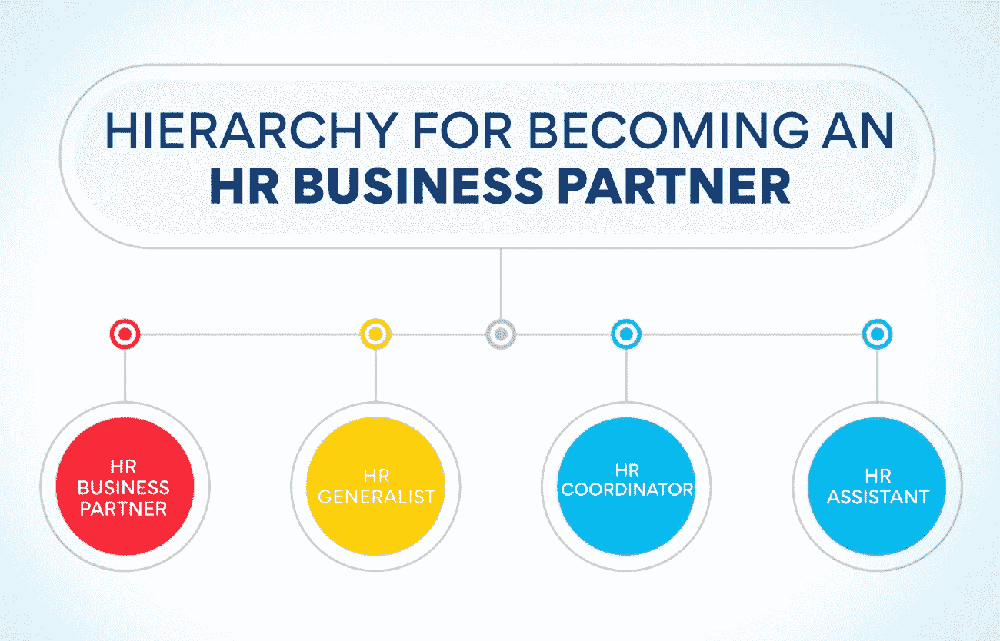

# 什么是人力资源业务伙伴:终极指南

> 原文：<https://www.edureka.co/blog/hr-business-partner>

你知道什么是人力资源商业伙伴吗？如果没有，不用担心；你并不孤单。很多人对这个术语不熟悉。一个人力资源业务合作伙伴是人力资源团队的重要成员，为业务提供[战略支持](https://www.edureka.co/blog/strategic-human-resource-management)。他们与经理和员工合作，帮助确保人力资源职能满足业务需求。本指南将讨论什么是人力资源业务合作伙伴，他们如何为你的公司做出贡献，以及他们成功所需的一些关键技能。

## 什么是人力资源业务伙伴？详细解释

人力资源业务合作伙伴是指在人事相关问题上担任管理顾问的人力资源专业人士。

HRBP(人力资源业务合作伙伴)角色出现于 20 世纪 90 年代初，当时企业开始扁平化，脱离传统的功能性人力资源角色。要想成功，人力资源业务人员需要既有深厚的人力资源知识，又有很强的商业头脑。

HRBPs 与直线经理密切合作，帮助他们识别和解决与人相关的问题。他们在绩效管理、员工参与度、人才发展和继任规划问题上充当经理的传声筒。

HRBPs 在变革管理举措中也发挥着重要作用，因为它们有助于确保变革顺利有效地实施。

没有放之四海而皆准的 HRBP 模式，因为角色会根据组织的具体需求而有所不同。然而，所有 HRBPs 都应该能够在人力资源事务上提供专家建议和支持，同时与直线经理建立牢固的关系。

想从事人力资源方面的职业？那么 HRBP 的角色是值得考虑的。这是一个要求很高的角色，但它可以令人满意，并提供极好的职业发展机会。

你具备成为 HRBP 人的素质吗？查看我们的人力资源管理研究生证书，它将让你详细了解如何成为一名人力资源业务合作伙伴。

## 人力资源业务伙伴需要扮演什么角色？

HRBP 角色有许多方面，他们可能负责以下任何或所有方面:

组织设计: 人力资源业务流程有助于组织设计，确保该结构促进公司的业务战略和人力资源计划。他们负责理解组织的职能，以及人力资源在哪里可以产生最大的影响。

他们从事的组织设计类型:

*   HRBPs 参与人力资源部门的重组，以符合业务目标。
*   他们还可以帮助设计新的角色或工作描述，以支持新的业务计划。
*   HRBPs 与经理合作，重新设计工作流程并提高效率。

**人力资源战略**

HRBPs 帮助开发和实施符合业务目标的人力资源战略。所有的人力资源战略都必须通过 HRBP，这样才能最有效地执行。它会让人力资源部门更聪明地工作，而不是更努力。

参与的人力资源策略类型:

*   hrbp 经常参与制定和实施与人才管理、[劳动力规划](https://www.edureka.co/blog/strategic-workforce-planning)、员工关系和组织发展相关的人力资源战略。
*   HRBPs 与人力资源专员和专家一起开发和实施人力资源项目和计划。
*   HRBPs 还可能参与人力资源政策的制定和实施以及员工沟通。
*   HRBPs 通常负责人力资源预算规划和管理。

**人才获取**

HRBPs 在人才获取和管理中起着至关重要的作用。他们与招聘经理合作，确定人员需求，制定职位描述，寻找和筛选候选人。他们还可能进行初步面试、背景调查和入职活动。HRBP 通常了解组织的文化和价值观，这有助于他们找到合适的候选人。

他们负责的人才获取任务类型:

*   寻找和筛选候选人
*   进行初步访谈
*   参考检查
*   新员工入职

他们在制定和实施人力资源政策和程序方面也发挥着至关重要的作用。他们与高层领导合作，确保人力资源政策与组织的战略目标保持一致。

**员工发展**

HRBPs 是人力资源专业人士，他们与组织的高层领导密切合作，帮助他们做出与组织战略目标一致的人事决策。

人力资源业务合作伙伴通常参与组织设计、变革管理、领导力发展和继任规划等计划。除了他们的战略角色，HRBPs 通常还负责更多的战术人力资源职能，如福利管理和员工关系。

人力资源业务伙伴是一个相对较新的职位，它仍在不断发展。随着人力资源业务流程的角色不断演变，渴望成为其中一员的人力资源专业人员需要与高层领导有效沟通，了解[业务目标](https://www.edureka.co/blog/objectives-of-human-resource-management/)，并具备战略思维。他们还必须精通人力资源人才管理和员工发展。

**薪酬和福利**

HRBPs 与组织的高层领导团队一起制定和实施薪酬和福利计划。他们的主要目标之一是激励和留住顶尖人才，同时确保组织的薪酬和福利计划具有竞争力。

人力资源业务伙伴在员工关系中也发挥着至关重要的作用。他们致力于解决员工和经理之间的冲突，并帮助制定防止未来冲突的政策和程序。HRBPs 还负责调查对员工不当行为的指控。

人力资源业务合作伙伴与组织的管理层团队紧密合作，制定并实施战略性人力资源计划。他们的目标是确保组织的人力资源政策和程序符合其业务目标。它们也是组织管理进步的基石。

**也读作:[分解人力资源管理的范围](https://www.edureka.co/blog/scope-of-human-resource-management/)**

**人力资源信息系统**

HRBPs 是人力资源专业人士，他们与经理合作，帮助他们做出与人相关的决策，以支持组织的业务目标。HRBPs 是战略思考者和发展代理人，他们能够看到全局并帮助客户驾驭不断变化的人力资源环境。

人力资源业务合作伙伴通常对人力资源和业务有全面的了解，他们用这些知识来帮助客户在人际关系问题上做出明智的决策。HRBPs 通常参与组织设计、变革管理、人才管理和继任规划等计划。

HRBP 还负责照看 HRIS 系统，并确保它们与最新的人力资源趋势和技术保持同步。他们与 HRIS 供应商合作，确保系统满足企业及其员工的需求。HRBPs 还与 HRIS 用户合作，确保他们有效且高效地使用该系统。

## **人力资源业务伙伴和人力资源经理的区别**

人力资源业务合作伙伴是一个战略职位，与组织的高层领导合作，帮助制定和执行公司的人力资源战略。HRBP 通常被视为高层领导的顾问，致力于将人力资源计划与公司的业务目标结合起来。

相比之下，人力资源经理负责人力资源部门的日常运作。人力资源经理监督人力资源政策和程序的实施，并努力确保人力资源部门顺利运行。人力资源经理也可能参与制定人力资源战略。尽管如此，他们通常不像人力资源业务伙伴那样参与公司的整体战略方向。

如果你想在人力资源领域开始职业生涯，你可能想知道你应该成为人力资源业务伙伴还是人力资源经理。做决定时，请考虑以下事项:

*   你想更多地参与人力资源部门的战略和决策吗？如果是这样，那么你可能想成为一个人力资源业务合作伙伴。
*   你想更专注于人力资源的运营和日常工作吗？如果是这样，那么你可能想成为一名人力资源经理。
*   你有什么样的技能和经验？如果你有更多的商业或人力资源管理背景，成为人力资源商业伙伴可能会更合适。如果你有更多的人力资源通才背景，成为一名人力资源经理可能会更好。
*   你的职业目标是什么？如果你想最终成为人力资源总监或其他高级人力资源主管，那么成为人力资源业务合作伙伴可能会给你一个实现目标的更好机会。如果你满足于留在一个更具操作性的人力资源岗位，那么成为一名人力资源经理将是你的理想选择。

## **人力资源业务合作伙伴技能和资格**

人力资源业务合作伙伴是一个管理级别的职位，要求个人具有出色的沟通、解决问题和人际交往能力。人力资源业务合作伙伴必须能够批判性地思考和分析，以确定与人力资源相关的问题，然后制定创造性的解决方案。人力资源业务合作伙伴还必须善于与组织内所有级别的个人建立关系和合作伙伴关系。

要想在 HRBP 这个职位上取得成功，个人必须对人力资源的概念和原则有深刻的理解。人力资源业务合作伙伴必须了解员工关系、薪酬和福利、[人才管理、](https://www.edureka.co/blog/talent-management-and-its-importance/)和人力资源合规。他们必须了解他们所支持的业务，并且能够使人力资源战略与业务目标保持一致。

## 如何成为 HRBP？

HRBPs 必须能够建立关系、有效沟通和解决问题。他们通常拥有人力资源、商业管理或相关领域的学士学位。他们必须有在人力资源部门工作的经验。

成为人力资源业务伙伴的层级:

*   **人力资源业务伙伴:**人力资源业务伙伴负责将人力资源计划与组织的业务目标保持一致。HRBP 的工作是确保人力资源计划的设计满足组织的需求。
*   **人力资源专员:** 人力资源专员负责日常的人力资源运作。他们有责任确保员工朝着公司的共同目标努力。
*   人力资源协调员: 人力资源协调员处理与人力资源相关的行政工作。人力资源协调员还负责制定和实施人力资源政策。
*   人力资源助理: 人力资源助理为人力资源部提供支持。他/她还可能负责维护员工档案和进行背景调查。

所以，在成为人力资源业务伙伴之前，你需要先做一名人力资源助理，然后是人力资源协调员和多面手。想知道作为一名人力资源业务伙伴，你能做些什么？以下是人力资源业务合作伙伴的一些主要职责:

*   将人力资源计划与组织的业务目标结合起来
*   与员工建立关系
*   有效沟通
*   解决问题

**也读作:[人力资源管理的关键目标](https://www.edureka.co/blog/objectives-of-human-resource-management/)**

**成为人力资源业务伙伴的步骤**

人力资源业务合作伙伴档案是一个组织内的战略职位，它与领导层合作，使人力资源计划和举措与整体业务战略保持一致。人力资源业务伙伴是对人力资源的职能和运作有深刻理解的人力资源通才。

要成为人力资源业务合作伙伴，人力资源专业人员必须首先获得至少五年的人力资源工作经验。人力资源经验可以通过各种角色获得，如人力资源协调员、人力资源专员、人力资源经理或人力资源总监。人力资源专业人士通常拥有人力资源或相关领域的硕士学位。

人力资源业务合作伙伴必须具备出色的沟通和人际交往技能，因为他们将与组织中各个层面的个人一起工作。他们还必须能够有效地管理组织内部的变革。

## **底线**

总之，人力资源业务伙伴是组织中的一个战略角色，负责将人力资源规划与整体业务战略结合起来。这些都是经验丰富、受过良好教育的人力资源专业人士，他们深刻理解企业及其目标，能够帮助制定[支持这些目标的人力资源战略](https://www.edureka.co/blog/ultimate-guide-to-developing-an-effective-hr-strategy/)。如果你正在考虑成为一名人力资源业务伙伴，或者你的组织正在考虑招聘专业人士担任这一职位，那么尽可能多地了解人力资源业务伙伴的工作以及他们如何为组织增加价值是至关重要的。

猜猜看？我们正在提供一个 PG 证书课程，可以让你接近目标。查看我们的[人力资源管理研究生证书](https://www.edureka.co/highered/human-resourse-management-course-iim-shillong)，在这里，您将在繁忙的日程之外享受舒适学习的便利。

## **更多信息:**

[人力资源管理的关键基础](https://www.edureka.co/blog/fundamentals-of-human-resource-management/)

[人力资源管理的演变:过去和未来](https://www.edureka.co/blog/evolution-of-human-resource-management)

[人力资源管理的性质和目标](https://www.edureka.co/blog/nature-and-objectives-of-human-resource-management/)

[改善员工关系——11 条建议](https://www.edureka.co/blog/employee-relations)