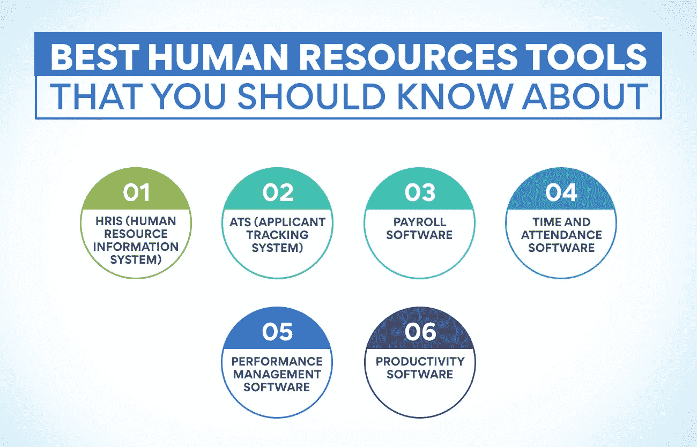
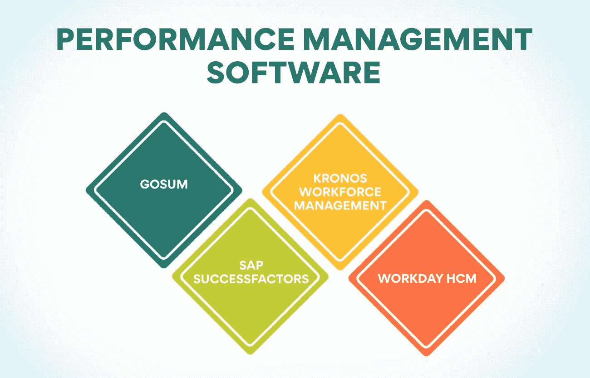

# 你应该知道的高级人力资源工具

> 原文：<https://www.edureka.co/blog/hr-tools/>

作为一名人力资源专业人员，了解最新的人力资源工具和技术非常重要。有许多先进的人力资源工具可以让你的工作轻松很多。

*   人力资源专业人士报告称，技术已经改善了他们组织中的人力资源管理，绝大多数人(91%)认为技术已经产生了一定或非常积极的影响。
*   特别是，人力资源专业人士表示，技术帮助他们实现了重复性任务的自动化(78%)，加快了流程(77%)，并改善了沟通和协作(74%)。
*   人力资源技术也被视为对招聘有积极影响，近四分之三(73%)的人力资源专业人士表示，它帮助他们发现并吸引更好的候选人。

这篇博文将讨论一些最流行的人力资源工具，以及它们如何为你的企业带来益处。敬请关注更多信息！

人力资源工具如何推动人力资源管理的发展？

人力资源工具有助于人力资源专业人员更高效地管理他们的工作。人力资源工具是人力资源管理的重要组成部分。它们用于管理员工档案，跟踪员工绩效和对人力资源政策的遵守情况。他们还在员工招聘、培训和发展方面发挥着关键作用。

**有效管理任务:** 人力资源工具让人力资源经理更容易跟踪和管理员工档案。借助人力资源工具，人力资源经理可以轻松跟踪员工的缺勤、工作时间和休假记录。他们还可以监控员工绩效和对人力资源政策的遵守情况。

**增强员工招聘:** 人力资源工具可用于增强员工招聘。借助人力资源工具，人力资源经理可以快速确定空缺职位的潜在候选人。人力资源工具也可以用来评估候选人的资格。

**更好的员工培训和发展:** 人力资源工具可以改善员工培训和发展。人力资源经理可以使用人力资源工具快速确定需要更多培训的员工。人力资源管理工具也可以用来评估员工培训计划的有效性。

**增强组织:** 人力资源管理工具旨在帮助人力资源专业人员更高效、更有效地管理他们的工作。借助人力资源管理工具，人力资源经理可以轻松地组织员工档案，跟踪[员工绩效](https://www.edureka.co/blog/employee-relations)和遵守人力资源政策的情况。人力资源管理工具还可以监控员工的缺勤、工作时间和休假记录。

**省时:** 人力资源工具可以为人力资源经理节省大量的时间。它们可用于自动化人力资源流程。借助人力资源工具，人力资源经理可以轻松跟踪和管理员工档案。人力资源管理工具也可以用来评估候选人的资格。

**降低成本:** 随着人力资源管理工具的日益普及，与人力资源管理相关的成本也在降低。他们实现了所有人力资源流程的自动化。有了这些工具，人力资源经理可以轻松地跟踪和管理员工档案。它们也可以用来评估候选人的资格。它减少了人力资源人员手动处理人力资源数据的需要。

**提高员工保留率:** 人力资源管理工具可以提高员工保留率。有了这些工具，人力资源经理可以很容易地识别出有离开组织风险的员工。人力资源工具也可以用来评估员工保留计划的有效性。

**也读作:[分解人力资源管理的范围](https://www.edureka.co/blog/scope-of-human-resource-management/)**

**你应该知道的最佳人力资源工具**

作为一家公司的人力资源经理，你有责任确保你的团队拥有成功所需的资源和工具。人力资源管理工具可以帮助您跟踪员工绩效、遵守人力资源政策等情况。

这里有一些你应该知道的最好的人力资源工具:

**HRIS(人力资源信息系统)**

这是一个帮助人力资源经理跟踪员工数据的系统，如联系信息、工作职责和绩效记录。HRIS 还可以帮助自动化人力资源流程，例如新员工入职或跟踪员工假期。你不需要成为一个技术人员或专家来使用 HRIS——市场上有许多用户友好的 HRIS 平台。

**优点:**

*   将所有员工数据保存在一个中心位置
*   可以自动化人力资源流程
*   帮助经理跟踪员工绩效

**缺点:**

*   实施可能会很昂贵
*   需要对人力资源人员进行培训

**ATS(申请人跟踪系统)**

求职者跟踪系统是公司在整个招聘过程中用来跟踪求职者的工具。该系统可用于收集和存储申请人的数据，以及与申请人沟通和安排面试。

对于人力资源专业人员来说，ATS 是一个很有价值的工具，因为它可以帮助他们跟踪工作申请人，并确保所有申请人都在空缺职位的考虑范围内。此外，ATS 有助于简化招聘流程，提高效率。

**优点:**

*   可以帮助跟踪求职者
*   有助于简化招聘流程
*   可以提高招聘过程的效率

**缺点:**

*   可贵了
*   使用起来可能会有挑战性
*   对小型企业来说可能没有必要

**薪资软件**

薪资软件是必不可少的人力资源工具之一。它用于管理员工工资、税收和福利。有许多不同的工资单软件程序可用，因此选择一个适合您的业务需求是至关重要的。一些最好的薪资软件有:

Gusto: Gusto 是一款基于云的薪资软件，提供直接存款、报税和员工自助服务等功能。Gusto 还提供人力资源和福利工具。

ADP: ADP 是领先的薪资和人力资源服务提供商。它们提供广泛的功能，包括在线和移动访问、时间和出勤跟踪以及报税。

Xero: Xero 是一款基于云的会计软件，提供直接存款和员工自助服务等薪资功能。Xero 还提供人力资源和福利工具。

Sage 是一家领先的薪资和人力资源软件提供商。它们提供许多功能，包括在线和移动访问、时间和出勤跟踪以及报税。

所有这些软件都可以帮助你提高人力资源流程的效率。选择最适合您业务需求的一款。

**优点:**

*   可以让 HR 流程更高效
*   提供广泛的功能

**缺点:**

*   可贵了
*   可能需要培训才能使用所有功能
*   并非所有的软件程序都相互兼容

**考勤软件**

如果你管理一个员工团队，你就会知道记录时间和出勤有多重要。许多人力资源工具可以帮助你做到这一点，但其中最好的是时间和考勤软件。这个软件可以帮助你跟踪员工的工作时间，安排班次，甚至计算工资。

现在比较流行的一些考勤软件有:

这个软件提供时间跟踪、排班和工资计算。它还有一个移动应用程序，因此即使你不在办公室，也可以跟踪时间和出勤情况。

**TimeClock Plus:** 这款软件非常适合拥有多个办公地点的企业。它提供时间跟踪、排班和员工自助服务等功能。

这个软件提供了时间跟踪、员工日程安排和工资单集成。它还有一个移动应用程序，因此即使你不在办公室，也可以跟踪时间和出勤情况。

**克罗诺斯劳动力就绪:** 该软件提供时间跟踪、员工调度以及人力资源和工资单集成。它还有一个移动应用程序，因此即使你不在办公室，也可以跟踪时间和出勤情况。

无论您的业务类型是什么，时间和考勤软件都可以帮助您保持有序，并确保您的员工获得他们应得的工作时间。如果你没有使用这种类型的软件，那么你应该考虑一下。会给你的 HR 部门带来巨大的不同。

**优点:**

*   可以帮助您跟踪员工工作时间
*   可以排班
*   可以计算工资总额
*   有手机 app

**缺点:**

*   可贵了
*   可以复杂地设置
*   可能需要对员工进行培训，以便有效地使用它

**绩效管理软件**

另一个重要的人力资源工具是绩效管理软件。这种类型的软件可以帮助人力资源专业人员跟踪员工的表现，确定需要改进的地方，并设定目标。此外，绩效管理软件可以创建个人发展计划，并随着时间的推移监控进度。

一些流行的绩效管理软件程序包括:

这个项目帮助人力资源专业人员通过目标设定、跟踪和反馈来管理员工绩效。此外，GoSum 提供了创建开发计划和跟踪进度的工具。

**克罗诺斯劳动力管理:** 该软件帮助人力资源专业人员跟踪员工绩效，管理轮班时间表，并监督遵守劳动法的情况。此外，克罗诺斯提供了分析劳动力数据和确定趋势的工具。

**SAP SuccessFactors:** 该软件帮助人力资源专业人员管理员工绩效，确定发展需求，并制定个性化的学习计划。此外，SAP SuccessFactors 还提供了跟踪目标进展和与其他组织进行对比的工具。

**Workday HCM:** 该软件帮助人力资源专业人员管理员工绩效，[开发人才，](https://www.edureka.co/blog/talent-management-and-its-importance/)并吸引员工。此外，Workday 还提供了跟踪人力资源政策和程序合规性的工具。

人力资源专业人员应该考虑使用绩效管理软件来提高组织绩效和发展员工。此外，绩效管理软件可以帮助人力资源专业人员识别问题领域并制定改进计划。

**优点:**

*   帮助人力资源专业人员跟踪员工绩效
*   帮助人力资源专业人员确定需要改进的领域
*   帮助人力资源专业人员设定目标
*   帮助人力资源专业人员制定个人发展计划
*   帮助人力资源专业人员监控一段时间内的进展

**缺点:**

*   可贵了
*   可以费时地实现***

**也读作:[人力资源管理的关键目标](https://www.edureka.co/blog/objectives-of-human-resource-management/)**

**生产力软件**

有几种人力资源工具可以帮助你提高工作效率。一些最受欢迎的选项包括项目管理软件、时间跟踪软件和员工生产力跟踪软件。

项目管理软件可以帮助你跟踪截止日期、分配的任务和进度报告。人力资源专业人员经常使用这种类型的软件来管理员工的绩效和合规性。

时间跟踪软件可以帮助监控员工的工作时间、休息时间和加班时间。人力资源专业人员经常使用这种软件来改进劳动力的安排和时间管理。

员工生产力跟踪软件可以帮助您识别哪些员工达到了他们的生产力目标，哪些员工落后了。人力资源专业人员经常使用这种类型的软件来提高员工的参与度和积极性。

**优点:**

*   帮助您提高工作场所的生产力
*   帮助您跟踪截止日期、分配的任务和进度报告
*   帮助您监控员工的工作时间、休息时间和加班时间
*   帮助您确定哪些员工达到了生产力目标，哪些员工落后了

**缺点:**

*   可贵了
*   设置和使用可能会很耗时
*   要求对员工进行培训以有效使用它们

人力资源工具的进步

人力资源工具的进步使得管理员工数据的流程更加高效和简化。人力资源工具可以实现许多人力资源功能的自动化，包括工资单、考勤、福利管理和绩效管理。人力资源工具也有助于改善经理和员工之间的沟通。

未来几年，随着大数据和预测分析等新技术的发展，人力资源工具预计会变得更加复杂。人力资源工具将继续在管理员工数据和人力资源部门的整体效率方面发挥重要作用。

**结论**

各种人力资源工具可帮助组织更有效地管理员工。通过了解不同类型的人力资源工具以及如何使用它们，组织可以选择合适的工具来满足他们的特定需求。人力资源工具可以帮助组织管理员工数据，跟踪员工绩效，并改善员工之间的沟通和协作。通过使用人力资源工具，组织可以提高整体绩效和效率。

无论你是渴望成为一名人力资源经理，还是已经在这个联盟中，[人力资源管理](https://www.edureka.co/blog/role-of-human-resource-management-in-an-organization/)工具将会有所帮助！人力资源管理工具使人力资源流程更加简单和高效。作为一名人力资源，你必须不断地监控员工的表现，管理工资单，处理员工的询问，等等。人力资源管理工具可以自动化这些过程中的大部分，使您的工作更容易。

如果你正在开始你的职业生涯，我们的课程将被证明是通向成功的大门。查看我们的[人力资源管理研究生证书](https://www.edureka.co/highered/human-resourse-management-course-iim-shillong)，了解如何在您的组织中使用人力资源工具。该课程将涵盖人力资源规划，人员配备，培训和发展，员工关系，等等。人力资源工具可以用于所有这些领域，以提高组织的绩效。查看并开始您的人力资源职业生涯！

## **更多信息:**

[目标&人力资源管理的本质](https://www.edureka.co/blog/nature-of-human-resource-management/)

[人力资源管理的演变:过去和未来](https://www.edureka.co/blog/evolution-of-human-resource-management)

[战略性劳动力规划:步骤和流程](https://www.edureka.co/blog/strategic-workforce-planning)

[什么是利益相关者参与？重要性、规划和实施](https://www.edureka.co/blog/stakeholder-engagement)