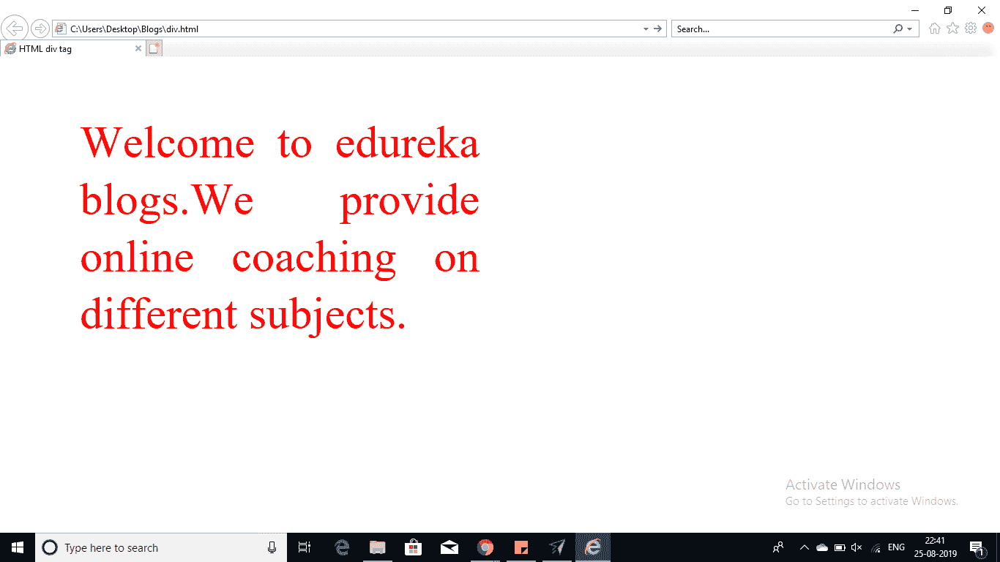
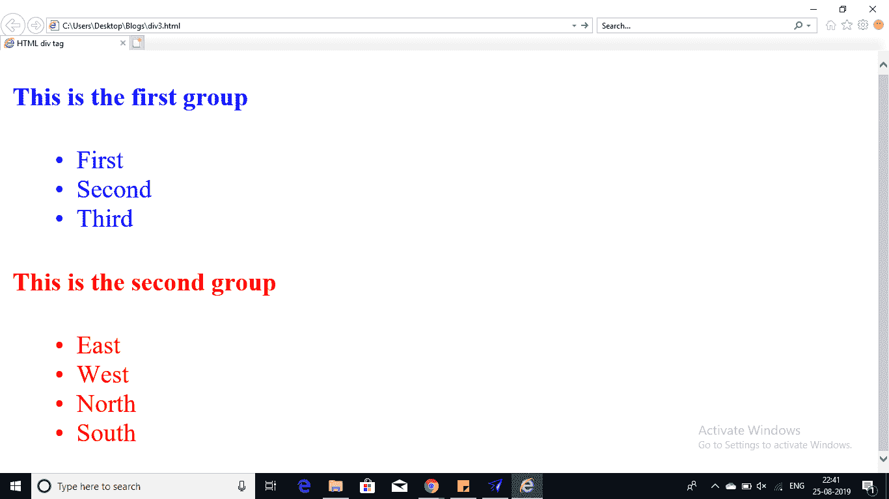

# 如何最好地利用 HTML Div 标签？

> 原文：<https://www.edureka.co/blog/html-div-tag/>

这篇文章将向你介绍一个简单而重要的新的 HTML 概念。在本文中，我们将探索 HTML Div 标签。在此过程中将涉及和讨论以下几点:

*   [HTML Div 标签](#HTMLDivTag)
*   [例 1](#Example1)
*   [例 2](#Example2)

那么让我们开始吧，

## **HTML Div 标签**

如果你想描述一个文档，可以在 HTML 中使用

标签和标签来定义你的文档的一个部分。使用这个标签，可以对大部分 HTML 元素进行分组。并且可以使用 CSS 进行格式化。标签用于对各种其他 HTML 标签进行分组。还可以创建网页布局来定义网页的不同部分。单独使用时，外观没有变化。div 标签和 span 标签的基本区别是，前者用于块级元素，后者用于行内元素。

继续这篇 HTML Div 标签文章

## **例 1**

***在下面的例子中，一个引用文件夹被保存为 div2.css。***

```
<!DOCTYPE html>
<html>
<head>
<title> HTML div tag</title>
<link rel="stylesheet" href="div2.css">
</head>
<body>

<div id="contentinfo">

Welcome to edureka blogs.We provide online coaching on different subjects.

</div>

</body>
</html>
The stylesheet of the css file is saved as div2.css
#contentinfo p
{
line-height: 20px;
margin: 20px;
padding-bottom: 20px;
text-align: justify;
width: 140px;
color: red;
}

```

**输出**

 继续这篇文章

## **例 2**

```
<!DOCTYPE html>
<html>
<head>
<title> HTML div tag</title>
<link rel="stylesheet" href="div2.css">
</head>
<body>
<!-----First group of tags---->

<div style="color:blue">

<h4>This is the first group</h4>

<ul>

<li>First</li>

<li>Second</li>

<li>Third</li>

</ul>

</div>

<!-----Second group of tags---->

<div style="color:red">

<h4>This is the second group</h4>

<ul>

<li>East</li>

<li>West</li>

<li>North</li>

<li>South</li>

</ul>

</div>

</body>
</html>

```

给定程序的结果将是:



这就把我们带到了本文的结尾。

*既然你知道了什么是 HTML，那就来看看 Edureka 的 **[Web 开发认证培训](https://www.edureka.co/complete-web-developer)** 。* *Web 开发认证培训将帮助您学习如何使用 HTML5、CSS3、Twitter Bootstrap 3、jQuery 和 Google APIs 创建令人印象深刻的网站，并将其部署到亚马逊简单存储服务(S3)。*

*有问题吗？请在这篇文章的评论部分提到它，我们会给你回复。*