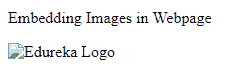
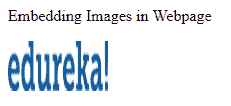

# 什么是 HTML 图片，如何修改你的网页？

> 原文：<https://www.edureka.co/blog/html-images/>

图像是网页的一个非常重要的部分，因为它改善了网页的外观，增加了客户的互动。多个网站的 USP 是他们如何在网页上组织不同的图片，并为其添加味道。在这篇 [HTML](https://www.edureka.co/blog/what-is-html/) 图片文章中，我们将了解如何按照以下顺序使用 HTML 在网页中嵌入图片:

*   [如何在 HTML 中添加图片](#how-to-add)
*   [HTML 图片标签](#tags)

## **如何在 HTML 中添加图片**

在网页中嵌入一张图片，HTML 会给你 ***< img >*** 标签。另外需要记住的重要一点是， ***< img >*** 没有关闭标签。 ***scr*** 属性用于指定图像的路径，可以是 url，也可以是来自系统/服务器的图像路径。让我们首先从使用 HTML 在网页中嵌入图像的基本语法开始。

**语法**

```
<span>img src="edureka.png"></span>
```

示例代码

```

<!DOCTYPE html>

<html>
 <head>
      <title>HTML Image</title>
   </head>
   <body>

Embedding Images in Webpage

  
   </body>
</html>

```


与其他标签类似，有各种属性与******标签相关联。让我们逐一查看它们中的每一个，了解它们的需求&如何使用它们。

## **HTML 图片标签**

*   **alt 属性**

alt 属性是图像的替换文本。引入 alt 属性的原因是，如果由于任何原因，图像无法加载，那么应该出现一个替代文本，给出关于图像的想法。图像无法加载的原因可能是互联网连接速度慢或图像不在提供的源中，等等。

如果图像位于 HTML 文件所在的同一文件夹中，您可以直接指定文件名。否则，您需要提供图像文件的绝对路径。

alt 属性的值应该描述图像。

**例子**

```

```

```

<!DOCTYPE html>
<html>

<head>
<title>HTML Image</title>
</head>

<body>

Embedding Images in Webpage


</body>

</html>

```



*   **图像的宽度和高度**

样式属性用于设置图像的高度和宽度。在样式属性中，您可以指定 CSS 样式。

```

<!DOCTYPE html>
<html>
   <head>
      <title>HTML Image</title>
   </head>
   <body>

Embedding Images in Webpage

  
   </body>
</html>

```


使用 HTML 在网页中嵌入图像的一些要点是:

*   宽度和高度属性以像素为单位定义。
*   您也可以用百分比来定义图像的宽度和高度。它会根据整个网页来考虑百分比。

```


```

*   如果你只指定其中一个，它会相应地调整另一个。

*   **使用 URL 嵌入图像**

HTML 还为您提供了灵活性，您可以通过指定 URL 从另一个服务器上选择图像。您可以使用单独的服务器来托管图像&然后使用 URL 嵌入这些图像。

```

<!DOCTYPE html>
<html>

<head>
<title>HTML Image</title>
</head>

<body>

Embedding Images in Webpage


</body>

</html>

```


*   **图片作为链接**

你也可以使用图片作为链接，用户可以点击图片并进入新的网页。为此，您只需将标签放入

```

<!DOCTYPE html>
<html>
   <head>
      <title>HTML Image</title>
   </head>
   <body>

Embedding Images in Webpage

  <a href="https://www.edureka.co/">

</a>
   </body>
</html>

```



*   **图像浮动**

您还可以使用 CSS float 属性调整图像的对齐方式。所有 CSS 属性都需要在 style 属性中指定。

```

<!DOCTYPE html>
<html>
   <head>
      <title>HTML Image</title>
   </head>
   <body>


The image will float to the right of the text.


The image will float to the left of the text.

   </body>
</html>

```


*   **影像地图**

这是 HTML 提供的重要特性之一。标签有助于定义图像映射。你一定想知道什么是图像地图。图像地图是带有可点击区域的图像

```

<!DOCTYPE html>
<html>
   <head>
     <title>HTML Image</title>
   </head>
   <body>
      

<map name="edurekamap">

<area shape="rect" coords="23,57,257,300" alt="e" href="https://www.edureka.co/devops">

<area shape="rect" coords="291,157,364,237" alt="d" href="https://www.edureka.co/big-data-and-hadoop">

<area shape="circle" coords="337,300,44" alt="u" href="https://www.edureka.co/robotic-process-automation-training">
</map>

  </body>
</html>

```

*   **背景图像**

您也可以在网页中添加背景图像。你只需要在样式标签中使用 CSS 属性，即背景图片，并将其添加到 HTML 元素中。

```

<!DOCTYPE html>
<html>
   <head>
     <title>HTML Image</title>
   </head>
   <body style="background-image:url('edureka.png');">

<h2>Background Image</h2>

BODY element

</body>
</html>

```


至此，我们结束了这个 HTML 图片博客。现在，在执行了上面的代码片段之后，你应该已经理解了如何在 HTML 中插入图片。我希望这篇博客能给你带来信息和附加值。

*查看我们的  [全栈 Web 开发人员硕士课程](https://www.edureka.co/masters-program/full-stack-developer-training) ，该课程包含讲师指导的现场培训和真实项目体验。本培训使您精通使用后端和前端 web 技术的技能。它包括关于 Web 开发、jQuery、Angular、NodeJS、ExpressJS 和 MongoDB 的培训。*

有问题要问我们吗？请在“HTML 图片”博客的评论部分提到它，我们会给你回复。