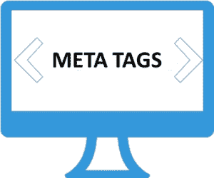

# 什么是 HTML 元标签？真的有必要吗？

> 原文：<https://www.edureka.co/blog/html-meta-tags/>

按照正式的定义，元数据是关于数据的数据。现在，如果我们在网站或网页方面谈论元数据，它被用来描述搜索引擎应该如何解释你的内容&应该如何描绘它。在这篇 [HTML](https://www.edureka.co/blog/what-is-html/) 元标签文章中，我将解释以下术语:

*   [HTML 中的 Meta 标签是什么？](#what)
*   [点记](#points)
*   [HTML 元标签属性](#attributes)
*   [元标签信息](#information)

## **HTML 中的 Meta 标签是什么？**

元数据是关于 web 文档的附加信息，例如页面描述、作者、重要关键字列表等。在这个博客中，我们将学习如何用 HTML 给你的网页添加元数据。



添加元数据，HTML 给你 **< meta >** 标签。 **< meta >** 标签类似于 HTML 中的 ***< img >*** 标签，其中没有结束标签，而是在其属性中存储信息。

## **点记**

*   您可以根据您想要公开的附加信息，在您的网页或文档中添加多个元标签。

*   Meta 标签不会改变网页的外观。所以，包含元数据不会改变网页的外观，但从搜索引擎优化的角度来看，这是非常关键的。

## **HTML 元标签属性**

***<meta>***标签应该包含在文档的头部里面，即 ***<头部>*** 和***</头部>*** 标签。与 ***<元>*** 标签相关的属性有:

*   ***名称:*** 描述了属性的名称如关键词、收录、作者、描述等。

****

*   ***内容:描述财产的价值。***

*   ***方案:*** 定义一个方案来解释属性的值

*   ***http-equiv:***http 响应消息头。用于设置 cookie 或刷新页面。

## **元标签信息**

元数据描绘了许多不同的信息。让我们来看看它们:

*   **指定元关键字**

文档包含各种重要的关键字。你可以在标签中指定重要的关键字&让搜索引擎知道它们。搜索引擎使用这些关键字来索引网页。

```

<!DOCTYPE html>
<html>
<head>
<title>Meta Tags in HTML</title>
<meta name = "keywords" content = "edureka, online training, online course, online certification, trending technologies" />
</head>
<body>

Welcome to Edureka

</body>
</html></span>

```

正如我们已经讨论过的，标签**不会改变网页**的外观。因此，我不会多次编写完整的代码。

*   **文件描述**

描述也是元数据的一个重要部分，它给出了关于网页的一个小的描述。搜索引擎使用这个元描述来索引网页。

```

<head>
<title>Meta Tags in HTML</title>
<meta name = "keywords" content = " edureka, online training, online course, online certification, trending technologies" />
<meta name = "description" content = " Edureka is an online training provider with the most effective learning system in the world. We help professionals learn trending technologies for career growth. />
</head>

```

*   **文件修订日期**

你可以利用标签来更新网页的最后修改数据。这些数据再次被搜索引擎用于优化&网络浏览器。

```

<head>
<title>Meta Tags in HTML</title>
<meta name = "keywords" content = " edureka, online training, online course, online certification, trending technologies" />
<meta name = "description" content = " Edureka is an online training provider with the most effective learning system in the world. We help professionals learn trending technologies for career growth. />
<meta name = "revised" content = "Edureka, 31/7/2019" />
</head>

```

*   **文档刷新**

您可以使用标签来设置网页的刷新率。持续时间以秒为单位，在此之后网页将自动刷新。

```

<head>
<title>Meta Tags in HTML</title>
<meta name = "keywords" content = " edureka, online training, online course, online certification, trending technologies" />
<meta name = "description" content = " Edureka is an online training provider with the most effective learning system in the world. We help professionals learn trending technologies for career growth. />
<meta name = "revised" content = "Edureka, 31/7/2019" />
<meta http-equiv = "refresh" content = "10" />
</head>

```

*   **页面重定向**

***< meta >*** 标签也可以用于重定向。您可以使用另一个网页的 url 指定导航，并以秒为单位指定您希望用户在经过多长时间后被重定向。

```

<head>
<title>Meta Tags in HTML</title>
<meta name = "keywords" content = " edureka, online training, online course, online certification, trending technologies" />
<meta name = "description" content = " Edureka is an online training provider with the most effective learning system in the world. We help professionals learn trending technologies for career growth. />
<meta name = "revised" content = "Edureka, 31/7/2019" />
<meta http-equiv = "refresh" content = "10; url = http://www.edureka.co" />
</head>

```

*   **设置 cookie**

简单来说，cookie 是由 web 服务器传递给 web 浏览器的消息。它由 web 浏览器存储在一个文本文件中。每当浏览器请求页面时，它再次被还原到服务器。它根据应用程序的需要跟踪各种信息。

标签< meta >的一个重要功能就是在客户端存储 cookies，以后可以被 web 服务器使用。

```
<head>
<title>Meta Tags in HTML</title>
<meta name = "keywords" content = " edureka, online training, online course, online certification, trending technologies" />
<meta name = "description" content = " Edureka is an online training provider with the most effective learning system in the world. We help professionals learn trending technologies for career growth. />
<meta name = "revised" content = "Edureka, 31/7/2019" />
<meta http-equiv = "cookie" content = "id = 401; expires = Saturday, 31-Jul-19 23:59:59 IST;" />
</head>

```

如果您没有指定到期日期和时间，每当浏览器关闭时，cookie 将被删除。

*   **设置作者姓名**

也可以使用标签指定作者姓名。

```

<head>
<title>Meta Tags in HTML</title>
<meta name = "keywords" content = " edureka, online training, online course, online certification, trending technologies" />
<meta name = "description" content = " Edureka is an online training provider with the most effective learning system in the world. We help professionals learn trending technologies for career growth. />
<meta name = "author" content = "Ron Wisely" />
</head>

```

*   **指定字符集**

我们还可以利用标签来指定网页中使用的字符集。默认情况下，网络浏览器和服务器使用 ISO-8859-1 编码来处理网页。

```

<head>
<title>Meta Tags in HTML</title>
<meta name = "keywords" content = " edureka, online training, online course, online certification, trending technologies" />
<meta name = "description" content = " Edureka is an online training provider with the most effective learning system in the world. We help professionals learn trending technologies for career growth. />
<meta name = "author" content = "Ron Wisely" />
<meta http-equiv = "Content-Type" content = "text/html; charset = UTF-8" />
</head>

```

至此，我们结束了这篇 HTML 元标签文章。现在，在执行了上面的代码片段后，你应该明白如何使用***<meta>***标签将元数据添加到你的网页中。我希望这篇博客能给你带来信息和附加值。

*查看我们的  [全栈 Web 开发人员硕士课程](https://www.edureka.co/masters-program/full-stack-developer-training) ，该课程包含讲师指导的现场培训和真实项目体验。本培训使您精通使用后端和前端 web 技术的技能。它包括关于 Web 开发、jQuery、Angular、NodeJS、ExpressJS 和 MongoDB 的培训。*

有问题要问我们吗？请在“HTML 元标签”博客的评论部分提到它，我们将会回复您。