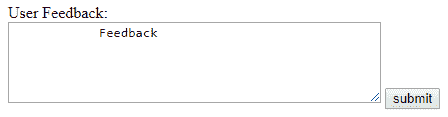
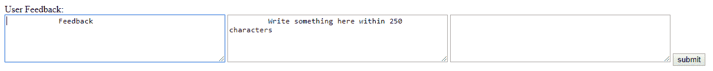

# 关于 HTML Textarea 你需要知道的一切

> 原文：<https://www.edureka.co/blog/html-textarea/>

这篇文章将带给你一个有趣而重要的话题，那就是 [HTML](https://www.edureka.co/blog/what-is-html/) Textarea，并在这个过程中帮助你详细地探索它。本文将涉及以下几点:

*   [HTML 中的文本区](#TextareaInHTML)
*   [可以添加到文本区的属性](#AttributesThatCanBeAddedToTextarea)
*   [HTML 5 Textarea 属性](#HTML5TextareaAttributes)
*   [样本代码](#SampleCode)

让我们从这篇 HTML Textarea 文章开始吧，

## **HTML 中的文本区**

无论是网页中的评论部分还是描述部分，文本区都是常用的，在这里你可以发表你的建议或写下该字段要求的任何类型的文本。如果您计划创建或使用网页，textarea 是您需要掌握的基本技能之一。

我们在表单中使用< textarea >标签来创建多行文本输入。在 textarea 元素中，用户可以在多行中插入文本。你可以创建一个无限字符的文本区域，也可以根据列数&行数指定文本区域的大小。

让我们学习如何在 HTML 中创建一个文本区域。

**例子**

```
<!DOCTYPE html>
<html>
<head>
<title>Textarea HTML Example</title>
</head>
<body>
<form action = "/submit.php" method = "get">
User Feedback:
<br />
<textarea rows = "5" cols = "50" name = "feedback">
Feedback
</textarea>
<input type = "submit" value = "submit" />
</form>
</body>
</html>

```

**输出 **

文本区域可以包含无限个字符。文本区域的大小可以由 columns 和 rows 属性指定。

继续这篇 HTML Textarea 文章，

**可以添加到文本区的属性**

有多种属性可以添加到文本区。让我们看看名单。

*   **cols** :指定可以用来定义文本区域宽度的列数
*   **禁用** :根据可见字符宽度的数量指定文本区的宽度
*   **名称** :给输入控件分配一个名称
*   **只读** :将输入控件设置为只读。用户不能更改该值。
*   **rows** :指定可以用来定义文本区高度的行数。如果有更多的文本，那么用户会在文本区看到滚动条。

随着 HTML5 的到来，增加了更多的属性。

继续这篇 HTML Textarea 文章，

## **HTML 5 Textarea 属性**

*   **自动聚焦** :指定页面加载时，文本区域自动聚焦。
*   **表单** :指定 textarea 所属的一个或多个表单。
*   **Maxlength** :指定文本区域允许的最大字符数。
*   **占位符** :指定一个简短的提示，描述 textarea 的预期值。
*   **必填项** :指定 textarea 必须填写。
*   **Wrap** :指定提交表单时文本区中的文本如何换行。

继续这篇 HTML Textarea 文章，

## **样本代码**

```
<!DOCTYPE html>
<html>
<head>
<title>Textarea HTML Example</title>
</head>
<body>
<form action = "/submit.php" method = "get">
User Feedback:
<br />
<textarea rows = "5" cols = "50" name = "feedback" autofocus='autofocus' >
Feedback
</textarea>
<textarea rows = "5" cols = "50" name = "feedback1" maxlength="250" placeholder="Write something here within 250 characters" >
Write something here within 250 characters
</textarea>
<textarea rows = "5" cols = "50" name = "feedback1" maxlength="250" required="required" >
</textarea>
<input type = "submit" value = "submit" />
</form>
</body>
</html>

```

**输出 **

现在，在执行了上面的代码片段之后，你应该已经理解了如何使用各种属性在 HTML 中创建 textarea。我希望这篇博客能给你带来信息和附加值。

这就把我们带到了这篇关于 HTML Textarea 的文章的结尾。现在你知道什么是 HTML 了，看看 Edureka 的 **[Web 开发认证培训](https://www.edureka.co/complete-web-developer)** 。Web 开发认证培训将帮助您学习如何使用 HTML5、CSS3、Twitter Bootstrap 3、jQuery 和 Google APIs 创建令人印象深刻的网站，并将其部署到亚马逊简单存储服务(S3)。

*有问题吗？请在“什么是 HTML？”的评论部分提及。我们会回复你的。*