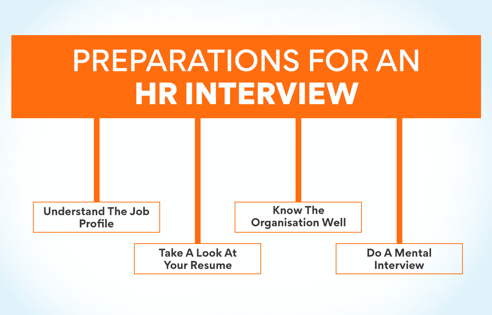
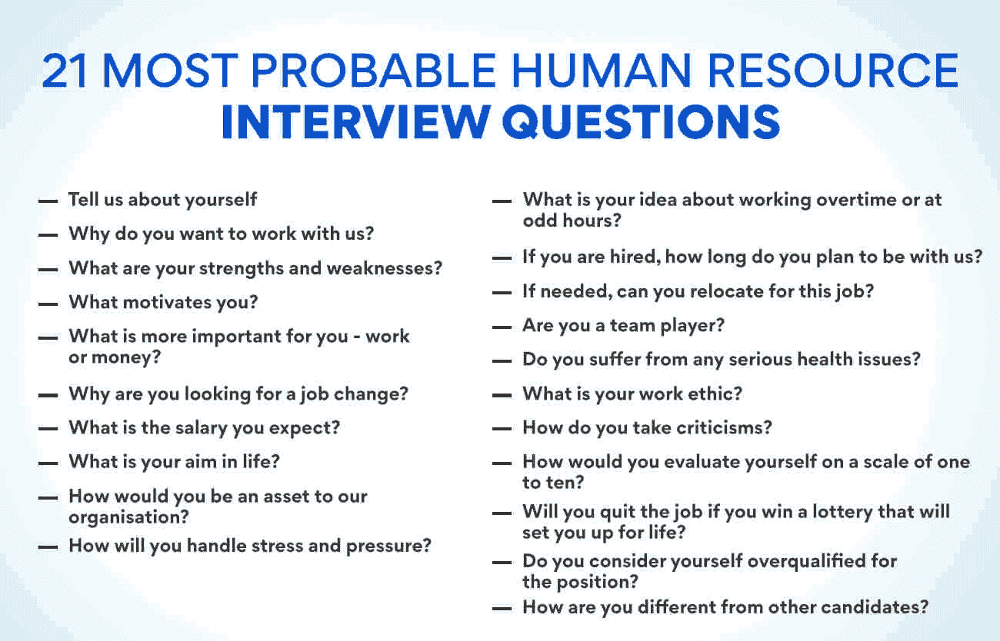

# 21 大人力资源面试问题&如何回答

> 原文：<https://www.edureka.co/blog/human-resource-interview-questions/>

从事自己最喜欢的职业是每个人的愿望。一个人必须获得他渴望的工作所必需的技能和资格。但是这两个人并不总是承诺给你一份工作。要进入任何工作岗位，恰当地回答人力资源面试问题是非常重要的。

你可以在知名机构提供的[人力资源管理](https://www.edureka.co/blog/role-of-human-resource-management-in-an-organization/)研究生证书课程中学习如何回答面试问题。访问我们的网站会告诉你更多关于这门课程的信息。但是拿到证书只是工作的一半。如果你想加入一家知名公司，在面试中表现出色是很有必要的。本文将展示最重要的问题以及你必须如何回答它们。但在此之前，让我们看看你如何准备面试。

**准备人力资源面试**

**了解工作简介**

在参加面试之前，彻底了解工作简介是非常重要的。你必须很好地阅读要求，以了解公司对你的期望。这将有助于了解他们需要什么样的技能和能力。如果你学好了这一点，回答 **人力资源面试问题** 就会很容易。

**看看你的简历**

检查你的简历，并与职位描述进行比较。看看你的技能和资格是否符合工作要求。如果需要的话，你必须重新调整你的简历，以确保公司需要的最重要的技能在简历中突出出来。也可以更看重符合职位描述要求的经历。

**充分了解组织**

尽可能了解公司的一切。你必须了解他们的产品、客户群以及他们所处的市场。您还可以查看他们的社交媒体页面，了解组织中发生的最新事件。了解公司的高层，以及他们最近是否参加过任何公共活动，会对你有很大帮助。这些信息将有助于你回答人力资源面试中关于公司的问题。

**做一次心理面试**

这很重要，因为它会帮助你做好面对人事官员的准备。你可以想象自己坐在面试小组前，在心里回答最有可能的问题。最好永远做你自己，不要在你的兴趣和能力上撒谎。没有一家公司喜欢一个为了进入公司而撒谎的人。在这篇文章中，我们为您准备了一些最有可能的问题，以及您必须如何回答这些问题。

在人力资源管理研究生证书课程中，你可以学到关于参加面试的一切。你可以从我们的网站上了解更多关于这门课程的信息。

**21 个最有可能的人力资源面试问题**

1.  **告诉我们你自己的情况**

这很可能是他们问的第一个问题。这看起来是一个简单的问题，但是在回答问题之前，你必须明白他们想从你这里听到什么。

除了告诉人力资源人员他们在同行中的地位，新的候选人还可以谈论他们的学位和证书。他们也可以谈论他们的个人品质和兴趣。

一个有经验的人可以告诉人力资源人员他们目前的工作岗位。那些已经工作的人也可以告知他们做过的任何特殊项目和他们的荣誉。用最适合他们申请的工作的技能来回答这些人力资源面试问题也是很好的。

2.  你为什么想和我们一起工作？

这个问题的答案有助于面试官了解你是否了解工作要求，以及你如何满足这些要求。这也有助于他们知道你是否适合这份工作。你必须回答这个问题，提到对这份工作最有用的技能。告诉他们你在以前的公司做过的项目也是很好的，这些项目与你想要的职位的要求相似。

3.  你的优势和劣势是什么？

这是人力资源面试问题中的一个，它将帮助他们了解你是否具备这份工作所需的素质。理想的答案是列出公司提供的职位最有用的优点。最好不要超过两个缺点，还有那些与工作没有直接联系的。你也可以补充说你正在努力改正它们。

4.  你的动力是什么？

这是一个简单的问题，你可以通过列出最能激励你的事情来回答。你可以提到工作满意度、职业目标、成为团队的一员、提高专业技能等。，作为激励你的主要方面。提到钱没有坏处，但那应该是最后一项。

5.  对你来说，工作和金钱哪个更重要？

你必须总是说工作第一。每个公司都想雇佣那些对工作充满热情的人。你可以说，如果有工作满足感，你就会在这方面出类拔萃。当你擅长你的工作时，金钱会自动随之而来。这是人力资源面试问题中的一个，你可以通过告知自己不断学习和提高技能的愿望来回答。

6.  你为什么想换工作？

这是人力资源面试问题中的一个，问的是已经工作的人。你绝不能提及你现任雇主的任何坏话。最好是正面回答问题。你可以说你想拓展视野，在寻找新的挑战。

7.  你期望的薪水是多少？

你绝不能提及具体的数字。最好是说你对这份工作提供的东西更感兴趣，并且你确信公司会为你的工作给予补偿。应届生可以说他们对学习工作更感兴趣，而且他们确信会按照行业标准获得报酬。

8.  你的人生目标是什么？

这是一个常见的人力资源面试问题，他们希望知道你是否是一个目标导向型的人。你可以告诉他们，你的目标是成为一家知名机构的一员，并有机会为公司的利益发挥你的技能。告诉他们你希望在工作中快乐，为你和你的家人创造舒适的生活也是很好的。

**也读:[什么是战略人力资源管理？](https://www.edureka.co/blog/strategic-human-resource-management)定义和例子**

9.  你如何成为我们组织的资产？

这是每次面试中最常被问到的人力资源面试问题 **s** 。最好的方法是告诉他们对工作最有用的技能，以及你将如何利用这些技能来帮助公司实现目标。如果你是一名新生，你可以说，如果给你提供平台和指导，你有信心为公司带来切实的成果。

10.  你将如何应对压力和紧张？

大多数公司工作都有很大的压力。你可以这样回答这个问题:你会通过组织和优先化你的任务来处理压力。值得一提的是，你会努力在截止日期前完成任务，以确保工作按时完成。我不会因为压力而气馁，因为它帮助我推动自己取得更好的成绩。

11.  你对加班或在非正常时间工作有什么看法？

这是另一个棘手的人力资源面试问题，你必须诚实回答。不要表现出太渴望投入更多的时间来获得这份工作。这可能会让你以后陷入困境。承诺在有需要的时候加班或在非正常时间工作。但是一定要提到你希望这样的工作能得到足够的报酬。

12.  如果你被录用，你打算在我们公司工作多久？

人力资源人员问这个问题是为了了解一名招聘人员的长期计划。公司希望知道投入精力和金钱来培训一个人是否值得。最好的回答是告诉他们，只要他们觉得你为公司的发展做出了贡献，并且对工作感到满意，你就会留在公司。

13.  如果需要，你能适应这份工作吗？

这是人力资源面试问题中的一个 **s** 被问及是否能广泛出差。你可以这样回答这个问题:如果工作需要，如果这会促进你的职业发展，你愿意出差。然而，如果你因为个人原因不能旅行，坦白地说出来。

14.  你是团队成员吗？

通过这个问题，面试官想知道你与公司其他人合作的意愿。正面回答这个问题，提及你在目前工作中与其他团队成员一起完成的项目。新生可以谈论他们和其他学生一起完成的作业。

15.  你有任何严重的健康问题吗？

这个人力资源面试问题是问你是否有任何可能降低你工作效率的疾病。除非你患有任何严重的疾病，否则最好说你的健康状况良好。孕妇必须在面试时提及自己的状况。

16.  你的职业道德是什么？

人事官员问这个问题是想知道你是否有纪律性、组织性和对工作的承诺。专注于你的核心优势，比如有条理和按时完成任务。新生可以谈论他们如何按时完成所有的作业，并且总是准时上课。

17.  你如何接受批评？

这是一个人力资源面试问题，帮助人力资源人员了解他们是否愿意接受反馈和批评。你可以回答说，你愿意接受任何有助于改进工作的批评。接受你也必然会犯错误并乐于被纠正也是很好的。

**也读作:[分解人力资源管理的范围](https://www.edureka.co/blog/scope-of-human-resource-management/)**

18.  从一到十，你会如何评价自己？

永远不要表现出自己是完美的。但是你也不能表现出你不好。告诉他们，你认为自己是 8 分，因为你拥有这份工作所需的技能，但总有改进的空间。

19.  如果你中了一张能让你生活富足的彩票，你会辞职吗？

永远不要用“是”来回答这个问题，因为这会显示出你是一个只对钱感兴趣的人。告诉他们，虽然你会很高兴有未来的资金，但你认为这份工作足够重要和有趣，可以继续工作。

20.  对于这个职位，你认为自己资历过高吗？

这是人力资源面试问题中的一个技巧来检验你是自吹自擂还是谦虚。表现出自信，但不要过度自信。告诉他们，虽然你认为自己是合格的，但你并没有大材小用，因为每份工作都有值得学习的地方。

21.  你和其他候选人有什么不同？

最好坦率地回答，告诉面试官你没有资格和别人比较，因为你不知道他们的资格和能力。你可以说你完全胜任这份工作，并且有信心成为这份工作的有力竞争者。

在知名机构举办的[人力资源管理研究生证书课程](https://www.edureka.co/highered/human-resourse-management-course-iim-shillong)中，你可以学到很多关于这类问题的知识。你可以从我们的网站上了解更多关于这门课程的信息。

**总结**

我们还没有给出一份完整的人力资源面试问题清单。但是了解它们有助于你为事件做好准备，并准备好你的答案。无论人事官员问什么问题，最好遵循的一条规则是，诚实回答。宁可失去一次机会，也不要以后被人发现说谎。

## **更多信息:**

[人力资源管理的关键目标](https://www.edureka.co/blog/objectives-of-human-resource-management/)

[目标&人力资源管理的本质](https://www.edureka.co/blog/nature-of-human-resource-management/)

[人力资源管理的演变:过去和未来](https://www.edureka.co/blog/evolution-of-human-resource-management)

[人力资源管理的关键基础](https://www.edureka.co/blog/fundamentals-of-human-resource-management/)