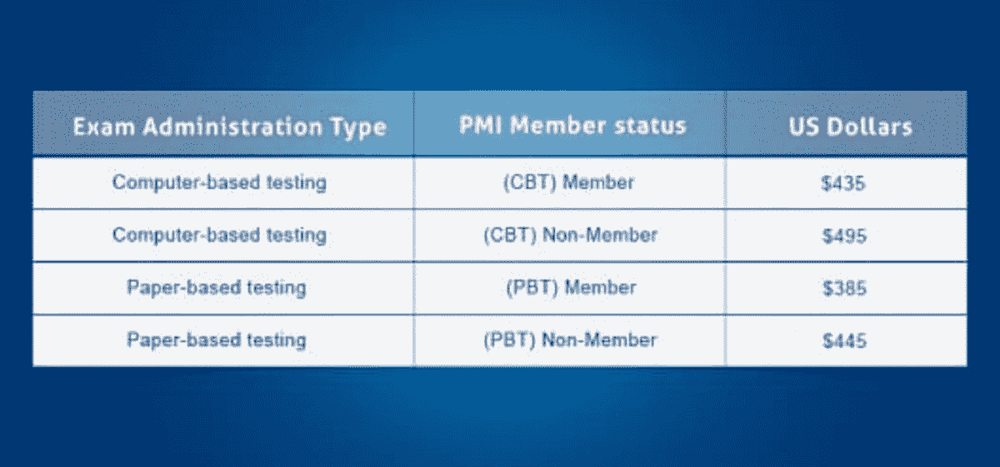

# 敏捷方法和 PMI-ACP 的重要性

> 原文：<https://www.edureka.co/blog/importance-of-agile-pmi-acp/>

## **什么是敏捷方法论？**

敏捷开发过程在 20 世纪 90 年代中期出现，作为传统的项目管理方法的计划驱动的瀑布模型的替代

*   计划驱动的方法适用于工作范围有限且变量很少的小型项目。
*   随着 IT 行业的发展，项目变得越来越复杂，很难在一开始就从业务中获得完整的需求。这就是敏捷方法的用武之地。

*敏捷方法基于:*

*   迭代和增量开发，其中需求和解决方案通过自组织、跨职能团队之间的协作而发展。
*   它促进适应性规划、进化开发和交付，以及时间限制的迭代方法
*   鼓励快速灵活地应对变化。

敏捷现在越来越多地被项目经理作为开发过程的选择。Gartner 估计，到 2014 年底，80%的软件开发项目将使用敏捷方法。

## **敏捷认证来自**PMI**:**

PMI 现在提供一种新的敏捷认证——敏捷认证从业者(ACP)。

*   如果你是一个有敏捷经验的项目经理，ACP 将允许你展示你如何应用和实践敏捷的知识。
*   该认证旨在验证项目经理对敏捷原则和流程的掌握，向寻求采用敏捷方法的公司验证他们现有的专业知识。

## **PMI-ACP 资格要求:**

## **PMI-ACP 认证适合你吗？**

各行各业正迅速采用敏捷来变得更加有效。以下是您应该选择该认证的几个原因:

*   您已经在项目中使用了敏捷实践
*   您的组织正计划采用敏捷方法
*   你希望成为一名更全面的项目经理
*   您需要更快地适应基本的业务需求
*   你想对项目采取更有价值和以人为本的方法
*   你想提升你作为项目经理的职业生涯

## **PMI-ACP** **考试结构:**

**问题:**

PMI-ACP 考试由 120 道选择题组成，其中 20 道是不影响分数的考前题。考试问题平均分配——50%是敏捷工具和技术，50%是知识和技能。涵盖的敏捷工具和技术包括:

*   通信
*   规划、监测和适应
*   敏捷评估
*   敏捷分析和设计
*   产品质量
*   软技能谈判
*   基于价值的优先排序
*   风险管理
*   韵律学
*   价值流分析

**测试格式:**

基于计算机的测试是 PMI 认证考试的标准方法，尽管在某些情况下也可以使用纸质测试。

考试时间:三个小时。

## **PMI-ACP** **考试费用结构:**

## 

正如你所看到的，PMI-ACP 是项目经理在不断发展的项目管理领域的下一步。敬请关注即将发布的关于 PMI-ACP 认证在行业中的重要性的帖子。

有问题要问我们吗？在评论区提到它，我们会回复你。

**相关帖子:**

[PMI-ACP 对你的职业生涯有多大价值？](https://www.edureka.co/blog/how-valuable-is-pmi-acp-to-your-career/)

*PMI-ACP 是项目管理协会的注册商标。Edureka 是全球 PMI 代表:ID 4021*