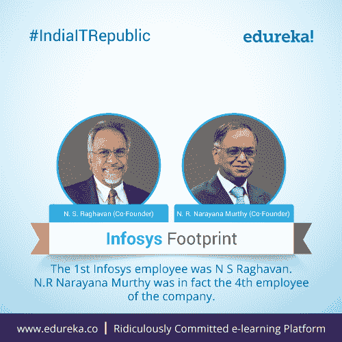
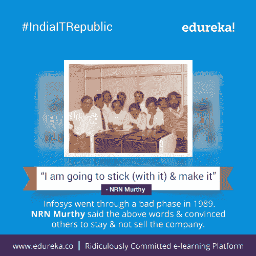
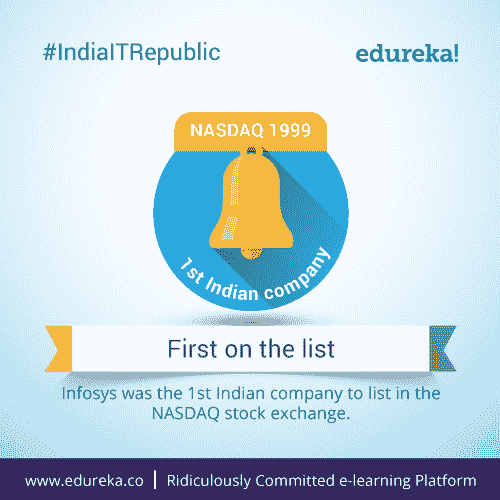
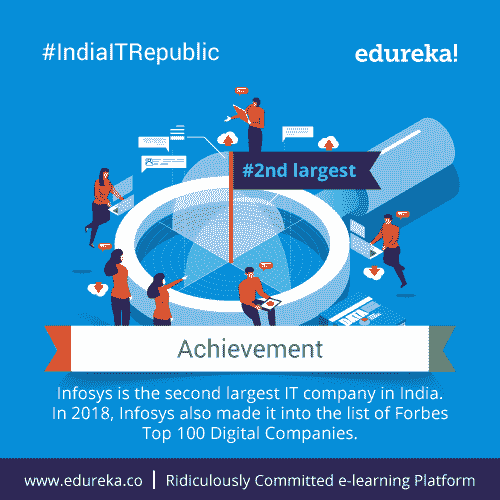
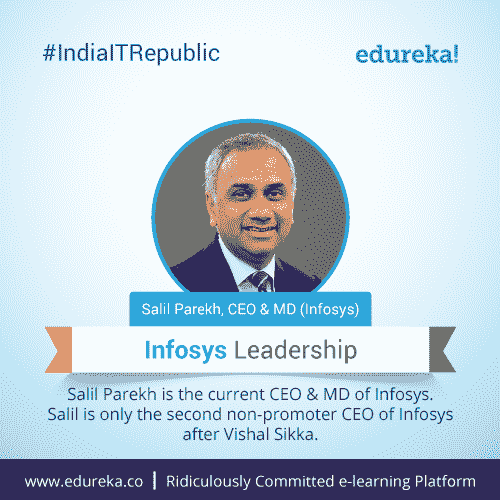
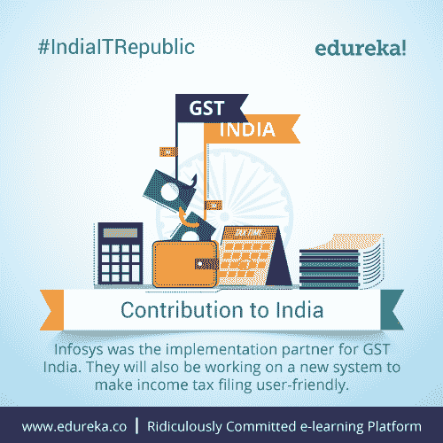
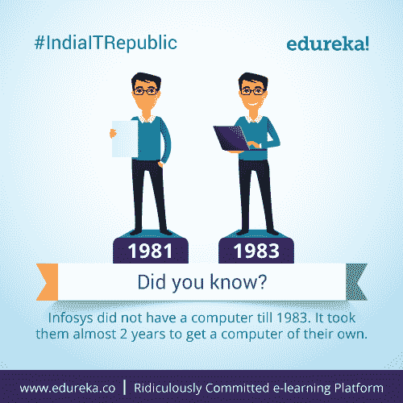
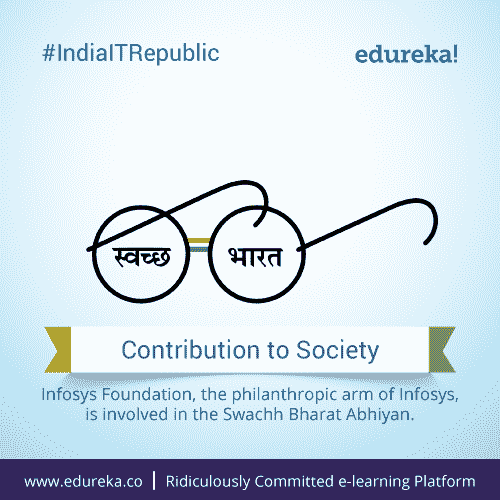

# # IndiaITRepublic–关于 Infosys 的十大事实

> 原文：<https://www.edureka.co/blog/indiaitrepublic-top-10-facts-infosys/>

## **# IndiaITRepublic–关于印孚瑟斯**的十大事实 

印度的 IT 领域是数百家(如果不是数千家的话)知名科技公司的所在地。自从这个国家作为一个独立的共和国开始它的旅程以来，技术和信息科学一直是这个次大陆拥有的一些最大的优势。在这成千上万的名字中，有一小部分是五岁到九十五岁的人都知道的。

Edureka 榜单上的第五大科技巨头是一家重新定义了多种技术方法并使其成为创新同义词的公司——Infosys。Infosys 是一家科技巨头，是全球最酷的工作场所之一，也是一家致力于进步的 IT 巨头。因此，让我们深入研究一下我们为您策划的关于 Infosys 的 10 大事实。

## **1。印孚瑟斯足迹:**

**

几十年来，Narayan Murthy 一直是印孚瑟斯的代言人。但是，你知道他不是第一个印孚瑟斯员工吗？

## **2。&我要坚持到底**

**

嗯，纳拉扬·穆尔蒂说这话时并不是在开玩笑。他绝对成功了！

## **3。印孚瑟斯收入:**

**

*你知道十亿有多少个零吗？嗯，印孚瑟斯有 84 亿！*

## **4。第一次上榜:**

**

从面临破产到成为纳斯达克证券交易所的第一家印度 IT 公司，Infosys 已经走过了漫长的道路！

## **5。成就:**

**

从收入到员工人数，再到跻身世界知名排行榜，印孚瑟斯已经习惯于打破记录。

## **6。印孚瑟斯领导层:**

**

*Salil Parekh 是印孚瑟斯现任首席执行官& MD。Salil 只是继 Vishal Sikka 之后，Infosys 的第二位非发起人 CEO。*

## **7。对印度的贡献:**

**

*利用自己的技术专长帮助创造一个更好的印度。*

## **8。你知道:**T3 吗

**

*你能在没有手机的情况下呆 2 小时吗？印度第二大 IT 公司 Infosys 已经两年没有电脑了！你的借口是什么？*

## **9。印孚瑟斯&斯奇林:**

**

*印孚瑟斯的专业人士正在学习哪些技术，以便在行业中保持最新？*

## **10。**对社会的贡献:

**

*您知道印孚瑟斯基金会为 Swachh Bharat Abhiyan 捐了一大笔钱吗？*

这些是你可能不知道的关于 Infosys 的十大事实。知道我们可能忽略的事实吗？请在下面的评论区联系我们，让我们知道。

充分利用 *Edureka 在教育和职业咨询领域的*专业知识。请立即与我们的课程顾问联系，以更清晰地了解您的职业道路及更多信息。**拨打:*IND:[+91-960-605-8406](tel:9606058406)*/*US:[1-833-855-5775](tel:18338555775)(免费电话)*。**

<article class="maincontentblog">

这些是你可能知道也可能不知道的关于 Infosys 的十大事实。如果你有任何问题，建议或者你想让我们报道的任何特定话题，请在下面的评论区联系我们。我们明天将带着另一个科技巨头塔塔咨询服务公司的 10 个事实回来。所以，请确保您通过下面的订阅框订阅了我们的博客，千万不要错过这些重要的更新。

</article>

<article class="maincontentblog"></article>