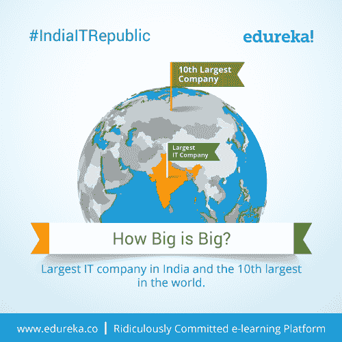
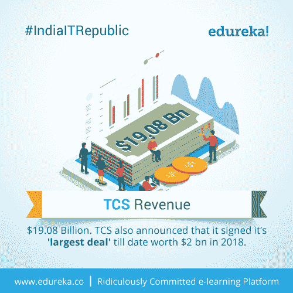
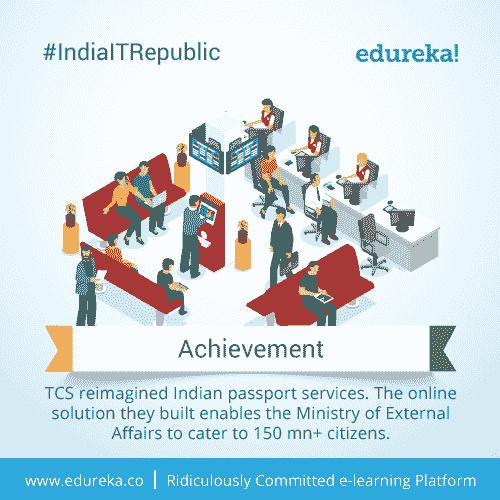
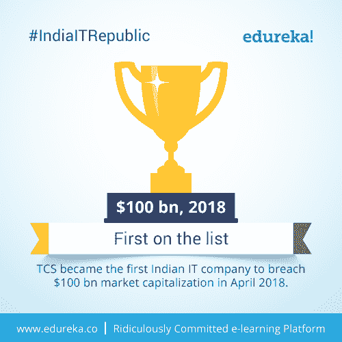
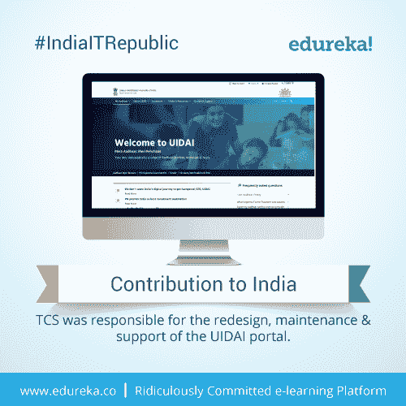
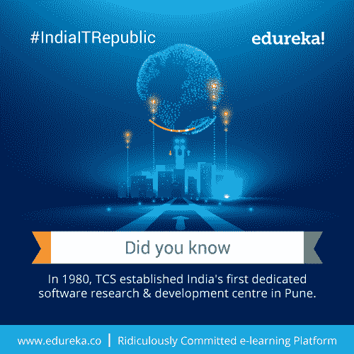
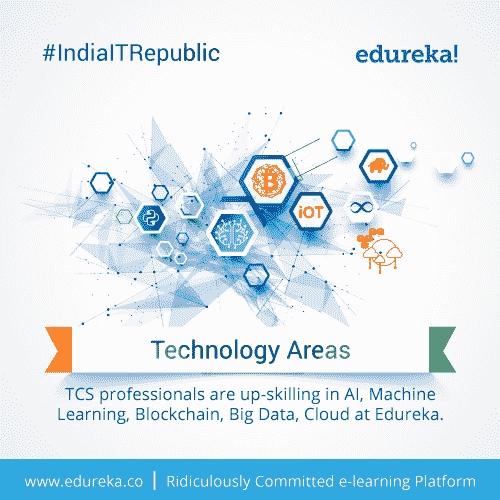
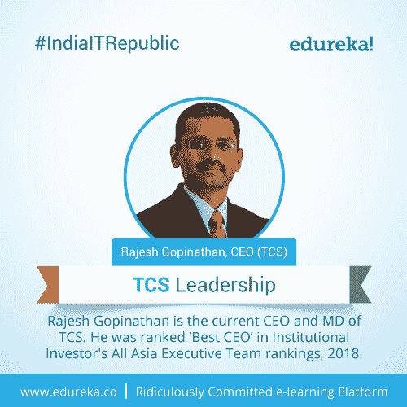
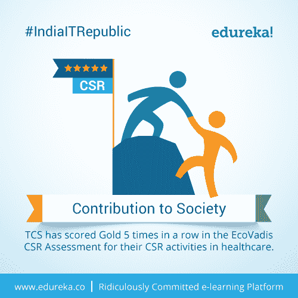

# # IndiaITRepublic–关于 TCS 的十大事实

> 原文：<https://www.edureka.co/blog/indiaitrepublic-top-10-facts-tcs/>

## **# IndiaITRepublic–关于 TCS 的十大事实**

印度的 IT 空间就像海洋一样——不断变化。一些鲨鱼毫不费力地统治着这片水域，而其他较小的鱼则在阴影中茁壮成长。这些鲨鱼虽然凶残而强大，但却是小型鱼类的补充，而且在许多情况下，被认为是它们的支持者。我们最后的印度科技巨兽就是这样一个温和的巨人。

edu reka 榜单上的第六位也是最后一位科技巨头代表了印度 IT 行业的方方面面——塔塔咨询服务公司(TCS)。作为一个在印度几乎每个主要城市都有基地的科技巨头，TCS 已经成为印度 IT 的代名词。因此，让我们深入探讨一下我们为您策划的关于 TCS 的 10 大事实。

## **1。TCS 的足迹:**

**

*TCS 打破的不仅仅是印度的记录，而是全世界的记录。*

## **2。多大才算大？:**

**

*TCS 是全球第十大 IT 公司！*

## **3。TCS 收入:**

**

*最大的不仅仅是在人数或客户方面而是在收入方面！*

## **4。成就:**

**

*从一个笨重的、文书工作密集的过程到一个数字化的、顺畅的过程，要感谢 TCS 重新发明了印度护照服务系统。*

## **5。榜单第一:**

**

*去年，TCS 成为首家突破 1000 亿美元资本化大关的公司。*

## **6。对印度的贡献:**

**

*你知道 TCS 在 UIDAI 门户的重新设计中发挥了巨大的作用吗？*

## **7。你知道吗:**

**

*正是 TCS 开启了印度的 R & D 热潮！第一个这样的中心在浦那。*

## **8。技术领域:**

**

*TCS 专业人员正在提升这些技术。是时候观察和学习了。*

## **9。TCS 领导力:**

**

*最好的 IT 公司得到了最好的 CEO！在机构投资者 2018 年全亚洲高管团队排名中，拉杰什被评为“最佳首席执行官”。*

## **10。对社会的贡献:**

**

*一个领导者不仅在 IT 而且在人性！TCS 连续第五年在最严格的 CSR 排名(EcoVadis CSR 评估)中获得金牌。*

这些是你可能不知道的关于 TCS 的十大事实。知道我们可能忽略的事实吗？请在下面的评论区联系我们，让我们知道。

充分利用 *Edureka 的*专长在教育和职业咨询空间。请立即与我们的课程顾问联系，以更清晰地了解您的职业道路及更多信息。**致电我们:*IND:[+91-960-605-8406](tel:9606058406)/*US:[1-833-855-5775](tel:18338555775)(免费)*。***

<article class="maincontentblog">

*这些是你可能知道或可能不知道的关于 TCS 的十大事实。如果你有任何问题，建议或者你想让我们报道的任何特定话题，请在下面的评论区联系我们。明天我们将带来更多科技公司的 10 个事实，特别是创业公司。所以，请确保您通过下面的订阅框订阅了我们的博客，千万不要错过这些重要的更新。*

</article>

<article class="maincontentblog"></article>