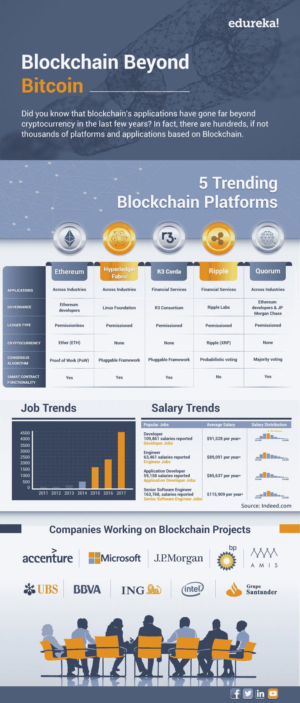

# 超越比特币的区块链——区块链平台和趋势

> 原文：<https://www.edureka.co/blog/infographic-blockchain-beyond-bitcoin-platforms/>

*“Imagine a technology that could preserve our freedom to choose for ourselves and our families, to express these choices in the world, and to control our own destiny, no matter where we lived or were born…” – Don Tapscott and Alex Tapscott, Blockchain Revolution about different blockchain platforms.***Blockchain is the talk of the town among IT professionals today. Even though it has been a decade since its first mainstream appearance, there are several professionals who still believe blockchain is limited to Bitcoin and cryptocurrency.

比特币于 2009 年发布，成为有史以来最伟大的创新之一——区块链的先驱。这是任何人都无法理解的。2012 年，当 Vitalik Buterin 设计并部署了以太坊(有史以来第一个开放的区块链平台)时，区块链摆脱了加密货币的外衣。自那以后，数百个区块链平台被引入，它们现在正在改变大多数技术的工作方式。

以太坊处理加密货币之外的应用的能力为它赢得了几个技术爱好者和远见者的昵称区块链 2.0。如果你希望更多地了解区块链，并在区块链技术公司建立职业生涯，那么就来看看我们的 [区块链培训](https://www.edureka.co/blockchain-training) ，它带有讲师指导的现场培训和真实的项目经验。本培训将帮助您深入了解 Hyperledger Fabric，并帮助您掌握该主题。

现在，让我们花几分钟时间来看看一些领先的区块链平台。我们还将介绍就业趋势，并看看几家从事这项技术的公司。

## 每天都在开发新的区块链平台

正如您可能从信息图中推断的那样，有几个区块链平台正在使用中。其中一些可以应用于不同行业的不同类型的项目，而其他的则是为特定的应用而构建的。有数百个平台基于这种加密的多链技术，尽管我们的信息图只涵盖了行业内排名前五的区块链平台。此外，几乎每天都有几家公司在开发新的和改进的平台。

据一些技术专家称，区块链是自 90 年代互联网革命以来 IT 行业最大的革命。此外，几乎所有领域的技术爱好者都试图利用区块链促成他们当前角色的演变。这证明了一个事实，即区块链在任何行业、任何时期都是“下一个大事件”。

希望你喜欢这个短片。如何让自己成为区块链专家？为什么不向 Edureka 的[专家学习呢？如果你仍然不相信区块链适合你，](https://www.edureka.co/blockchain-training)[在这里多看几篇博客](https://www.edureka.co/blog/category/blockchain)。如果您有任何其他问题、疑问或建议，请在下面留言。我们很乐意与您互动。**