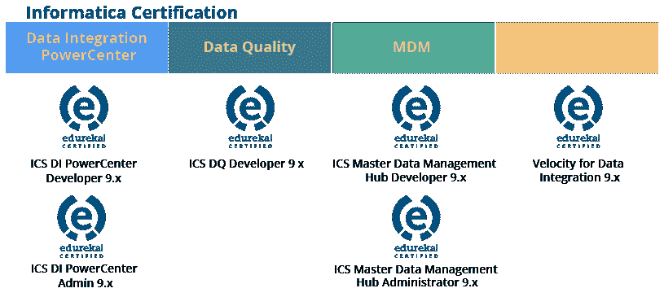
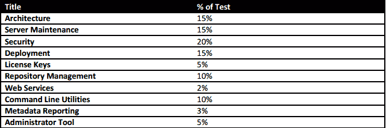
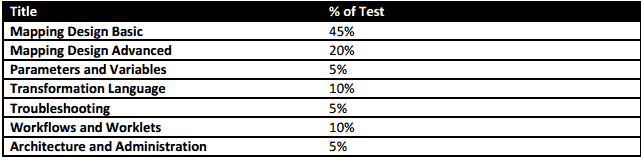
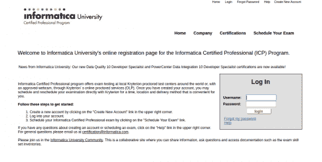
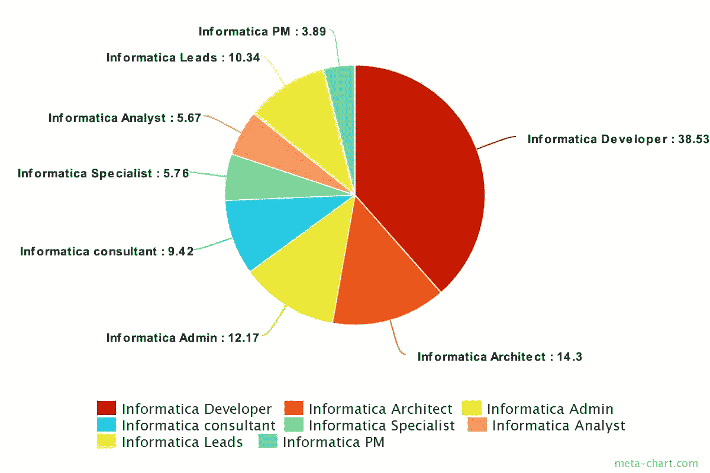

# 信息认证:所有需要知道的

> 原文：<https://www.edureka.co/blog/informatica-certification-all-there-is-to-know/>

你是否在考虑从事商业智能领域的工作？不确定走哪条职业发展道路？那么是时候考虑 Informatica PowerCenter 了，它是市场领先的数据集成平台。Informatica 认证可以让你在数据集成领域获得一份顶级工作。在这个博客中，我们将首先简要了解 Informatica 的重要性，然后了解 Informatica 认证的各个方面:考试结构，先决条件，如何注册等。

## **为什么是 Informatica？**

Informatica 提供市场领先的数据集成平台。经过近 500，000 种平台和应用程序组合的测试，数据集成平台 inter 可以与尽可能多的不同标准、系统和应用程序一起运行。这种不偏不倚的普遍观点使 Informatica 在当今市场上独树一帜，成为数据集成平台的领导者。它还使 Informatica 成为寻求解决任何规模的数据集成问题的公司的理想战略平台。

为了更好地了解什么是 Informatica PowerCenter 及其实际应用，我建议您查看我们的博客[什么是 Informatica](https://www.edureka.co/blog/what-is-informatica/) 和 [Informatica 教程](https://www.edureka.co/blog/informatica-tutorial)。

## **我要考哪个 Informatica 认证？**

信息认证是一个两级结构:

*   专家–要获得专家认证，候选人必须通过笔试，由专人或通过网络摄像头监督。专家考试验证了个人对产品的理解，并能运用作为正式团队成员对项目做出贡献所需的技能和能力。
*   专家–要达到专家级别，Informatica 认证专家必须通过 Informatica Velocity 最佳实践和实施方法认证。该认证证明您能够按照我们的最佳实践领导项目实施团队。

下面可以看到 Informatica 的一些主要认证考试:

Informatica 提供了各种证书，其中最受欢迎的是数据集成领域的两个主要方向:管理员和开发人员。

*   **数据整合:Informatica PowerCenter 管理员**

Informatica 认证管理员是监控环境、监控和调度负载(工作流)、在出现任何故障时恢复或重启负载以及监控服务器的专业人员。他们还负责管理开发、质量保证和生产环境。

**先决条件:**SQL 和基本 Unix 基础知识以及 [Informatica PowerCenter 培训](https://www.edureka.co/informatica)。

谁应该申请这个认证？

尽管任何对数据集成特别是 ETL 有热情的人都可以申请这个认证。以下专业人士通常会申请该认证:

*   分析专家。
*   BI/ETL/DW 专业人员。
*   大型机架构师。
*   企业商业智能领域的个人贡献者。

*   ## **Developer of data integration PowerCenter**

Informatica 认证开发人员是记录所有 ETL 流程的所有技术和系统规范文档、开发所有数据仓库模型、设计和安排工作流程、测试 ETL 代码的专业人员。

**先决条件:**SQL 和基本 Unix 基础知识以及 [Informatica PowerCenter 培训](https://www.edureka.co/informatica)。

谁应该申请这个认证？

以下专业人员可以申请该认证:

*   软件开发人员。
*   BI/ETL/DW 专业人员。
*   大型机开发人员。
*   企业商业智能领域的个人贡献者。

**考试结构**

作为项目实施团队的正式成员，该考试测试您在安装和配置、体系结构、服务器维护、安全性、部署、PowerCenter 存储库管理、web 服务、命令行实用程序以及 Informatica Velocity 最佳实践和实施方法方面的能力。

这里有几个考试的提示:

*   70 道选择题
*   本次考试采用的考试形式有:

1.  多项选择:选择一个最能回答问题或完成陈述的选项
2.  多项回答:选择最适合回答问题的所有答案，或者完成陈述
3.  对/错:阅读陈述或问题后，选择最佳答案

*   完成考试需要 90 分钟
*   70%为及格分数
*   报名费为 240 美元
*   如果您第一次考试没有通过，您必须在考试后 2 周内再次参加考试
*   从你第一次参加考试之日起，一年内你最多可以参加三次考试
*   每次参加考试时，你必须支付全部考试费。

**考试考试领域**

考试领域及其在考试中所占的估计百分比如下:

**数据整合动力中心管理员**

**数据集成 PowerCenter 开发者**

从表面上看，考试可能看起来很容易，因为你只需要答对 70 道题中的 49 道，而且没有负分。但是当有多项选择的问题时，就变得很棘手了。例如，您可能会遇到这样的问题，要求您为一个问题选择三个正确答案。在这种情况下，没有部分标记，因此一个错误的答案选项会破坏其他两个可能正确的选项。

## **如何报名考试？**

第一步是在[网上评估员](https://www.webassessor.com/informatica.)创建一个考生账户，确保你用你的官方电子邮件地址注册。

创建帐户后，您可以登录并注册参加考试。建议您提前 3 个月注册，以便获得您喜欢的时间和足够的时间来准备。

**                                Fig:  How to Register**

## **我如何得到我的结果？**

你一考完试就会知道结果。你会立刻知道你是通过了还是失败了。你还会得到一份部门绩效报告。您注册的电子邮件 id 的可打印证书。

## **工作前景如何？**

作为数据集成领域的市场领导者，Informatica PowerCenter 是企业进入商业智能领域的首选。Informatica 在 2015 年创造了超过 10 亿美元的年收入，并帮助组织节省了超过 56 亿美元。以下是 Informatica 认证专家的当前工作趋势:

我想这个博客可能会帮助你获得关于 Informatica 认证的所有重要信息。正如我们上面讨论的，信息技术有令人兴奋的职业机会。所以你可以通过获得 Informatica 认证迈出第一步。

如果你已经决定以 Informatica 认证和 Informatica 为职业，我建议你为什么不看看我们的 [Informatica 培训](https://www.edureka.co/informatica)课程页面。Edureka 的 Informatica 认证培训将通过现场讲师指导课程和使用真实案例的实践培训，使您成为 Informatica 专家。

*有问题吗？请在评论区提到它，我们会给你回复。*