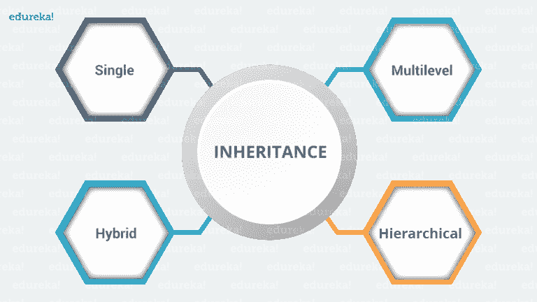
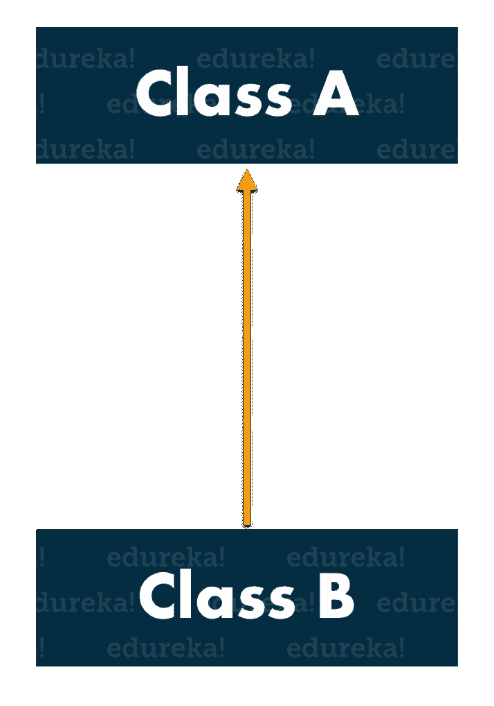
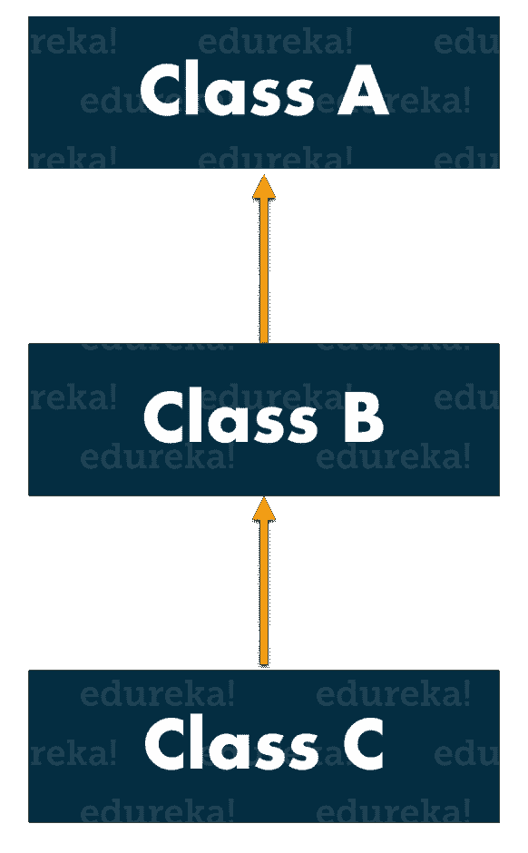
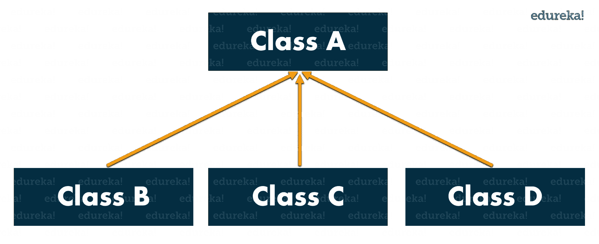
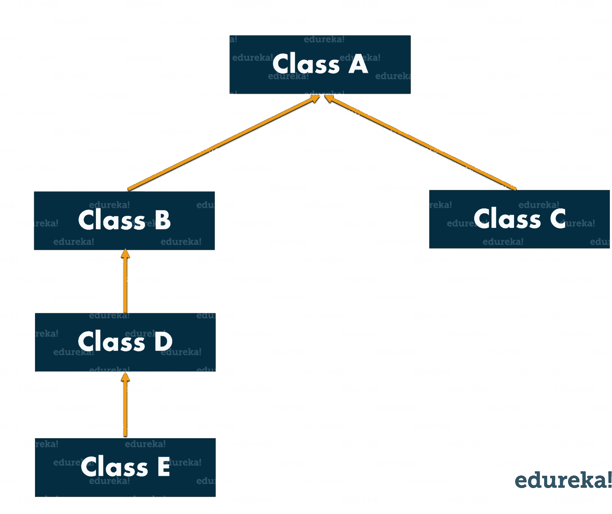
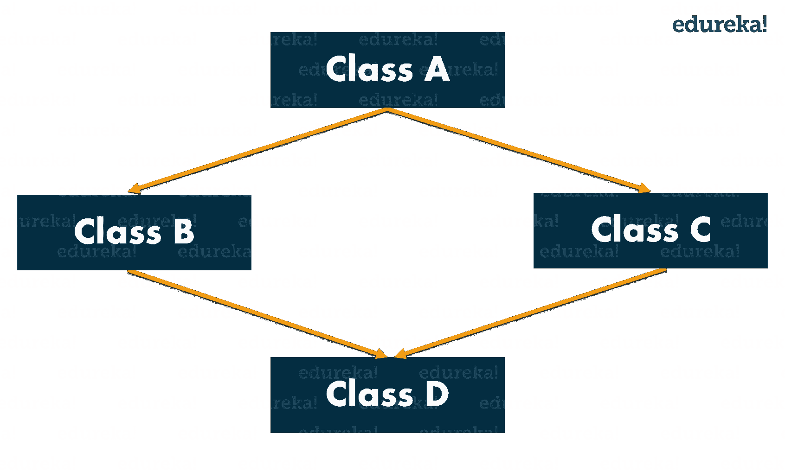

# Java 继承的类型及示例

> 原文：<https://www.edureka.co/blog/inheritance-in-java/>

面向对象编程或更广为人知的 OOPs 是 Java 的主要支柱之一，它充分利用了其强大的功能和易用性。要成为一名专业的 Java 开发人员，你必须对各种 [**Java OOPs 概念**](https://www.edureka.co/blog/object-oriented-programming/) 如继承、抽象、封装和多态有完美的控制。通过这篇文章，我将让你全面了解 OOPs 的一个最重要的概念，即 Java 中的继承，以及它是如何实现的。

以下是我将在本文中讨论的主题:

**Java OOPs 概念|面向对象编程| Edureka**


[https://www.youtube.com/embed/7GwptabrYyk?rel=0&showinfo=0](https://www.youtube.com/embed/7GwptabrYyk?rel=0&showinfo=0)

这段视频将让你简要了解 Java 中面向对象编程的各种基础知识，如继承、抽象、封装和多态，以及它们的实际实现。

## **Java 继承简介**

在面向对象程序设计中，计算机程序被设计成这样一种方式，所有的东西都是一个相互作用的[对象](https://www.edureka.co/blog/java-tutorial/#obj)。 继承是 Java OOPs 不可分割的一部分，它允许一个类的属性被另一个类继承。它基本上有助于重用代码，并在不同的类之间建立关系。

 我们知道，子女继承父母的财产。在 Java 中遵循类似的概念，我们有两个类:

1。父类(超类或基类)

2.  子类(子类或派生类 )

继承属性的类称为子类，而属性被继承的类称为父类。

**语法:**

现在，为了继承一个类，我们需要使用*扩展*关键字。在下面的例子中，类 Son 是子类，类 Mom 是父类。Son 类继承了 Mom 类的属性和方法。

```
class Son extends Mom
{
//your code
}

```

我们来看一个小程序，了解一下它的工作原理。在这个例子中，我们有一个基类教师和一个子类 HadoopTeacher。由于类 HadoopTeacher 扩展了基类的属性，我们不需要在子类中声明这些属性和方法。

```
class Teacher{
String designation = "Teacher";
String collegeName = "Edureka";
void does(){
System.out.println("Teaching");
}
}
public class HadoopTeacher extends Teacher{
String mainSubject = "Spark";
public static void main(String args[]){
HadoopTeacher obj = new HadoopTeacher();
System.out.println(obj.collegeName);
System.out.println(obj.designation);
System.out.println(obj.mainSubject);
obj.does();
}
}

```

**输出:**

endureka 老师星火教学

*查看 [**Java 课程**](https://www.edureka.co/java-j2ee-training-course) 通过实时项目实例了解 Java 中各种类型的继承。*

现在我们再进一步，看看 Java 支持的各种类型的继承。

## **Java 中的继承类型**

下图描述了 Java 中的继承类型:

****

*   ### **单继承**

在单一继承中，一个类继承另一个类的属性。它使派生类能够从单个父类继承属性和行为。反过来，这将支持代码的可重用性，并为现有的代码添加新的特性。

这里，A 类是你的父类，B 类是你的子类，继承了父类的属性和行为。类似的概念在下面的代码中有所体现:

```
class Animal{
void eat(){System.out.println(“eating”);}
}
class Dog extends Animal{
void bark(){System.out.println(“barking”);}
}
class TestInheritance{
public static void main(String args[]){
Dog d=new Dog();
d.bark();
d.eat();
}
}

```

*   ### 多级继承

    当一个类从另一个类派生的类派生时，即一个类具有一个以上的父类但在不同的级别，这种类型的继承称为多级继承。

如果我们讨论流程图，B 类继承 A 类的属性和行为，C 类继承 B 类的属性。这里 A 是 B 的父类，B 类是 C 的父类。所以在这种情况下，C 类隐式继承 A 类和 B 类的属性和方法。这就是多级继承。

```
class Animal{
void eat(){System.out.println(“eating…”);}
}
class Dog extends Animal{
void bark(){System.out.println(“barking…”);}
}
class Puppy extends Dog{
void weep(){System.out.println(“weeping…”);}
}
class TestInheritance2{
public static void main(String args[]){
Puppy d=new Puppy();
d.weep();
d.bark();
d.eat();
}
}

```

*   ### **分层继承**

    当一个类有不止一个子类(子类)，或者换句话说，不止一个子类有相同的父类，那么这种继承被称为**层次**。

在上面的流程图中，B 类和 C 类是继承自父类即 a 类的子类

```
class Animal{
void eat(){System.out.println(“eating…”);}
}
class Dog extends Animal{
void bark(){System.out.println(“barking…”);}
}
class Cat extends Animal{
void meow(){System.out.println(“meowing…”);}
}
class TestInheritance3{
public static void main(String args[]){
Cat c=new Cat();
c.meow();
c.eat();
}
}

```

*   ### Crossbreeding

混合继承是组合*两种或多种*类型的继承 。



现在我们知道了什么是继承及其各种类型，让我们更进一步，看看继承类时应该考虑的一些重要规则。

## **Java 中的继承规则**

#### 规则 Java 中不允许多重继承。



多重继承指的是一个子类试图扩展多个父类的过程。在上图中，A 类是 B 类和 C 类的父类，它们由 d 类进一步扩展。这导致了菱形问题。为什么？假设在类 B 和 C 中都有一个方法 show()，但是功能不同。当 D 类扩展 B 类和 C 类时，它自动继承 B 类和 C 类的特征，包括 show()方法。现在，当您试图调用类 B 的 show()时，编译器会弄不清要调用哪个 show()(要么从类 B 调用，要么从类 C 调用)。因此，它会导致歧义。

***例如:***

```
class Demo1
{
//code here
}
class Demo2
{
//code here
}
class Demo3 extends Demo1, Demo2
{
//code here
}
class Launch
{
public static void main(String args[])
{
//code here
}
}

```

在上面的代码中，Demo3 是一个试图继承两个父类 Demo1 和 Demo2 的子类。这是不允许的，因为它会导致菱形问题和歧义。

*注意:Java 不支持多重继承，但是你仍然可以使用接口来实现。*

#### 规则 Java 中不允许循环继承。

它是一种继承类型，在这种类型中，类扩展自己并形成自己的循环。现在想一想，如果一个类以任何方式扩展自己，如果它在用户定义的类中形成循环，那么还有机会扩展 Object 类。这就是 Java 中不允许它的原因。

***例如:***

```
class Demo1 extends Demo2
{
//code here
}
class Demo2 extends Demo1
{
//code here
}

```

在上面的代码中，两个类都试图继承对方的字符，这是不允许的，因为这会导致歧义。

#### 规则 3:私有成员不能被继承。

***例如:***

```
class You
{
private int an;
private int pw;
You{
an =111;
pw= 222;
}
}
class Friend extends You
{
void change Data()
{
an =8888;
pw=9999;
}
}
void disp()
{
System.out.println(an);
System.out.println(pw);
}
}
class Launch
{
public static void main(String args[])
{
Friend f = new Friend();
f.change.Data();
f.disp();
}
}

```

当你执行上面的代码时，猜猜会发生什么，你认为私有变量 *an* 和 *pw* 会被继承吗？绝对不行。它保持不变，因为它们特定于特定的类。

#### 规则 4:构造函数在 Java 中不能被继承。

构造函数不能被继承，因为子类总是有不同的名字。

```
class A {
   A();}

class B extends A{
   B();}

```

你只能做:

```
B b = new B();  // and not new A()

```

相反，方法是以“相同的名称”继承的，并且可以使用。尽管如此，您仍然可以在 B 的实现中使用构造函数:

```
class B extends A{
   B() { super(); }
}

```

#### 规则 5:在 Java 中，我们给子对象分配父引用。

父对象是对恰好是父对象的子类型的对象的引用，即子对象。*为什么用这个？*嗯，简而言之，它防止你的代码与单个类紧密耦合。因为引用是父类的，所以它可以保存它的任何子类对象，即，它可以引用它的任何子类。

它具有以下优点

1.  动态方法调度允许 Java 支持方法的覆盖，这是运行时多态性的核心。
2.  它允许一个类指定对它的所有派生方法通用的方法，同时允许子类定义一些或所有这些方法的具体实现。
3.  它还允许子类添加其特定的方法子类来定义一些特定的实现。

假设您将 getEmployeeDetails 添加到父类，如以下代码所示:

```
public String getEmployeeDetails() {
    return "Name: " + name;
}

```

我们可以在 Child 中覆盖该方法以提供更多的细节。

```
@Override
public String getEmployeeDetails() {
    return "Name: " + name + " Salary: " + salary;
}

```

现在，您可以编写一行代码来获取任何可用的详细信息，无论该对象是父对象还是子对象，如下所示:

```
parent.getEmployeeDetails();

```

然后检查以下代码:

```
Parent parent = new Parent();
parent.name = 1;
Child child = new Child();
child.name = 2;
child.salary = 2000;
Parent[] employees = new Parent[] { parent, child };
for (Parent employee : employees) {
    employee.getEmployeeDetails();
}

```

这将导致以下输出:

```
Name: 1
Name: 2 Salary: 2000

```

这里我们使用了一个子类作为父类引用。它有一个子类所特有的特殊行为，但是如果我们调用 getEmployeeDetails()，我们可以忽略功能差异，而专注于父类和子类是如何相似的。

#### 规则 6:因为构造函数中存在 super()，所以构造函数被执行。

正如您已经知道的，构造函数不会被继承，但是会因为 super()关键字而被执行。“super()”用于引用扩展类。默认情况下，它将引用对象类。Object 中的构造函数不执行任何操作。如果一个构造函数没有显式调用超类构造函数，那么 Java 编译器默认会插入一个对超类的无参数构造函数的调用。

这就把我们带到了“Java 中的继承”这篇文章的结尾。希望，你发现它信息丰富，有助于增加你的知识价值。如果你希望了解更多关于 Java 的知识，可以参考 [**Java 教程。**](https://www.edureka.co/blog/java-tutorial/)

*既然您已经了解了“什么是 Java 中的继承”以及 Java 中的各种类型的继承，那么就来看看 Edureka 提供的 Java 课程培训* *，edu reka 是一家值得信赖的在线学习公司，拥有遍布全球的 250，000 多名满意的学习者。Edureka 的 Java J2EE 和 SOA 培训和认证课程是为想成为 Java 开发人员的学生和专业人士设计的。该课程旨在为您提供 Java 编程的良好开端，并训练您掌握核心和高级 Java 概念以及各种 Java 框架，如 Hibernate & Spring。*

*有问题吗？请在“Java 中的继承”博客的评论部分提到它，我们会尽快回复您。*