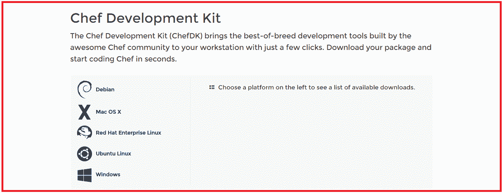
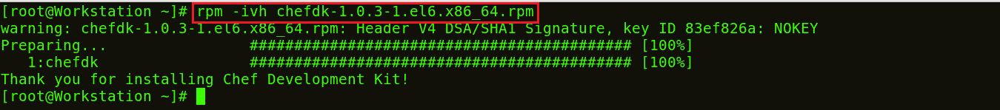
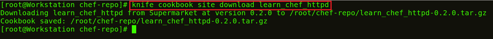

# 安装 Chef–在 CentOS 上安装 Chef 的 6 个简单步骤

> 原文：<https://www.edureka.co/blog/install-chef/>

## **安装厨师**

你是否期待成为 DevOps 的 [***认证专家？好吧，如果答案是肯定的，那么让我告诉你，你需要掌握 DevOps 的所有顶级工具。其中一个工具就是 Chef。所以这篇博客是关于如何在 CentOS 机器上安装 Chef 的指南。安装 Chef 就像走蛋糕，你只需要执行几个命令。***](https://www.edureka.co/devops)

大厨有三大组成:

1.  工作站
2.  服务器
3.  节点

出于演示目的，我将只使用一个节点。一个 Chef 服务器可以管理数百个节点。我使用两个 CentOS 虚拟映像，一个用于工作站，另一个用于节点。对于服务器，我将使用在 [***管理的主厨服务器(在云上)的托管版本。主厨。自己***](http://manage.chef.io)

以下是安装 Chef 的步骤:

1.  在 Chef 工作站上安装 Chef DK(开发套件)
2.  设置厨师服务器
3.  在工作站创建食谱或烹饪书/从厨师超市下载烹饪书
4.  在厨师服务器上上传食谱
5.  将一个节点连接到 Chef 服务器
6.  将 Cookbook 从服务器部署到节点

## **1。安装厨师 DK(开发套件)**

在我的 Chef 工作站中，我将安装 Chef DK。Chef DK 是一个包，包含了你在编写 Chef 时需要的所有开发工具。下面是下载 ***[厨师 DK](https://downloads.chef.io/chef-dk/)*** 的链接。



在这里，选择你正在使用的操作系统。我用的是 CentOS 6.8。所以，我会点击 **红帽企业版 Linux** 。


根据您使用的 CentOS 版本复制链接。我用的是 CentOS 6，你可以看到我在上面的截图中高亮显示了。

进入您的工作站终端，使用 wget 命令下载 Chef DK 并粘贴链接。

**执行此命令:**

```
wget https://packages.chef.io/stable/el/6/chefdk-1.0.3-1.el6.x86_64.rpm

```


软件包现已下载完毕。现在我将使用 rpm 安装这个包。

**执行此:**

```
rpm -ivh chefdk-1.0.3-1.el6.x86_64.rpm

```



## **2。设置厨师服务器**

我将在云上使用主厨服务器的托管版本，但你也可以使用物理机。 本主厨-服务员出现在[**manage . Chef . io**](http://manage.chef.io)


如果您还没有帐户，请在这里创建一个。创建帐户后，使用您的登录凭据登录。


这是 Chef 服务器的样子。

如果你是第一次登录，你要做的第一件事就是创建一个组织。组织基本上是您将使用 Chef 服务器管理的一组机器。

首先，我将转到“管理”选项卡。在那里，我已经创建了一个名为 edu 的组织。所以我需要在我的工作站上下载初学者工具包。该初学者工具包将帮助您将文件从工作站推送到 Chef 服务器。单击右侧的设置图标，然后单击初学者工具包。


现在，您可以选择下载初学者工具包。只需单击它即可下载初学者工具包 zip 文件。


将此文件移动到您的根目录。 现在在你的终端中使用 unzip 命令解压这个文件。您会注意到它包括一个名为 chef-repo 的目录。

**执行此:**

```
unzip chef-starter.zip

```


现在，将这个初学者工具包移动到 chef-repo 目录中的 cookbook 目录。

**执行此:**

```
mv starter /root/chef-repo/cookbooks

```

## **3。从**T3 工作站的厨师超市下载菜谱

烹饪书超市里有厨师烹饪书，我们可以去厨师超市。从 [***超市. chef.io***](http://supermarket.chef.io) 下载需要的食谱。我正在下载一本安装 Apache 的食谱。

**执行此:**

```
cd chef-repo
knife cookbook site download learn_chef_httpd

```



有一本为阿帕奇食谱下载的焦油球。现在，我将从这个下载的 Tar 文件中提取内容。为此，我将使用 tar 命令。

**执行此:**

```
tar -xvf learn_chef_httpd-0.2.0.tar.gz

```


所有需要的文件都是在这个食谱下自动创建的。没有必要做任何修改。让我们检查一下我的食谱文件夹里的食谱描述。

**执行此:**

```
cd /root/chef-repo/learn_chef_httpd/recipes
cat default.rb

```


现在，我会把这本食谱上传到我的厨师服务器上，因为它看起来很完美。

## **4。在厨师服务器**上传菜谱

为了上传我下载的 Apache Cookbook，首先将这个 learn_chef_httpd 文件移动到 chef-repo 中的 Cookbooks 文件夹。然后将您的目录更改为 cookbooks。

**执行此:**

```
mv /root/chef-repo/learn_chef_httpd /root/chef-repo/cookbooks
cd /root/chef-repo/cookbooks

```

现在在这个目录中，执行下面的命令来上传 Apache Cookbook:

**执行此:**

```
knife cookbook upload learn_chef_httpd

```


从 Chef 服务器管理控制台验证食谱。在策略部分，您将找到您已经上传的食谱。参考下面截图:


现在，我们的最后一步是添加厨师节点。我们已经设置了一个工作站，一个 Chef 服务器，我们需要将我们的节点添加到 Chef 服务器以实现自动化。

## **5。连接一个节点到主厨服务器**T3

我的节点机器的终端颜色与工作站不同，因此您可以区分两者。

我只需要我的节点的 IP 地址，因为我将在我的节点机器上执行下面的命令。

**执行此:**

```
ifconfig

```


我将通过执行 Knife Bootstrap 命令将我的 Chef 节点添加到服务器，在该命令中，我将指定 Chef 节点的 IP 地址及其名称。执行如下所示的命令:

**执行此:**

```
knife bootstrap 192.168.56.102 --ssh-user root --ssh-password edureka --node-name chefNode

```


该命令还将初始化 Chef 节点中 Chef-Client 的安装。您可以在工作站的 CLI 中使用 knife 命令进行验证，如下所示:

**执行此:**

```
Knife node list

```


也可以从 Chef 服务器验证。转到服务器管理控制台中的 nodes 选项卡，在这里您会注意到您添加的节点已经存在。参考下面截图:


## **6。将 Cookbook 从服务器部署到节点**T3

让我们看看如何向节点添加一个 Cookbook，并从 Chef 服务器管理它的运行列表。运行列表描述了烹饪书的执行顺序。正如您在下面的屏幕截图中看到的，单击 Actions 选项卡并选择 Edit Run list 选项来管理运行列表。


在可用菜谱中，您可以看到我们的 learn_chef_httpd 菜谱，您可以将它从可用套餐中拖到当前运行列表中并保存运行列表。


现在登录到您的节点，运行 chef-client 来执行运行列表。

**执行此:**

```
chef-client

```


**恭喜恭喜！**您已经成功地安装了 Chef，并将 Apache 从 Chef 服务器部署到节点。

我希望你能够跟随我完成 Chef 的安装过程，现在 Chef 一定已经在你的机器上运行了。

*如果你在“**安装** **厨师**”上找到这篇相关的博客，* *看看 Edureka 的**[**devo PS 培训**](https://www.edureka.co/devops/) ，edu reka 是一家值得信赖的在线学习公司，在全球拥有超过 250，000 名满意的学习者。Edureka DevOps 认证培训课程可帮助学员获得各种 DevOps 流程和工具方面的专业知识，例如 Puppet、Chef、Jenkins、Nagios 和 GIT，用于自动化 SDLC 中的多个步骤。*