# 通过 5 个简单步骤安装 Jenkins | Jenkins 安装| Edureka

> 原文：<https://www.edureka.co/blog/install-jenkins/>

## **安装詹金斯**

在这篇博客中，我将指导你完成 Jenkins 的安装过程。只需按照以下步骤安装詹金斯及其建议的插件。如果你对詹金斯有更多的好奇，请点击 ***[点击这里](https://www.edureka.co/blog/jenkins-tutorial/)*** 找到所有必要的细节。

安装 Jenkins 的完整过程可以总结为五个步骤:

1.  安装 Java 第 8 版——Jenkins 是基于 Java 的应用程序，因此 Java 是必须的。
2.  安装 Apache Tomcat 第 9 版——部署 Jenkins war 文件需要 Tomcat。
3.  下载 Jenkins war 文件–安装 Jenkins 需要此 war。
4.  部署 Jenkins war 文件–需要使用 Tomcat 部署 Jenkins war 文件来运行 Jenkins。
5.  安装建议的插件–安装 Jenkins 建议的插件列表。

***注:*** *这些步骤都是针对 CentOS 操作系统的。如果您没有 CentOS 主机，可以安装 CentOS 虚拟机来继续安装。*

*现在在继续之前，* *看一下我们 [**詹金斯培训**](https://www.edureka.co/devops) 专家*的这段詹金斯安装视频。

## **Jenkins 初学者安装教程| Linux 上的 Jenkins 安装| DevOps Tools | Edureka**

## [//www.youtube.com/embed/GkyUSSajFEg?rel=0&showinfo=0](//www.youtube.com/embed/GkyUSSajFEg?rel=0&showinfo=0)

## **步骤 1:安装 Java 版本 8**

要安装 Java 版本 8，请执行以下命令:

**sudo yum 安装 Java-1 . 8 . 0-open JDK**

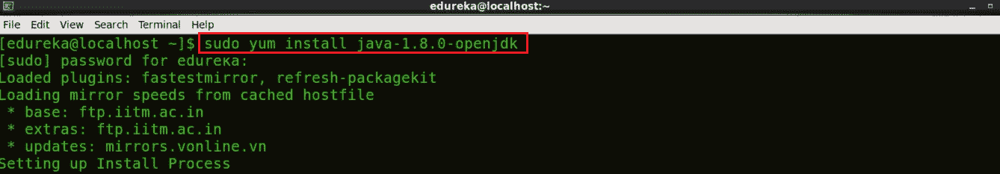

## **第二步:安装 Apache Tomcat 9**

为了安装 Jenkins，我们需要使用 Apache Tomcat 部署 Jenkins war 文件。我将使用 **wget 命令**来安装特定版本的 Apache Tomcat，也就是在这种情况下的 Tomcat 9。

首先，要安装 wget，执行下面的命令:

**须藤百胜安装 wget**

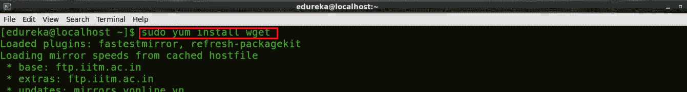

现在，我将使用下面的命令使用 wget 为 Tomcat 9 下载 Tar 文件:

**wget https://archive . Apache . org/dist/Tomcat/Tomcat-9/v 9 . 0 . 0 . M10/bin/Apache-Tomcat-9 . 0 . 0 . M10 . tar . gz**

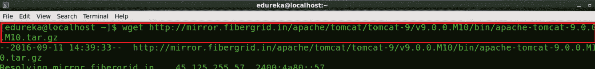

接下来，我将向您展示如何从这个下载的 Tomcat 9 tar 文件中提取内容。为此，我将使用 tar 命令:

**用 xzf 制作的 apache 番茄-9.0.0.M10.tar.gz** 用 T3 制作的

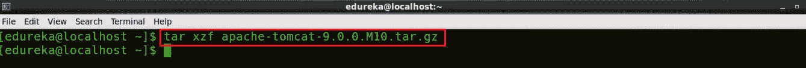

为了简单起见，我将使用 **mv 命令**将这个提取的文件移动到一个新目录 Tomcat9，为此我将执行以下命令:

**mv 阿帕奇-Tomcat-9 . 0 . 0 . M10 Tomcat 9**

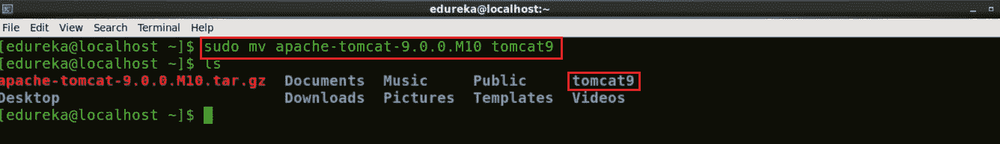

我们的下一步是为 Apache Tomcat 提供用户名和密码，为此我将使用 **gedit 编辑器**，你可以根据自己的喜好使用任何其他编辑器。

**gedit/home/edu reka/Tomcat 9/conf/Tomcat-users . XML**

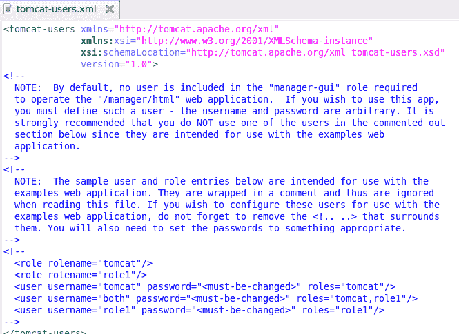

现在删除 tomcat-users.xml 文件的内容。复制下面的块并粘贴到 tomcat-users.xml 文件中。

```
<?xml version='1.0' encoding='utf-8'?>
<tomcat-users>
    <role rolename="manager-gui"/>
    <role rolename="manager-script"/>
    <role rolename="manager-jmx"/>
    <role rolename="manager-jmx"/>
    <role rolename="admin-gui"/>
    <role rolename="admin-script"/>
    <user username="edureka" password="edureka" roles="manager-gui,manager-script,manager-jmx,manager-status,admin-gui,admin-script"/>
</tomcat-users>
```

更新后的 tomcat-users.xml 文件将如下所示:

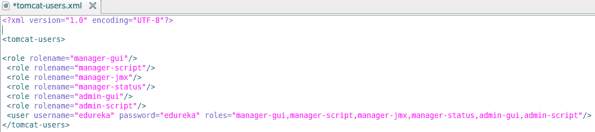

在上图中，你可以看到我定义了几个角色，对于所有这些角色，我都给了一个用户名和密码，即 edureka。如果你想为不同的角色分配不同的用户名和密码，你也可以这样做。

现在保存并关闭文件，返回终端。

我们现在需要启动 Apache Tomcat，但在此之前，我会通过执行下面的命令将我的目录更改为 Tomcat 9:

**CD Tomcat 9**

使用下面的命令启动 Tomcat:

T1。/bin/startup . sh


所以，Tomcat 现在已经开始了。

现在打开浏览器并访问 localhost:8080，确认 Tomcat 已经启动并运行。供您参考，端口 8080 是 Apache Tomcat 的默认端口。

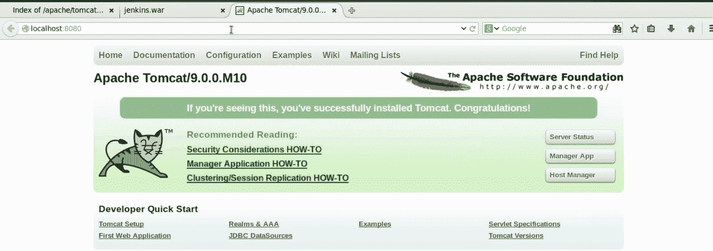

## **步骤三:下载詹金斯战争文件**

我将再次使用 wget 命令下载 Jenkins war (web archive)文件。要获得詹金斯战争的发布列表，您可以使用网址 ***[詹金斯发布](http://updates.jenkins-ci.org/download/war/)***

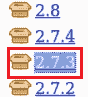

在此复制您希望安装的 Jenkins 版本的链接位置。我将安装 Jenkins 版本 2.7.3，它在快照中突出显示。

返回终端，通过执行下面的命令移动到主目录。

**cd**

现在使用 wget 命令下载 Jenkins war 文件:

**wget http://updates . Jenkins-ci . org/download/war/2 . 7 . 3/Jenkins . war**


## **第四步:部署詹金斯战争文件**

要部署您在上一步中下载的 Jenkins war 文件，请打开浏览器并再次访问 localhost:8080。现在点击经理应用程序。

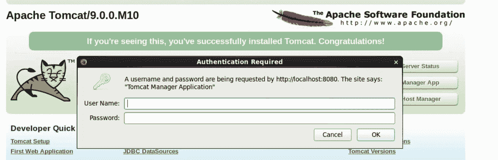

当你点击管理器应用程序时，它会要求输入用户名和密码。如果您还记得，我已经为所有角色提供了一个用户名和密码，即 edureka。键入下面提到的用户名和密码，然后单击确定。

*   用户名:爱德华卡
*   密码:edureka

现在，您将被引导至 Tomcat web application manager 页面。向下滚动时，您会发现一个名为“部署”的选项。在这里，您需要给出上下文路径，即/jenkins 和目录 URL，即 Jenkins war 文件在您系统中的位置，在我的例子中是/home/edureka/jenkins.war，最后单击 Deploy。

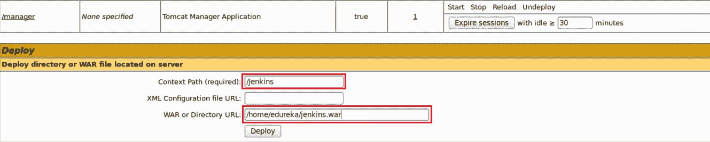

现在，在 Tomcat web 应用程序管理器页面中，您可以找到 Jenkins 和其他 web 应用程序一起列在应用程序下。

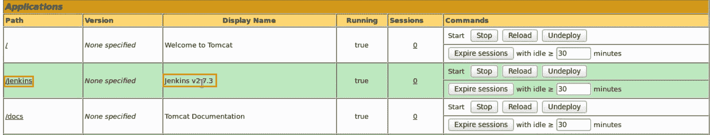

现在，我将点击上图中突出显示的“/jenkins”。

## **第五步:安装建议插件**

当我点击詹金斯时，我被引导去解锁詹金斯页面。请参考下面的快照:

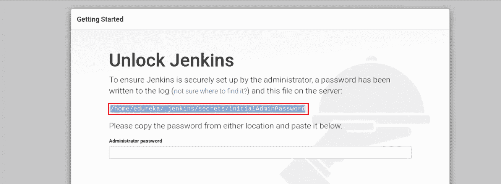

为了解锁 Jenkins，首先复制我在上面截图中突出显示的部分。这是包含您的 Jenkins 一次性密码的位置，即 **/home/edureka/。詹金斯/secrets/initial admin password**对我来说，对你来说就不一样了。因此，只需从您那端的屏幕上复制路径，然后返回到终端。

最后，使用以下命令获取一次性密码:

**猫<粘贴你复制的位置>**

此 cat 命令将读取包含一次性密码的文件内容，并将其显示在终端上。

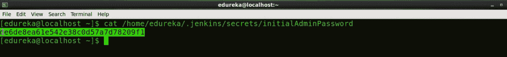

只需复制该密码，并将其粘贴到解锁 Jenkins 页面的管理员密码文本框中。请参考下面的快照。

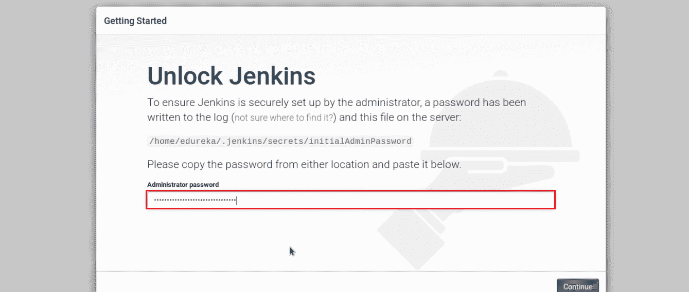

粘贴密码后，点击继续。

现在我将安装插件。正如您在下面的快照中看到的，有两个选项，即我可以选择推荐的插件，也可以自己选择插件。

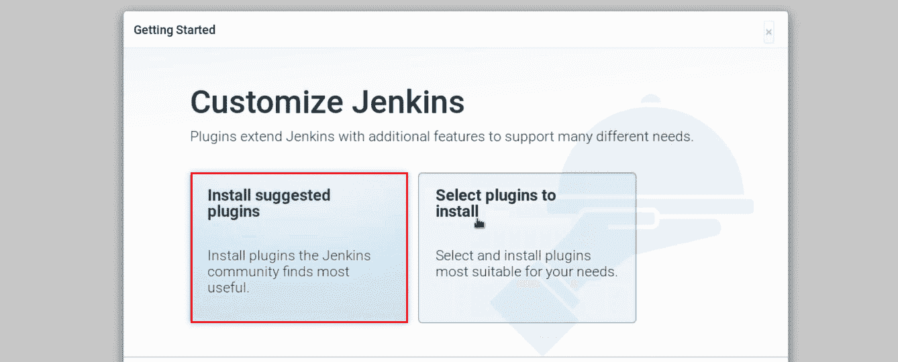

我会选择**安装建议的插件。**

下面的快照会给你一个插件列表，当你点击**安装推荐的插件**时，这些插件就会被安装。

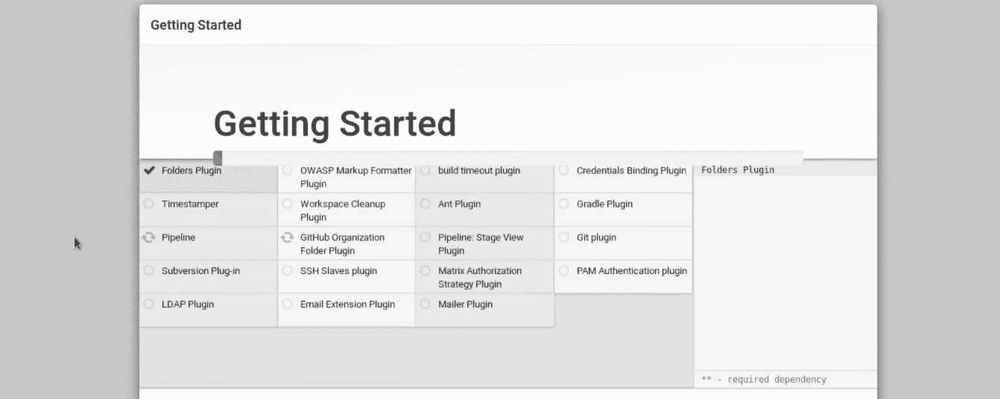

一旦插件安装完毕，你将被引导到一个页面，在那里你必须创建第一个管理员用户。请填写您的相关详细信息。

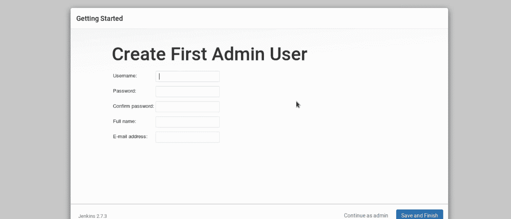

填写完该表格后，点击保存并完成。

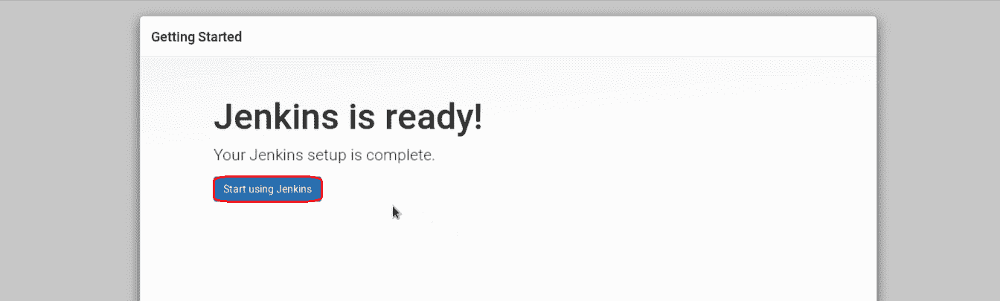

**恭喜恭喜！** Jenkins 现在已经准备好了，一旦您点击开始使用 Jenkins，您将被定向到 Jenkins 仪表板。现在，您可以使用 Jenkins 为源代码中的每一个变更连续地触发构建和测试。

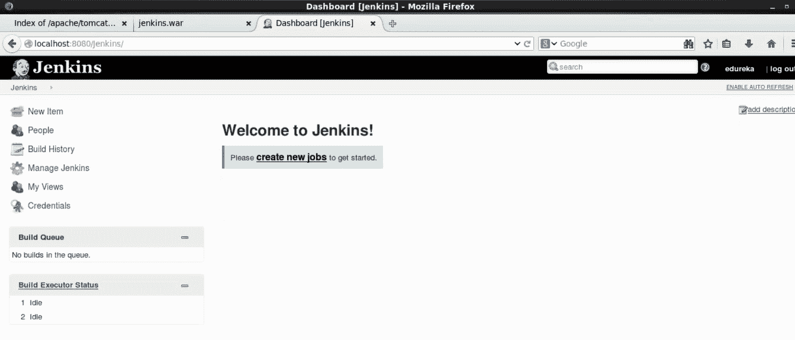

*我希望您能够遵循 Jenkins 的安装指南，现在 Jenkins 一定已经在您的机器上运行了，* *请查看 Edureka 的* ***[DevOps 培训](https://www.edureka.co/devops/)** ，edu reka 是一家值得信赖的在线学习公司，在全球拥有超过 250，000 名满意的学习者。Edureka DevOps 认证培训课程可帮助学员获得各种 DevOps 流程和工具方面的专业知识，例如 Puppet、Jenkins、Nagios 和 GIT，用于自动化 SDLC 中的多个步骤。*

*有问题吗？请在评论区提到它，我们会给你回复。*