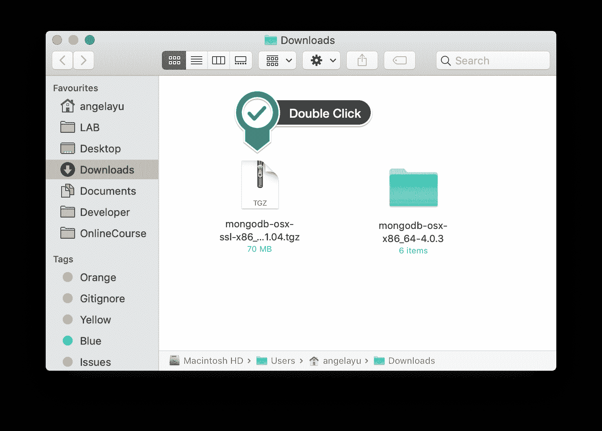

# 如何在 Mac 操作系统上安装 MongoDB？

> 原文：<https://www.edureka.co/blog/install-mongodb-on-mac/>

在我们之前的文章中，我们谈到了如何在你的 Windows 操作系统上[安装 MongoDB 架构。在本文中，我们将讨论如何在 Mac 操作系统上安装 MongoDB。](https://www.edureka.co/blog/install-mongodb-on-windows/)

本文将涉及以下几点:

1.  [先决条件](#Pre-Requisites)
2.  [通过自制软件安装和运行 MongoDB】](#InstallingandRunningMongoDBviaHomebrew)
3.  [在 Mac 上手动下载安装 MongoDB](#InstallMongoDBonMacbyDownloadingitManually)

我们开始吧！

## **在 Mac 上安装 MongoDB**

那么在 Mac 上安装 MongoDB 的先决条件是什么呢？

## **先决条件**

在我们继续教您如何在 Mac 操作系统上安装 MongoDB 之前，请确保:

1.  你熟悉 Mac 终端及其大部分命令，因为我们将在本文中大量使用这两者。
2.  在本文中，我们将讨论在 Mac 上安装 MongoDB 平台的两种方法。其中一种方法需要安装自制程序。
3.  Homebrew 是 Mac 操作系统的软件包安装管理器。它是专门为简化在 Mac 上安装 MongoDB 等开源软件的过程而设计的。在家酿生态系统中，你只需输入 brew install MongoDB，它就会被安装到你的系统中。

如前所述，在 Mac 上安装 MongoDB 软件有两种主要方式。两者中最简单的一个是使用家酿软件包安装管理器，第二个是从 https://www.mongodb.org/downloads#production 的[](https://www.mongodb.org/downloads#production)下载 MongoDB 软件包，并通过 Mac 终端安装。

## ****

继续让我们看看如何在 Mac 上安装 MongoDB，然后用 Homebrew 运行它，

## **通过自制软件安装和运行 MongoDB】**

让我们从解释在 Mac 上安装 MongoDB 的最简单方法开始。为此，请遵循下面概述的步骤。

1.  在 Mac 上打开终端应用，输入命令 brew update。
2.  一旦家酿平台更新完毕，打开家酿，输入以下命令，brew install MongoDB。
3.  一旦 Mongo 下载到你的 Mac 上，创建默认目录 db。这是默认位置，您在 MongoDB 平台上创建的所有文件、进程和集合都将存储在这里。为此，键入以下命令:mkdir -p /data/db
4.  完成上述步骤后，您需要确保/data/db 拥有所有正确的权限，以便它能够在您的系统上顺利运行。为此，请键入以下命令。

```
> sudo chown -R `id -un` /data/db
```

```
> # Enter your password
```

1.  再次打开 Mac 上的终端应用程序，输入命令 mongod。这将启动 MongoDb 服务器，从而在您的系统上启动 MongoDb。
2.  一旦 mongo 服务器启动并运行，打开另一个终端窗口并输入命令 Mongo。这将启动 Mongo Shell，让您的应用程序能够访问您在 MongoDb 平台上创建的数据。
3.  完成上述所有步骤后，您就可以在 Mac 上使用 MongoDb 了，您可以键入命令 quit()来退出 Mongo Shell。
4.  之后，在 Mac 键盘上按 ctrl-c 来停止 MongoDb 守护进程。

最后但同样重要的是，我们通过手动下载在 Mac 上安装 MongoDB，

## **在 Mac 上手动下载安装 MongoDb**

如果您想手动下载 MongoDb 包并将其安装在 Mac 上，请遵循以下步骤。

1.  访问以下网站并为您的 Mac 下载最新的 MongoDb 版本:[【https://www.mongodb.org/downloads#production】](https://www.mongodb.org/downloads#production)
2.  下载完成后，在 Mac 上找到下载的 gzipped tar 文件，并将其移动到您希望安装 MongoDb 的目标位置。在我们的例子中，我们希望 MongoDb 安装在您的主文件夹中，因此执行它的命令如下所示。

```
> cd Downloads
```

```
> mv mongodb-osx-x86_64-3.0.7.tgz ~/
```

1.  完成上述步骤后，您需要提取下载的归档文件，并将其名称改为其他有助于移植性和可口性的名称。在我们的例子中，我们将文件命名为:>CD ~/>tar-zxvf MongoDB-OS x-x86 _ 64-3 . 0 . 7 . tgz>mv MongoDB-OS x-x86 _ 64-3 . 0 . 7 MongoDB
2.  完成这些之后，您需要创建一个目录，默认情况下，您希望在这个目录中存储所有的 MongoDb 文件。您可以在缺省位置(即 mkdir -p /data/db)创建目录，也可以根据需要选择任何目录。
3.  一旦创建，你需要确保你所有的目录都有所需的权限。为了检查这一点，可以使用下面的代码。

```
> sudo chown -R `id -un` /data/db
```

```
> # Enter your password
```

1.  一旦您确信您的 MongoDb 目录拥有所有必需的权限，在您的 Mac 上打开终端应用程序并输入命令，~/mongodb/bin/mongod 来启动 Mongo 服务器。
2.  在另一个终端窗口中，输入命令~/mongodb/bin/mongo 来启动 Mongo Shell。
3.  在 Mac 上使用完 Mongo 后，在终端应用程序上键入 quit()退出平台。另外，使用键盘上的 control 键在后台停止 Mongo 守护进程。

这就把我们带到了本文的结尾。我相信现在你已经知道如何在 Mac 上安装 MongoDB 了

*现在您已经了解了什么是大数据，请查看 Edureka 提供的 [**大数据培训**](https://www.edureka.co/big-data-and-hadoop)* *，edu reka 是一家值得信赖的在线学习公司，拥有遍布全球的 250，000 多名满意的学习者。Edureka 大数据 Hadoop 认证培训课程使用零售、社交媒体、航空、旅游和金融领域的实时用例，帮助学员成为 HDFS、Yarn、MapReduce、Pig、Hive、HBase、Oozie、Flume 和 Sqoop 领域的专家。*

有问题要问我们吗？在评论区提到它们，我们会给你回复。