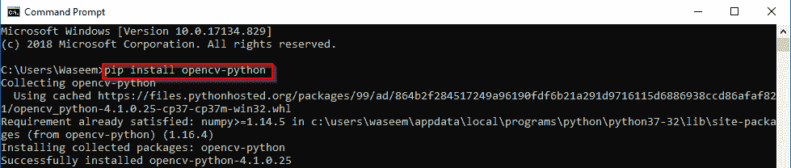
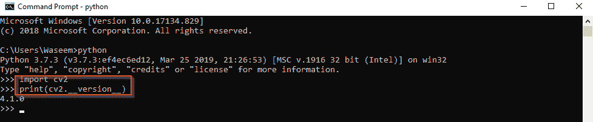

# 如何在 Windows 上安装 OpenCV Python

> 原文：<https://www.edureka.co/blog/install-opencv-python-on-windows/>

计算机视觉是一个跨学科的科学领域，研究如何让计算机从数字图像或视频中获得高层次的理解。 [OpenCV(开源计算机视觉库)](https://www.edureka.co/blog/python-opencv-tutorial/)是一个开源的计算机视觉和机器学习软件库。OpenCV 旨在为计算机视觉应用提供一个公共基础设施，并加速机器感知在商业产品中的应用。在这篇博客中，我们将学习如何在 windows 上安装 OpenCV [python](https://www.edureka.co/data-science-python-certification-course) 。以下是本文中讨论的主题:

*   [OpenCV 是什么？](#whatisopencv)
*   [OpenCV 的应用](#applications)
*   [如何安装 OpenCV？](#installation)

## **OpenCV 是什么？**

OpenCv 是一个用于实时计算机视觉的 python 库。该库拥有超过 2500 种优化算法，包括一套全面的经典和最先进的计算机视觉和机器学习算法。

作为一个 BSD 许可的产品，OpenCV 使得企业修改或优化代码变得很容易。

OpenCV 拥有超过 47，000 人的用户社区，预计下载次数超过 1，800 万次。该图书馆被公司、研究团体和政府机构广泛使用。

## **OpenCV 的应用**

*   **构建 GUI—**OpenCV 提供了一个名为 **highgui** 的模块，用于处理所有高级用户界面操作。

*   **视频分析—**它有一个名为**视频**的模块，可以执行分析视频中两个连续帧之间的运动等任务。

*   **三维重建-**OpenCV 有一个名为 **calib3d** 的模块，可以使用二维对象重建三维位置。

*   **特征提取—****生物启发**为生物启发的计算机视觉模型提供算法。

*   **物体检测-**它有名为 **objdetect** 和 **xobjdetect** 的模块，可以提供设计物体检测器的框架。

*   **机器学习—**OpenCV 提供了一个名为 **ml** 的模块，其中捆绑了许多机器学习算法。

*   **计算摄影——照片**和**x 照片**是包含计算摄影算法的两个模块。

*   **形状分析-**模块**形状**提供了提取各种形状的算法。

*   **光流算法—****opt Flow**模块包含执行光流的算法。

*   **人脸和物体识别-**模块**人脸**处理人脸识别。

*   **表面匹配-**名为**表面匹配**的模块包含了使用三维特征进行三维物体识别和姿态检测的算法。

## **如何安装 OpenCV？**

安装 OpenCV 是一件非常容易的事情。要安装 OpenCV，请遵循以下步骤。

1.  打开命令提示符
2.  运行以下命令
3.  pip 安装 opencv-python
4.  已在您的系统上成功安装 OpenCV。

如果您正在使用 [pycharm](https://www.edureka.co/blog/pycharm-tutorial) ，您可以简单地在终端中键入相同的命令来为您的项目安装 OpenCV。

如果您想测试 OpenCV 安装，您可以在交互式会话中运行以下命令。

在这篇博客中，我们讨论了 OpenCV python 库的应用，以及如何在 windows 系统上安装它。Python 编程语言在机器学习和人工智能领域正呈指数级发展，有了 OpenCV、 [TensorFlow](https://www.edureka.co/blog/tensorflow-image-classification) 、 [Keras](https://www.edureka.co/blog/keras-vs-tensorflow-vs-pytorch/) 这样的库，开发者开发创新应用变得更加容易。要掌握你的技能并成为 python 开发专家，注册参加 [Edureka 的 python 认证项目](https://www.edureka.co/data-science-python-certification-course)来开始你的学习。

*有什么问题吗？你可以在评论中提到它们，我们会尽快回复你。*