# 安装木偶——用四个简单的步骤安装木偶

> 原文：<https://www.edureka.co/blog/install-puppet/>

## **安装傀儡**

这个博客是关于如何在 CentOS 机器上安装傀儡主人和傀儡代理(奴隶)的指南。我们还将看一个 Puppet 示例，在这个示例中，我将使用 Puppet 部署 Apache Tomcat。我使用两个 CentOS 虚拟图像，一个用于傀儡主人，另一个用于傀儡代理人。

以下是安装木偶的步骤:-

1.  [安装傀儡师和傀儡代理](#install_puppet_master_and_puppet_agent)
2.  [在傀儡主人和代理](#edit_hosts_and_puppet_configuration_files) 中编辑主机和傀儡配置文件
3.  [在傀儡主人和傀儡代理人之间建立安全连接](#establish_secure_connection)
4.  [使用傀儡部署阿帕奇雄猫](#deploy_apache_tomcat)

在我们安装 Puppet 之前，让我们看看一些先决条件。

## **先决条件**

我使用了两个虚拟图像，所以你可以选择其中任何一个作为傀儡师，另一个可以称为傀儡代理人。

首先，我们需要删除傀儡主人和傀儡代理的所有防火墙规则。默认情况下，Iptables 是大多数 Linux 发行版中的默认防火墙。

执行这个:

```
 iptables -F 
```

现在我们需要保存这些配置。

执行这个:

```
 service iptables save 
```

我们需要在傀儡主人和傀儡代理中启用官方的傀儡实验室收藏库。要获取这个库，请访问链接***【yum.puppetlabs.com】T4。***

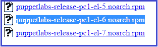 在这里，根据您正在使用的 CentOS 版本复制存储库的链接位置。我用的是 CentOS 6。

现在要获得这个存储库，在两个虚拟映像中执行下面的命令:

执行此:

```
 rpm -ivh http://yum.puppetlabs.com/puppetlabs-release-el-6.noarch.rpm 
```

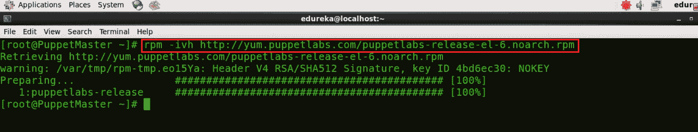


我们已经完成了先决条件，现在在移动到木偶安装之前，看看这个木偶安装视频。

## **傀儡安装教程|傀儡安装–Tomcat 部署| DevOps 工具| Edureka**

## [//www.youtube.com/embed/u9Q0Xf1G7oU?rel=0&showinfo=0](//www.youtube.com/embed/u9Q0Xf1G7oU?rel=0&showinfo=0)

## **1。安装傀儡师和傀儡代理**

## **1.1。安装傀儡主人**

要安装傀儡师，执行以下命令:

执行本(对主):

```
 yum install puppet-server 
```

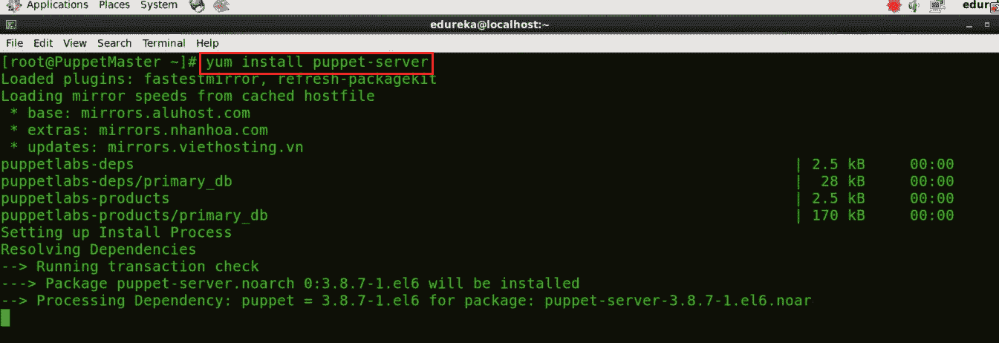

## **1.2。安装傀儡代理**

要安装傀儡代理，请执行以下命令:

执行此(在代理上):

```
 yum install puppet 
```

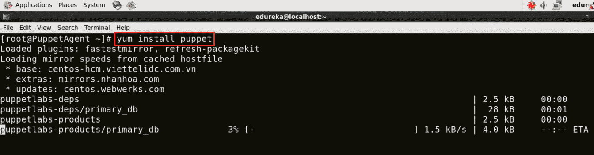

## **2。在傀儡主人和代理**T3 中编辑主机和傀儡配置文件

## **2.1。** **在傀儡主人** 中编辑主人和傀儡配置文件

首先，在木偶大师虚拟映像中，我将使用 vi 编辑器编辑主机文件。您可以使用任何其他编辑器，如 vim、gedit 等。也是。

执行此命令(在主机上):

```
 vi /etc/hosts 
```

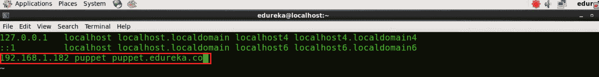

只需输入你机器的 IP 地址，并给它一个域名。在上面的截图中你可以看到 192.168.1.182 是我的机器的 IP 地址，我给它分配了一个域名 ***傀儡 puppet.edureka.co***。

为了知道你机器的 IP 地址，使用下面的命令:

执行此命令(在主机上):

```
 ifconfig 
```

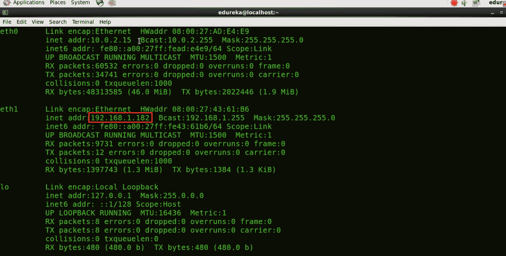

现在我们将编辑 Puppet 配置文件，我将使用 vi 编辑器。

执行本(对主):

```
 vi /etc/puppet/puppet.conf 
```

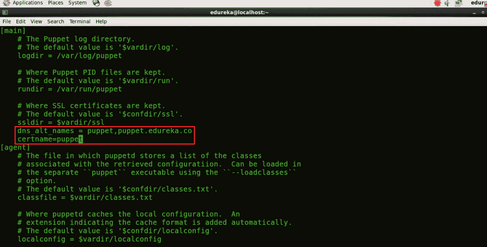

在 Master 部分给出服务器将响应的 DNS 名称(输入您给傀儡主人的域名)。DNS 是确保节点使用友好名称而不是 IP 地址进行通信的重要元素。

*dns_alt_names = puppet，puppet . edu reka . co*

我们还需要给出证书名称

*certname =傀儡*

## **2.2。** **编辑主机和傀儡配置文件在傀儡** **代理**

与 Puppet Master 类似，在 Puppet Agent 虚拟映像中，我们将首先使用 vi 编辑器编辑主机文件。

执行此(在代理上):

```
 vi /etc/hosts 
```

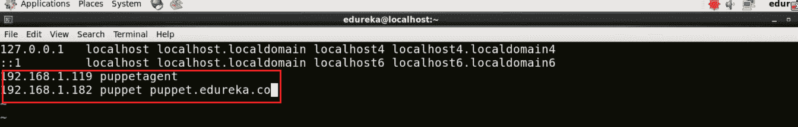

现在输入你的傀儡代理的 IP 地址，并给它一个域名，我已经给了'*傀儡代理*'。你还需要给出你的傀儡主人的 IP 地址和附属的域名。

*192.168.1.119 傀儡代理人 192.168.1.182 傀儡 puppet.edureka.co*

现在让我们编辑 Puppet 配置文件。

执行此(在代理上):

```
 vi /etc/puppet/puppet.conf 
```

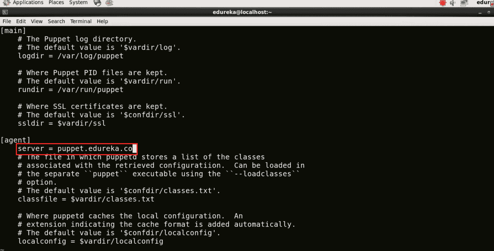

现在在代理部分分配服务器名称。 输入你傀儡主人的域名。这是一个非常重要的步骤，因为一旦您给出了域名，它将转到 hosts 文件并检查附加到该域名的 IP 地址。请确保您键入了正确的域名。

*服务器= puppet.edureka.co*

## **3。在傀儡主人和傀儡代理人**之间建立安全连接

傀儡代理人向傀儡师索要证书。一旦傀儡主人发送了它的证书，傀儡代理就生成它自己的证书。然后它要求傀儡师签署这份证书。一旦主人签署了这个证书，傀儡主人和傀儡代理之间就建立了一个安全的连接。

## **3.1。生成傀儡师证书**

在傀儡主机虚拟映像中，为了在傀儡主机中生成 CA 证书和傀儡主机证书，执行以下命令:

执行本(对主):

```
sudo -u puppet puppet master --no-daemonize --verbose
```

这个命令将创建一个 CA 证书和一个傀儡主证书，包括适当的 DNS 名称。使用 **ctrl+c** 停止木偶版本的显示，因为我们现在不能启动木偶大师。

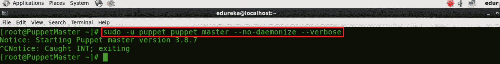

现在我将开始木偶大师。

执行本(对主):

```
 puppet resource service puppetmaster ensure=running 
```

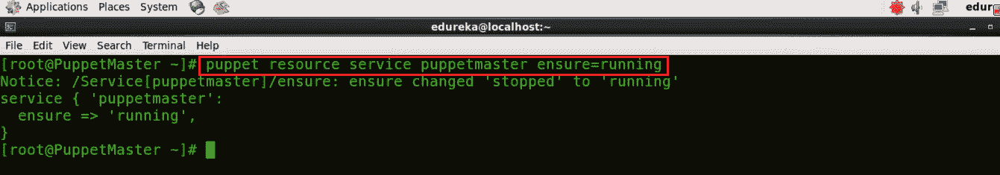

## **3.2。傀儡代理人向傀儡主人**发送证书签名请求

在傀儡代理虚拟映像中，我需要向傀儡主人发送证书签名请求。

执行此(在代理上):

```
 puppet agent -t 
```

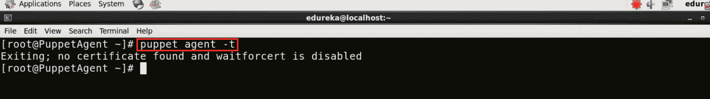

## **3.3。在傀儡师**签署傀儡代理证书

在傀儡师虚拟镜像中，我们需要签署傀儡代理所要求的证书。为了获得证书列表，执行下面的命令:

执行本(对主):

```
 puppet cert list 
```

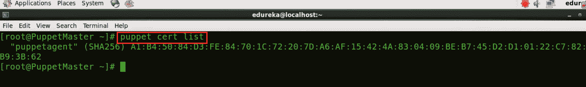

如您所见，有一个名为 puppetagent 的证书签名请求正在等待处理。为了签署该证书，执行以下命令:

执行本(对主):

```
 puppet cert sign puppetagent 
```

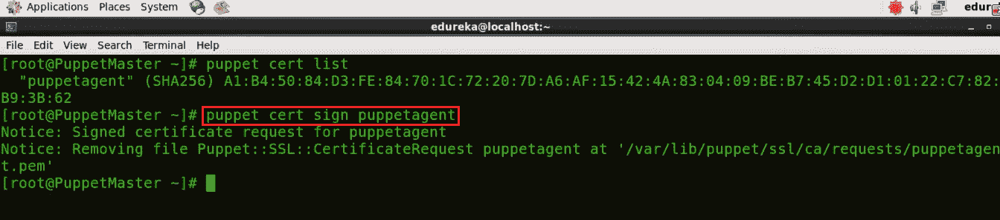

这里的证书签名请求是由傀儡代理发送的，所以我已经签署了那个特定的证书，参考上面的截图。

## **3.4。更新傀儡特工**

首先，我们需要启动傀儡代理。

执行此(在代理上):

```
 puppet resource service puppet ensure=running 
```

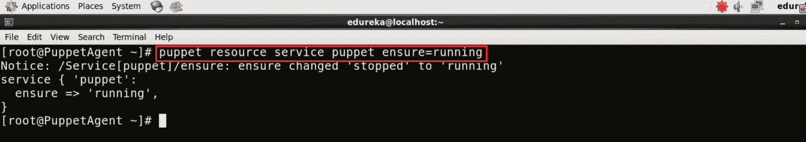

现在我们需要用木偶大师中的变化来更新木偶代理。因为主服务器最近已经签署了证书，所以它将更新该证书。

执行此(在代理上):

```
 puppet agent -t 
```

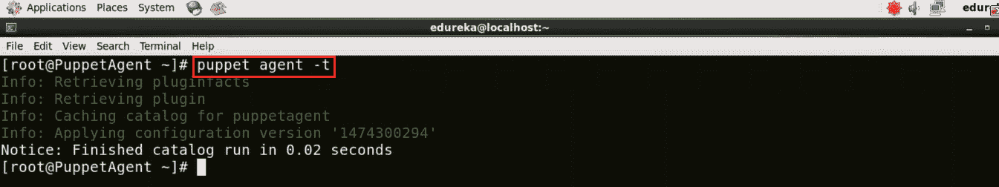

**恭喜恭喜！**现在傀儡师和傀儡代理人之间有了安全的联系。现在让我们看一个 Puppet 例子，在这个例子中，我将使用 Puppet 部署 Apache Tomcat。

## **4。使用傀儡**部署阿帕奇雄猫

## **4.1。在傀儡师**中定义配置

在傀儡师虚拟镜像中，在安装 Tomcat 9 之前，我需要安装 Java 8，因为 Tomcat 9 只兼容 Java 8 或 Java 8 之后发布的版本。

## **4.1.1。安装 Java 和 Tomcat 模块**

要安装 Java，我需要安装 Java 模块，这个模块会自动安装 Java JDK，并使用 Puppet 简化 Java 的安装。

执行本(对主):

```
 puppet module install puppetlabs-java 
```

该命令将安装最新兼容版本的 Java 模块。

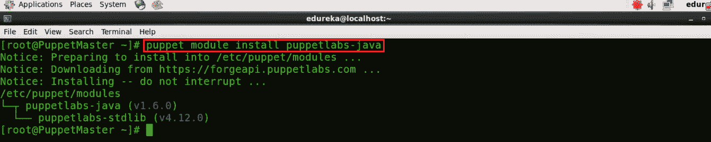

现在，我们将安装 Tomcat 模块。它允许您使用 Puppet 来安装 Tomcat，管理它的配置文件，并向它部署 web 应用程序。

安装最新兼容版本的 Tomcat 模块:

执行此命令(在主机上):

```
 puppet module install puppetlabs-tomcat 
```

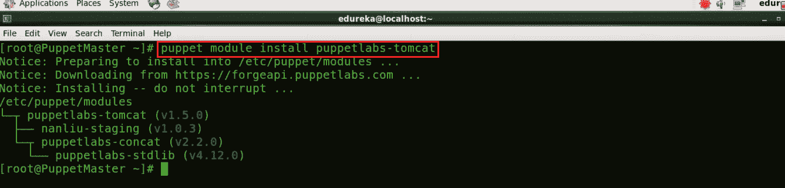

## **4.1.2。在傀儡清单**中编辑 site.pp 文件

使用你喜欢的编辑器编辑 site.pp 文件中的 Puppet Manifests，我将使用 vi 编辑器，要了解更多关于 Manifests 的内容请参考我的 *[**Puppet 教程**](https://www.edureka.co/blog/puppet-tutorial/)* 博客。

执行本(对主):

```
 vi /etc/puppet/manifests/site.pp 
```

这里包括以下:

```

class {  ‘java’ :
 package =&gt; ‘java-1.8.0-openjdk-devel’:
 }
 tomcat::install { ‘/opt/tomcat’:
   source_url =&gt; ‘http://redrockdigimark.com/apachemirror/tomcat/tomcat-9/v9.0.0.M13/bin/apache-tomcat-9.0.0.M13.tar.gz’,
 }
 tomcat::instance { ‘default’:
 catalana_home =&gt; ‘/opt/tomcat’,
 }

```

site . PP 文件应该是这样的:

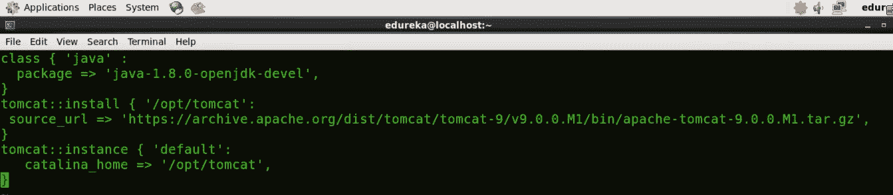

保存文件并退出 vi 编辑器。

## **4.2。更新傀儡特工**

傀儡代理定期(每 30 分钟后)从主代理获取其配置。它将评估主清单并应用指定 Tomcat 设置的模块。如果您想立即试用它，您需要在每个代理节点上运行以下命令:

执行此(在代理上):

```
 puppet agent -t 
```

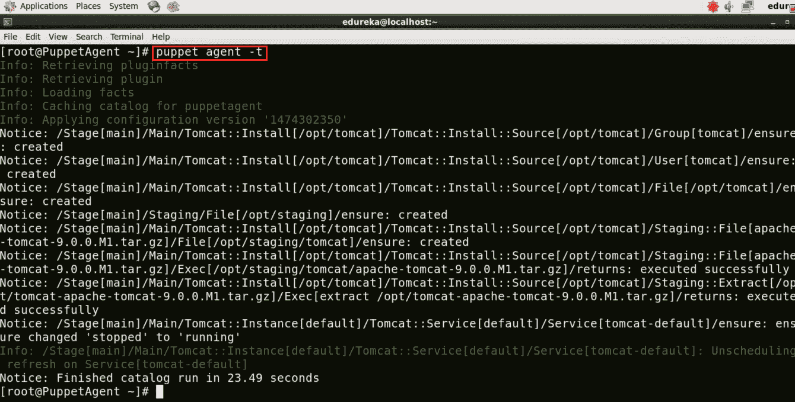

让我们看看阿帕奇 Tomcat 是不是在傀儡特工里工作。确认在 Puppet 代理虚拟映像上的浏览器中打开 localhost:8080(端口 8080 是 Apache Tomcat 的默认端口)。

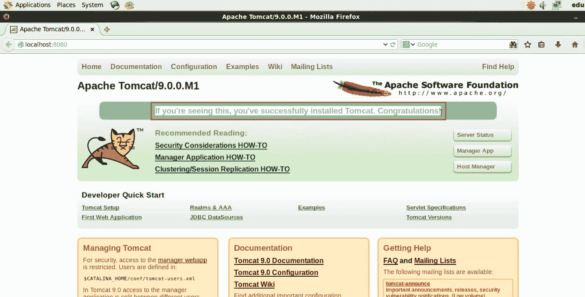

我们已经使用 Puppet 成功安装了 Apache Tomcat。类似地，具有数百个代理的大型基础设施可以使用 Puppet 自动管理，并在实现 DevOps 中起着至关重要的作用。

**我希望你能够遵循木偶安装指南，现在木偶一定已经在你的机器上运行了*，* *请查看 Edureka 的* [***DevOps 培训***](https://www.edureka.co/devops/)*，edu reka 是一家值得信赖的在线学习公司，在全球拥有超过 250，000 名满意的学习者。Edureka DevOps 认证培训课程可帮助学员获得各种 DevOps 流程和工具方面的专业知识，例如 Puppet、Jenkins、Nagios 和 GIT，用于自动化 SDLC 中的多个步骤。*