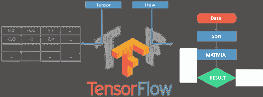
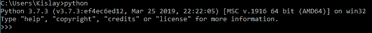
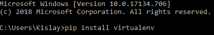
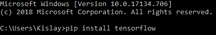

# 安装 TensorFlow 的分步指南

> 原文：<https://www.edureka.co/blog/install-tensorflow>

深度学习是 2019-20 年最热门的话题之一，这是有充分理由的。工业的进步使得机器/计算机程序真正取代人类成为可能。人工智能将在 2020 年**前**为**创造 230 万个**工作岗位，而这其中很多都是通过 TensorFlow 实现的。因此，在这篇安装 TensorFlow 的文章中，我将讨论以下主题:

*   [什么是张量流？](#what-is-tf)
*   [TensorFlow 应用](#Applications)
*   [TensorFlow 安装流程](#Installation)

## What is TensorFlow?

[**TensorFlow**](https://www.edureka.co/blog/tensorflow-tutorial/) 是谷歌的开源机器学习框架，用于跨一系列任务的数据流编程。图中的节点表示数学运算，而图边表示它们之间通信的多维数据数组(**张量**)。

张量是多维数组，是二维表向更高维数据的扩展。TensorFlow 有许多特性，这使它适合深度学习。

## TensorFlow 应用

现在 TensorFlow 已经帮助很多公司建立了世界级的模型来解决实际问题。所以，在安装 TensorFlow 之前，我们先来看看它的一些应用。

****

**Airbnb:** 它通过使用 TensorFlow 对图像进行分类，并在规模上检测对象，从而改善了客人体验。

**coca Cola:**tensor flow 的进步使可口可乐最终实现了长期寻求的无摩擦购买证明功能。

**GE Healthcare:** GE 使用 TensorFlow 训练了一个神经网络，以在大脑磁共振成像期间识别特定解剖结构，从而帮助提高速度和可靠性。

**Twitter:** Twitter 使用 TensorFlow 构建了他们的“排名时间轴”，让用户即使关注了一千个其他用户，也不会错过任何一条推文。

## 安装 TensorFlow:步骤

在我们安装 Tensorflow 之前，有几个先决条件:

*   [安装 Python](https://www.python.org/)

*   [安装 Pip](https://pip.pypa.io/en/stable/installing/)

从 python 3.5.x 开始，Pip 就已经存在了。

*   设置虚拟环境

要设置虚拟环境，请执行以下操作:

在此之后，使用以下命令

然后，你就完了。继续，在你安装 tensorflow 之后，只需导入它并开始使用它令人惊叹的深度学习能力并创造一些新的东西。

*就这样，我们结束了这篇安装 TensorFlow 的文章。Edureka 在 TensorFlow 开展的[深度学习和 Python 认证培训是由行业专业人士根据行业要求&的要求策划的。您将掌握 SoftMax 函数、自动编码器神经网络、受限玻尔兹曼机(RBM)等概念，并使用 Keras & TFLearn 等库。该课程由行业专家通过实时案例研究特别策划。](https://www.edureka.co/ai-deep-learning-with-tensorflow)*