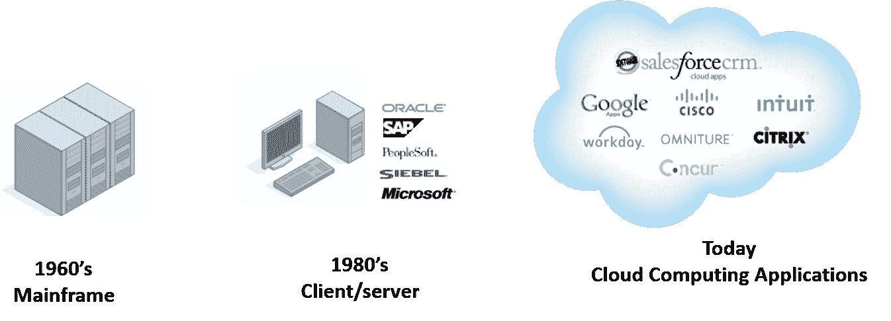

# CRM Salesforce 和云计算简介

> 原文：<https://www.edureka.co/blog/introduction-to-crm-salesforce-and-cloud-computing>

在获取新客户和留住现有客户变得越来越重要的商业环境中，敏捷的 CRM 系统是弥合业务流程和管理客户期望之间差距的答案。CRM 可以广义地定义为一套管理公司与客户和销售前景互动的过程。它通常涉及组织、自动化和同步销售、营销、客户服务和技术支持的技术。每个组织的目标通常是在组织和客户之间建立牢固的联系。[закмнакртуонлакнбезотказа](http://mirziamov.ru)。

简而言之，客户应该永远是任何组织的首要关注点。

**客户关系管理的 3 个重要方面是:**

**#1 挡位**

大多数组织花费大量的时间和金钱试图获得新客户。在客户获取量上升的时候，组织应该更加积极主动和创新地留住他们的客户。客户与你接触的时间越长，他们在你身上的花费就越多。竞争可以复制你的产品，但永远无法复制你提供的体验。

这就是为什么客户通常会因为竞争而离开你:

*   68%的人离开是因为他们对得到的服务不满意。
*   14%的人对产品或服务不满意。
*   9%的人决定使用竞争对手。

**#2 采集**

客户获取对于任何公司的成长都是非常重要的。大量的顾客总是处于边缘状态。他们被称为骑墙派，很容易转到你的竞争对手一边。你最好不要失去这些人，因为很难从竞争中赢回他们。骑墙派通常对你的竞争对手没有太多的了解，所以他们是相对较软的目标。

**#3 延长**

当我们考虑 CRM 时，我们总是着眼于 CRM 如何帮助提高公司对客户的价值。例如，当一个化妆品品牌决定推出新产品时，他们不会直接用他们的产品充斥市场。相反，他们会先联系他们为数不多的忠实客户，因为他们知道肯定会购买产品，他们的反馈非常重要。CRM 帮助我们识别这样的客户。

**为什么选择 CRM？**

公司总是有关于谁在买谁在卖的数据。几十年前，我们总是将客户数据写在日记中或存储在电子表格中，但主要缺点是这些数据没有被重用来获得对客户的进一步了解。此外，他们的重点不是客户关系管理，而是他们更关心对业务更重要的供应链和物流。

不同的客户可能有不同的问题。一个解决方案不能解决所有问题，而这正是 CRM 帮助我们的地方。CRM 有助于在微观层面解决个人客户问题。从组织的角度来看，CRM 通过减少维护成本和时间来促进高收入。

CRM Salesforce 的四个重要优势是:

*   跨所有客户渠道的完美信息交换。
*   跨所有接触点的一致用户体验。
*   实时访问所有客户信息，以便快速做出决策。

此外，CRM Salesforce 还根据特定需求和规格提供个性化产品或服务。个性化产品或服务是衡量客户满意度的一个非常重要的矩阵。一个不满意的顾客更有可能不忠诚。

**两种类型的 CRM 系统:**

**内部/传统系统(Siebel)**

内部部署意味着公司必须安装服务器、网络和系统，并且必须拥有所有这些设备才能使其 CRM 系统正常工作。这就是 Siebel 系统的典型工作方式。非转让系统的主要缺点是必须预先投入大量的时间和金钱。

**按需/基于云的系统(SFDC)**

在基于云的系统或 SFDC 中，你不拥有任何东西。你所需要的只是一台笔记本电脑，互联网和 saleforce.com 许可证。作为一家公司，你需要做的就是购买许可证，因为服务器、网络、数据库和基础设施都是由名为 Salesforce 的公司维护的。如今，我们有许多基于云的应用，如 google apps、cisco、citrix 等。

**云计算**

对于许多人来说，云计算听起来可能非常复杂，但它只不过是基于互联网的计算，在这种计算中，您将使用托管在互联网上的远程服务器网络来存储、管理和处理数据，而不是本地服务器或个人计算机。

**云计算的三个基本优势是:**

多租户:多租户是一种架构，其中软件应用程序的单个实例服务于多个客户。每个客户被称为一个租户。租户可以被给予定制应用程序的某些部分的特权。多租户是经济的，因为软件开发和维护成本是共享的。

**按使用付费:**你不用为所有可用的服务付费，只需为你需要的服务付费。这将有助于降低总成本，并且您将对年底的支出有一个估计。

**可伸缩:**可伸缩性是云计算提供的丰富特性之一。云计算为组织提供了按需扩展计算资源的能力。

**云的种类:**

**销售云**

这是关于向你的客户销售产品，并与他们建立关系。销售云在一个地方跟踪所有客户信息和互动。这也有助于培养销售线索，直到他们做好销售准备，也有助于将简单的销售线索转化为优质的销售线索。

**营销云**

它是基于云的营销服务的集合，使内部营销功能更有效，外部营销计划更有效。这是关于理解你的客户的需求，向他们销售他们所需要的东西，以及使用渠道营销。营销云也有助于建立活动和分析活动的结果。

点击 [此处](https://www.youtube.com/watch?v=RxDVeVjN_7g&%20link& "here") 获取帮助您深入了解 CRM Salesforce 和云计算的教程。您可以通过山景城的 [Salesforce 培训了解更多信息。](https://www.edureka.co/salesforce-administrator-and-developer-training-mountain-view)

另外，如果你想成为一名云工程师或者开始你的云计算职业生涯，现在正是时候。通过获得必要的资格，你可能会成为一名成功的云工程师。你也可以参加网上的 [云计算课程](https://www.edureka.co/masters-program/cloud-architect-training) 。

有问题要问我们吗？请在评论区提及它们，我们将会回复您。

**相关帖子:**

[CRM sales force 初学者入门](https://www.edureka.co/crm-salesforce "get started with crm salesforce for beginners")

[云计算神话](https://www.edureka.co/blog/top-10-myths-regarding-cloud-computing/ "the sky is the limit in cloud computing")