# Hadoop 2.0 简介以及 Hadoop 2.0 相对于 1.0 的优势

> 原文：<https://www.edureka.co/blog/introduction-to-hadoop-2-0-and-advantages-of-hadoop-2-0/>

这篇文章解释了 Hadoop 2.0 的优势，它是我们上一篇博客文章的延续，前一篇文章宣布了用于生产部署的 Hadoop 2.0 的稳定 [版本的到来。](https://www.edureka.co/blog/apache-hadoop-2-0-and-yarn/)

从那以后，Apache 又发布了两个 Hadoop 2 的版本。Hadoop 2 的最新版本 2.4.0 现在支持 YARN ResourceManager 的自动故障转移。由于许多这样的[企业就绪](http://www.forbes.com/sites/centurylink/2014/02/11/big-data-5-reasons-hadoop-is-ready-for-enterprise-prime-time/)特性，Hadoop 正在制造[新闻](http://www.forbes.com/sites/centurylink/2014/01/16/why-2014-will-be-a-big-year-for-big-data/)和积极[预测](http://www.forbes.com/sites/gilpress/2013/12/12/16-1-billion-big-data-market-2014-predictions-from-idc-and-iia/)。

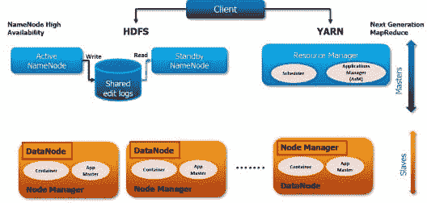

这篇文章详细解释了新特性，并澄清了许多关于 Hadoop 2.0 的普遍疑虑。如果你是 Hadoop 新手，回顾一下我们之前关于 [HDFS 和 MapReduce](https://www.edureka.co/blog/introduction-to-apache-hadoop-hdfs/) 和 [HDFS 架构](https://www.edureka.co/blog/apache-hadoop-hdfs-architecture/)的博文。本期[大数据课程](https://www.edureka.co/big-data-hadoop-training-certification)将向您详细介绍由顶级行业工作专家精心设计的 HDFS 实时项目体验。

以下是 Hadoop 2.0 相对于 [Hadoop 1.x](https://www.edureka.co/blog/apache-hadoop-hdfs-architecture/) 的四项主要改进:

*   **HDFS 联盟**–NameNode 的横向可扩展性
*   **NameNode 高可用性**–NameNode 不再是单点故障
*   **YARN**–能够使用 MPI、GIRAPH 等非 MapReduce 应用程序处理 HDFS 可用的数 TB 和数 Pb 的数据
*   **资源管理器**–将负担过重的 JobTracker 的两个主要功能(资源管理和作业调度/监控)分成两个独立的守护进程:全局资源管理器和每个应用程序的 ApplicationMaster

还有其他功能，如**容量调度器**(在 Hadoop **中启用多租户支持)；****数据快照、支持 Windows、NFS 访问**，使 Hadoop 在行业中的采用率增加，以解决大数据问题。

**HDFS 联邦**

尽管 Hadoop 集群可以扩展到数百个 DataNodes，但是 NameNode 会将其所有元数据保存在内存(RAM)中。这导致了对 Hadoop 集群可以存储的最大文件数的限制(通常为 50-100M 个文件)。随着数据大小和集群大小的增长，这将成为一个瓶颈，因为集群的大小受到 NameNode 内存的限制。

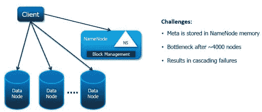

Hadoop 2.0 特性 [HDFS 联盟](http://hadoop.apache.org/docs/stable2/hadoop-project-dist/hadoop-hdfs/Federation.html)允许 Hadoop 分布式文件系统(HDFS)的水平扩展。这是亚马逊和易贝等企业级 Hadoop 用户追求的众多功能之一。HDFS 联盟支持多个名称节点和名称空间。

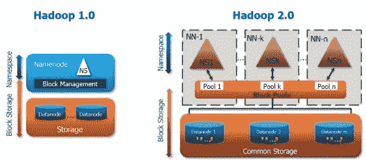

为了横向扩展名称服务，联邦使用多个独立的名称节点和名称空间。命名节点是联合的，也就是说，命名节点是独立的，不需要相互协调。数据节点被所有命名节点用作块的公共存储。每个 DataNode 向集群中的所有 NameNodes 注册。DataNodes 发送定期心跳和阻塞报告，并处理来自 NameNodes 的命令。

**NameNode 高可用性**

在 Hadoop 1.x 中，NameNode 是单点故障。NameNode 故障导致 Hadoop 集群不可访问。通常，这种情况很少发生，因为 NameNode 服务器使用了具有 RAS 特性的业务关键型[硬件](http://www8.hp.com/in/en/products/proliant-servers/product-detail.html?oid=5177953#!tab=features)。

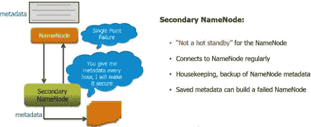

如果 NameNode 出现故障，Hadoop 管理员需要使用辅助 NameNode 手动恢复 NameNode。

Hadoop 2.0 架构支持多个 NameNodes 来消除这个瓶颈。Hadoop 2.0 的 NameNode 高可用性特性支持被动备用 NameNode。这些主动-被动命名节点配置为自动故障转移。

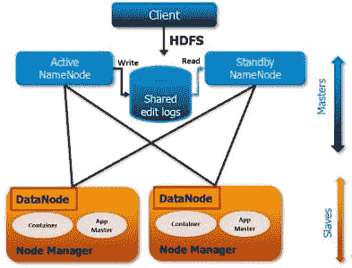

所有命名空间编辑都会记录到共享的 NFS 存储中，并且在任何时间点，该共享存储都只有一个写入方(具有隔离配置)。被动节点节点从该存储中读取数据，并为群集保存更新的元数据信息。如果主动 NameNode 出现故障，被动 NameNode 将成为主动 NameNode，并开始写入共享存储。防护机制确保在任何时间点对共享存储只有一次写入。

在 Hadoop 2 . 4 . 0 版中，还提供了对资源管理器的高可用性支持。

**YARN——又一个资源谈判者**

来自多个商店的大量数据存储在 HDFS，但您只能在上运行 MapReduce 框架作业来处理和分析这些数据(使用 Pig 和 Hive)。要使用其他框架应用程序(如 Graph 或 Streaming)进行处理，您需要将这些数据从 HDFS 转移到 Cassandra 或 HBase 中。

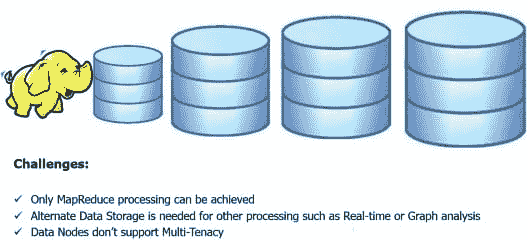

Hadoop 2.0 提供了 YARN API 来编写在 HDFS 上运行的其他框架。这使得在 Hadoop 上运行非 MapReduce 大数据应用成为可能。Spark、MPI、Giraph 和 HAMA 是在 YARN 中编写或移植的几个应用程序。

*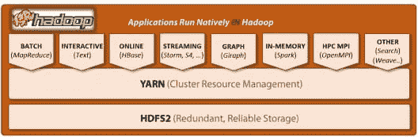 形象功劳:[【http://hortonworks.com/hadoop/yarn/】](http://hortonworks.com/hadoop/yarn/)*

YARN 提供了开发任何类型的通用分布式应用程序所需的守护程序和 API，处理和调度来自这些应用程序的资源请求(如内存和 CPU ),并监督它们的执行。

**纱线-资源经理**

在 Hadoop 中，JobTracker 是作业资源管理和作业调度/监控的主守护进程。在具有数千个 Map 和 Reduce 任务的大型 Hadoop 集群中，使用 DataNodes 上的 TaskTackers 运行任务，这会导致 CPU 和网络瓶颈。

它负责一个任务从调度到成功完成的整个生命周期—**调度和监控**。它还必须维护每个节点上的资源信息，例如 DataNodes 上可用的 map 和 reduce 插槽的数量—**资源管理**。

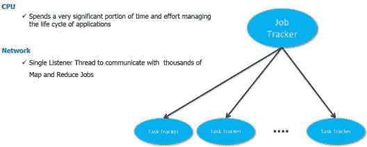

下一代 MapReduce 框架(MRv2)是一个在 YARN 中运行的应用程序框架。新的 MRv2 框架将 JobTracker 的两个主要功能(资源管理和作业调度/监控)划分为独立的组件。

新的 **ResourceManager** 管理计算资源到应用的全局分配，每个应用的 **ApplicationMaster** 管理应用的调度和协调。

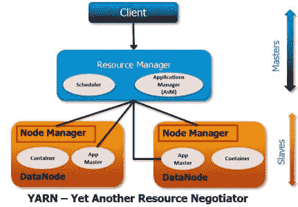

YARN 在 Hadoop 中提供了更好的资源管理，从而提高了集群效率和应用性能。该特性不仅改进了 MapReduce 数据处理，还支持 Hadoop 在其他数据处理应用中的使用。

YARN 的执行模型比早期 Hadoop 1.0 中的 MapReduce 实现更通用。YARN 可以运行不遵循 MapReduce 模型的应用程序，不像最初的 Apache Hadoop MapReduce(也称为 MRv1)。

理解 YARN 和 MRv2 是两个不同的概念，应该互换使用，这一点很重要。YARN 是一个资源管理框架，它提供基础设施和 API 来促进集群资源的请求、分配和调度。如前所述，MRv2 是一个运行在 YARN 中的应用程序框架。

**容量调度程序–多租户支持**

在 Hadoop 1.0 中，所有 DataNodes 都专用于 Map 和 Reduce 任务，不能用于其他处理。在 Hadoop 1.0 中，集群的容量是以 MapReduce 插槽来衡量的。集群中的每个节点都有一组预定义的插槽，调度程序确保这些插槽中有一定比例的插槽可供一组用户和组使用。因此，如果不运行 MapReduce 作业，就会浪费 DataNode 资源。

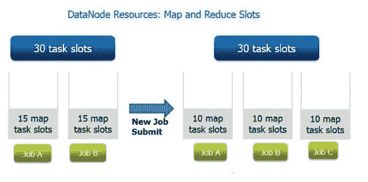

借助 Hadoop 2.0 中的容量调度器支持，DataNode 资源也可用于其他应用。容量调度程序(CS)确保用户组和应用程序将获得有保证的群集份额，同时最大限度地提高群集的整体利用率。通过弹性资源分配，如果群集有可用资源，那么用户和应用程序可以占用比保证的最小份额更多的群集资源。

在采用 YARN 和 MapReduce v2 的 Hadoop 2.0 中，集群容量是以整个集群中可用的物理资源(现在是 RAM，将来也是 CPU)来衡量的。

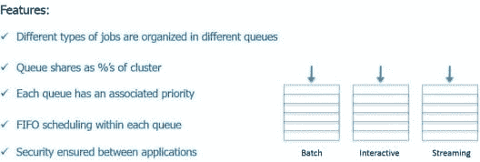

ResourceManager 支持分层的应用程序队列，这些队列可以保证一定百分比的集群资源。它不监视或跟踪应用程序的状态，而是作为一个纯粹的调度程序工作。

ResourceManager 根据应用程序的资源需求执行其调度功能。每个应用程序都有多个资源请求，如内存、CPU、磁盘、网络等。这是对 Hadoop MapReduce 中固定类型插槽的当前模型的重大改变，这会对集群利用率产生重大负面影响。

*你可以查看我们关于 **[HDFS 和 MapReduce](https://www.edureka.co/blog/introduction-to-apache-hadoop-hdfs/)** ， **[HDFS 架构](https://www.edureka.co/blog/apache-hadoop-hdfs-architecture/)，[学习 Hadoop 的 5 个理由](https://www.edureka.co/blog/5-reasons-to-learn-hadoop)** 还有**[Hadoop 培训有多重要](https://www.edureka.co/blog/how-essential-is-hadoop-training/)。***