# 举例介绍马尔可夫链 Python 中的马尔可夫链

> 原文：<https://www.edureka.co/blog/introduction-to-markov-chains/>

## **马尔可夫链简介:**

你有没有想过谷歌是如何对网页进行排名的？如果你做过研究，那么你一定知道它使用的是基于马尔可夫链思想的 PageRank 算法。这篇关于马氏链介绍的文章将帮助您理解马氏链背后的基本思想，以及如何将它们建模为现实世界问题的解决方案。

以下是本博客将涉及的主题列表:

1.  [什么是马尔可夫链？](#What%20Is%20A%20Markov%20Chain)
2.  [什么是马尔可夫性质？](#What%20Is%20The%20Markov%20Property)
3.  [用一个例子理解马尔可夫链](#Understanding%20Markov%20Chains%20With%20An%20Example)
4.  [什么是转移矩阵？](#What%20Is%20A%20Transition%20Matrix)
5.  [Python 中的马尔可夫链](#Markov%20Chain%20In%20Python)
6.  [马尔可夫链应用](#Markov%20Chain%20Applications)

*要获得关于使用 Python 进行数据科学和机器学习的深入知识，您可以注册参加 Edureka 提供的实时[数据科学认证培训](https://www.edureka.co/python)，该培训提供全天候支持和终身访问。*

## **什么是马尔可夫链？**

安德烈·马尔科夫在 1906 年首次引入了马尔科夫链。他将马尔可夫链解释为:

***包含随机变量的随机过程，根据一定的假设和确定的概率规则，从一种状态过渡到另一种状态。***

这些随机变量从一种状态转换到另一种状态，这是基于一种叫做**马尔可夫特性的重要数学特性。**

这给我们带来了一个问题:

## **什么是马尔可夫性质？**

*离散时间马尔可夫性质表明，随机过程转移到下一个可能状态的计算概率仅取决于当前状态和时间，而与之前的一系列状态无关。*

随机过程的下一个可能的动作/状态不依赖于先前状态的序列，这一事实使得马尔可夫链成为仅依赖于变量的当前状态/动作的无记忆过程。

让我们从数学上推导一下:

设随机过程为，{Xm，m=0,1,2,⋯}.

只有当这个过程是马尔可夫链时，

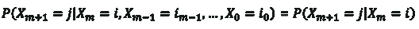

*马尔可夫链——马尔可夫链简介——edu reka*

对于所有的 m，j，I，i0，i1，⋯im-1

对于有限数量的状态，S={0，1，2，⋯，r}，这叫做有限马尔可夫链。

P(Xm+1 = j|Xm = i)这里表示从一个状态转移到另一个状态的转移概率。这里，我们假设转移概率与时间无关。

这意味着 P(Xm+1 = j|Xm = i)不依赖于‘m’的值。因此，我们可以总结如下:

*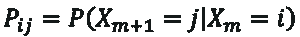*

*马尔可夫链公式——马尔可夫链介绍——edu reka*

所以这个方程代表马尔可夫链。

现在我们用一个例子来理解一下到底什么是马尔可夫链。

## **马尔可夫链示例**

在我给你一个例子之前，让我们定义一下什么是马尔可夫模型:

## **什么是马尔可夫模型？**

马尔可夫模型是一种随机模型，它以变量遵循马尔可夫特性的方式对随机变量进行建模。

现在让我们通过一个简单的例子来理解马尔可夫模型是如何工作的。

如前所述，马尔可夫链用于文本生成和自动完成应用程序。对于这个例子，我们将看一看一个示例(随机)句子，看看如何使用马尔可夫链对它建模。


*马尔可夫链示例——马尔可夫链简介——edu reka*

上面的句子是我们的例子，我知道它没有多大意义(它不必)，它是一个包含随机单词的句子，其中:

1.  **键**表示句子中的独特单词，即 5 个键(一、二、欢呼、快乐、edureka)

2.  **记号**表示总字数，即 8 个记号。

接下来，我们需要了解这些单词的出现频率，下图显示了每个单词以及表示该单词出现频率的数字。

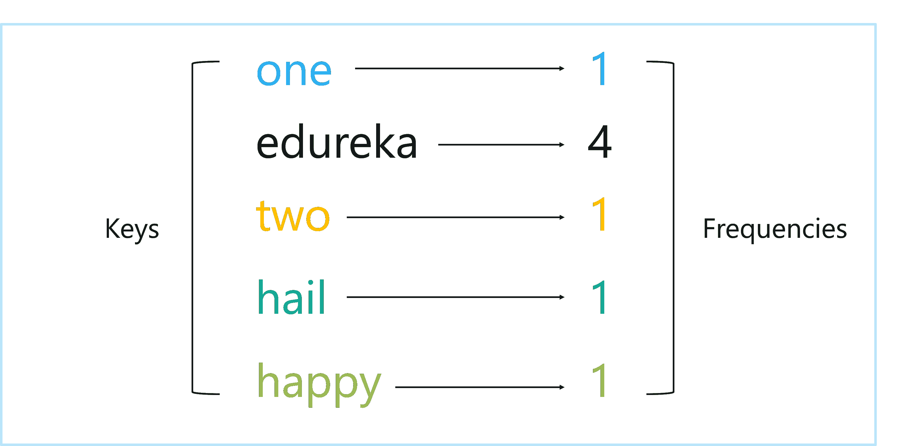

*键和频率——马尔可夫链介绍——edu reka*

左边一栏表示按键，右边一栏表示频率。

从上表中，我们可以得出结论，键“edureka”出现的次数是任何其他键的 4 倍。推断这样的信息是很重要的，因为它可以帮助我们预测在特定的时间点会出现什么单词。如果让我猜例句中的下一个单词，我会选“edureka ”,因为它出现的概率最高。

说到概率，你必须知道的另一个度量是 ***加权分布。***

在我们的例子中,“edureka”的加权分布是 50% (4/8 ),因为在总共 8 个标记中，它的频率是 4。其余的键(一、二、万岁、开心)都有 1/8 的几率出现( ≈ 13% )。

既然我们已经了解了加权分布，并且知道了特定的单词比其他单词出现的频率更高，我们可以继续下一部分了。


*了解马尔可夫链——马尔可夫链简介——edu reka*

在上图中，我添加了两个额外的单词来表示句子的开始和结束，在下面的部分你会明白我为什么这样做。

现在让我们也为这些键分配频率:

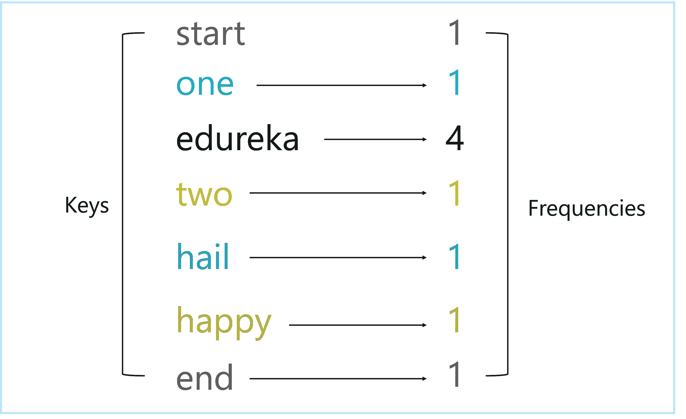

*更新的关键字和频率——马尔可夫链介绍——edu reka*

现在让我们创建一个马尔可夫模型。如前所述，马尔可夫模型用于模拟特定状态下的随机变量，使得这些变量的未来状态仅取决于它们的当前状态，而不是它们的过去状态。

所以基本上在一个马尔可夫模型中，为了预测下一个状态，我们必须只考虑当前状态。

在下面的图表中，你可以看到我们句子中的每个标记是如何指向另一个标记的。这表明未来状态(下一个令牌)是基于当前状态(当前令牌)的。所以这是马尔可夫模型中最基本的规则。

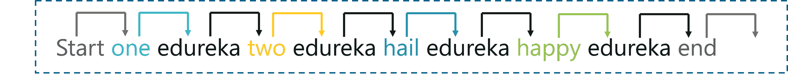

下图显示了成对的令牌，其中一对令牌中的每个令牌都指向同一对令牌中的另一个令牌。

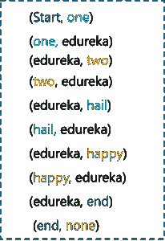

*马尔可夫链对——马尔可夫链介绍——edu reka*

在下面的图表中，我创建了一个结构性的表示，它显示了每个键和它可以配对的下一个可能的标记的数组。

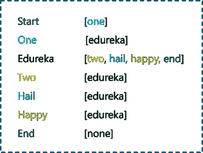

*马尔可夫链对阵列——马尔可夫链介绍——edu reka*

总结一下这个例子，考虑一个场景，在这个场景中，您必须使用我们在上面的例子中看到的键和标记的数组来组成一个句子。在我们运行这个例子之前，另一个要点是我们需要指定两个初始度量:

1.  初始概率分布(即时间=0 时的开始状态，(‘开始’键))

2.  从一个状态跳到另一个状态的转移概率(在这种情况下，从一个令牌转移到另一个令牌的概率)

我们已经在开始定义了加权分布，所以我们有了概率和初始状态，现在让我们继续例子。

*   所以开始时的初始令牌是[Start]

*   接下来，我们只有一个可能的令牌，即[一]

*   目前，这个句子只有一个词，即“一”

*   从这个记号开始，下一个可能的记号是[edureka]

*   句子更新为“一个 edureka”

*   从[edureka]我们可以移动到以下任何一个令牌[二，欢呼，快乐，结束]

*   有 25%的机会选择“二”,这可能导致形成原始句子(一个 edureka 两个 edureka 欢呼 edureka 快乐 edureka)。但是，如果选择了“end ”,则过程停止，我们将最终生成一个新句子，即“one edureka”。

给自己一个鼓励，因为你刚刚建立了一个马尔可夫模型，并通过它运行了一个测试用例。总结上面的例子，我们基本上是用现在的状态(现在的单词)来确定下一个状态(下一个单词)。这就是马尔可夫过程。

这是一个随机过程，其中随机变量从一种状态转换到另一种状态，使得变量的未来状态仅取决于当前状态。

让我们进入下一步，画出这个例子的马尔可夫模型。

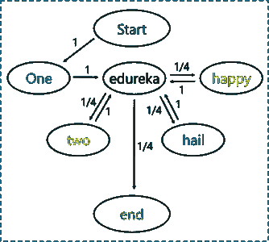

*状态转移图——马尔可夫链介绍——edu reka*

上图被称为状态转换图。我们将在下一节详细讨论这一点，现在只要记住这张图显示了从一个状态到另一个状态的转换和概率。

请注意，图中的每个椭圆形代表一个键，箭头指向可能跟在它后面的键。此外，箭头上的权重表示从/向相应状态转移的概率或加权分布。

这就是马尔可夫模型的工作原理。现在让我们试着理解马尔可夫过程中的一些重要术语。

## **什么是转移概率矩阵？**

在上一节中，我们通过一个简单的例子讨论了马尔可夫模型的工作，现在让我们来理解马尔可夫过程中的数学术语。

在马尔可夫过程中，我们用一个矩阵来表示从一个状态到另一个状态的转移概率。这个矩阵被称为转移矩阵或概率矩阵。通常用 p 表示。

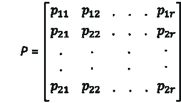

*转移矩阵——马尔可夫链介绍——edu reka*

注意:pij≥0，所有值' I '为:

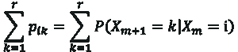

*转移矩阵公式——马尔可夫链介绍——edu reka*

我来解释一下。假设我们当前的状态是“我”，下一个或即将到来的状态必须是潜在状态之一。所以在取 k 的所有值求和的同时，一定要得到一个。

## **什么是状态转换图？**

马尔可夫模型由状态转移图表示。该图显示了马尔可夫链中不同状态之间的转换。我们用一个例子来理解转移矩阵和状态转移矩阵。

### **转移矩阵示例**

考虑具有三个状态 1、2 和 3 以及以下概率的马尔可夫链:

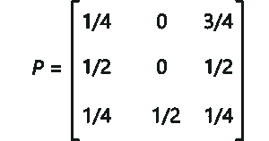

*转移矩阵示例——马尔可夫链介绍——edu reka*

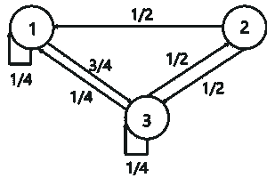

*状态转移图示例——马尔可夫链介绍——edu reka*

上图表示马尔可夫链的状态转移图。这里，1、2 和 3 是三种可能的状态，从一种状态指向另一种状态的箭头代表转移概率 pij。当 pij=0 时，意味着状态“I”和状态“j”之间没有转换。

现在我们已经了解了马尔可夫链背后的数学和逻辑，让我们运行一个简单的演示，并了解马尔可夫链可以用在哪里。

## **Python 中的马尔可夫链**

为了运行这个演示，我将使用 Python，所以如果你不知道 Python，你可以浏览以下博客:

1.  [Python 教程——学习 Python 编程的完整指南](https://www.edureka.co/blog/python-tutorial/)
2.  [如何从零开始学习 Python 3——初学者指南](https://www.edureka.co/blog/learn-python-3/)
3.  [Python 编程语言——从 Python 基础开始](https://www.edureka.co/blog/python-programming-language)
4.  [Python 函数初学者指南](https://www.edureka.co/blog/python-functions)

现在让我们开始编码吧！

## **马尔可夫链文本生成器**

**问题陈述:**应用马尔可夫性质，通过学习 Donald Trump 语音数据集，创建能够生成文本模拟的马尔可夫模型。

**数据集描述:**文本文件包含唐纳德·特朗普(Donald Trump)在 2016 年发表的演讲列表。

**逻辑:**应用马尔可夫属性，通过考虑演讲中使用的每个单词来生成唐纳德·特朗普的演讲，并为每个单词创建接下来使用的单词的字典。

**第一步:导入需要的包**

```
import numpy as np

```

**第二步:读取数据集**

```

trump = open('C://Users//NeelTemp//Desktop//demos//speeches.txt', encoding='utf8').read()
#display the data

print(trump)

SPEECH 1 ...Thank you so much. That's so nice. Isn't he a great guy. He doesn't get a fair press; he doesn't get it. It's just not fair. 
And I have to tell you I'm here, and very strongly here, because I have great respect for Steve King and have great respect likewise for Citizens 
United, David and everybody, and tremendous resect for the Tea Party. Also, also the people of Iowa. They have something in common. 
Hard-working people....

```

**第三步:将数据集分割成单个单词**

```
corpus = trump.split()

#Display the corpus
print(corpus)

'powerful,', 'but', 'not', 'powerful', 'like', 'us.', 'Iran', 'has', 'seeded', 'terror',...

```

接下来，创建一个函数来生成演讲中不同的词对。为了节省空间，我们将使用一个生成器对象。

**步骤 4:创建密钥和后续单词的配对**

```
def make_pairs(corpus):
for i in range(len(corpus) - 1):
yield (corpus[i], corpus[i + 1])
pairs = make_pairs(corpus)

```

接下来，让我们初始化一个空字典来存储单词对。

如果单词对中的第一个单词已经是字典中的一个关键字，只需将下一个潜在单词添加到该单词后面的单词列表中。但是如果这个单词不是一个键，那么在字典中创建一个新的条目，并把这个键赋给这个对中的第一个单词。

**第五步:追加词典**

```
word_dict = {}
for word_1, word_2 in pairs:
if word_1 in word_dict.keys():
word_dict[word_1].append(word_2)
else:
word_dict[word_1] = [word_2]

```

接下来，我们从语料库中随机选取一个单词，这将启动马尔可夫链。

**第六步:建立马尔可夫模型**

```

#randomly pick the first word
first_word = np.random.choice(corpus)

#Pick the first word as a capitalized word so that the picked word is not taken from in between a sentence
while first_word.islower():

#Start the chain from the picked word
chain = [first_word]

#Initialize the number of stimulated words
n_words = 20

```

在第一个单词之后，链中的每个单词都是从特朗普现场演讲中特定单词之后的单词列表中随机抽样的。这显示在下面的代码片段中:

```
for i in range(n_words):
chain.append(np.random.choice(word_dict[chain[-1]]))

```

**第七步:预测**

最后，我们来展示一下被刺激的文字。

```
#Join returns the chain as a string
print(' '.join(chain))

The number of incredible people. And Hillary Clinton, has our people, and such great job. And we won’t be beating Obama

```

所以这是我考虑特朗普的演讲得到的生成文本。这可能没有太多意义，但足以让您理解如何使用马尔可夫链来自动生成文本。

现在让我们看看马尔可夫链的更多应用，以及它们是如何被用来解决现实世界的问题的。

**马尔可夫链应用**

以下是马尔可夫链在现实世界中的应用列表:

1.  整个网络可以被认为是一个马尔可夫模型，其中每个网页都可以是一个状态，这些页面之间的链接或引用可以被认为是具有概率的转移。所以基本上，不管你从哪个网页开始冲浪，到达某个网页的机会，比如说，X 是一个固定的概率。

2.  **打字单词预测:**已知马尔可夫链用于预测即将到来的单词。它们也可以用于自动完成和建议。

3.  **子编辑模拟:**你肯定见过 reddit，并在他们的某个线程或子编辑上有过互动。Reddit 使用了一个 subreddit 模拟器，它消耗了大量的数据，这些数据包含了他们所在小组的所有评论和讨论。通过利用马尔可夫链，模拟器产生字到字的概率，以创建评论和主题。

4.  **文本生成器:**马尔可夫链最常用于生成虚拟文本或产生大型文章和编译演讲。它也用于你在网上看到的名称生成器。

既然您已经知道了如何使用马尔可夫链来解决现实世界中的问题，我相信您一定很想了解更多。这里有一个博客列表，可以帮助你开始了解其他统计学概念:

1.  [数据科学数学和统计学完全指南](https://www.edureka.co/blog/math-and-statistics-for-data-science/)
2.  [关于统计和概率你需要知道的一切](https://www.edureka.co/blog/statistics-and-probability/)
3.  [面向数据科学的 Python——如何实现 Python 库](https://www.edureka.co/blog/learn-python-for-data-science/)

至此，我们结束了对马尔可夫链博客的介绍。如果你对这个话题有任何疑问，请在下面留下评论，我们会尽快回复你。

敬请关注更多关于趋势技术的博客。

如果你正在寻找数据科学的在线结构化培训，edureka！有一个专门策划的 *[**Python 数据科学认证培训**](https://www.edureka.co/python)* 计划，帮助您获得统计学、数据争论、探索性数据分析、机器学习算法(如 K-Means 聚类、决策树、随机森林、朴素贝叶斯)方面的专业知识。您将学习时间序列的概念、文本挖掘以及深度学习的介绍。本课程的新批次即将开始！！