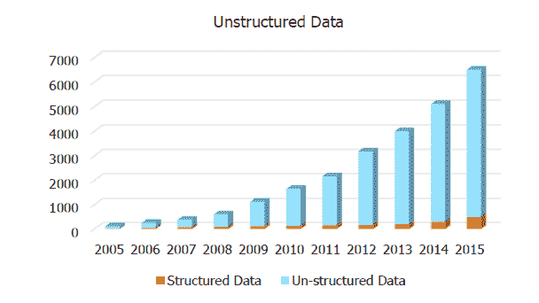
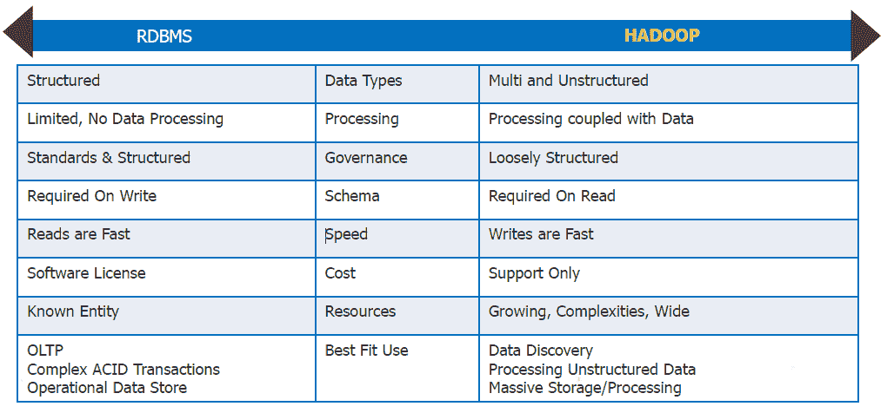
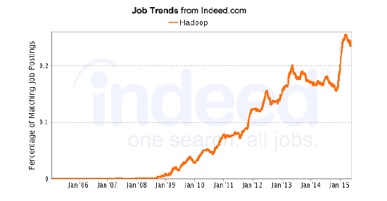

# 这是我学习 Hadoop 的合适时机吗？

> 原文：<https://www.edureka.co/blog/is-this-the-right-time-for-me-to-learn-hadoop>

绝对的！将 Hadoop 技能添加到您的简历中，这是前所未有的好时机。让我们用一些事实和例子来证明这一点。

你有没有想过脸书的自动标记功能背后的技术是什么？即使在光线较暗的情况下也能生成完美图像的监控摄像机怎么样？答案是 Hadoop 及其存储、处理和检索数据的突破性能力。

存储数据是一回事，但处理和查询数据是完全不同的另一回事。如果大数据是一支橄榄球队，那么 Hadoop 就是你能找到的最好的四分卫！

多亏了 Hadoop，脸书能够存储一个人的所有信息，并在他/她的个人资料上指出活动的确切时间和日期。关于一个人的所有信息都是大数据，Hadoop 有助于呈现所有这些信息。

所有 Hadoop 数据都存储在 HDFS (Hadoop 分布式文件系统)之上，该系统可以存储结构化和非结构化数据。Hadoop 的竞争对手(如 RDBMS 和 Excel)只能存储结构化数据。这是 Hadoop 成为传统数据处理工具的霸主的主要原因。Hadoop 在数据附近进行处理，而 RDBMS 需要通过 I/O 在网络上传输数据来处理相同的数据。

**思考的食粮:**Hadoop 能基于数据集预测情况的结果吗？

此图显示了这些年来数据的指数级增长。仔细观察一下，你会发现非结构化数据占全球所有数据的 90%。简单地应用需求和供应的原则，我们可以认识到，越来越多的非结构化数据只会产生能够修复这些数据的专业人员。这足以成为一个人寻找处理非结构化数据(也称为大数据)的工作的理由。毫无疑问，这是学习 Hadoop 的最佳时机。

**现实中，Hadoop 相对于 RDBMS 的效率如何？【T2**

Hadoop 直接击败了任何其他数据处理工具。RDBMS 和 Excel 在管理不超过几百个 Excel 表的数据方面可能是高效的，但是对于需要维护的一千个这样的文件呢？让我们再次回到脸书的例子。包含脸书用户活动细节的数据日志不能存储在 Excel 中，至少不能存储用户几十年来的所有历史数据。此外，在 Hadoop 中，数据可以是松散的结构，但 RDBMS 要求数据更加一致，并且采用可识别的格式。

看一看 RDBMS 和 Hadoop 之间的比较，你就会知道哪一个更好。

我有最后一个统计数据，它将消除人们对 Hadoop 是否是一个好的职业选择的所有疑虑。

这张图表说明了对 Hadoop 专业人员的需求在不断增长，并且在接下来的几周内只会继续增长。

可惜你我都改变不了技术。充其量，我们可以跟上它的步伐，学习不断发展的技术，成为我们工作场所不可或缺的一部分。学习 Hadoop，驾驭大数据浪潮，正是时候。

有问题要问我们吗？请在评论区提到它，我们会给你回复。

**相关帖子:**

[大数据和 Hadoop 入门](https://www.edureka.co/big-data-and-hadoop "Get started with Big Data and Hadoop")

[2016 年你应该准备的 50 大 Hadoop 面试题](https://www.edureka.co/blog/interview-questions/top-50-hadoop-interview-questions-2016/ "top 50 hadoop interview questions you should prepare for in 2016")

[学 Hadoop 需要 Java 吗？](https://www.edureka.co/blog/do-you-need-java-to-learn-hadoop "do you need java to learn hadoop")