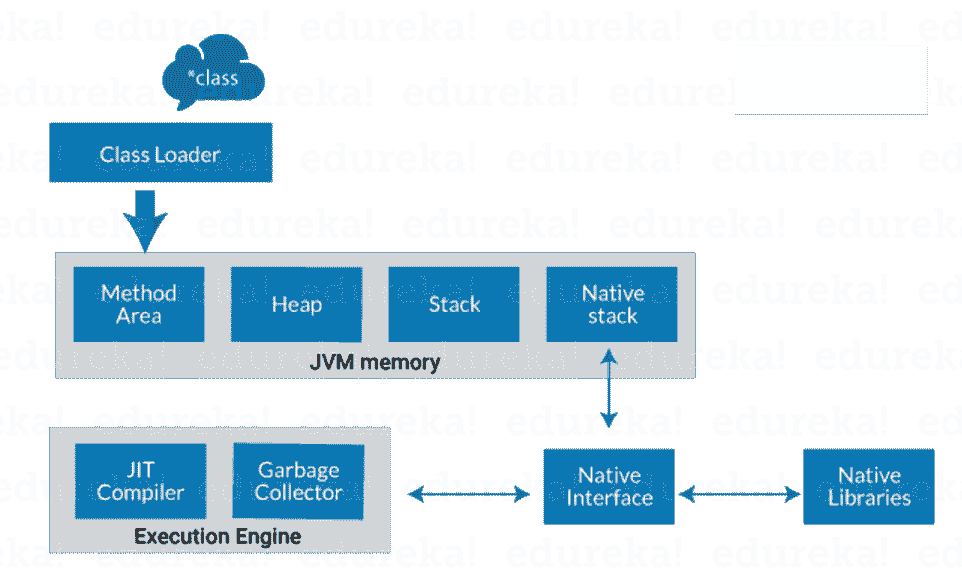

# Java 架构的组成部分是什么？

> 原文：<https://www.edureka.co/blog/java-architecture/>

Java 架构结合了编译和解释的过程。它解释了在制定一个 Java 程序时所涉及的各种过程。在我开始这个话题之前，让我先给你介绍一下这篇文章的议程。

下面提到的指针将是我们讨论的主题:

*   [什么是 Java 架构？](#whatisjavaarchitecture)
*   [Java 的组件](#componentsofjava)
*   [Java 平台如何独立？](#platformindependent)
*   [Java 中的 JIT](#jitinjava)

让我们从理解什么是 Java 架构开始。

## **什么是 Java 架构？**

在这里，我将用简单的步骤向你解释 java 架构。

*   在 Java 中，有一个编译和解释的过程。
*   用 [Java](https://www.edureka.co/blog/java-tutorial/) 编写的代码，由 Java 编译器转换成字节码。
*   字节码然后被 JVM 转换成机器码。
*   机器代码由机器直接执行。

这个图展示了 Java 代码的内部工作，或者准确地说，是 Java 架构！

现在，让我们更深入地研究一下 java 架构，谈谈 Java 的各种[组件。](https://www.edureka.co/blog/what-is-java/#ComponentsinJava)

## **Java 架构的组件**

Java 语言主要有三个组成部分: ***JVM、JRE、JDK*** 。

Java 虚拟机、Java 运行时环境和 Java 开发工具包。

让我逐一阐述它们:

### **Java 虚拟机:**

听说过 WORA 吗？(一次编写，随处运行)。嗯，Java 应用程序被称为 WORA，因为它们能够在任何平台上运行代码。这样做只是因为 JVM。JVM 是一个 Java 平台组件，它提供了执行 Java 程序的环境。JVM 将字节码解释成机器码，机器码在运行 Java 程序的机器上执行。

因此，简而言之，JVM 执行以下功能:

*   加载代码
*   验证代码
*   执行代码
*   提供运行时环境

现在，让我向您展示 JVM 架构。开始了。

****

**说明:**

**类加载器**:类加载器是 JVM 的一个子系统。它用于加载类文件。每当我们运行 java 程序时，类装入器首先装入它。

**类方法区**:是 JVM 中的数据区之一，将存储类数据。静态变量、静态块、静态方法、实例方法都存储在这个区域。

**Heap**:JVM 启动时创建一个堆。当应用程序运行时，它的大小可能会增加或减少。

**栈** : JVM 栈被称为线程栈。它是 JVM 内存中为单个执行线程创建的数据区域。线程的 JVM 堆栈被该线程用来存储各种元素，即:用于调用方法和返回的局部变量、部分结果和数据。

本地堆栈:它包含了应用程序中使用的所有本地方法。

**执行引擎:**

*   JIT 编译器
*   垃圾收集工

**JIT 编译器:**[实时(JIT)编译器](https://www.edureka.co/blog/just-in-time-compiler/)是运行时环境的一部分。通过在运行时将字节码编译成机器码，它有助于提高 Java 应用程序的性能。默认情况下，JIT 编译器是启用的。当编译一个方法时，JVM 直接调用该方法的编译代码。JIT 编译器将该方法的字节码编译成机器码，编译成“实时”运行。

**垃圾收集器:**顾名思义，[垃圾收集器](https://www.edureka.co/blog/garbage-collection-in-java/)的意思是收集不用的材料。在 JVM 中，这项工作是通过垃圾收集来完成的。它跟踪 JVM 堆空间中所有可用的对象，并删除不需要的对象。垃圾收集器的工作分为两个简单的步骤，即标记和清扫:

*   标记——垃圾收集器在这里识别哪些内存在使用，哪些没有使用
*   sweep–删除在“标记”阶段识别的对象。

### **Java 运行时环境:**

JRE 软件构建了一个可以执行 Java 程序的运行时环境。JRE 是磁盘上的系统，它获取 Java 代码，将其与所需的库结合起来，并启动 JVM 来执行它。JRE 包含 Java 程序运行所需的库和软件。JRE 是 JDK 的一部分(我们将在后面研究)，但是可以单独下载。

### **Java 开发套件:**

Java 开发工具包(JDK)是一个用于开发 Java 应用程序和小应用程序的软件开发环境。它包含 JRE 和几个开发工具，一个解释器/加载器(java)，一个编译器(javac)，一个归档器(jar)，一个文档生成器(javadoc)以及另一个工具。

****

图表中显示的蓝色区域是 JDK。现在，让我向大家详细介绍一下开发工具。

java :它是所有 java 应用程序的启动器。**javac**:Java 编程语言的编译器。 **javadoc** :是 API 文档生成器。 **jar** :创建并管理所有的 jar 文件。

继续介绍 Java 架构，让我们了解 Java 平台是如何独立的？

## **Java 平台如何独立？**

什么时候任何编程语言被称为平台无关的？嗯，当且仅当它可以在所有可用的操作系统上运行时，就其开发和编译而言。现在， [Java](https://docs.oracle.com/javase/tutorial/) 是独立于平台的，仅仅是因为字节码。让我告诉你什么是字节码？简单来说，字节码是机器可以理解的 JVM 代码。Java 中的字节码执行证明了它是一种平台无关的语言。在这里，我将向您展示 java 字节码执行过程中涉及的步骤。

下面是对相关步骤的解释:

***sample.java→javac(样本。class) → JVM(sample.obj) →最终输出***

java 编译器使用第一个源代码，并在。类文件。类文件代码是字节码形式的，JVM 使用该类文件转换成目标文件。之后，您可以在屏幕上看到最终的输出。

继续阅读 Java 架构文章，让我们理解 Java 中的 [JIT 的概念。](https://www.edureka.co/blog/just-in-time-compiler/)

## **Java 中的 JIT**

准时制编译器通常称为 JIT，主要负责在运行时优化基于 java 的应用程序的性能。应用程序的性能依赖于编译器。这是一个简单的图表，向您展示了正在进行的内部流程。

JIT 编译器将方法的字节码编译成机器码，编译成“正好及时”运行。当编译一个方法时，JVM 直接调用该方法的编译代码。让我们深入研究:字节码必须根据所提供的指令集被解释或编译成正确的机器指令。此外，如果指令架构是基于字节码的，则可以直接执行这些指令。解释字节码会影响执行速度。为了提高性能，JIT 编译器在运行时与 Java 虚拟机(JVM)进行交互，将合适的字节码序列编译成本机代码(如图)。当使用 JIT 编译器时，硬件能够执行本机代码，相比之下，让 JVM 重复解释相同的字节码序列会导致翻译过程的开销。

至此，我已经接近这篇关于 Java 架构的文章的结尾。我希望上面讨论的主题能够增加您的 Java 知识。敬请关注更多文章！

现在您已经了解了 Java 的基础知识，请查看 Edureka 的 [Java 在线课程](https://www.edureka.co/java-j2ee-training-course)，edu reka 是一家值得信赖的在线学习公司，在全球拥有超过 250，000 名满意的学习者。Edureka 的 Java J2EE 和 SOA 培训和认证课程是为想成为 Java 开发人员的学生和专业人士设计的。该课程旨在让你在 Java 编程方面有一个良好的开端，并训练你掌握核心和高级 Java 概念以及各种 Java 框架，如 Hibernate & Spring。

有问题吗？请在“Java 架构及其组件”博客的评论部分提到它，我们会尽快回复您。