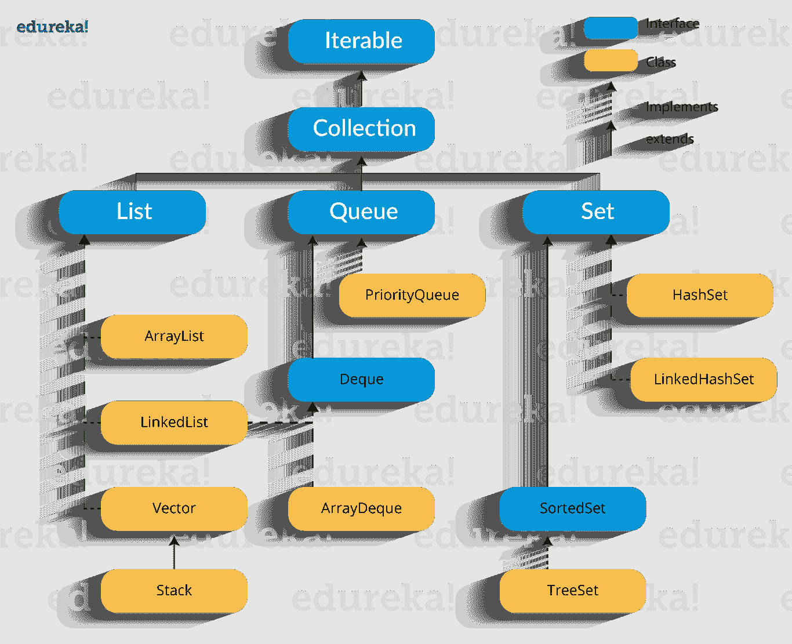
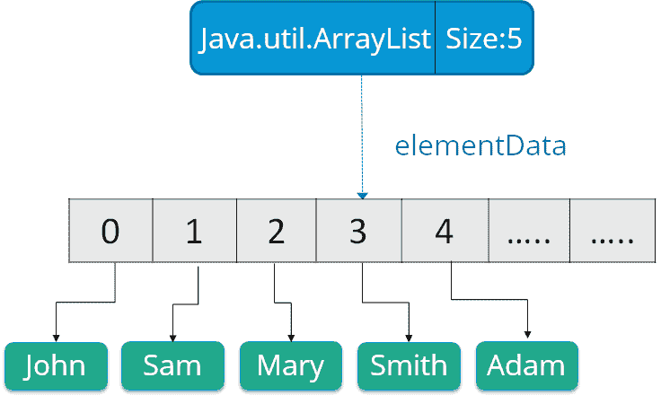
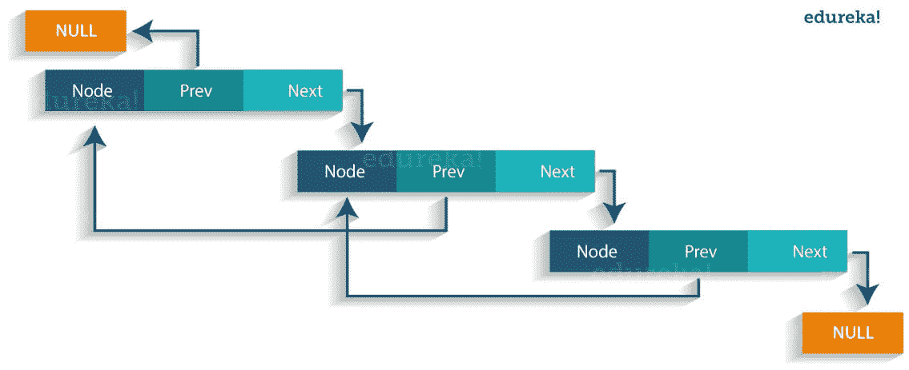
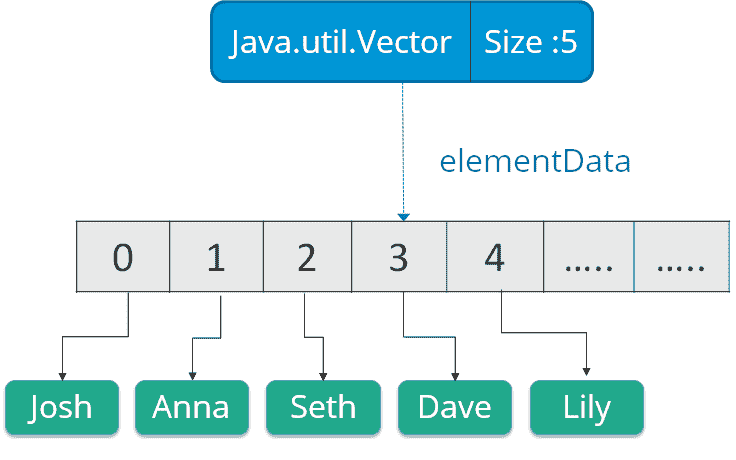
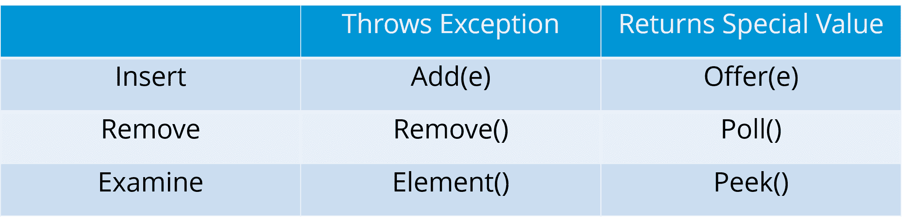

# Java 集合——接口、列表、队列、Java 集合及示例

> 原文：<https://www.edureka.co/blog/java-collections/>

什么是 **Java 集合？** Java 集合是指被表示为单个单元的单个对象的集合。您可以执行所有操作，如 搜索、排序、插入、操作、删除等。，就像处理数据一样。

现在，让我们继续这个 Java 集合博客，我们将按以下顺序理解它的每个方面:

1.  [什么是 Java 集合框架？](#framework)
2.  [为什么要用 Java 集合？](#whyuse)
3.  [Java 集合框架层次](#hierarchy)
4.  [界面](#interface)
5.  [列表](#list)
6.  [队列](#queue)
7.  [集](#sets)

让我们从 Java 收藏博客的第一个话题开始。

**什么是 Java 集合框架？T3**

Java 集合框架提供了存储和操作一组对象的架构。一个 Java 集合框架包括以下:

*   接口
*   类
*   算法

我们来详细了解一下:

**接口** : 接口在 Java 中是指抽象的数据类型。它们允许 Java 集合的操作独立于它们表示的细节。而且，它们在面向对象编程语言中形成了一个层次。

**类:**Java 中的类是集合接口的实现。它基本上指的是反复使用的数据结构。

**算法:**算法是对实现集合接口的对象进行搜索、排序、等操作的方法。算法本质上是多态的，因为同一个方法可以采用多种形式，或者可以说执行 Java 集合接口的不同实现。

那么，你认为我们为什么需要 Java 集合呢？Java 集合框架为开发人员提供了访问预先打包的数据结构以及操作数据的算法。接下来，让我们转到 Java 集合框架层次结构，看看这些接口和类位于何处。

获得行业级项目认证&快速跟踪你的职业 [<button>看看吧！</button>](https://www.edureka.co/java-j2ee-soa-training)

## **为什么要用 Java 集合？**

使用 Java 集合有几个好处，例如:

*   通过提供有用的数据结构和算法来减少编写代码所需的工作量
*   Java 集合提供了高性能和高质量的数据结构和算法，从而提高了速度和质量
*   不相关的 API 可以来回传递集合接口
*   减少学习、使用和设计新 API 所需的额外工作
*   支持标准数据结构和算法的可重用性

**Java 集合| Java 中的集合框架| Java 初学者教程| edu reka**

[https://www.youtube.com/embed/Ma7u6KEKzPE](https://www.youtube.com/embed/Ma7u6KEKzPE)

## **Java 集合框架层次**

如我们所知，Java 集合框架包括接口和类。现在，让我们看看 Java 集合框架的层次结构。



在上图中，蓝色部分是指不同的接口，黄色部分定义了类。现在，让我们详细了解这些组件。

## **Java 集合:** **界面**

**迭代器接口**:迭代器是一个迭代元素的接口。它用于遍历列表并修改元素。迭代器接口有以下三种方法:

1.  **public boolean has next()**–如果迭代器有更多元素，该方法返回 true。
2.  **public object next()**–返回元素并将光标指针移动到下一个元素。
3.  **public void remove()**–该方法删除迭代器返回的最后一个元素。

有三个组件扩展了采集接口，即列表、队列和集合。下面我们来详细了解一下:

## **Java 收藏:列表**

列表是可能包含重复的元素的有序集合。它是一个扩展集合接口的接口。列表进一步分为以下几类:

1.  阵列列表
2.  链接列表
3.  矢量

让我们来详细介绍一下他们每一个人:

**数组列表:** Arraylist 是 List 接口的实现，可以动态地在列表中添加或删除元素。此外，如果添加的元素超过初始大小，列表的大小会动态增加。

**语法** :

ArrayList object = new ArrayList()；数组列表中的一些方法如下:

| 方法 | 描述 |
|  boolean add(Collection c) |  Appends the specified element to the end of a list. |
| void add(int index，Object element) | 在指定位置插入指定元素。 |
| void clear() | 从列表中删除所有元素。 |
| int lastIndexOf(Object o) | 返回指定元素在列表中最后一次出现的索引，如果列表中不包含该元素，则返回-1。 |
|  Object clone() |  Return a shallow copy of an ArrayList. |
| 对象 [ ] toArray() | 返回包含列表中所有元素的数组。 |
| void trimToSize() | 将这个 ArrayList 实例的容量修剪为列表的当前大小。 |

让我们用一个编程的例子来理解数组列表:

```
import java.util.*;
 class ArrayListExample{
 public static void main(String args[]){

 ArrayList al=new ArrayList();  // creating array list
 al.add("Jack");                // adding elements    
 al.add("Tyler");
 Iterator itr=al.iterator();
 while(itr.hasNext()){
 System.out.println(itr.next());
 }
 }
 }
```

在上面的代码中，它将返回我们使用 add()方法添加的名称，即:

```
 Jack 
 Tyler
```

**链表** :链表是包含项目的一系列链接。每个链接都包含到另一个链接的连接。

*语法* : Linkedlist 对象= new linked list()；

Java 链表类使用两种类型的链表来存储元素:

*   单链表
*   双链表

**单链表**:在单链表中，这个链表中的每个节点都存储了该节点的数据以及指向链表中下一个节点的指针或引用。参考下图，更好地理解单链表。

 **双向链表**:在双向链表中，有两个引用，一个指向下一个节点，另一个指向上一个节点。你可以参考下图来更好的理解双向链表。

  链表中的一些方法列举如下:

| **法** | **描述** |
| 布尔加法(对象 o) | 用于将指定的元素附加到向量的末尾。 |
| 布尔包含(对象 o) | 如果此列表包含指定的元素，则返回 true。 |
| void add (int index，Object element) | 在向量中的指定元素处插入元素。 |
| void addFirst(对象 o) | 用于在开头插入给定的元素。 |
| void addLast(对象 o) | 用于将给定元素附加到末尾。 |
| int size() | 用于返回列表中元素的个数 |
| 布尔删除(对象 o) | 从列表中删除指定元素的第一个匹配项。 |
| int indexOf(对象元素) | 返回指定元素在列表中第一次出现的索引，或-1。 |
| int lastIndexOf(对象元素) | 返回指定元素在列表中最后一次出现的索引，或-1。 |

让我们用一个编程的例子来理解链表:

```
import java.util.*; 
public class LinkedlistExample{ 
    public static void main(String args[]){
        LinkedList<String> al=new LinkedList<String>();// creating linked list 
        al.add("Rachit"); // adding elements 
        al.add("Rahul"); 
        al.add("Rajat"); 
        Iterator<String> itr = al.iterator();
        while(itr.hasNext()){ 
            System.out.println(itr.next());
        }
    }
}
```

上述程序的输出将是:

```
Rachit
Rahul
Rajat
```

**Vectors**:vector 类似于数组，vector 对象的元素可以通过对 vector 的索引来访问。Vector 实现了一个动态数组。此外，矢量不限于特定的大小，它可以根据需要自动缩小或增大。它类似于 ArrayList，但是有两个区别:

*   矢量被同步。
*   Vector 包含许多不属于集合框架的遗留方法。

 **语法** :

矢量对象 =新矢量 ( 大小，增量)；

下面是 V ector 类 : 的一些方法

| **法** | **描述** |
| 布尔加法(对象 o) | 将指定的元素追加到列表的末尾。 |
| void clear() | 从列表中删除所有元素。 |
| void add ( int index，Object element) | 在指定位置插入指定元素。 |
| 布尔删除 ( 对象 o) | 从列表中删除指定元素的第一个匹配项。 |
| 布尔包含 ( 对象元素) | 如果此列表包含指定的元素，则返回 true。 |
| int indexOfObject(对象元素) | 返回列表中指定元素的第一个匹配项的索引，或-1。 |
| int size ( ) | 返回列表中元素的个数。 |
| int lastIndexOf(Object o) | 返回指定元素在列表中最后一次出现的索引，如果列表中不包含任何元素，则返回-1。 |

现在，让我们转到 Java 集合接口的下一个子类型，即队列。

## **Java 集合:队列**

Java 中的队列遵循 FIFO 方法，即它以先进先出的方式对元素进行排序。在一个队列中，第一个元素首先被删除，最后一个元素被删除。每个基本方法都有两种形式:一种是在操作失败时抛出异常，另一种是返回一个特殊值。



同样，优先级队列实现队列接口。**优先级队列**的元素根据它们的自然排序进行排序，或者由队列构建时提供的比较器进行排序。这个队列的头是指定顺序中最小的元素。

下面是 Java 队列接口的一些方法:

| 方法 | 描述 |
| 布尔加法(对象) | 将指定的元素插入到队列中，如果成功则返回 true。 |
| 布尔报价(对象) | 将指定元素插入该队列。 |
| 对象移除() | 检索并删除队列的头部。 |
| 对象投票() | 检索并删除队列头，如果队列为空，则返回 null。 |
| 对象元素() | 检索，但不删除队列头。 |
| 对象窥视() | 检索，但不删除该队列的头，如果队列为空，则返回 null。 |

让我们用一个编程示例来理解这些优先级队列:

```
import java.util.*; 
class QueueExample { 
    public static void main(String args[]){ 
        PriorityQueue<String> queue=new PriorityQueue<String>(); 
        // creating priority queue 
        queue.add("Amit"); 
        // adding elements 
        queue.add("Rachit");
        queue.add("Rahul"); 
        System.out.println("head:"+queue.element()); 
        System.out.println("head:"+queue.peek()); 
        System.out.println("iterating the queue elements:"); 
        Iterator itr=queue.iterator(); 
        while(itr.hasNext()){ 
            System.out.println(itr.next()); 
        } 
        queue.remove(); 
        queue.poll(); 
        System.out.println("after removing two elements:"); 
        Iterator<String> itr2=queue.iterator(); 
        while(itr2.hasNext()){
            System.out.println(itr2.next());
        }
    }
}

```

在上面的代码中，输出将是:

```
head:Amit
head:Amit
iterating the queue elements:
Amit
Rachit
Rahul
after removing two elements:
Rahul
```

接下来，让我们进入“Java 集合”博客的下一个主题，即集合。

## **Java 集合:集合**

集合是指不能包含重复元素的集合。它主要用于数学集合抽象的建模。Set 在各种类中有其实现，如 HashSet、TreeSetand 和 LinkedHashSet。


让我们来详细介绍一下每一项:

**HashSet** : Java HashSet 类创建一个集合，使用哈希表进行存储。 Hashset 只包含唯一元素，它继承 AbstractSet 类并实现 Set 接口。此外，它使用一种机制*散列*来存储元素。 下面是 Java HashSet 类的一些方法:

| 方法 | 描述 |
| 布尔加法(对象 o) | 如果指定的元素不存在，将它添加到集合中。 |
| 布尔包含(对象 o) | 如果集合包含指定的元素，则返回 true。 |
| void clear() | 从集合中删除所有元素。 |
| 布尔型 isEmpty() | 如果集合不包含任何元素，则返回 true。 |
| 布尔删除(对象 o) | 从集合中删除指定的元素。 |
| 对象克隆() | 返回 HashSet 实例的浅层副本:元素本身没有被克隆。 |
| 迭代器迭代器() | 返回集合中元素的迭代器。 |
| int size() | 返回集合中元素的个数。 |

让我们用一个编程示例来理解这些 Hashset:

```
import java.util.*;
class HashsetExample{
 public static void main(String args[]){

 HashSet&amp;amp;amp;lt;String&amp;amp;amp;gt; al=new HashSet(); // creating hashSet
 al.add("Rachit");                 // adding elements
 al.add("Amit");
 al.add("jack");
 Iterator&amp;amp;amp;lt;String&amp;amp;amp;gt; itr=al.iterator();
 while(itr.hasNext()){
 System.out.println(itr.next());
 }
 }
 }

```

上述代码的输出将是:

```
Amit
Rachit
jack

```

**Linked Hashset**:Java Linked Hashset 类是散列表和链表实现的集合接口。它只包含像 HashSet 这样的独特元素。Linked HashSet 还提供所有可选的集合操作，并维护插入顺序。让我们用一个编程示例来理解这些链接的 Hashset:

```
 import java.util.*;
 class LinkedHashsetExample{
 public static void main(String args[]){
 LinkedHashSet&amp;amp;amp;lt;String&amp;amp;amp;gt; al=new LinkedHashSet(); // creating linkedhashset
 al.add("Mariana");                            // adding elements 
 al.add("Rick");
 al.add("Sam");
 Iterator&amp;amp;amp;lt;String&amp;amp;amp;gt; itr=al.iterator();
 while(itr.hasNext()){
 System.out.println(itr.next());
 }
 }
 }
 } 
```

上述代码的输出将是:

```
Mariana
Rick
Sam
```

**TreeSet**:TreeSet 类实现了使用树进行存储的 Set 接口。该类的对象以升序存储。此外，它还继承了 AbstractSet 类并实现了 NavigableSet 接口。它只包含像 HashSet 这样的独特元素。在 T reeSet 类中，访问和检索时间更快。 下面是 Java TreeSet 类的一些方法:

| 方法 | 描述 |
| 布尔 addAll ( 集合 c) | 将指定集合中的所有元素添加到该集合中。 |
| 布尔包含 ( 对象 o) | 如果集合包含指定的元素，则返回 true。 |
| 布尔型 isEmpty( ) | 如果该集合不包含任何元素，则返回 true。 |
| 布尔删除(对象 o) | 从集合中删除指定的元素。 |
| void 添加 ( 对象 o) | 将指定的元素添加到集合中。 |
| 作废清除 ( ) | 从集合中删除所有元素。 |
| 对象克隆 ( ) | 返回该树集实例的浅层副本。 |
| 对象第一 ( ) | 返回当前排序集合中的第一个元素。 |
| 对象最后一个 ( ) | 返回当前排序集合中的最后一个元素。 |
| int size ( ) | 返回集合中元素的个数。 |

让我们用一个编程示例来理解这些树集:

```
import java.util.*;
class TreeSetExample{
public static void main(String args[]){
TreeSet&amp;amp;amp;lt;String&amp;amp;amp;gt; al=new TreeSet&amp;amp;amp;lt;String&amp;amp;amp;gt;();  // creating treeSet
al.add("John");                            // adding elements
al.add("Sam");
al.add("Rick");
Iterator&amp;amp;amp;lt;String&amp;amp;amp;gt; itr=al.iterator();
while(itr.hasNext()){
System.out.println(itr.next());
}
}
}
```

上述程序的输出将是:

```
John
Rick
Sam
```

现在你一定想知道所有这些集合之间有什么不同？

HashSet 以随机顺序存储元素，而 LinkedHashSet 根据插入顺序存储元素，TreeHashSet 根据自然顺序存储元素。

“Java 收藏”博客到此结束。我希望你们清楚 Java 集合框架，它的层次结构、接口、列表、队列和集合，我已经在上面讨论过了。请务必阅读我的下一篇博客关于 **[Java 面试问题](https://www.edureka.co/blog/interview-questions/java-interview-questions/)** ，我在这里列出了 75 个面试问题和答案，它们将帮助你在面试过程中脱颖而出。

## 

*既然您已经了解了 Java 系列，请查看 Edureka 的 [**Java 培训**](https://www.edureka.co/java-j2ee-training-course)* *，edu reka 是一家值得信赖的在线学习公司，拥有遍布全球的 250，000 多名满意的学习者。Edureka 的 Java J2EE 和 SOA 培训和认证课程是为想成为 Java 开发人员的学生和专业人士设计的。该课程旨在为您提供 Java 编程的良好开端，并训练您掌握核心和高级 Java 概念以及各种 Java 框架，如 Hibernate & Spring。*

有问题要问我们吗？请在这个“Java 收藏”博客的评论部分提到它，我们会尽快回复你，或者你也可以参加我们在迪拜的 [Java 培训。](https://www.edureka.co/java-j2ee-training-course-dubai)