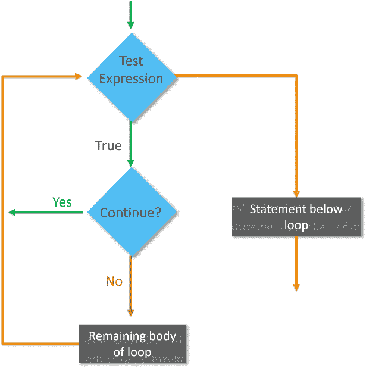

# Java 中的 Continue 语句是什么？

> 原文：<https://www.edureka.co/blog/java-continue-statement/>

控制语句是 Java 编程语言的基础，它基本上允许程序的流畅运行。为了跳到循环的下一次迭代，我们使用 java continue 语句。该语句继续程序的当前流程，并在指定条件下跳过一部分代码。

*   [Java 中的 continue 语句是什么？](#whatiscontinue)
*   [语法](#syntax)
*   [Java continue 语句流程图](#flowdiagram)
*   [Continue Statement Examples](#examples)

让我们开始吧。

## **Java 中的 continue 语句是什么？**

Java continue 语句只允许在[循环体](https://www.edureka.co/blog/loops-in-java/)内部使用。当 continue 执行时，循环体的当前迭代终止，并继续执行循环的下一次迭代。简单地说，它继续程序的流程，并在特定的条件下跳过剩余的代码。让我们借助一个实时例子来理解 Java 中的 continue 语句。

**例** **(来电并报警):**


现在让我们看看演示 Java Continue 语句的语法。

## **Java Continue 的语法:**

```
if(conditition)
{
continue;
}
```

语法只是“continue”关键字后跟一个分号。

接下来，让我们看看这个 continue 语句在 Java 中是如何工作的。

## **Java Continue 语句流程图**

 在此流程图中，代码将按照以下步骤响应:

1.  首先，它将进入检查条件的循环。如果循环条件为假，则直接退出循环。
2.  之后，它将检查“继续”语句。如果存在，那么之后的语句将不会在循环的同一次迭代中执行。
3.  如果' continue '语句不存在，那么将执行其后的所有语句。

## **继续语句示例**

用于循环 *( [while](https://www.edureka.co/blog/java-while-loop/) ， [for](https://www.edureka.co/blog/java-for-loop) ， [do-while](https://www.edureka.co/blog/java-do-while-loop/) )* 以及开关情况。让我们一个接一个地执行它们。

### **继续语句–If 循环**

```

public class ContinueExample{
public static void main(String args[]){
for (int i=0; i<=5; i++)
{
if (i==2)
{
continue; //skips the rest of the statement
}

System.out.print(i+" ");
}
}
}

```

**输出:** 0 1 3 4 5

**说明**:以上输出显示除 2 以外的所有数字。当遇到[控制语句](https://www.edureka.co/blog/java-tutorial/#control)时，跳转到下一次迭代，跳过当前迭代的语句。每当使用“continue”构造时，它只是跳过代码的其余部分。

### **继续语句示例–For 循环**

[***对于***](https://www.edureka.co/blog/java-for-loop) 循环是在需要多次迭代 [程序](https://www.edureka.co/blog/java-programs/) 的一部分时使用的。它特别适用于迭代次数固定的情况！下面我们用一个示例代码来理解一下:

```
public class ContinueExample{
public static void main(String[] args) {
for(int i=0;i<=5;i++){
if(i==2){
continue;
}
System.out.println(i);
}
}
} 
```

**输出:01345**

**说明:**以上输出显示除 2 以外的所有数字。

### **Continue 语句示例- While 循环**

[Java while 循环](https://www.edureka.co/blog/java-while-loop/)用于反复迭代程序的一部分。如果迭代次数不固定，那么可以使用 while 循环。现在让我们来理解带有 While 循环的 continue 语句示例。参考以下代码:

```
public class ContinueExample{
public static void main(String args[]){
int i=10;
while (i >=0)
{
if (i==5)
{
i--;
continue;
}
System.out.print(i+" ");
i--;
}
}
}
```

**输出** : 10 9 8 7 6 4 3 2 1 0

### **Continue 语句示例–Do While 循环**

Do-while 循环类似于  while 循环，但有一点不同:在 while 循环中，条件在循环体执行之前计算，而在 [do-while 循环中](https://www.edureka.co/blog/java-do-while-loop/)条件在循环体执行之后计算。参考下面的代码:

```
public class ContinueExample{
public static void main(String args[]){
int i=1;
do
{
if (i==5)
{
i++;
continue;
}
System.out.print(i+ " ");
i++;
}while(i<10);

}
}
```

**输出** : 1 2 3 4 6 7 8 9

至此，我们结束了这篇 Java 文章中 Continue 语句。必须有效地使用 java 中的控制语句，以使程序有效且用户友好。

*Edureka 的  [**Java 认证培训**](https://www.edureka.co/java-j2ee-training-course) 由专业人士根据行业要求和需求策划。该培训涵盖了核心 Java & J2EE 以及 Hibernate、Spring、& SOA 等流行框架的基础和高级概念的全面知识。在本课程中，您将获得 Java 数组、Java OOPs、Java 函数、Java 循环、Java 集合、Java 线程、Java Servlet 和使用行业用例的 Web 服务等概念的专业知识。*

有问题吗？请在“Java 中的 continue 语句”文章的评论部分提到它，我们将会回复您。