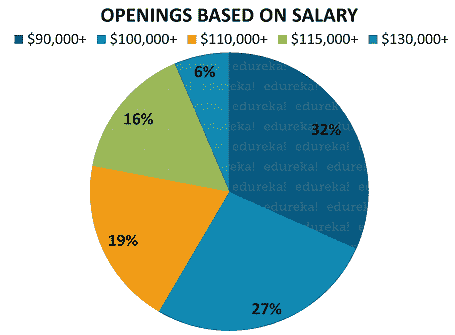
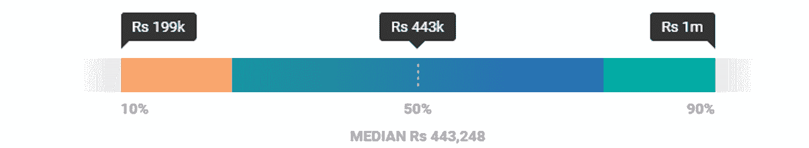

# Java 开发人员平均工资是多少？

> 原文：<https://www.edureka.co/blog/java-developer-salary/>

Java 是最受欢迎的编程语言之一，并且凭借其平台独立性成功保持了它的魅力。根据 [TIOBE Index](https://www.tiobe.com/tiobe-index/) 的数据，从 2000 年代初到 2019 年，Java 一直统治着编程领域。嗯，这很清楚的说明了 Java 的普及程度和在工业界的使用情况。在本文中，我们将讨论 Java 开发人员的工资，并了解为什么 Java 已经成为最流行的编程语言之一。事实上，一名 Java 开发人员的平均年薪是 443，248 卢比(IND) 或 73，743 美元(US) 。

本文将涉及以下主题:

1.  [谁是 Java 开发者？](#JavaDeveloper)
    *   [成为 Java 开发者的技能](#SkillstobecomeJavaDeveloper)
2.  [Java 开发者就业趋势](#JobTrends)
3.  [Java 开发人员的职业道路](#CareerPaths)
4.  [基于薪资](#OpeningsBasedonSalary)的空缺
5.  [Java 开发人员工资:](#Salary)

在我们深入研究 Java 开发人员工资趋势的细节之前，让我们先简单了解一下谁是 Java 开发人员，以及成为一名 Java 开发人员所需的技能。

## **谁是 Java 开发人员？**

Java 开发人员是指创建复杂的基于网络的应用程序，并与软件开发人员合作将 Java 集成到商业应用程序中的人。这些开发人员参与业务产品的完整 SDLC，以识别和分析产品中的问题。他们还必须提出问题的解决方案，分析并记录用户需求。

## **成为 Java 开发人员的技能**

成为 Java 开发者的技巧如下:

1.  [爪哇/J2EE](https://www.edureka.co/blog/java-tutorial/)
2.  [春天](https://www.edureka.co/blog/what-is-spring-framework/)
3.  [冬眠](https://www.edureka.co/blog/what-is-hibernate-in-java/)
4.  [JavaScript](https://www.edureka.co/blog/what-is-javascript/)
5.  [JDBC](https://www.edureka.co/blog/connect-mysql-database-in-java)
6.  [Eclipse Java IDE](https://www.edureka.co/blog/setup-eclipse-ide/)

现在你知道了谁是 Java 开发人员，让我们来看看 Java 开发人员的工作趋势。

## **Java 开发人员工作趋势**

根据 Indeed.com 的数据，美国大约有 30997 个工作岗位，印度有 32250 个工作岗位。

### **印度:**

| **城市** | **工作数量** |
| 本加卢鲁 | Nine thousand nine hundred and thirty-three |
| 海得拉巴 | Three thousand three hundred and seventy |
| 浦那 | Three thousand one hundred and eight |
| 金奈 | Two thousand seven hundred and seventeen |
| 孟买 | 1904 年 |

### **美国:**

| **城市** | **工作数量** |
| 西雅图 | Two thousand one hundred and sixty-seven |
| 纽约 | One thousand three hundred and fifty-nine |
| 芝加哥 | Eight hundred and thirty-four |
| 旧金山 | Eight hundred and eleven |
| 华盛顿 | 690 |

Java 职业机会只会一飞冲天！随着世界每天都在转向构建新的 web 应用程序，无论是初创公司还是像埃森哲、亚马逊、谷歌等这样的老牌公司。向 Java 开发人员提供丰厚的薪水。

看着上面的工作趋势，几乎我们所有人都可以在这个领域开始职业生涯。因此，在这篇关于 Java 开发人员工资的文章中，我将讨论 Java 开发人员的职业道路。

## Java 开发人员的职业道路

一旦我们开始在某个特定领域做出一番事业，我们脑子里总会有这个问题！

**Java 开发者是个好职业吗？接下来呢？职业道路是怎样的？**

嗯，我想说 Java 开发人员不必太担心，因为他们前面有一条美妙的职业道路，有许多选择。

Java 开发人员有如下选择:

1.  软件开发商
2.  高级软件工程师
3.  Java 软件开发商
4.  团队领导

以上角色在市场上都有很高的人气，待遇优厚，从**$ 87641**到**$ 100073**不等。因此，在这篇关于 Java 开发人员薪水的文章中，让我们看看基于薪水的职位空缺数量:

## **基于薪资的职位空缺**

纵观 Java 的受欢迎程度，毫无疑问，Java 开发人员是市场上最受欢迎的工作角色之一。根据甲骨文公司的调查，[福布斯](https://www.forbes.com/sites/oracle/2018/01/25/become-a-software-hero-top-10-priorities-for-growth-oriented-developers-in-2018/#7d362a64926f)称 Java 是云开发者的首选，有 210 亿台虚拟机运行在与云相关的代码中。所以，根据[Indeed.com 的职位空缺](https://www.indeed.com/q-Java-Developer-jobs.html)基于薪资如下:

根据上面的图表，很明显 Java 开发人员是开始构建你职业生涯的一个很好的职业。 既然你已经知道了基于薪资的职位空缺数量，那么让我们深入了解一下一个 Java 开发人员的薪资预估。

## **一个 Java 开发人员的工资**

Java 开发人员的年薪从**443，248 卢比(印度)**到**73，743 美元(美国)**不等，但是，它可能会因一些因素而有所不同。在我深入研究这些因素之前，请参考下面 Java 开发人员平均工资的图表:

**印度**

****

来源:[薪级表](https://www.payscale.com/research/IN/Job=Java_Developer/Salary)

**美国**

来源:[薪级表](https://www.payscale.com/research/US/Job=Java_Developer/Salary)

接下来，在这篇关于 Java 开发人员薪水的文章中，让我们根据经验来看看一个 Java 开发人员的薪水。

### **基于经验的 Java 开发人员工资**

下面的表格描述了基于印度和美国经验的 java 开发人员的工资。

#### **印度**

| **职业等级** | **年经验** | **补偿** |
| 入门级 | < 1 年 | 254，493 卢比(根据 461 份工资计算) |
| 职业生涯早期 | 1-4 年 | 406，088 卢比(基于 2，620 份薪水) |
| 职业生涯中期 | 5-9 岁 | 827，338 卢比(根据 715 份工资计算) |
| 经历过的 | 10-19 岁 | 1，342，021 卢比(基于 148 份薪水) |

来源:[薪级表](https://www.payscale.com/research/IN/Job=Java_Developer/Salary)

#### **美国**

| **职业等级** | **年经验** | **补偿** |
| 入门级 | < 1 年 | :59，177 美元(基于 304 份薪水) |
| 职业生涯早期 | 1-4 年 | :69，519 美元(根据 1，458 人的工资计算) |
| 职业生涯中期 | 5-9 岁 | :82，994 美元(基于 911 工资) |
| 经历过的 | 10-19 岁 | :97，110 美元(基于 400 份薪水) |

来源:[薪级表](https://www.payscale.com/research/US/Job=Java_Developer/Salary)

嗯，我相信一个众所周知的事实是，不同国家的人做同样的工作却得到不同的报酬。让我们来看看一个 Java 开发人员的工资会因地域不同而有所不同。

### **基于地理位置的 Java 开发人员的工资**

我列出了以下主要城市的 Java 开发人员工资:

#### **印度**

| **城市** | **工资** |
| 本加卢鲁 | ₹780609/年 |
| 海得拉巴 | ₹527762/年 |
| 浦那 | ₹435987 人/年 |
| 金奈 | ₹280449 英镑/年 |
| 孟买 | ₹671414 英镑/年 |

来源:[Indeed.co.in](https://www.indeed.co.in/salaries/Java-Developer-Salaries)

**美国**

| **城市** | **工资** |
| 西雅图 | 每年 117，973 美元 |
| 纽约 | 每年 124，278 美元 |
| 芝加哥 | 每年 104，860 美元 |
| 旧金山 | $58.45 每小时 |
| 华盛顿 | 每年 105，767 美元 |

来源:[Indeed.com](https://www.indeed.com/salaries/Java-Developer-Salaries)

看着上面的数字，你可能有兴趣知道招聘 Java 开发人员的公司。因此，在这篇关于 Java 开发人员薪水的文章中，让我们来看看那些为 Java 开发人员提供薪水的公司。

### **基于公司的 Java 开发人员工资**

下表描述了几家公司提供的薪资:

#### **印度**

| **公司名称** | **平均工资** |
| 认知技术解决方案公司 | ₹66.6 万/年 |
| 认知 | ₹55.7 万/年 |
| 凯捷 | ₹55.5 万英镑/年 |
| Infosys 有限公司 | ₹48.8 万/年 |
| TCS | ₹44.8 万/年 |

来源:[薪级表](https://www.payscale.com/research/IN/Job=Java_Developer/Salary)

#### **美国**

| **公司名称** | **平均工资** |
| 摩根大通·蔡斯&公司 | $ 90，000/年 |
| TCS | $ 73，000/年 |
| Infosys 有限公司 | $ 73，000/年 |
| 认知 | $ 69，000/年 |
| 认知技术解决方案公司 | ₹6.4 万英镑/年 |

来源:[薪级表](https://www.payscale.com/research/US/Job=Java_Developer/Salary)

如果你正在寻找一份有趣的职业，现在是提升技能和利用 Java 职业机会的好时机。

查看 Edureka 提供的 [Java 培训](https://www.edureka.co/java-j2ee-training-course) ，edu reka 是一家值得信赖的在线学习公司，在全球拥有超过 250，000 名满意的学习者。我们在这里帮助你的旅程中的每一步，为了成为一个除了这个 java 面试问题，我们提出了一个课程，这是为学生和专业人士谁想要成为一个 Java 开发人员设计的。

有问题要问我们吗？请在这篇“Java 开发人员薪水”文章的评论部分提到它，我们会尽快回复您。