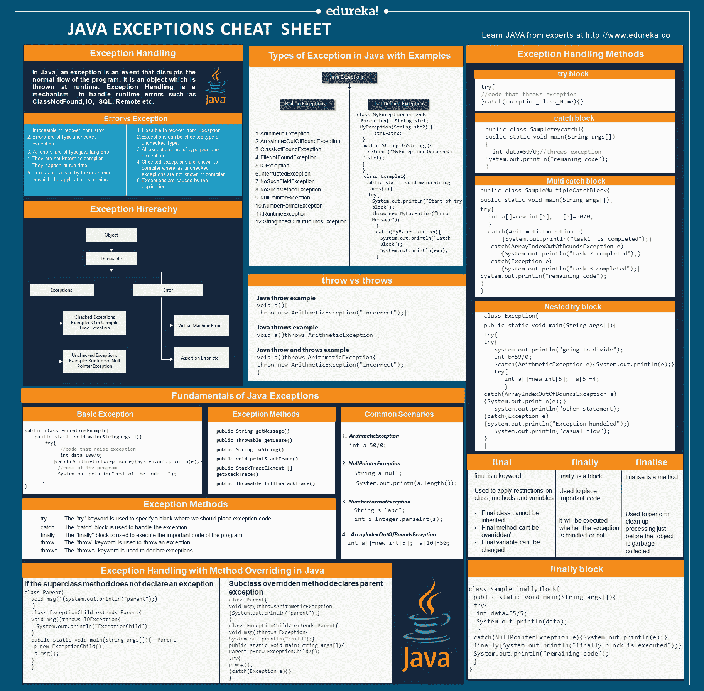

# Java 异常备忘单——提升您的 Java 知识

> 原文：<https://www.edureka.co/blog/cheatsheets/java-exceptions-cheat-sheet/>

错误随时可能发生，但重要的是，我们如何处理和纠正它们，以维持正常的流程。 **[Java，](https://www.edureka.co/blog/java-tutorial/)** 作为最突出的 **[面向对象语言，](https://www.edureka.co/blog/object-oriented-programming/)** 提供了一个强大的机制，允许你处理这些错误/异常。如果您有一个备忘单作为处理所有异常的快速参考，这不是很好吗？因此，我为您带来了 Java 异常备忘单，作为异常处理的解决方案指南。

## Java 异常备忘单

Java 中的 ***异常处理*** 是处理运行时错误的最强大的*机制之一，用于维护应用的正常流程。当方法中出现异常情况时，Java 会创建一个异常对象并抛出它。创建的异常对象包含关于错误的信息，如错误类型、程序状态等。*


[](https://bit.ly/2SlwcOQ)

## Java 异常的基础

## 什么是例外？

在 **[Java，](https://www.edureka.co/blog/what-is-java/)** 异常是指扰乱程序正常流程的事件。它是一个在运行时抛出的对象。

异常类型:

*   **检查异常:** 它是在编译时发生的异常，也叫编译时异常。

*   **未检查的异常** : 它是在执行时发生的异常。这些也称为**运行时异常**。

## 异常处理的基本示例

```
public class JavaExceptionExample{
  public static void main(String args[]){
    try{
         int data=100/0;
       }catch(ArithmeticException e){System.out.println(e);}
        System.out.println("rest of the code...");
     }
}
```

## 异常方法

```
public String getMessage()

// Returns a detailed message about the exception

public String toString()

// Returns the name of the concatenated class with the result of getMessage() 
public void printStackTrace()

// Prints the result of toString() along with the stack trace

public stackTraceElement [] getStackTrace()

// Returns an array containing each element on the Stack Trace

public Throwable fillInStackTrace()

// Fills the stack trace by adding previous information present in the stack. 
```

## Java 中异常的类型

有两种例外:

**内置异常**

内置 Java 异常是在 Java 库中可用的异常。 这些例外适用于解释某些错误情况。

**用户自定义异常**

有时，Java 中的内置异常不能够描述某种情况。在这种情况下，用户也可以创建被称为“用户定义的例外”的例外。

**注意要点:**

1。用户定义的异常必须扩展异常类。 2。使用 throw 关键字引发异常。

```
// User Defined Exception
class MyException extends Exception{  
 String str1;
 MyException(String str2) { str1=str2;}
  public String toString(){
   return ("MyException Occurred: "+str1);
 }
}
class Example1{
public static void main(String args[]){ 
 try{
      System.out.println("Start of try block");
      throw new MyException(“Error Message");
    }
    catch(MyException exp){System.out.println("Catch Block");  System.out.println(exp);
 }
}
```

## 异常处理方法

## 尝试阻止

Java try 块用于封装可能抛出异常的代码。

```
**try**{  
//code that may throw exception
}**catch**(Exception_class_Name ref){}
```

## 捕捉块

Java catch 块用于处理异常。它只能在 try 块之后使用。

```
public class Testtrycatch1{  
  public static void main(String args[]){  
    int data=50/0;//may throw exception  
    System.out.println("rest of the code..."); 
  }
}
```

## 嵌套 try 块

try 块中的 try 块在 java 中被称为嵌套 try 块。

```
class Exception{
  public static void main(String args[]){ 
    try{
      try{
          System.out.println("going to divide"); 
          int b=59/0;
         }catch(ArithmeticException e){System.out.println(e);}
      try{
          int a[]=new int[5];
          a[5]=4;
         }
        catch(ArrayIndexOutOfBoundsException e) {System.out.println(e);}  System.out.println("other statement);
        }catch(Exception e)
         {System.out.println("Exception handeled");} 
       System.out.println("casual flow");
    }
}
```

## 多重捕捉块

如果你必须在各种异常发生时执行各种任务，你可以使用 java multi-catch 块。

```
public class SampleMultipleCatchBlock{ 
 public static void main(String args[]){ 
   try{
       int a[]=new int[5];  
       a[5]=30/0;
      }
      catch(ArithmeticException e)
        {System.out.println("task1  is completed");}
      catch(ArrayIndexOutOfBoundsException e)
        {System.out.println("task 2 completed");} 
      catch(Exception e)
        {System.out.println("task 3 completed");}  
      System.out.println("remaining code");
  }
}
```

| **扔** 扔 | **摔投** |
| 用于显式抛出异常 | 用于声明一个异常 |
| 被检查的异常不能使用 throw only 来传播 | 已检查的异常可以传播 |
| 后接实例 | 后面跟着一个班 |
| 在一个方法内使用 | 与方法签名一起使用 |
| 不能抛出多个异常 | 可以声明多个异常 |

```
**//Java** **throw example**
void a()
{
  throw new ArithmeticException("Incorrect");
}

**//Java** **throws example**
void a()throws ArithmeticException
{
 //method code
}

**//Java** **throw and throws** **example**
void a()throws ArithmeticException
{
  throw new ArithmeticException("Incorrect");
}
```

## 最终阻止

**最终块** 是用于*执行重要代码*的块，如关闭连接、流等。无论异常是否被处理，It 总是被执行。

```
class SampleFinallyBlock{
 public static void main(String args[]){ 
   try{
     int data=55/5;        
     System.out.println(data);
    }
    catch(NullPointerException e)
       {System.out.println(e);}  
    finally {System.out.println("finally block is executed");}  
    System.out.println("remaining code");
  }
}
```

| **决赛** | **最后** | **定型** |
| 是关键词 | 它是一个块 | 它是一种方法 |
| 用于对类、方法&变量施加限制。 | 用于放置重要代码 | 用于在对象被垃圾收集之前执行清理处理 |
| 最终类不能被继承，方法不能被覆盖&变量值不能被改变 | 无论异常是否被处理，都会被执行。 | – |

**最后举例说明哪里发生异常并处理**

```
class SampleFinallyBlock{
  public static void main(String args[]){ 
    try{
        int data=25/0;        
        System.out.println(data);
       }
       catch(NullPointerException e)
         {System.out.println(e);}  
       finally {System.out.println("finally block is executed");}  
         System.out.println("remaining code");
  }
}
```

## Java 中方法覆盖的异常处理

## 如果超类方法没有声明异常

如果**超类**方法没有声明异常，子类覆盖的方法不能声明检查的异常，但是可以声明未检查的异常。

```
import java.io.*; 

class Parent{
void msg()
 {System.out.println("parent");}
}
class ExceptionChild extends Parent{ 
 void msg()throws IOException{
 System.out.println("ExceptionChild");
}
public static void main(String args[]){ 
   Parent p=new ExceptionChild(); 
   p.msg();
 }
}
```

## 如果超类方法声明了异常

如果**超类**方法声明异常，子类覆盖的方法可以声明相同、子类异常或无异常，但不能声明父异常。

```
import java.io.*;  

class Parent{
void msg()throwsArithmeticException
{System.out.println("parent");}
}
class ExceptionChild2 extends Parent{
 void msg()throws Exception {System.out.println("child");} 
 public static void main(String args[]){
 Parent p=new ExceptionChild2(); 
 try{
     p.msg();
    }catch(Exception e){}
}
```

[下载 Java 异常备忘单](https://bit.ly/2SlwcOQ)

至此， **Java 异常备忘单**告一段落。查看 [**Java 培训**](https://www.edureka.co/java-j2ee-soa-training) 由 **Edureka，**一家值得信赖的在线学习公司，拥有遍布全球的 250，000 多名满意的学习者。Edureka 的 ***[综合 Java 课程认证培训](https://www.edureka.co/java-course-self-paced)*** 是为想成为 Java 开发者的学生和专业人士设计的。本课程旨在让您对 Java 编程有一个初步的了解，包括接口、异常处理和 JDBC 项目。