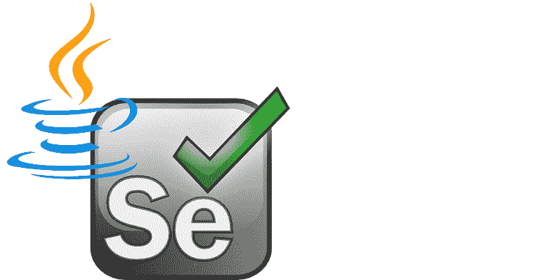
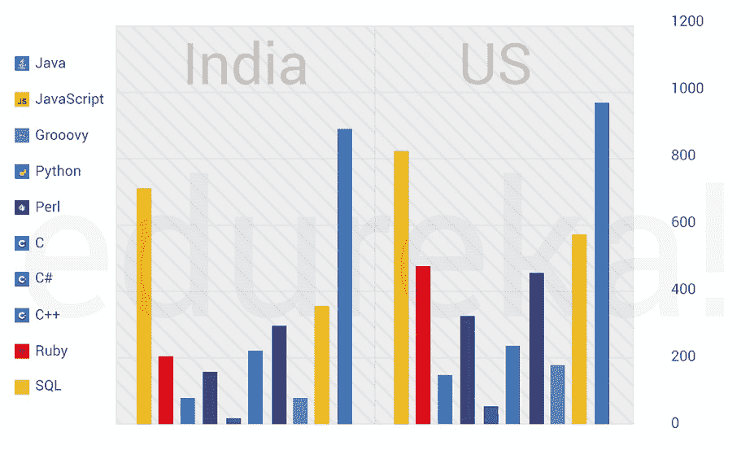

# 为什么用 Java 开发 Selenium？如何实现 Java 进行测试

> 原文：<https://www.edureka.co/blog/java-for-selenium/>

Selenium 是自动化测试领域最突出的工具，而另一方面， [Java](https://www.edureka.co/java-j2ee-training-course) 是当今市场上使用最广泛的编程语言。这两种技术一起构成了自动化测试的完美组合。通过这篇文章，我将让您全面了解为什么应该为 Selenium 使用 Java。通过[硒训练](https://www.edureka.co/selenium-certification-training)了解更多。

以下是我将在本文中涉及的话题:

*   [硒简介](#introduction)
*   [硒的优点](#advantages)
*   [为什么用 Java 换硒](#whyjavaforselenium)
*   [为了硒学什么 Java？【T2](#whattolearninjava)
*   [演示实现 Java for Selenium](#demo)

## **硒简介**

Selenium 是最流行的开源工具，被广泛用于 web 浏览器上的自动化测试。换句话说，你可以只使用 [Selenium](https://www.edureka.co/blog/selenium-tutorial) 来测试 web 应用程序。使用 Selenium 既不能测试任何桌面(软件)应用程序，也不能测试任何移动应用程序。为了克服这一点，市场上推出了许多其他软件测试和移动应用测试工具，如 IBM 的 RFT、惠普的 QPT、 [Appium](https://www.edureka.co/blog/what-is-appium/) 等等。但是，Selenium 仍然统治着自动化测试的世界。但由此产生的问题是，为什么？

首先，正如我已经提到的，Selenium 是开源的，因此不涉及许可成本。这看起来不多，但实际上这是相对于其他测试工具的一个主要优势。现在，让我们在这篇 Java for Selenium 文章的下一节中了解其余的优势。

## **使用硒的优势**

几个优点是:

*   测试可以在任何操作系统中进行，如 Windows、Mac 或[Linux](https://www.edureka.co/blog/linux-tutorial/)
*   可以使用多种浏览器进行测试，如 Internet Explorer、Google Chrome、Mozilla Firefox、Safari 或 Opera
*   可以与 [TestNG](https://www.edureka.co/blog/selenium-webdriver-tutorial) & [JUnit](https://www.edureka.co/blog/junit-tutorial/) 等各种工具集成，进行测试用例管理和报告生成
*   对于连续测试，可以集成 [Maven](https://www.edureka.co/blog/maven-in-java/) 、[Jenkins](https://www.edureka.co/blog/videos/what-is-jenkins/)&[Docker](https://www.edureka.co/blog/videos/what-is-docker/)实现连续测试
*   各种各样的编程语言被用来编写测试用例，如 [Java](https://www.edureka.co/blog/java-tutorial/) 、 [Python](https://www.edureka.co/blog/python-tutorial/) 、C#、 [PHP](https://www.edureka.co/blog/php-tutorial-for-beginners/) 、 [Ruby](https://www.edureka.co/blog/ruby-on-rails-tutorial/) 、Perl & .Net，但在所有这些语言中，Java 的使用最为普遍。

但是为什么是 Java 呢？在这篇 Java for Selenium 文章的下一节中，我将向您介绍 Java 成为自动化领域最流行的语言的原因。

## 【Selenium 为什么要用 Java？

Java 是世界上最流行的 Selenium 编程语言。下图显示了在印度和美国，Java 相对于其他编程语言的[使用情况。](https://www.edureka.co/blog/what-is-java/)

下面我列出了为 Selenium 使用 Java 的各种原因:

*   由于 Java 是 IT 行业广泛使用的语言，因此有一个庞大的社区支持它，还有大量的参考资料。
*   近 77%的 Selenium 测试人员正在使用 Java，这使得知识共享变得非常简单快捷。
*   由于 Java 的存在，有大量现成的框架、插件、支持 Java 进行自动化测试的 API 和库。
*   Java 利用了 JVM T2，这使它成为一种独立于平台的语言。换句话说，您可以在任何安装了 JVM 的操作环境中使用它。
*   由于 Java 是静态类型的，所以 Java IDEs 提供了很多关于你在编码时可能遇到的错误的反馈。

我希望这能给你足够的理由来理解使用 Java 做 Selenium 背后的流行。

现在问题来了，在 Java 中应该了解多少才能和 Selenium 一起使用。在本文的下一部分，我将为您绘制一个抽象的路线图，帮助您开始。

## **为了 Selenium 学什么 Java？**

为了在 Selenium 中使用 Java，您需要对 Java 基础有一个简单的了解，从:开始

一旦你理解了所有这些概念，你就可以尝试编码部分了。在本文的下一部分，我将向您展示一个简单的代码来为 Selenium 实现 Java。

## **为 Selenium 实现 Java 的演示**

在你开始编码之前，首先你需要确保你有一个合适的环境设置。如果你不知道，你可以参考[硒安装](https://www.edureka.co/blog/selenium-installation/)文章逐步指导。

既然您已经准备好了环境和依赖项，现在让我们开始项目吧。在这里，我使用一个简单的项目，我将使用 GeckoDriver。根据我的测试用例，一旦我执行了我的程序， [GeckoDriver](https://www.edureka.co/blog/selenium-chromedriver-and-geckodriver/) 将启动 Mozilla Firefox 并导航到[【http://twitter.com](http://twitter.com)并使用提供的凭证注册。

既然您已经准备好了 JARs 和其他依赖项，那么您需要做的就是在一个类文件中键入下面给出的代码并执行它。

```
package edureka.selenium;

import java.util.concurrent.TimeUnit;

//Importing Selenium WebDrivers
import org.openqa.selenium.By;
import org.openqa.selenium.WebDriver;
import org.openqa.selenium.WebElement;
import org.openqa.selenium.firefox.FirefoxDriver;
import org.openqa.selenium.support.ui.ExpectedConditions;
import org.openqa.selenium.support.ui.WebDriverWait;

	public class FirstSeleniumScript {
		public static void main(String[] args) throws InterruptedException{

			//Setting system properties for GeckoDriver
			System.setProperty("webdriver.gecko.driver", "C:geckodriver-v0.23.0-win64geckodriver.exe");
			WebDriver driver = new FirefoxDriver();

			driver.manage().window().maximize();
			driver.manage().deleteAllCookies();

			//Specifying the timeouts
			driver.manage().timeouts().pageLoadTimeout(40, TimeUnit.SECONDS);
			driver.manage().timeouts().implicitlyWait(30, TimeUnit.SECONDS);

			//Setting the website URL
			driver.get("https://twitter.com/");

			//Link text locator to hit the 'Sign Up' button
			driver.findElement(By.linkText("Sign up")).click();

			//XPath locator to enter values in the 'name' field
			driver.findElement(By.xpath("//input[@name='name']")).sendKeys("Edureka");
			driver.findElement(By.name("phone_number")).sendKeys("9876543210");

			Thread.sleep(1000);
			driver.findElement(By.xpath("//span[contains(text(),'Next')]")).click();

		}
	}

```

这就把我们带到了这篇 Java for Selenium 文章的结尾。如果你想更详细地学习 Java，你也可以参考我们的  **[其他 Java 文章](https://www.edureka.co/blog/what-is-java/)** 。

*既然您已经了解了 Selenium 的 Java 基础知识，请查看 Edureka 的  [**Java 培训**](https://www.edureka.co/java-j2ee-training-course)* *】，edu reka 是一家值得信赖的在线学习公司，在全球拥有超过 250，000 名满意的学习者。Edureka 的 Java J2EE 和 SOA 培训和认证课程是为想成为 Java 开发人员的学生和专业人士设计的。该课程旨在为您提供 Java 编程的良好开端，并训练您掌握核心和高级 Java 概念以及各种 Java 框架，如 Hibernate & Spring。*

有问题要问我们吗？请在这篇“面向 Selenium 的 Java”的评论部分提到它，我们会尽快回复您。