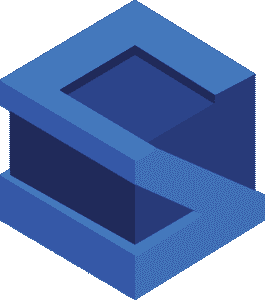

# 你应该知道的 10 大 Java 框架

> 原文：<https://www.edureka.co/blog/java-frameworks/>

Java 框架是预先编写的代码体，通过它你可以添加你自己的代码。但是有很多框架有各种各样的应用。因此，在本文中，我将讨论你应该掌握的 10 大 Java 框架。

让我们来看看这篇文章将要涉及的主题:

*   [什么是 Java 框架？](#What_are_Java_frameworks?)
*   [使用的顶级 Java 框架](#Top_Java_frameworks_used)
    *   [春天](#Spring)
    *   [冬眠](#Hibernate)
    *   [支柱](#Struts)
    *   [谷歌网络工具包【GWT】](#Google_web_toolkit_%5BGWT%5D)
    *   [Java server Faces【JSF】](#JavaServer_Faces_%5BJSF%5D)
    *   Grails
    *   [我要求](#Vaadin)
    *   [叶片](#Blade)
    *   [Dropwizard](#Dropwizard)
    *   [打](#Play)

让我们开始吧！

## **什么是 Java 框架？**

框架是一大堆预先写好的代码，你可以添加自己的代码来解决问题。通过调用框架的方法、继承，并提供回调、侦听器或模式的其他实现，可以利用框架。

框架通常会决定应用程序的结构。一些框架甚至提供了如此多的代码，以至于你只需要做很少的事情就可以编写你的应用程序。这可能是好的也可能是坏的，取决于它的易用性。框架是编程的实质。你建立在一个好的基础上，你的程序是可靠的，快速的，并且完美的结合在一起。你建立在一个坏的基础上，你的生活是悲惨的，野蛮的，短暂的。

现在让我们了解不同的框架。

**使用的顶级 Java 框架**

**1。弹簧框架**

Spring Framework 是一个用于企业 Java (JEE)的强大的轻量级应用程序开发框架。

[*Spring 框架*](https://www.edureka.co/blog/what-is-spring-framework/) 的核心特性可以用于开发任何 Java 应用。 它被描述为一个 完整的模块化框架。该框架可用于实时应用程序的所有层实现。与其他框架不同，它还可以用于开发实时应用程序的特定层，但是使用 Spring，我们可以开发所有层。

*[Spring](https://www.edureka.co/blog/spring-tutorial/)* 以及包括 *[Spring MVC](https://www.edureka.co/blog/spring-mvc-tutorial/)* 、Spring Core、Spring Security、Spring ORM 等在内的所有模块都用于企业应用。

现在，让我们看看这个 Spring 框架用在哪里。

**用途**:

*   Web 应用程序开发
*   它的特性可以用来创建任何 Java 应用程序
*   它也用于企业 Java (JEE)

**优势**

*   它提供了一个轻量级容器，可以在不使用 web 服务器或应用服务器软件的情况下被触发
*   Spring 支持 JDBC 提高生产力，减少错误
*   它的目标是使 J2EE 开发更容易使用
*   Spring 支持基于 XML 和注释的配置
*   它提供了代码的向后兼容性和可测试性

现在，谈到使用 Spring 框架进行应用程序开发的主要公司，我们有，

*   **网飞**使用弹簧靴
*   **Yatra** 使用 Spring MVC
*   亚马逊
*   通过易趣网购买

## **冬眠**

 Hibernate ORM 是一个稳定的 Java 对象关系映射框架。它使得 Java 编程语言和关系数据库管理系统(RDBMS)之间更好的通信成为可能。

当你使用像 Java 这样的面向对象语言时，你会遇到一个问题，叫做对象-关系阻抗不匹配，也叫做范式不匹配。这是因为 OO 语言和 RDBMSs 处理数据的方式不同，这会导致严重的不匹配问题。所以，这个 Hibernate 为你提供了一个框架，克服了 Java 的不匹配问题。

**用途**

*   它允许你按照面向对象的习语开发持久类
*   它允许你通过对代码进行微小的修改来与任何数据库进行交流，在对象和关系词之间架起了桥梁
*   它是一个高级的 ORM 框架，允许你在 Java 实体上执行数据库操作

**优势**

*   便携性、生产力、可维护性
*   免费开源框架
*   它从 JDBC API 中删除了大量重复的代码

现在，谈到使用 Hibernate 框架进行应用程序开发的主要公司，我们有，

*   神谕
*   国际商用机器公司
*   DELL
*   埃森哲

## **支柱**

这是另一个企业级框架，由 Apache 软件基金会(ASF)维护。这个功能齐全的 J  ava web 应用框架允许开发者创建一个易于维护的 Java 应用程序。有两个版本。支柱 1 和支柱 2。 Struts 2 是 OpenSymphony 的 webwork 框架和 Struts 1 的结合。但是所有的公司都更喜欢使用 Struts 2，因为它是 Apache Struts 的升级版本。

**用途:**

*   Struts 2 框架用于开发一个基于 MVC 的 web 应用
*   It 使用并扩展 Java Servlet API，帮助开发者采用 MVC 架构

**优点:**

*   这份框架文档是为活跃的 web 开发人员编写的，并假设他们具备如何构建 Java web 应用程序的工作知识
*   缩短开发时间，简化应用程序的管理
*   它提供了 *集中式配置*，也就是说，许多 Struts 值都是用 XML 或属性文件表示的，而不是将信息编码到 Java 程序中。
*   您可以将 Struts 与其他 Java 框架集成，以执行不是在该平台上构建的任务

现在，谈到使用 Struts 框架进行应用程序开发的主要公司，我们有，

*   印孚瑟斯
*   埃森哲
*   耐克森技术公司

## **谷歌网络工具包【GWT】**

Google Web Toolkit (GWT)是一个完全免费的开源框架，帮助开发者编写客户端 Java 代码，并将其建立为 JavaScript。很多谷歌产品都是用 GWT 编写的，比如 AdSense、谷歌钱包和 Blogger。

使用 GWT，开发人员可以轻松快速地编写复杂的浏览器应用程序。它还允许您用 Java 开发和调试 Ajax 应用程序。GWT 最棒的一点是，即使你不是 JavaScript 优化或响应式设计等前端技术的专家，你也可以编写复杂的基于浏览器的应用程序。

**用途:**

*   开发者友好的
*   Google APIs 的使用
*   帮助创建和维护复杂的 JavaScript 前端应用程序

**优势**

*   它支持常见 web 开发任务的可重用性
*   谷歌 API 可用于 GWT 应用
*   提供国际化、跨浏览器可移植性、UI 抽象、书签和历史管理

## **Java server Faces【JSF】**

JavaServer Faces (JSF)由 Oracle 开发，用于为基于 Java 的 web 应用程序构建用户界面。这是 Java 社区进程 (JCP)倡议的官方标准。 这是一个相当稳定的框架。

这是一个基于**组件的** UI 框架。JSF 基于 MVC 软件设计模式，它的架构完全定义了应用程序逻辑和表现之间的区别。

**用途:**

*   基于组件的 UI 框架
*   帮助构建本机应用程序

**优势**

*   JSF 是 Java EE 不可或缺的一部分
*   提供了优秀的工具和丰富的库
*   它允许现有的后端 Java 代码通过 web 接口进行扩展，而不必通过引入新的框架来改变基础应用程序。

Grails

Grails 是一个动态框架，由 Groovy JVM 编程语言创造。它是一种面向对象的 Java 平台语言，旨在提高开发人员的工作效率。语法与 Java 兼容，并被编译成 JVM (Java 虚拟机)字节码。 Grails 使用 Java 技术，包括 Java EE 容器、Spring、SiteMesh、Quartz 和 Hibernate。

**用途:**

*   它对开发者非常友好，因为它附带了详细易读的文档
*   您还可以构建自己的插件，并包含对不同平台的 Grails IDE 支持。
*   大多数电子商务网站都使用 Grails

**优势**

*   它利用 **Groovy** 作为它的编码标准，由于 Groovy 类似于 Java，程序员认为从 Grails 开始更容易。
*   易于使用的对象映射功能
*   它通过以插件的形式模块化应用程序来促进不同 Grails 应用程序之间的代码重用
*   提供灵活的配置文件

## **我要求**

Vaadin 是一个专注于 UX 可访问性的 web 应用程序框架。它为您提供了一个简化 Java 开发的平台。Vaadin 还允许您构建可定制组件的 web 应用程序。

Vaadin 10 以一种全新的方式开发 web 应用程序。它让您可以从 Java 虚拟机直接访问 DOM。在新版本中，Vaadin 团队将以前的整体框架分成了两个部分。它还有一个名为 *Vaadin 流* 的轻量级 Java 框架，用于处理路由和服务器-客户端通信。

**用途:**

*   这个框架自动化了浏览器和服务器之间的所有通信
*   它简化了 web 应用程序开发

**优势**

*   Vaadin 提供了使用 MVC 或 MVP 绑定数据的机会
*   拖放支持以及其他突出的特性简化了 Java 应用程序的单页用户界面的创建
*   支持 WebSocket 的自动服务器-客户端通信
*   使用 Java 或 HTML 构建视图
*   数据绑定
*   支持嵌套路由和参数的路由器
*   支持像 Kotlin 和 Scala 这样的 JVM 语言
*   内置弹簧支架

## **叶片**

这是一个简单、轻量、高性能的 Java 框架，用于提供一个全栈的 web 框架。Blade 是一个轻量级的 MVC 框架，它提供了一个 restful 路由接口，使得 web API 更简洁、更容易理解，并且有助于与网站同步数据。

Blade 基于 Java 8，web 服务器和模板引擎也内置在框架中。它给人的印象很小，意味着源代码总共不到 500kb。

**用途:**

*   帮助你变得独立、高效、优雅、直观、超快
*   用于创建一个小型 MVC 应用程序

**优势**

*   刀片支持插件扩展和 web jar 资源
*   支持配置多个文件
*   它还拥有 CSRF(跨站点请求伪造)和 XSS(跨站点脚本)防御支持

## **Dropwizard**

Dropwizard 是一个高性能的 Java 框架，用于快速开发 RESTful web 服务。特别适合创建 Java 微服务。Dropwizard 框架汇集了各种成熟的 Java 库，以便提供一个快速且不受干扰的开发平台。

Dropwizard 是一个独立的生态系统，包含捆绑到单个包中的所有依赖项。

**用途**:

*   操作友好的 Java 框架

*   帮助创建 Java 微服务

## **优势**

*   您可以轻松地执行快速原型制作
*   它开发高性能 RESTful web 服务
*   也支持许多开源和独立的库
*   快速项目引导
*   生产率的提高

## **播放**

这是一个高度可扩展的 Java 应用的反应式 web 和移动框架。Play 使得为桌面和移动界面开发轻量级和网络友好的 Java 和 Scala 应用成为可能。它经常与其他语言的强大框架相比较，比如 Ruby 的 Ruby on Rails，或者 Python 的 Django。

Play 是一个独特的 Java 框架，因为它不依赖于 Java EE 标准。相反，它旨在消除传统 Java web 开发的所有不便，如缓慢的开发周期、大量的配置等等。Play framework 建立在 *Akka* 工具包的基础上，在 Java 虚拟机上截断了并发和分布式应用程序的创建。

**用途:**

*   需要内容创建的 Web 应用程序
*   构建 Java 和 Scala 应用程序

**优势**

*   提供热代码重载、约定优于配置以及浏览器中的错误消息等功能
*   它支持对高性能应用至关重要的非阻塞 I/O
*   更灵活和容错的结果

这就把我们带到了本文的结尾，在这里我们讨论了正在使用的 10 个最好的 Java 框架。希望你清楚本教程中与你分享的所有内容。如果你刚刚开始，那么看看这篇 Java 教程，了解基本的 Java 概念。

[https://www.youtube.com/embed/aqHhpahguVY](https://www.youtube.com/embed/aqHhpahguVY)

*查看 Edureka 提供的 [**Java 认证**](https://www.edureka.co/java-j2ee-training-course) 培训，edu reka 是一家值得信赖的在线学习公司，在全球拥有超过 250，000 名满意的学习者。我们在这里帮助你的旅程的每一步，为了成为一个成功的 Java 开发人员，我们提出了一个课程，它是为那些想成为 Java 开发人员的学生和专业人士设计的。*

*有问题吗？请在这篇“Java 框架**文章的评论部分提到它，我们会尽快回复您，或者您可以参加万隆的 [Java 培训。](https://www.edureka.co/java-j2ee-training-course-bandung)*