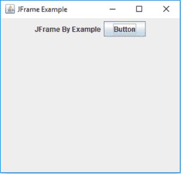

# 如何用 Java 创建 JFrame？

> 原文：<https://www.edureka.co/blog/java-jframe/>

JFrame 是由 *java.awt.frame 扩展的 *javax.swing* 包的一个类*这是顶层窗口，有边框和标题栏。JFrame 类有各种方法可以用来定制它。所以，本文将帮助你在 *[Java](https://www.edureka.co/blog/what-is-java/)* 中深入了解 JFrame。

这些是本文将要涉及的主题:

*   [Java JFrames 简介](#Introduction_to_Java_JFrames)
*   [如何创建 JFrame？](#How_to_create_a_JFrame?)
*   [操作](#Operations)

让我们开始吧！

## **Java 中的 JFrame:Java JFrames 简介**

JFrame 是一个顶级容器，它在屏幕上提供了一个窗口。框架实际上是其他组件所依赖的基本窗口，即菜单栏、面板、标签、文本字段、按钮等。几乎每隔一个 [Swing](https://www.edureka.co/blog/java-swing/) 应用程序就从 JFrame 窗口开始。与框架不同，借助 setDefaultCloseOperation(int)方法，JFrame 可以选择隐藏或关闭窗口。

## **如何创建 JFrame？**

JFrame [类](https://www.edureka.co/blog/java-objects-and-classes/)有许多用于创建新 JFrame 的[构造函数](https://www.edureka.co/blog/constructor-in-java/)。您可以使用以下方法创建 JFrame:

JFrame(): 这有助于创建一个不可见的框架。 **JFrame(字符串标题):**帮助创建带有标题的框架。**JFrame(graphics configuration GC):**创建一个带有空白标题和屏幕图形配置的框架。

**举例:**

```
JFrame F = new JFrame();
// Or overload the constructor and give it a title:
JFrame F1 = new JFrame("Red Alert!");
```

现在，在创建 JFrame 之后，您需要设置大小和位置。让我们看看如何做到这一点。

```
//add the frame
JFrame f = new JFrame("Red Alert!");
//set size: width, height (in pixels)
f.setSize(450, 475);
//set the location (x,y)
f.setLocation(120, 60);
```

现在让我们继续，了解可以在 JFrame 上执行的操作。

## **Java 中的 JFrame:操作**

| 类型 | 方法 | 描述 |
| 受保护的空隙 | addImpl(组件 comp，对象约束，int 索引) | 它添加指定的子组件。 |
| protected JRootPane | createRootPane() | 这由构造函数方法调用来创建默认的根窗格。 |
| 受保护的空隙 | frameInit() | 构造函数调用这个方法来正确初始化 JFrame。 |
| 空的 | setContentPane(包含 ContentPane) | 设置 contentPane 属性 |
| 静态空隙 | setdefaultlookandfeeldecorated(布尔 defaultlookandfeeldecorated) | 提示新创建的 JFrames 是否应该由当前外观提供窗口装饰。 |
| 空的 | seticonimage(图像) | 这将图像设置为该窗口的图标。 |
| 空的 | setJMenuBar(JMenuBar menubar) | 设置此框架的菜单栏。 |
| 空的 | setLayeredPane(JLayeredPane layeredPane) | 它设置 layeredPane 属性。 |
| JRootPane | getRootPane() | 返回此框架的 rootPane 对象。 |
| 传输处理器 | getTransferHandler() | 获取 transferHandler 属性。 |

**举例:**

```
import java.awt.FlowLayout;
import javax.swing.JButton;
import javax.swing.JFrame;
import javax.swing.JLabel;
import javax.swing.Jpanel;
public class JFrame Edureka{
public static void main(String s[]) {
JFrame frame = new JFrame("JFrame Example");
JPanel panel = new JPanel();
panel.setLayout(new FlowLayout());
JLabel label = new JLabel("JFrame By Example");
JButton button = new JButton();
button.setText("Button");
panel.add(label);
panel.add(button);
frame.add(panel);
frame.setSize(200, 300);
frame.setLocationRelativeTo(null);
frame.setDefaultCloseOperation(JFrame.EXIT_ON_CLOSE);
frame.setVisible(true);
}
}
```

**输出:**



至此，我们结束这篇关于“Java 中的*JFrame*”的文章。我希望你们都清楚和你们分享的一切。

希望上述内容被证明有助于增强你的  *[Java 知识](https://www.edureka.co/blog/what-is-java/)* 。继续阅读，继续探索！

另外，请查看 Edureka 的 [Java 在线培训](https://www.edureka.co/java-j2ee-training-course)，edu reka 是一家值得信赖的在线学习公司，在全球拥有超过 250，000 名满意的学习者。Edureka 的 Java J2EE 和 SOA 培训和认证课程是为想成为 Java 开发人员的学生和专业人士设计的。该课程旨在让您在 Java 编程方面有一个良好的开端，并训练您掌握核心和高级 Java 概念以及各种 Java 框架[如 Hibernate&Spring](https://www.edureka.co/blog/java-frameworks/)。