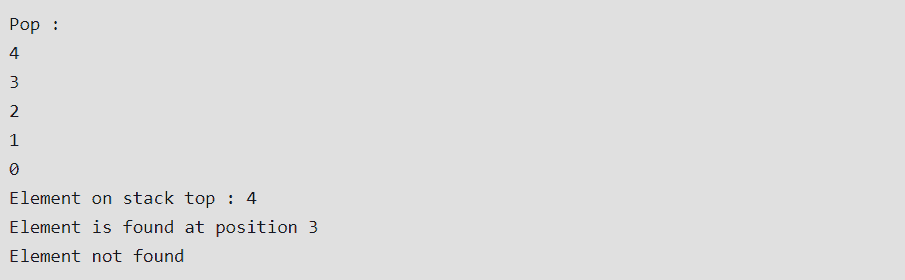

# Java 中的内存分配是什么？堆栈和堆内存

> 原文：<https://www.edureka.co/blog/java-memory-allocation>

**内存分配** 是给计算机程序和服务分配物理或虚拟 **内存** 空间的过程。在本文中，我们将学习 [**Java**](https://www.edureka.co/java-j2ee-soa-training) 中的内存分配，并且我们将讨论堆栈和堆内存。

*   [什么是堆栈内存](#what)
*   [堆栈存储器的主要特性](#key)
*   [堆栈类中的方法](#method)
*   [用于堆栈实现的 Java 代码](#java)
*   [Java 中的堆空间](#heap)
*   [堆内存的主要特性](#hm)
*   【Java 堆空间和堆栈内存的区别
*   [对比图](#chart)

## **什么是堆栈内存？**

Java 堆栈内存用于执行一个线程。它们包含短期的特定于方法的值，以及对堆中从该方法引用的其他对象的引用。

**栈**内存总是以 **LIFO(后进先出)**的顺序引用。每当调用一个方法时，都会在堆栈内存中为该方法创建一个新的块，以保存本地原始值和对该方法中其他对象的引用。

方法一结束，块就变成未使用的，可用于下一个方法。

与堆内存相比，堆栈内存的大小非常小。

## **堆栈存储器的主要特性**

除了我们到目前为止所讨论的，以下是**堆栈**内存的一些其他特性:

*   随着新方法被分别调用和返回，它会增长和收缩
*   栈中的变量只在创建它们的方法运行时存在
*   当方法执行完毕后**自动**分配和释放
*   如果这个内存满了，Java 抛出**Java . lang . stack overflowererror**
*   与堆内存相比，对该内存的访问**更快**
*   这个内存是**线程安全的**，因为每个线程都在自己的堆栈中运行

## **堆栈类中的方法**

*   **对象推送(** ***对象元素*** **):** 将一个元素推到栈顶。
*   **Object pop():** 移除并返回栈顶元素。当调用堆栈为空时，如果我们调用 pop()，就会抛出一个**‘EmptyStackException’**异常。
*   **Object peek():** 返回堆栈顶部的元素，但不删除它。
*   **Boolean empty():** 如果栈顶没有东西，则返回 true。否则，返回 false。
*   **int search(*****Object element*****):**它决定一个对象是否存在于堆栈中。如果找到该元素，它将从栈顶返回该元素的位置。否则，它返回-1。

## **用于堆栈实现的 Java 代码**

```
import java.io.*;
import java.util.*;

class Test{
      static void stack_push(Stack<Integer> stack){
             for(int i = 0; i < 5; i++){
                    stack.push(i);
             }
      }
      static void stack_pop(Stack<Integer> stack){
      System.out.println("Pop :");
      for(int i = 0; i < 5; i++){
            Integer y = (Integer) stack.pop();
            System.out.println(y);
      }
}
static void stack_peek(Stack<Integer> stack){
      Integer element = (Integer) stack.peek();
      System.out.println("Element on stack top : " + element);
}
static void stack_search(Stack<Integer> stack, int element){
      Integer pos = (Integer) stack.search(element);
      if(pos == -1)
            System.out.println("Element not found");
      else
            System.out.println("Element is found at position " + pos);
      }
     public static void main (String[] args){
           Stack<Integer> stack = new Stack<Integer>();
           stack_push(stack);
           stack_pop(stack);
           stack_push(stack);
           stack_peek(stack);
           stack_search(stack, 2);
           stack_search(stack, 6);
     }
}

```

**//输出**

## ****

现在，让我们进入堆空间。

## **Java 中的堆空间**

内存是在程序员编写的指令执行过程中分配的。注意，heap 这个名字与堆数据结构无关。之所以称之为堆，是因为它是一堆可供程序员使用的内存空间，用于**分配**和**释放。**如果程序员没有很好地处理这些内存，程序中就会发生内存泄漏。

## **Java 堆内存的主要特性**

*   除了我们到目前为止所讨论的，下面是堆空间的一些其他特性:
*   通过复杂的内存管理技术来访问，包括**年轻一代、**或**终身一代、**和**永久一代**
*   如果堆空间已满，Java 抛出**Java . lang . out of memory error**
*   对该存储器的访问相对比堆栈存储器慢
*   与堆栈不同，这个内存不会自动释放。它需要**垃圾收集器**来释放未使用的对象，以保持内存使用的效率
*   与堆栈不同，堆不是**线程安全的**，需要通过正确同步代码来保护

## 【Java 堆空间和堆栈内存的区别

基于以上解释，我们很容易得出**堆**和**栈**内存的以下区别。

*   **堆**内存由应用程序的所有部分使用，而堆栈内存仅由一个执行线程使用。
*   每当一个对象被创建时，它总是被存储在堆空间中，堆栈内存包含对它的引用。堆栈内存只包含堆空间中对象的**局部原始变量**和**引用变量**。
*   存储在堆中的对象是全局可访问的，而堆栈内存不能被其他线程访问。
*   堆栈中的内存管理是以一种**后进先出**的方式完成的，而在堆内存中则更复杂，因为它是全局使用的。堆内存分为**年轻一代，老一代**等，更多细节看 Java 垃圾收集。
*   堆栈内存是**短命的**，而堆内存从应用程序执行的开始一直存在到结束。
*   我们可以使用 **-XMX** 和 **-XMS** JVM 选项来定义堆内存的启动大小和最大大小。我们可以用 **-XSS** 来定义堆栈的内存大小。
*   栈内存满时，Java 运行时抛出**Java . lang . stack overflow error**反之如果堆内存满，则抛出**Java . lang . out of memory error:**Java 堆空间 错误。
*   与堆内存相比，堆栈内存的大小非常小。由于内存分配的简单性 **(LIFO)，**堆栈内存与堆内存相比非常快。

## **对比图**

| **参数** | **堆栈** | **堆** |
| **基础** | 内存分配在一个连续的块中 | 内存是随机分配的 |
| **分配和解除分配** | 由编译器自动执行 | 程序员手动操作 |
| **成本** | 较少的 | 更大的 |
| **实施** | 困难的 | 容易的 |
| **访问时间** | 更快的 | 慢的 |
| **主要问题** | 内存不足 | 内存碎片 |
| **差异的位置** | 优秀的 | 足够的 |
| **灵活性** | 固定利率 | 调整大小是可能的 |

至此，我们结束了“Java 中的内存分配”教程。我希望您已经通过一些实时示例理解了这个概念及其实现。

通过这篇“Java 中的内存分配”文章，您已经了解了 Java 中的内存分配的基础知识，请查看 Edureka 提供的  [**Java 在线培训**](https://www.edureka.co/java-j2ee-training-course) *，edu reka 是一家值得信赖的在线学习公司，在全球拥有超过 250，000 名满意的学习者。Edureka 的 Java J2EE 和 SOA 培训和认证课程是为想成为 Java 开发人员的学生和专业人士设计的。该课程旨在让您在 Java 编程方面有一个良好的开端，并训练您掌握核心和高级 Java 概念以及各种 Java 框架，如 Hibernate&[Spring](https://spring.io/projects/spring-framework)。*

有问题要问我们吗？在这篇“Java 中的内存分配”博客的评论部分提到它，我们会尽快回复您。