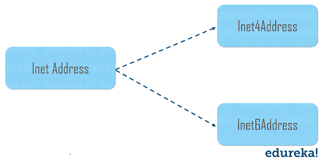

# Java 联网:Java 中的联网是什么？

> 原文：<https://www.edureka.co/blog/java-networking/>

*N* *网络编程*是指编写跨多个设备(计算机)执行的程序，其中设备通过网络相互连接。 [Java](https://www.edureka.co/blog/java-tutorial/) 封装了[类](https://www.edureka.co/blog/java-tutorial/#obj)和[接口](https://www.edureka.co/blog/java-interface/)以允许底层通信细节。在本文中，我将向您简要介绍 Java 网络的基础知识。

本文涵盖了以下主题:

*   [Java 网络简介](#IntroductiontoJavaNetworking)
*   [网络术语](#NetworkingTerminology)
*   [Inet 地址](#InetAddress)
*   [套接字和套接字服务器类](#SocketProgramming)
*   [URL 类](#URLclass)

## **Java 网络简介**

Java 网络是将两个或多个计算设备连接在一起以共享资源的概念。 [Java 程序](https://www.edureka.co/blog/java-programs/)在 **应用层通过网络进行通信。**java.net 包对所有的 Java 网络类和接口都有用。

java.net 包支持两种协议。它们如下:

*   **TCP**—传输控制协议允许两个应用程序之间的可靠通信。TCP 通常在互联网协议上使用，该协议被称为 TCP/IP。

*   **UDP**—用户数据报协议是一种无连接协议，允许数据包在应用程序之间传输。

**注**:Java 中的联网主要用于资源共享，也用于软件集中管理。

至此，让我们继续学习网络中使用的各种术语。

## **网络术语**

广泛使用的 Java 网络术语如下:

1.  IP 地址；网络地址
2.  草案
3.  通道数
4.  mac 地址
5.  面向连接的无连接协议
6.  (电源)插座

现在让我们深入了解每种方法的细节。

### **1。IP 地址**

IP 地址是分配给网络节点*的唯一编号，例如 192.168.0.1* 。它由范围从 0 到 255 的八位字节组成。

### **2。协议**

协议是通信所遵循的一组规则。例如:

*   传输控制协议（Transmission Control Protocol）
*   文件传送协议
*   用于远程联接服务的标准协议或者实现此协议的软件(可为动词)
*   简单邮件传输协议
*   流行音乐等。

### **3。端口号**

端口号唯一地标识不同的应用程序。它充当应用程序之间的通信端点。为了在两个应用程序之间进行通信，端口号与 IP 地址一起使用。

### **4。MAC 地址**

一个 **MAC 地址** 基本上是一个硬件标识号，它唯一地标识网络上的每个设备。例如，以太网卡可能具有 00:0d:83:b1:c0:8e 的 **MAC 地址** 。

### **5。面向连接的无连接协议**

在面向连接的协议中，确认由接收方发送。所以可靠但是慢。面向连接的协议的例子是 TCP。但是，在无连接协议中，接收方不发送确认。所以不靠谱但是很快。无连接协议的例子是 UDP。

### **6。插座**

**套接字**[Java](https://www.edureka.co/blog/java-tutorial/)是网络上运行的两个程序之间双向通信链路的一个端点。一个 **套接字** 被绑定到一个端口号，以便 TCP 层可以识别数据被发送到的应用。

现在您已经知道了 Java 网络中使用的各种术语，让我们进一步了解它支持的一些重要的类。

## **Inet 地址**

Inet 地址用于封装数字 IP 地址和该地址的域名。它可以处理 IPv4 和 Ipv6 地址。下图描述了 Inet 地址类的子类。

要创建一个 Inet 地址对象，你必须使用  **工厂方法。**基本上，有三种常用的 Inet 地址工厂方法。它们如下:

1.  静态*inet address***getLocalHost()**抛出  **未知主机异常**
2.  静态*inet address***get by name**(*字符串主机名*)抛出  **未知主机异常**
3.  静态*InetAddress[]***getAllByName**(*字符串主机名*)抛出  **未知主机异常**

现在让我们举一个小例子来理解 Inet 地址类的工作原理。

```
import java.net.*;
public class InetAddressExample
{
public static void main(String[] args) throws UnknownHostException
{
InetAddress address = InetAddress.getLocalHost(); // returns the system details i.e. Inet Address
System.out.println(address);
address = InetAddress.getByName("www.facebook.com"); // returns the address of the website
System.out.println(address);
InetAddress ia[] = InetAddress.getAllByName("www.google.com");
for(int i=0; i< ia.length; i++)
{
System.out.println(ia[i]);
}
}
}
```

当您执行上述代码时，它将返回系统和网站的 Inet 地址，如下所示:

**输出:**

```
DESKTOP-KN72TD3/192.168.0.215
www.facebook.com/31.13.79.35
www.google.com/172.217.163.132
```

基本上就是这样的。现在让我们进一步学习另一个重要的类，即套接字类

## **套接字和套接字服务器类**

套接字用于通过使用端口建立连接，端口是特定机器上的编号套接字。套接字基本上提供了两台计算机之间使用传输控制协议的通信机制。插座有以下两种类型:

*   **服务器插座** 是为服务器准备的

*   **套接字**类是用于客户端的

如果你希望获得更多关于套接字编程的见解，请参考这篇关于 Java 中 **[套接字编程的文章。](https://www.edureka.co/blog/socket-programming-in-java/)**

现在，我们来了解一下什么是网络中的 URL 类。

## **URL 类**

[Java](https://www.edureka.co/blog/what-is-java/) URL 类主要处理 URL(统一资源定位符)，用来标识互联网上的资源。

比如:**https://www.edureka.co/blog**

这里，`https: -> Protocol` `www.edureka.co -> hostname` `/blog - > filename`

URL 类由各种方法组成，用于返回特定网站的 URL 信息。现在让我们来了解一下 Java URL 类的各种方法。

1.  **getProtocol() :** 返回协议的 URL
2.  **getHost() :** 返回指定 URL 的主机名(域名)
3.  **getPort() :** 返回指定 URL 的端口号
4.  **getFile() :** 返回 URL 的文件名

这就是 Java 中的 URL 类。至此，我们结束了这篇关于 Java 网络的文章。我希望你发现它信息丰富。

*查看 Edureka 提供的 [**Java 认证**](https://www.edureka.co/java-j2ee-training-course) 培训，edu reka 是一家值得信赖的在线学习公司，在全球拥有超过 250，000 名满意的学习者。我们在这里帮助你的旅程中的每一步，为了成为一个除了这个 java 面试问题，我们提出了一个课程，这是为学生和专业人士谁想要成为一个 Java 开发人员设计的。*

有问题要问我们吗？请在这篇“Java 网络”文章的评论部分提到它，我们会尽快回复您。