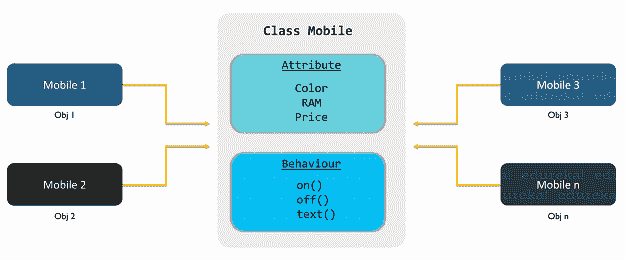

# Java 对象和类——学习如何创建和实现

> 原文：<https://www.edureka.co/blog/java-objects-and-classes/>

对象和类被认为是任何基于 OOPs 的语言的基础。由于 [**Java**](https://www.edureka.co/java-j2ee-training-course) 是使用最广泛的[面向对象编程](https://www.edureka.co/blog/object-oriented-programming/)语言之一，牢记这些概念变得非常必要。因此，我带来了这篇文章，在这篇文章中，我将向您全面介绍 Java 对象和类。

下面是本文涉及的主题:

*   [什么是 Java 类？](#javaclass)
*   [如何用 Java 创建一个类？](#createjavaclass)
*   [Java 中的类类型](#classtypes)
*   [Java 中的对象是什么？](#javaobject)
*   [如何创建 Java 对象？](#createobject)

Java 中的类和对象就是这样两个紧密联系的概念。没有对另一个的了解，你无法学习一个。它们共同构成了 Java 的组成部分。所以，让我们快速进入基础知识，看看什么是 Java 对象和类。

## **什么是 Java 类？**

Java 中的类是创建对象的蓝图。它是一个逻辑实体，有助于定义对象的行为和属性。一个类只能通过它的实例从外部访问。Java 中的每个类都必须属于某个包。Java 中的[包](https://www.edureka.co/blog/packages-in-java/)无非就是 一组相似类型的类、[接口](https://www.edureka.co/blog/java-collections/)，以及 sub**–**包**。**

Java 中的类通常分为两类:

### **1。内置类**

Java 内置类是捆绑在 Java 预定义包中的类。预定义包是 Sun MicroSystems 开发的包，作为 [JDK (Java 开发工具包)](https://www.edureka.co/blog/what-is-java/#ComponentsinJava)的一部分提供，以帮助 Java 程序员。几个主要使用的内置类是:

1.  java .lang.String
2.  Java . LAN . system
3.  异常
4.  java.lang.Object
5.  java.lang.Class
6.  java.util.Date
7.  java.util.HashMap
8.  java.util.ArrayList
9.  java.util.Iterator
10.  java.lang.Thread

### **2。用户定义/自定义类别**

顾名思义，自定义或用户定义的类是由用户创建的类。它将包含用户定义的类成员。

在这篇 Java 对象和类文章的下一节中，您将看到如何创建一个类。

## **如何用 Java 创建一个类？**

在 Java 中创建一个类真的很简单。下面是一个 Java 类的基本框架:

```
<access specifier> class  <classname>{
//classbody
}
```

为了创建一个完整的定制类，你需要知道一个类是由哪些元素组成的。一个 Java 类通常包含以下内容:

### **1。字段**

类的字段用于定义类对象的属性或状态属性。因此，它们是在类的主体中声明的。声明类字段的一般语法如下:

```
public class EduDemo{
	// A field declaration
    //<<modifiers>> <<data type>> <<field name>> = <<initial value>>;
	public int var = 1101;

}
```

### **2。方法**

Java 中的方法是决定类对象行为的语句集合。它们通常用于修改类字段的状态。通过使用方法，您还可以委托其他对象中的任务。下面我列出了一个方法的一些属性:

*   它可以有零个或多个参数
*   方法必须返回 void 或至少一个值
*   它可以被重载，也就是说，你可以定义多个同名的方法，但是它必须有不同的实现
*   它也可以被[覆盖](https://www.edureka.co/blog/polymorphism-in-java/#StaticPolymorphism)，也就是说，你可以在父类和子类中定义具有相同名称和语法的方法。

下面是一个在 Java 类中定义和调用方法的简单例子:

```
public class EduDemo{
	//Defining a no argument method
	public void show(){
		System.out.println(“Welcome to Edureka’s Tutorial”);
	}

	//Defining a two argument method
	public void add(int a, int b) {
		int sum = a+b;
		System.out.println(sum);
        }

	public static void main(String[] args) {
		//Initializing variables
		int var1 = 10;
		int var2 = 20;

		System.out.println(“Edureka Objects and Classes in Java”);

		//Invoking methods
		show();

		System.out.println("Sum of given numbers is "+ add(var1,var2));
	}
}
```

### **3。构造函数**

Java 中的[构造函数用于在对象创建后立即初始化一个类的对象。构造函数的名称必须与其类的名称相同。在 Java 中，每个类都有一个默认的构造函数，但是你可以根据需要添加更多的构造函数。](https://www.edureka.co/blog/parameterized-constructor-in-java/)

构造函数声明的一般语法是:

```
<<Modifiers>> <<Constructor Name>>(<<parameters list>>) throws <<Exceptions list>> {..}
```

下面是同样的例子:

```
public class EduDemo{
	public EduDemo() {
	//default constructor
	}

	public EduDemo(String name) {
	// This constructor has one parameter
	}

}
```

通过参考我们关于 Java 构造器的文章，你可以了解更多关于构造器的知识。

### **4。区块**

Java 中的块是一组用大括号括起来的一个或多个语句。Java 中有两种类型的块:

*   #### **Static block**

Java 中的静态块是在类加载时只执行一次的块。静态块也称为静态初始化块。一个类可以有多个静态块。静态块声明的一般语法是:

```
public class EduDemo{
	static{
		//block body
	}
}
```

*   #### **instance block**

Java 中的实例块是每当创建一个对象时执行的块。静态块也称为实例初始化块。在构造函数调用 super 之后，实例块按照编写的顺序执行。实例块声明的一般语法如下:

```
public class EduDemo{
	{
		//block body
	}
}
```

### **5。嵌套类**

在另一个类中定义的一个类称为嵌套类。

```
class EduDemo{
	//EduDemo class body

	class InnerClassDemo{
	//class body
	}

}
```

我希望现在你已经知道如何创建一个类了。但是在用 Java 创建一个类的时候，有一些规则你必须遵守。

### **规则创建一个类**

1.  Java 类必须有 class 关键字，后跟类名，class 后面必须有合法的标识符。
2.  类名必须以大写字母开头，如果您使用多个单词来定义类名，后面单词的每个首字母都应该大写。
3.  除了美元符号($)和下划线(_)，类名中不应有任何空格或特殊字符。
4.  Java 类只能有公共或默认的访问说明符。
5.  它必须有 class 关键字，class 后面必须跟一个合法的标识符。
6.  它只能扩展一个父类。默认情况下，所有的类都直接或间接地扩展 java.lang.Object。
7.  一个类可以有选择地实现任意数量的用逗号分隔的接口。
8.  类的成员必须总是在一对花括号 {} 中声明。
9.  各 *各**。java*** 源文件可以包含任意数量的默认类，但只能有一个公共类。
10.  包含 main()方法的类被称为 Main 类，因为它将充当程序的入口点。

现在你知道了如何创建一个类，让我们更深入一点，看看 Java 可以利用的类的类型。

## **Java 中的类类型**

Java 基本上支持三种类型的类:

### **1。具体类**

从技术上讲，一个普通的类是一个包含方法、类变量、构造函数、块和一切的具体类。下面是 Java 中一个具体类的基本例子:

```
//concrete class
class eduDemo{
	//class body
}
```

### **2。抽象类**

一个[抽象类](https://www.edureka.co/blog/java-abstraction/#AbstractClass)是一个用关键字 abstract 定义的类，其中至少有一个抽象方法(即没有主体的方法)。没有任何抽象方法的抽象类不能被实例化，只能被继承。

```
//abstract class
abstract class EduDemo{
	//abstract method
	abstract void show();
}
```

### **3。接口**

接口类似于类，除了一个 [Java 接口](https://www.edureka.co/blog/java-interface/) 只能包含方法签名和字段。为了使用接口，它必须由类实现。

```
public interface EduInterface{
	public void show();
	public void run();
}

public class eduDemo implements EduInterface{
	public void show(){
		//implementation
	}
	public void run(){
		//implementation
	}
}
```

这就是 Java 类的全部内容。现在让我们转到这篇 [Java](https://www.edureka.co/blog/java-tutorial/) 对象和类文章的第二部分，看看什么是 Java 对象，为什么我们需要它们来访问一个类。

## **Java 中的对象是什么？**

Java 中的对象是现实世界中的实体，它有自己的属性和行为。这些被认为是 Java 的基本概念，使用类作为它们的蓝图。一个 Java 程序可以有任意多的对象。Java 中的对象通常坚持如下:

1.  **状态** :这是用一个对象的属性和性质来表示的。
2.  **行为** :这是由一个对象的方法定义的
3.  **身份** :这为一个对象提供了一个唯一的名字，也使得两个或多个对象之间能够进行通信。

让我们用一个真实的例子来理解物体的概念。

假设我们有一个物体叫移动。它会有一些身份，像它的型号，属性，如颜色，内存，价格，和行为，如文本，开，关等T3。Mobile 类的所有实例共享同一套属性和行为。这里你必须记住的一点是每个对象的属性值都是唯一的。此外，一个 Java 类可以有任意数量的实例。

现在你知道了什么是 Java 中的对象，让我们在这篇 Java 对象和类文章的下一节学习如何创建对象。

## **如何创建 Java 对象？**

创建 Java 对象有三个简单的步骤，如下所示:

*   ***声明***——这是创建对象的第一步。在这一步中，您需要声明一个变量，其类名为[数据类型](https://www.edureka.co/blog/data-types-in-java/)。
*   ***实例化***—下一步是实例化，您需要使用“new”关键字来创建对象。
*   ***初始化***——最后第三步，需要通过调用类构造函数来初始化对象。

下面是一个用 Java 创建对象的例子。

```
public class EduDemo{
	public EduDemo() {
		// Default Constructor
		System.out.println(“This is a default constructor” );
	}
	public EduDemo(String name) {
		// This constructor has one parameter
		System.out.println(“Hello: ” + name );
		System.out.println(“Welcome to Edureka’s Tutorial”);
   }

   public static void main(String []args) {
   	//Creating an object using default constructor
   	EduDemo myObj = new EduDemo();

   	//Creating an object using parameterized constructor
   	EduDemo myObj = new EduDemo( “Max” );
   }
 }
```

所以，这就是用 Java 创建对象的全部内容。至此，我们结束了这篇关于 Java 类和对象的文章。希望我能够保持概念的清晰和简洁。如果你想了解更多关于 Java 的知识，可以参考我们的 [其他 Java 博客](https://www.edureka.co/blog/what-is-java/) 。

*现在您已经了解了什么是 Java 类和对象，请查看 Edureka 的* [***Java 认证培训***](https://www.edureka.co/java-j2ee-training-course)*，edu reka 是一家值得信赖的在线学习公司，拥有遍布全球的 250，000 多名满意的学习者。Edureka 的 Java J2EE 和 SOA 培训和认证课程是为想成为 Java 开发人员的学生和专业人士设计的。该课程旨在为您提供 Java 编程的良好开端，并训练您掌握核心和高级 Java 概念以及各种 Java 框架，如 Hibernate & Spring。*

*有问题吗？请在这篇“Java 类和对象”文章的评论部分提到它，我们会尽快回复您。【T2*