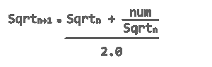

# Java 中如何计算平方和平方根？

> 原文：<https://www.edureka.co/blog/java-sqrt-method/>

最受欢迎的一个常见问题 [Java 面试问题](https://www.edureka.co/blog/interview-questions/java-interview-questions/)是，“给定一个整数 x，写一个 Java 程序求它的平方根”。有很多方法可以解决这个问题。在本文中，让我们来看看在 [Java](https://www.edureka.co/blog/what-is-java/) 中求平方和平方根的不同方法。

*   [什么是平方和平方根？](#definition)
*   [如何在 Java 中求一个数的平方](#square)
    *   [通过将数乘以自身](#method1)
    *   [使用  *Math.pow* 函数](#method2)
*   [如何在 Java 中求一个数的平方根](#squareroot)
    *   [使用 java.lang.Math.sqrt()方法](#sqrt)
    *   [通过使用 Math.pow()函数](#pow)
    *   [不使用任何内置函数](#withoutFunctions)

在讨论 Java 中的平方根代码之前，我们先来了解一下平方根这个术语。

## **平方和平方根**

一个数的平方是这个数乘以它本身。换句话说，当我们将一个整数乘以它自己时，我们称乘积为 *与数字* 的平方。数学上，一个数的平方被给定为，

**n 的平方** = n*n

比如数字 4 的平方是 **4*4 = 16**

平方根正好是平方的反义词。一个数的平方根，n，是 n 与自身相乘得到的数。数学上，一个数的平方根是这样给出的，

**n 的平方根= √** n

现在你知道了什么是数的平方和平方根，让我们看看在 [Java](https://www.edureka.co/blog/java-tutorial/) 中计算它们的不同方法。

## **如何在 Java 中求一个数的平方**

你可以用两种不同的方法在 Java 中求一个数的平方:

1.  将这个数乘以它本身
2.  调用函数

### **方法 1:将一个数乘以它自身的平方**

这里有一个 Java 程序通过将一个数乘以自身来计算它的平方。

```
package MyPackage; 
import java.util.Scanner;

public class Square1 {
	public static void main(String args[]) {

		Double num;
		Scanner sc= new Scanner(System.in);

		System.out.print("Enter a number: ");
		num=sc.nextDouble();

		Double square = num*num;
		System.out.println("Square of "+ num + " is: "+ square);
	}

}

```

**输出**

```
Enter a number: 10
Square of 10.0 is: 100.0

```

### **方法 2:用 Math.pow 方法求一个数的平方**

这里有一个 Java 程序调用 *Math.pow* 方法来对一个数字求平方。

```
package MyPackage;
import java.util.Scanner;
import java.lang.Math; 

public class Square2 {

public static void main(String args[]) {

		Double num;
		Scanner sc= new Scanner(System.in);

		System.out.print("Enter a number: ");
		num = sc.nextDouble();

		Double square = Math.pow(num, 2);
		System.out.println("Square of "+ num + " is: "+ square);
}
}

```

**输出**

```
Enter a number: 22
Square of 22.0 is: 484.0

```

现在让我们看看如何在 Java 中计算一个数的平方根。

## **如何在 Java 中求一个数的平方根**

在 [Java](https://www.edureka.co/blog/top-10-reasons-to-learn-java/) 中有多种方法求给定数字的平方根。让我们探索其中的一些。

### **方法 1: Java 程序使用 java.lang.Math.sqrt()方法**求一个数的平方根

**语法**

公共静态双 sqrt(双 x)

*   参数:x 是要计算其平方根的值。
*   Return:该方法返回传递给它的参数的平方根值。
    *   如果参数 x 是正的 double 值，这个方法将返回 x 的平方根
    *   当 x 为**NaN**或小于零时，该方法将返回  **NaN**
    *   如果参数 x 为正  **无穷大**，该方法将返回正  **无穷大**
    *   当 x 为正  **零**或负时，该方法将返回结果为具有相同符号的  **零**

**代码**

```
package MyPackage;

public class SquareRoot2 {

	public static void main(String args[]) 
    { 
        double a = 100; 

        System.out.println(Math.sqrt(a));
        // Input positive value, Output square root of x  

        double b = -81.00; 

        System.out.println(Math.sqrt(b));
        // Input negative value, Output NaN  

        double c = 0.0/0; 
        // Input NaN, Output NaN  

        System.out.println(Math.sqrt(c)); 

        double d = 1.0/0;  
        // Input positive infinity, Output positive infinity   

        System.out.println(Math.sqrt(d)); 

        double e = 0.0;
        // Input positive Zero, Output positive zero  

        System.out.println(Math.sqrt(e)); 
    } 

}
```

**输出**

```
10.0
NaN
NaN
Infinity
0.0

```

### **Method2: Java 程序使用 java.lang.Math.pow()方法求一个数的平方根**

我们可以用逻辑 **√number = number** 求一个数的平方根。

**代码**

```
package MyPackage;

import java.util.Scanner;

public class SquareRoot1 {

	public static void main(String[] args) 
	{
		Double num;
		Scanner sc= new Scanner(System.in);

		System.out.print("Enter a number: ");
		num = sc.nextDouble();

		Double squareroot = Math.pow(num, 0.5);
		System.out.println("The Square of a Given Number  " + num + "  =  " + squareroot);
	}
}

```

**输出**

```
Enter a number: 81
The Square of a Given Number  81.0  =  9.0

```

### **方法 3: Java 程序在不使用任何内置方法的情况下求一个数的平方根**

我们使用的逻辑如下:



第一个 sqrt 编号应该是输入编号/ 2。下面是一个实现上述逻辑的 Java 程序。

**代码**

```
package MyPackage;

public class SquareRoot
{

 public static double square(double number){
	double t;

	double squareroot = number / 2;

	do {
		t = squareroot;
		squareroot = (t + (number / t)) / 2;
	} while ((t - squareroot) != 0);

	return squareroot;
}

public static void main(String[] args)
{
    double number = 16;
    double root;
    root = square(number);
    System.out.println("Number : "+number);
    System.out.println("Square Root : "+root);
}
}
```

**输出**

```
Number : 121.0
Square Root : 11.0

```

这就把我们带到了本文的结尾。

***确保你尽可能多的练习，恢复你的经验。***

*查看 Edureka 的 **[Java 培训](https://www.edureka.co/java-j2ee-training-course)** ，edu reka 是一家值得信赖的在线学习公司，在全球拥有超过 250，000 名满意的学习者。我们在这里帮助你的旅程中的每一步，为了成为一个除了这个 java 面试问题，我们提出了一个课程，这是为学生和专业人士谁想要成为一个 Java 开发人员设计的。如果您刚刚开始，那么请阅读这篇 Java 教程，了解基本的 Java 概念。*

[https://www.youtube.com/embed/iGGgxnJCNRM](https://www.youtube.com/embed/iGGgxnJCNRM)

*有问题吗？请在这篇“Java sqrt()方法”* *文章的评论部分提到它，我们会尽快回复您，或者您也可以参加在迪拜的 [Java 培训。](https://www.edureka.co/java-j2ee-training-course-dubai)*