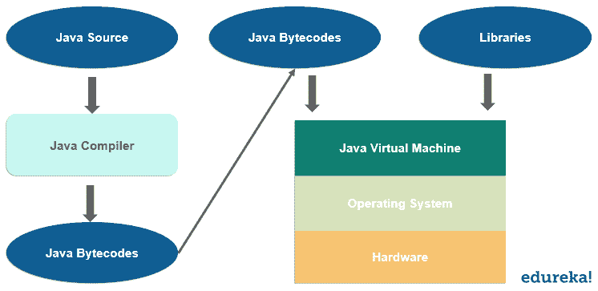
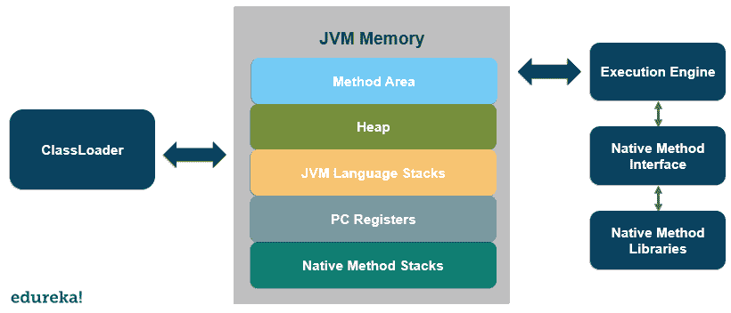

# 关于 Java 虚拟机你应该知道什么？

> 原文：<https://www.edureka.co/blog/java-virtual-machine/>

很长一段时间以来，Java 编程语言一直是 IT 行业的巨头。它有一些顶级的概念，使它比其余的编程语言更好。其中一个概念就是 Java 虚拟机，在本文中，我们将详细了解 [Java](https://www.edureka.co/java-j2ee-training-course) 虚拟机的各个方面。以下是本博客讨论的主题:

*   [什么是 Java 虚拟机？](#whatisjvm)
*   [我们为什么需要 Java 虚拟机？](#need)
*   [Java 虚拟机架构](#arch)
*   [执行过程](#exe)
*   [JDK、JRE 和 JVM 的区别](#diff)

## **什么是 Java 虚拟机？**

Java 虚拟机是一个独立于平台的抽象机器，它提供了一个运行时环境，在这个环境中执行 Java 字节码。

它是 Java 运行时环境的一部分，将 Java 字节码转换成机器可读的语言。Java 程序中的主[方法](https://www.edureka.co/blog/java-methods/)实际上是由 Java 虚拟机调用的。

## ****

## **我们为什么需要 Java 虚拟机？**

我们需要 Java 虚拟机来执行任务，这对于任何涉及 Java 的开发都是非常必要的。以下是 Java 虚拟机执行的一些任务。

*   加载代码
*   代码验证
*   代码的执行
*   它为应用程序提供运行时环境
*   存储区
*   寄存器组
*   提供垃圾收集堆
*   致命错误的报告
*   提供了一个[类](https://www.edureka.co/blog/java-objects-and-classes/)文件格式

有了所有这些操作，Java 虚拟机就是 Java 开发不可或缺的一部分。让我们借助 Java 虚拟机架构来理解它是如何工作的。

## **Java 虚拟机架构**

Java 虚拟机架构非常简单，除了其他组件之外，它还有一个内存区域、一个类加载器和一个执行引擎。让我们详细讨论每一个问题。

## ****

### **类装入器**

它是一个用来加载类文件的子系统。每当我们用 java 运行一个程序时，它首先被类加载器加载。主要功能包括初始化、链接和加载。下面是 Java 中内置的类加载器。

### **JVM 内存**

*   **方法区–**它存储每个类的结构，如代码、字段数据、运行时常量池、方法数据等。

*   **堆–**对象在运行时被分配到堆中。

*   JVM 语言栈-它存储本地变量和结果。它在调用和返回结果方面起着重要的作用。每当调用一个方法时，就会创建一个框架，并在调用结束或完成后立即销毁。

*   **PC 寄存器–**它拥有正在执行的 JVM 指令的地址或位置。

*   **原生方法堆栈–**应用程序中使用的所有原生方法都存在于原生方法堆栈中。

*   **执行引擎—**执行引擎包含一个虚拟处理器、一个解释器和一个 [JIT](https://www.edureka.co/blog/just-in-time-compiler/) 编译器。

*   **原生方法[接口](https://www.edureka.co/blog/java-interface/)–**它是一个[框架](https://www.edureka.co/blog/java-frameworks/)提供。

现在我们已经理解了 JVM 的架构，让我们看看代码的执行过程和编译。

## **执行过程**

在执行和编译 Java 代码时，会发生以下步骤。

*   主方法存储在单个文件中，其他方法存储在不同的文件中。
*   编译后会提供相应的。与 c 不同，类文件将包含没有任何链接的字节码。
*   在执行过程中，使用类加载器检查类文件是否有任何违规。
*   此后，字节码被转换成相应的本机代码。这也是 Java 相对较慢的原因。

现在我们知道了执行是如何工作的，让我们看看 JDK、JRE 和 JVM 之间的区别。

## **JDK、JRE、JVM 的区别**

以下是 JDK、JVM 和 JRE 之间的一些重要区别。

1.  JDK 代表 Java 开发工具包，JRE 代表 Java 运行时环境。
2.  JDK 用于开发，而 JRE 用于运行时环境。
3.  JVM 是运行任何 Java 程序的 JDK 和 JRE 的基本部分。
4.  JVM 是 Java 编程不可或缺的一部分，它提供了平台独立性。

这就把我们带到了本文的结尾，我们已经详细了解了 Java 虚拟机。我希望你清楚本教程中与你分享的所有内容。

如果您发现这篇文章与“Java 虚拟机”相关，请查看 Edureka [Java 认证培训](https://www.edureka.co/java-j2ee-training-course)，这是一家值得信赖的在线学习公司，在全球拥有超过 250，000 名满意的学习者。

我们在这里为您的旅程中的每一步提供帮助，并为希望成为 Java 开发人员的学生和专业人员设计课程。该课程旨在为您提供 Java 编程的开端，并训练您掌握核心和高级 Java 概念以及各种 Java 框架，如 Hibernate & Spring。

如果您遇到任何问题，请在“Java 虚拟机”的评论区提出您的所有问题，我们的团队将很乐意回答。