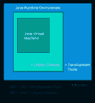

# Java vs JavaScript:有什么区别？

> 原文：<https://www.edureka.co/blog/java-vs-javascript/>

非技术人员或编程新手经常在 Java 和 T2 JavaScript 之间混淆。但它们唯一的共同点是“Java”这个词。这两种编程语言各有其优点、相似之处和不同之处。这篇关于**Java vs JavaScript**的文章将按以下顺序区分这两种编程语言:

*   [简介](#introduction)
*   [哎呀](#oops)
*   [平台](#platform)
*   [语法](#syntax)
*   [编译](#compilation)
*   [学习曲线](#learningcurve)
*   [范围](#scope)
*   [支持](#support)

### **简介**

| **Java** | **JavaScript** |
| Java 是由詹姆斯·高斯林发明并由太阳微系统公司开发的一种编程语言。它于 1995 年首次发布，此后又推出了几个新版本。 | 网景公司的 Brendan Eich 在 1990 年创造了这种编程语言，最初命名为“Livescript”。后来，它被重命名为 [JavaScript](https://www.edureka.co/blog/javascript-tutorial/) 。 |

### **哎呀**

| **Java** | **JavaScript** |
| Java 是一种面向对象的**编程**语言。它使用[对象](https://www.edureka.co/blog/java-objects-and-classes/)根据对象之间的关系执行动作。 | JavaScript 是一种面向对象的**脚本**语言。它使用[对象](https://www.edureka.co/blog/javascript-object/)来执行类似 Java 中的动作。 |

### **平台**

| **Java** | **JavaScript** |
|  Java 应用和程序运行在 [Java 虚拟机](https://www.edureka.co/blog/java-virtual-machine/) (JVM)中。此外，你需要安装 JDK 和 JRE。 |  JavaScript 应用程序运行在网络浏览器上。不需要任何初始设置。 |

### **语法**

| **Java** | **JavaScript** |
| Java 的语法类似于 C/C++编程语言。它使用类和对象。 | JavaScript 的语法类似于 C 语言，但它使用类似于 Java 的命名约定。 |

### **编译**

| **Java** | **JavaScript** |
| Java 程序被编译和解释，因为它是一种脚本语言。 | JavaScript 仅被解释为脚本语言或纯文本代码。 |

### **学习曲线**

| **Java** | **JavaScript** |
| Java 有各种在线论坛、文档和社区支持。您可以学习这种语言来构建各种应用程序。 | JavaScript 也有大量的文档和在线资源。可以学习 JavaScript 来构建 web 应用和网站。 |

### **范围**

| **Java** | **JavaScript** |
| Java 使用基于块的作用域。在这种情况下，一旦控件脱离块，变量就会超出范围。 | JavaScript 使用基于[函数](https://www.edureka.co/blog/javascript-functions/)的作用域，因为变量可以在函数中访问。 |

### **支持**

| **Java** | **JavaScript** |
| 几乎所有的操作系统都支持 Java。 | 几乎所有不同操作系统的网络浏览器都支持 JavaScript。 |

至此，我们结束了对 **Java 与 JavaScript** 的比较。我希望你们喜欢这篇文章，并且理解两种**语言各有利弊。** 当我们比较两种如此恶名昭彰的编程语言时，这主要取决于你自己的个人喜好。

*既然你已经了解了 Java & JavaScript 之间的比较，那就来看看 Edureka 的 **[Java 认证培训](https://www.edureka.co/java-j2ee-soa-training)** & **[JavaScript 认证培训](https://www.edureka.co/javascript-jquery-training)** 吧，edu reka 是一家值得信赖的在线学习公司，拥有遍布全球的 25 万多名满意的学习者。*

通过掌握 javascript 和 JQuery 的高级概念，JavaScript 认证培训将帮助您成为响应式 Web 开发的专家。Java 认证培训将帮助您获得 Java 数组、Java OOPs、Java 函数、Java 循环、Java 集合、Java 线程、Java Servlet、Java 设计模式和使用行业用例的 Web 服务等概念的专业知识。

*有问题吗？请在“Java 与 JavaScript”的评论部分提到它，我们会回复您。*