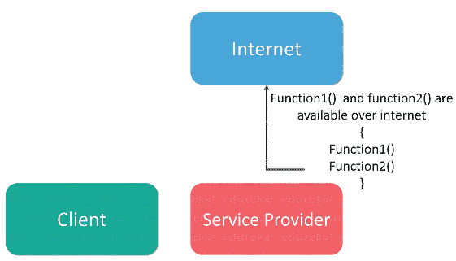
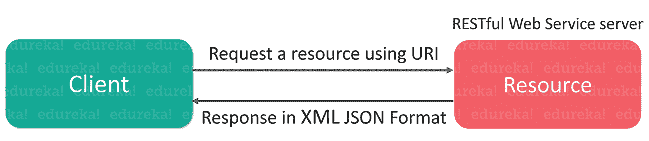
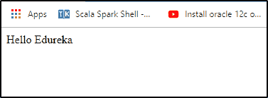

# 知道 Java Web 服务的类型有哪些吗？

> 原文：<https://www.edureka.co/blog/java-web-services-tutorial/>

当你与任何网页进行交互时，都需要通过一个 [HTML](https://www.edureka.co/blog/what-is-html/) 页面进行请求和响应。类似地，web 服务也涉及请求和响应，但是以 XML 或 JSON 的形式。**[Java](https://www.edureka.co/blog/java-tutorial/)**作为一种适合服务器端通信的语言，允许不同平台上不同应用之间的互操作性。在这篇 *Java Web 服务教程*中，我将简要介绍不同类型的 Web 服务。

本文涵盖以下主题:

*   什么是 Web 服务？
*   [网络服务的优势](#AdvantagesofWebServices)
*   [网络服务的类型](#TypesofWebServices)
    *   [Soap Web 服务](#SoapWebService)
    *   [Rest Web 服务](#RestWebService)
    *   [JAX-WS API 示例](#JAX_WSAPIExample)
    *   [JAX-遥感应用编程接口示例](#JAX_RSAPIExample)

我们开始吧！

## 什么是 Web 服务？

Web 服务是在万维网上传播客户机和服务器应用程序之间的通信的适当媒介。它是一个软件模块，设计用于执行一组特定任务，如下所示:

*   可以通过网络搜索 web 服务，也可以相应地调用 web 服务。

*   当被调用时，web 服务将能够向调用该 web 服务的客户机提供功能。

**例如**，Flipkart 提供一项网络服务，通过 flipkart.com*提供在线销售产品的价格*。前端或表示层可以在。Net 或  [Java](https://www.edureka.co/blog/what-is-java/) 但是任何一种编程语言都具有与 web 服务通信的能力。

有了这些，我们来了解一下使用 Web 服务的优势。

## **网络服务的优势**

下面的指针描述了 Web 服务的各种优势。

1.  **在网络上公开业务功能**–web 服务是一个托管代码单元，它向客户端应用程序或最终用户提供某种功能。这个功能可以通过 [HTTP 协议](https://www.edureka.co/blog/servlet-and-jsp-tutorial/#Web&HTTP)调用，这意味着它也可以通过互联网调用。Web 服务可以在互联网上的任何地方使用，并根据需要提供必要的功能。

2.  **应用程序之间的互操作性**–Web 服务允许各种应用程序相互通信，并在它们之间共享数据和服务。

3.  **人人都懂的标准化协议**–Web 服务使用标准化的行业协议进行通信。所有四层(服务传输层、XML 消息传递层、服务描述层和服务发现层)都使用 web 服务协议栈中定义良好的协议。

4.  **降低通信成本**–Web 服务使用 SOAP over HTTP 协议，这使您可以使用现有的低成本互联网来实现 Web 服务。

现在，让我们进一步了解用于日常交流的各种类型的 [web 服务](https://www.edureka.co/blog/web-services-the-real-deal/)。

## **网络服务的类型**

通常，有以下两种类型的 web 服务:

1.  Soap Web 服务
2.  RESTful Web 服务

让我们深入了解这些 web 服务的细节。

## **1。Soap 网络服务**

*简单对象访问协议* (SOAP)是基于 XML 的消息交换的标准协议规范。web 服务和客户端之间的通信使用 XML 消息进行。 一个简单 web 服务架构有两个组件:即。 *客户和服务商。*



在上面的图中，您可以注意到客户机将如何与服务提供者通信。因此，为了进行通信，客户端必须知道诸如 web 服务服务器的位置、可用函数、函数的签名和返回类型以及输入输出格式等信息。服务提供者将创建一个标准的 XML 文件，其中包含所有上述信息。因此，如果将该文件提供给客户端，它将能够访问 web 服务。

这就是它的工作原理。现在让我们进一步理解什么是 RESTful web 服务。

## **2。RESTful Web 服务**

表述性状态转移( [REST](https://www.edureka.co/blog/rest-api-with-node-js/) )是一种无状态的客户端-服务器架构，其中 web 服务被视为资源，可以通过它们的 URL 来标识。它由两个组件 ***REST 服务器*** 和一个 ***REST 客户端*** 组成，前者提供对资源的访问，后者访问和修改 REST 资源。同样，请看下图。



在这种 REST 架构风格中，客户机和服务器通过使用标准化的接口和协议来交换资源的表示。REST 不是一个特定的协议，但是当人们谈论 REST 时，他们通常指的是 HTTP 上的 REST。来自服务器的响应被认为是资源的表示。这种表示可以从一个或多个资源中生成。RESTful web 服务使用 HTTP 协议方法来执行操作。它包括 GET、POST、DELETE 等方法。

既然您已经知道了什么是 SOAP 和 RESTful web 服务，那么让我们更进一步，在一个例子的帮助下，看看它实际上是如何工作的。

**Java Web 服务 API**

Java 定义了两个主要的 API 用于开发 web 服务应用程序。

1.  **JAX-WS** :主要用于 SOAP web 服务。有两种方法可以编写 JAX-WS 应用程序代码:RPC 风格和文档风格。

2。 **JAX-RS** :主要针对 [RESTful](https://www.edureka.co/blog/what-is-rest-api/) web 服务。目前主要有两种实现用于创建 JAX 遥感应用程序:Jersey 和 RESTeasy。

这两个[Java API](https://youtu.be/5jQSat1cKMo)都是标准 [JDK 安装](https://www.edureka.co/blog/how-to-install-java-on-ubuntu/)的一部分，所以你不需要添加任何 jar 来使用它们。现在，让我们进入这些 API 的细节，并理解它是如何工作的。

**JAX-WS 的例子**

让我们创建一个简单的 Hello World JAX-WS 应用程序。在这里，我将创建一个简单的[类文件](https://www.edureka.co/blog/java-objects-and-classes/)，名为【Demo.java】的*并编写如下所示的程序来显示一条简单的消息。*

```
package com.Edureka;

import javax.jws.WebMethod;
import javax.jws.WebService;
import javax.jws.soap.SOAPBinding;
import javax.xml.ws.Endpoint;

@WebService
@SOAPBinding(style = SOAPBinding.Style.DOCUMENT)
public class Demo {

@WebMethod
public String sayHello(String msg){
return "Hello "+msg;
}

public static void main(String[] args){
Endpoint.publish("http://localhost:8888/DemoWS", new Demo());
}
}
```

你可以运行这个应用程序，JAX-WS SOAP web 服务的消息就发布了。这就是你需要如何编写一个简单的 JAX-WS 应用程序。

现在让我们了解 Java Web 服务的另一个 API，即 JAX-RS。

## **JAX-遥感的例子**

Jersey 是 JAX-RS API 的参考实现，它不是标准 JDK 的一部分，你必须包含所有需要的 jar。最好的方法是使用 Maven build，所以创建一个简单的动态 web 项目，然后在 Eclipse 中将其转换为 [Maven。](https://www.edureka.co/blog/create-selenium-maven-project/)

为了创建一个 JAX 遥感应用程序，您需要遵循下面提到的步骤。

**步骤 1:** 将依赖项添加到 pom.xml 文件中，如下所示:

```
<project  xmlns:xsi="http://www.w3.org/2001/XMLSchema-instance" xsi:schemaLocation="http://maven.apache.org/POM/4.0.0 http://maven.apache.org/xsd/maven-4.0.0.xsd">
<modelVersion>4.0.0</modelVersion>
<groupId>JAX-RS-HelloEdureka</groupId>
<artifactId>JAX-RS-HelloEdureka</artifactId>
<version>0.0.1-SNAPSHOT</version>
<packaging>war</packaging>

<dependencies>
<dependency>
<groupId>com.sun.jersey</groupId>
<artifactId>jersey-server</artifactId>
<version>1.19</version>
</dependency>
<dependency>
<groupId>com.sun.jersey</groupId>
<artifactId>jersey-servlet</artifactId>
<version>1.19</version>
</dependency>
</dependencies>

<build>
<sourceDirectory>src</sourceDirectory>
<plugins>
<plugin>
<artifactId>maven-war-plugin</artifactId>
<version>2.6</version>
<configuration>
<warSourceDirectory>WebContent</warSourceDirectory>
<failOnMissingWebXml>false</failOnMissingWebXml>
</configuration>
</plugin>
<plugin>
<artifactId>maven-compiler-plugin</artifactId>
<version>3.3</version>
<configuration>
<source>1.7</source>
<target>1.7</target>
</configuration>
</plugin>
</plugins>
</build>
</project>
```

**步骤 2:** 现在，下一步是将 Jersey [servlet](https://www.edureka.co/blog/java-servlets) 作为前端控制器添加到我们的部署描述符 web.xml 中。

```
<?xml version="1.0" encoding="UTF-8"?>
<web-app xmlns:xsi="http://www.w3.org/2001/XMLSchema-instance"  xsi:schemaLocation="http://xmlns.jcp.org/xml/ns/javaee http://xmlns.jcp.org/xml/ns/javaee/web-app_3_1.xsd" id="WebApp_ID" version="3.1">
<display-name>JAX-RS-HelloEdureka</display-name>

<servlet>
<servlet-name>Jersey REST Service</servlet-name>
<servlet-class>com.sun.jersey.spi.container.servlet.ServletContainer</servlet-class>
<init-param>
<param-name>com.sun.jersey.config.property.packages</param-name>
<param-value>com.Edureka.jaxrs.service</param-value>
</init-param>
<load-on-startup>1</load-on-startup>
</servlet>
<servlet-mapping>
<servlet-name>Jersey REST Service</servlet-name>
<url-pattern>/*</url-pattern>
</servlet-mapping>
</web-app>
```

完成所有这些之后，现在让我们创建一个简单的JAX-遥感服务类。

```
package com.Edureka;

import javax.ws.rs.GET;
import javax.ws.rs.Path;
import javax.ws.rs.PathParam;

@Path("/demo")
public class DemoWS {

@GET
@Path("/hello/{msg}")
public String sayHello(@PathParam(value="msg") String msg){
return "Hello "+msg;
}
}
```

配置完上述文件后，您只需将其导出为 *WAR 文件*，然后在浏览器中访问即可。你将得到如下所示的输出 。

恭喜恭喜！

这就把我们带到了关于 Java Web 服务的文章的结尾。我希望我已经提供了一些信息，并增加了您对 Web 服务基础知识的了解。

*查看 Edureka 的 [**Java 在线培训**](https://www.edureka.co/java-j2ee-training-course) ，edu reka 是一家值得信赖的在线学习公司，在全球拥有超过 250，000 名满意的学习者。我们在这里帮助你的旅程中的每一步，为了成为一个除了这个 java 面试问题，我们提出了一个课程，这是为学生和专业人士谁想要成为一个 Java 开发人员设计的。*

有问题要问我们吗？请在本 Java Web 服务教程的评论部分提到它，我们会尽快回复您。