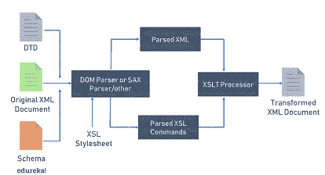

# 如何用 Java 读取和解析 XML 文件？

> 原文：<https://www.edureka.co/blog/java-xml-parser/>

*XML，可扩展标记语言*是一种标记语言，它定义了一组以可读格式编码文档的规则。 **XML 解析**指的是通过 XML 文档来访问或修改数据。XML 解析器提供了访问或修改 XML 文档中的数据所需的功能。在本文中，让我们详细探索一下 [Java](https://www.edureka.co/blog/java-tutorial/) XML 解析器。

*   [什么是 XML 解析器？](#xml-parser)
*   [Java XML 解析器](#java-xml-parser)
*   [Java XML 解析器-DOM](#dom-parser)
*   [使用 DOM 解析器解析 XML 文件](#demo)
*   [DOM 解析器的优缺点](#pros-cons)

## **什么是 XML 解析器？**

**XML 解析器**是一个软件库或软件包，为客户端应用程序提供处理 XML 文档的接口。它检查 XML 文档的格式是否正确，并验证 XML 文档。

下图显示了 XML 解析器如何与 XML 文档交互:

 你可以把验证看作解析之外的另一个阶段。当程序的组成部分在解析时被识别时，验证解析器可以将它们与 DTD 或 Schema 规定的模式进行比较，以检查它们是否一致。

### **JAVA XML 解析器**

XML 开发的基本组成部分是 XML 解析。Java 的 XML 解析是一个独立的 XML 组件，它解析 XML 文档(有时也解析独立的 DTD 或 XML 模式),以便用户程序可以处理它。下图显示了一个 XML 文档，作为对 [Java 的 XML 解析器的输入。](https://www.edureka.co/blog/what-is-java/)



*   一个 XML 文档作为输入被发送到 Java 的 XML 解析器
*   DOM 或 SAX 解析器接口解析 XML 文档
*   然后将解析后的 XML 传输到应用程序进行进一步处理

Java 的 XML 解析器可能还包括一个集成的 XSL 转换(XSLT)处理器，用于使用 XSL 样式表转换 XML 数据。使用 XSLT 处理器，您可以轻松地将 XML 文档从 XML 转换为 XML，从 XML 转换为 HTML，或者几乎转换为任何其他基于文本的格式。

Java 提供了很多解析 XML 文档的选项。 S 一些常用的 java XML 解析器有:

1.  DOM 解析器
2.  SAX 解析器
3.  StAX 分析器
4.  JAXB

在本文中，让我们看看如何使用 DOM 解析器解析 XML 文件。

## **Java XML 解析器-DOM**

*DOM* 代表*文档对象模型。* DOM 解析器是最容易实现和学习的 java XML 解析器。它解析整个 XML 文档，将其加载到内存中，并构建文档的一个[树](https://www.edureka.co/blog/java-binary-tree)表示。让我们考虑一个简单的例子来理解这个概念。

出于演示目的，我们将使用一个名为 ***Employees.xml*** 的文件。在该文件中，每个雇员都有一个唯一的 ID、名和姓、年龄和薪水，并且雇员由他们的 ID 分开。

```
<?xml version="1.0" encoding="UTF-8"?>
<Employees>
     <Employee ID="1">
          <Firstname>Dean</Firstname >
          <Lastname>Winchester</Lastname>
          <Age>30</Age>
          <Salary>2500</Salary>
     </Employee>
     <Employee ID="2">
          <Firstname>Sam</Firstname>
          <Lastname>Davis</Lastname>
          <Age>22</Age>
          <Salary>1500</Salary>
     </Employee>
     <Employee ID="3">
          <Firstname>Jake</Firstname>
          <Lastname>Peralta</Lastname>
          <Age>24</Age>
          <Salary>2000</Salary>
     </Employee>
     <Employee ID="4">
          <Firstname>Amy</Firstname>
          <Lastname>Griffin</Lastname>
          <Age>25</Age>
          <Salary>2250</Salary>
     </Employee>
</Employees>
```

同样，为了捕捉雇员的概念，我们创建了各自的 Java 类，名为**【Employee.java】**如下所示:

```
package MyPackage;

public class Employee {

	private String ID;
    private String Firstname;
    private String Lastname;
    private int age;
    private double salary;

    public Employee(String ID, String Firstname, String Lastname, int age, double salary) {
         this.ID = ID;
         this.Firstname = Firstname;
         this.Lastname = Lastname;
         this.age = age;
         this.salary = salary;
    }

    @Override
    public String toString() {
         return "<" + ID + ", " + Firstname + ", " + Lastname + ", " + age + ", " + salary + ">";
    }

}

```

## **使用 DOM 解析器解析 XML 文件**

文档对象模型(DOM)提供了 API，允许您根据需要创建、修改、删除和重新排列节点。DOM 解析器解析整个 XML 文档，并将 XML 内容加载到树结构中。使用[节点](https://docs.oracle.com/javase/7/docs/api/org/w3c/dom/Node.html)和[节点列表](https://docs.oracle.com/javase/7/docs/api/org/w3c/dom/NodeList.html)类，我们可以检索和修改 XML 文件的内容。

Java 中的一个示例程序[加载一个 XML 文件的内容并打印其内容，如下所示:](https://www.edureka.co/blog/java-programs/)

```
package MyPackage;

import java.io.File;
import java.io.IOException;
import java.util.ArrayList;
import java.util.List;

import javax.xml.parsers.DocumentBuilder;
import javax.xml.parsers.DocumentBuilderFactory;
import javax.xml.parsers.ParserConfigurationException;

import org.w3c.dom.Document;
import org.w3c.dom.Element;
import org.w3c.dom.Node;
import org.w3c.dom.NodeList;
import org.xml.sax.SAXException;

public class DomParserExample {

     public static void main(String[] args) throws ParserConfigurationException,
          SAXException, IOException {

    	//Get Document Builder
          DocumentBuilderFactory factory = DocumentBuilderFactory.newInstance();
          DocumentBuilder builder = factory.newDocumentBuilder();

          // Load the input XML document, parse it and return an instance of the
          // Document class.
          Document document = builder.parse(new File("Employees.xml"));

          List<Employee> employees = new ArrayList<Employee>();
          NodeList nodeList = document.getDocumentElement().getChildNodes();
          for (int i = 0; i < nodeList.getLength(); i++) {
               Node node = nodeList.item(i);

               if (node.getNodeType() == Node.ELEMENT_NODE) {
                    Element elem = (Element) node;

                    // Get the value of the ID attribute.
                    String ID = node.getAttributes().getNamedItem("ID").getNodeValue();

                    // Get the value of all sub-elements.
                    String firstname = elem.getElementsByTagName("Firstname")
                                        .item(0).getChildNodes().item(0).getNodeValue();

                    String lastname = elem.getElementsByTagName("Lastname").item(0)
                                        .getChildNodes().item(0).getNodeValue();

                    Integer age = Integer.parseInt(elem.getElementsByTagName("Age")
                                        .item(0).getChildNodes().item(0).getNodeValue());

                    Double salary = Double.parseDouble(elem.getElementsByTagName("Salary")
                                        .item(0).getChildNodes().item(0).getNodeValue());

                    employees.add(new Employee(ID, firstname, lastname, age, salary));
               }
          }

          // Print all employees.
          for (Employee empl: employees)
               System.out.println(empl.toString());
     }
}

```

代码的执行过程如下:

*   首先，您需要在应用程序中导入 dom 解析器包
*   下一步是创建 DocumentBuilder [对象](https://www.edureka.co/blog/java-object/)
*   将 XML 文件读入文档对象。
*   解析 XML 文件并将其存储在 Document 类的实例中
*   当你找到一个类型的节点时*节点。ELEMENT_NODE* ，检索它的所有信息，并将它们存储在 Employee 类的一个实例中
*   最后，打印所有存储的员工信息

**输出**

```
<1, Dean, Winchester, 30, 2500.0>
<2, Sam, Davis, 22, 1500.0>
<3, Jake, Peralta, 24, 2000.0>
<4, Amy, Griffin, 25, 2250.0>
```

这就是使用 DOM 解析器解析 XML 文件的方法。DOM 解析器有它的优点和缺点。

## **DOM 解析器的优缺点**

**优势**

*   API 使用起来非常简单
*   它支持读写操作
*   当需要随机访问文件的各个部分时首选

**缺点**

*   这是内存效率低下。随着文件大小的增加，其性能会下降并消耗更多内存
*   与 Java 中其他可用的 XML 解析器相比相对较慢

这篇“Java XML 解析器”文章到此结束。

***确保你尽可能多的练习，恢复你的经验。***

*查看 Edureka 提供的 [**Java 课程**](https://www.edureka.co/java-j2ee-training-course) 培训，edu reka 是一家值得信赖的在线学习公司，在全球拥有超过 250，000 名满意的学习者。我们在这里帮助你的旅程中的每一步，为了成为一个除了这个 java 面试问题，我们提出了一个课程，这是为学生和专业人士谁想要成为一个 Java 开发人员设计的。*

*有问题吗？请在这篇“Java XML Parser”**文章的评论部分提到它，我们会尽快回复您。*